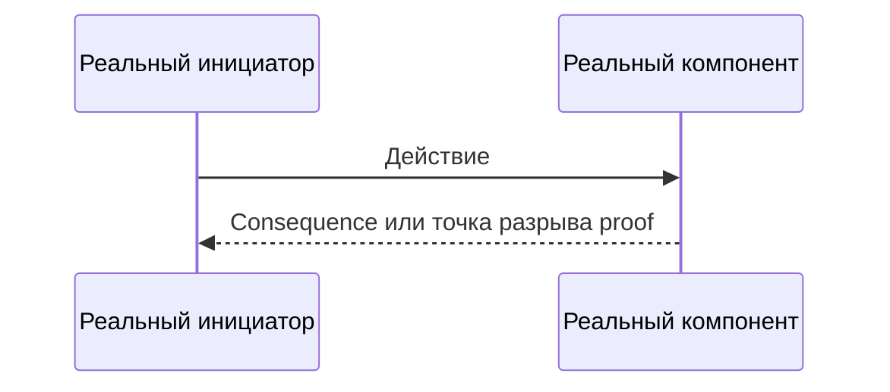

# FULL-REVIEW-REPORT-<NNN>: production review OsEngine

**Template ID:** `FULL-REVIEW-TEMPLATE-001`
**Review ID:** `FULL-REVIEW-<NNN>`
**Baseline commit:** `<40-hex SHA>`
**Dirty-tree boundary:** `<CLEAN либо inspected paths + SHA-256 diff>`
**Scope:** `REPOSITORY_WIDE`
**Started:** `DD.MM.YYYY HH:mm:ss (UTC+03:00, Москва)`
**Finished:** `DD.MM.YYYY HH:mm:ss (UTC+03:00, Москва)`
**Terminal verdict:** `<REVIEW_COMPLETE_NO_ACTIONABLE_FINDINGS|REVIEW_COMPLETE_AWAITING_OWNER_DECISION|REVIEW_COMPLETE_WITH_OWNER_DECISIONS|REVIEW_INCOMPLETE_BLOCKED>`

> Report — evidence exact review identity, не source of truth будущего code.

## Inspected inventory

Перечислить реализованные modules/execution boundaries и относящиеся к ним
tests/contracts. Target-only components не считать отсутствующими defects.

## Coverage matrix

| Module / boundary | Mode | Review category | Status | Evidence / причина |
|---|---|---|---|---|
| `<module>` | `<Live/Tester/Optimizer/OsData/MCP/UI>` | `<category>` | `<CHECKED|NOT_APPLICABLE|BLOCKED>` | `<anchors или missing evidence>` |

Terminal report не содержит `PENDING` coverage. Каждая применимая category
`production-review-checklist` покрыта для каждого relevant module.

## Finding registry

### Finding <ID>: <краткое название>

- **Category:** `<category>`
- **Technical severity:** `<CRITICAL|HIGH|MEDIUM|LOW>`
- **Business impact:** `<BUSINESS_CRITICAL|BUSINESS_HIGH|BUSINESS_MEDIUM|BUSINESS_LOW|NO_DIRECT_BUSINESS_IMPACT>`
- **Scope relation:** `<IN_SCOPE|REGRESSION|ADJACENT>`
- **Affected modes/components:** `<modes/components>`
- **Affected document IDs:** `<IDs либо нет>`
- **Problem / hypothesis:** <проверяемое утверждение>
- **Preconditions:** <конкретные условия>
- **Entry point:** <реальный caller/event/configuration>
- **Concrete execution path:** <последовательность до consequence>
- **Evidence:** <current code/test/config/contract/runtime anchors>
- **Strongest counterevidence:** <guards/invariants/negative evidence либо нет>
- **Evidence status:** `<PROVEN|PARTIAL|REQUIRES_OWNER_EVIDENCE>`
- **Reachability:** `<REACHABLE|CONDITIONALLY_REACHABLE|UNREACHABLE|NOT_PROVEN>`
- **Observable technical consequence:** <наблюдаемый результат>
- **Observable business consequence:** <financial/trading/availability/security impact либо нет>
- **Recommended action:** `<MUST_FIX|SHOULD_FIX|ACCEPT_RISK_CANDIDATE|REQUIRES_EVIDENCE|DO_NOT_FIX>`
- **Owner decision:** `<PENDING|APPROVED_FOR_FIX|RISK_ACCEPTED|DEFERRED|REJECTED>`
- **Terminal relation:** `<current review/future task/blocker>`

Для `UNREACHABLE` показать guard. Для `NOT_PROVEN` показать последнюю
доказанную точку и missing evidence.

## Deduplication и previous review

- Latest same-identity review consulted: `<Review ID или NONE>`.
- Reused only for navigation/coverage: `<что именно>`.
- Merged/superseded Finding IDs: `<IDs или NONE>`.
- Current evidence rechecked: `<как>`.

## Blockers

Перечислить blocked coverage/findings и exact owner-run scenario. Не
превращать blocker в optimistic PASS.

## Owner triage

| Finding ID | Recommended action | Owner decision | Follow-up task |
|---|---|---|---|
| `<ID>` | `<action>` | `PENDING` | `—` |

Reviewer/Main останавливаются после terminal report. Fix начинается только для
IDs с `APPROVED_FOR_FIX`.

## Review completion evidence

- Primary full-review pass: `<PASS|BLOCKED>`.
- Coverage validation: `<PASS|BLOCKED>`.
- Coverage cells without `PENDING`: `<PASS|FAIL>`.
- Finding schema and Mermaid sequences: `<PASS|FAIL>`.
- Live/test-stand boundary: `<PASS|BLOCKED|NOT_APPLICABLE>`.
- No automatic fixes/full-review rerun: `<PASS|FAIL>`.
