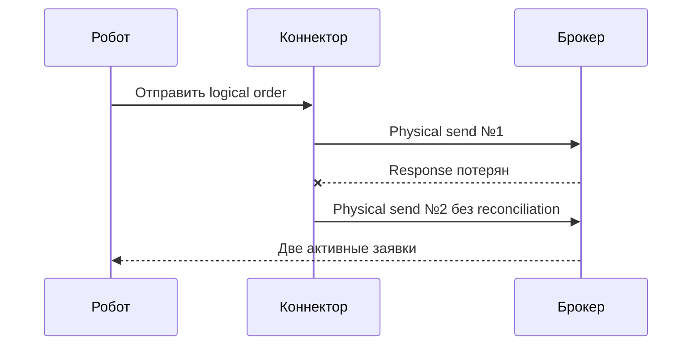
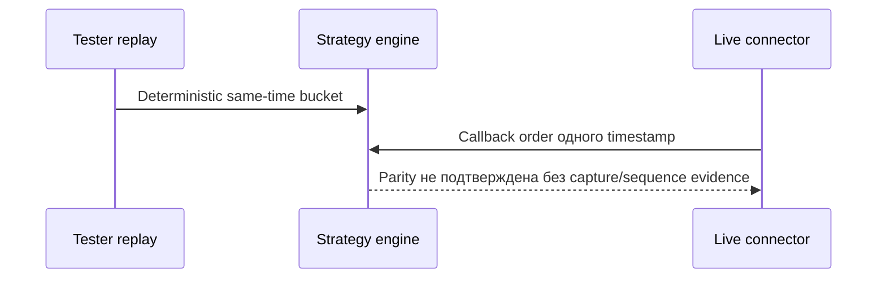

# FULL-REVIEW-REPORT-TEST: representative OsEngine review

**Review ID:** `FULL-REVIEW-TEST`
**Baseline commit:** `0123456789abcdef0123456789abcdef01234567`
**Dirty-tree boundary:** `CLEAN`
**Scope:** `REPOSITORY_WIDE`
**Terminal verdict:** `REVIEW_COMPLETE_AWAITING_OWNER_DECISION`

## Coverage matrix

| Module / boundary | Mode | Review category | Status | Evidence / причина |
|---|---|---|---|---|
| `connector order sender` | `Live` | `order lifecycle` | `CHECKED` | `SendOrder` path и tests |
| `indicator presenter` | `UI` | `financial precision` | `NOT_APPLICABLE` | не выполняет money calculations |
| `strategy execution` | `Tester/Live` | `mode parity` | `BLOCKED` | требуется live capture |

## Finding registry

### Finding OE-FR-001: resend после неизвестного результата

- **Category:** `order-lifecycle`
- **Technical severity:** `CRITICAL`
- **Business impact:** `BUSINESS_CRITICAL`
- **Scope relation:** `IN_SCOPE`
- **Affected modes/components:** `Live / connector order sender`
- **Affected document IDs:** `CONNECTORS-CONTEXT-001`
- **Problem / hypothesis:** timeout переводит non-idempotent order в resend без reconciliation.
- **Preconditions:** первая отправка достигла broker, response потерян.
- **Entry point:** recovery после transport timeout.
- **Concrete execution path:** retry повторяет physical send до запроса active orders.
- **Evidence:** current retry branch и отсутствие client-ID deduplication guard.
- **Strongest counterevidence:** caller ограничивает число retries, но не устраняет duplicate send.
- **Evidence status:** `PROVEN`
- **Reachability:** `REACHABLE`
- **Observable technical consequence:** две broker orders для одной logical command.
- **Observable business consequence:** двойная позиция и финансовый убыток.
- **Recommended action:** `MUST_FIX`
- **Owner decision:** `PENDING`
- **Terminal relation:** owner triage до отдельной implementation task.

### Finding OE-FR-002: parity стакана не доказан

- **Category:** `mode-parity`
- **Technical severity:** `HIGH`
- **Business impact:** `BUSINESS_HIGH`
- **Scope relation:** `IN_SCOPE`
- **Affected modes/components:** `Tester/Live / strategy execution`
- **Affected document IDs:** `ORDER-FLOW-ROADMAP-001`
- **Problem / hypothesis:** одинаковый timestamp trade/depth может упорядочиваться по-разному.
- **Preconditions:** source не предоставляет подтверждённую sequence между событиями bucket.
- **Entry point:** replay и live callbacks одного timestamp.
- **Concrete execution path:** offline evidence заканчивается на deterministic bucket rule; live source order не измерен.
- **Evidence:** Tester fixture и target roadmap.
- **Strongest counterevidence:** live capture/connector sequence evidence отсутствует.
- **Evidence status:** `PARTIAL`
- **Reachability:** `NOT_PROVEN`
- **Observable technical consequence:** возможное различие signal timing, не подтверждено.
- **Observable business consequence:** возможная переоценка backtest, не доказана.
- **Recommended action:** `REQUIRES_EVIDENCE`
- **Owner decision:** `PENDING`
- **Terminal relation:** не создавать fix без live evidence.

## Owner triage

| Finding ID | Recommended action | Owner decision | Follow-up task |
|---|---|---|---|
| `OE-FR-001` | `MUST_FIX` | `PENDING` | — |
| `OE-FR-002` | `REQUIRES_EVIDENCE` | `PENDING` | — |
