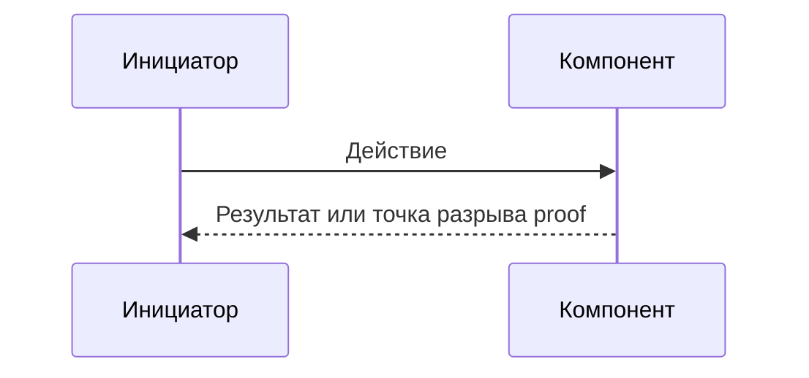

# AGENT-WORKFLOW-001: scoped review

**Load trigger:** независимое review конкретного diff/module/documentation scope
или validation ранее выданных scoped findings.

## 1. Конечный review automaton

Normal path:

```text
PRIMARY -> FIX -> VALIDATION_1 -> TERMINAL
```

`VALIDATION_2` допускается ровно один раз, только если `VALIDATION_1` доказал:

- regression текущего fix diff;
- ошибку evidence/proof исходной finding;
- незавершённый уже in-scope execution path.

После `VALIDATION_2` всегда terminal transition. `VALIDATION_3`, новый широкий
поиск улучшений и расширение scope запрещены. Неустранимый в оставшемся
transition обязательный дефект завершает review как `BLOCKED`.

Terminal outcomes:

- `CLEAN` — доказанных in-scope проблем не осталось;
- `ACCEPTED` — residual risk явно принят владельцем/контрактом;
- `SEPARATE_TASK` — доказанная независимая проблема вне frozen scope;
- `BLOCKED` — обязательное evidence или owner decision недоступны;
- `NO_CHANGE` — finding не доказана, недостижима или изменение не нужно.

## 2. Compact review packet

Main передаёт reviewer только:

- task/case ID и frozen scope;
- exact baseline и clean checkpoint либо точный dirty boundary;
- changed paths и непосредственно затронутые runtime/documentation paths;
- применимые document IDs/paths;
- exact commands и краткие totals/verdicts evidence;
- для validation — исходные Finding IDs, fix diff и новое evidence.

Не передавать полную task history, весь `ACTIVE_TASK.md`, старые notes и
successful logs. Production и documentation reviewers могут работать
параллельно только на одном exact checkpoint.

## 3. Finding и reachability

Каждая substantive finding содержит:

1. stable Finding ID и category;
2. technical severity: `CRITICAL`, `HIGH`, `MEDIUM`, `LOW`;
3. business impact: `BUSINESS_CRITICAL`, `BUSINESS_HIGH`, `BUSINESS_MEDIUM`,
   `BUSINESS_LOW`, `NO_DIRECT_BUSINESS_IMPACT`;
4. scope relation: `IN_SCOPE`, `REGRESSION`, `ADJACENT`;
5. affected modes/components: Live, Tester, Optimizer, OsData, MCP, UI или
   точная комбинация;
6. problem/hypothesis;
7. preconditions и реальный entry point;
8. concrete execution path;
9. current evidence и strongest counterevidence;
10. evidence status: `PROVEN`, `PARTIAL`, `REQUIRES_OWNER_EVIDENCE`;
11. reachability: `REACHABLE`, `CONDITIONALLY_REACHABLE`, `UNREACHABLE`,
    `NOT_PROVEN`;
12. observable technical и business consequence;
13. recommended action: `MUST_FIX`, `SHOULD_FIX`, `ACCEPT_RISK_CANDIDATE`,
    `REQUIRES_EVIDENCE`, `DO_NOT_FIX`;
14. owner decision: `PENDING`, `APPROVED_FOR_FIX`, `RISK_ACCEPTED`, `DEFERRED`,
    `REJECTED`;
15. terminal relation;
16. отдельный русский Mermaid sequence source.

`UNREACHABLE` получает `DO_NOT_FIX`. `NOT_PROVEN`, partial evidence или
owner/live dependency получают `REQUIRES_EVIDENCE`, а не `MUST_FIX`. Для
`CONDITIONALLY_REACHABLE` перечисляются конкретные необходимые условия.

Business impact описывает размер последствия; reachability — доказанность
пути. Слово «торговля» само по себе не повышает severity.



Для `UNREACHABLE`/`NOT_PROVEN` диаграмма показывает guard, последнюю доказанную
точку и недостающее evidence. Если proof зависит от live connector/account,
применить `EXTERNAL_AND_LIVE_EVIDENCE.md` и вернуть `REQUIRES LIVE CONNECTOR`
с точным owner-run scenario.
