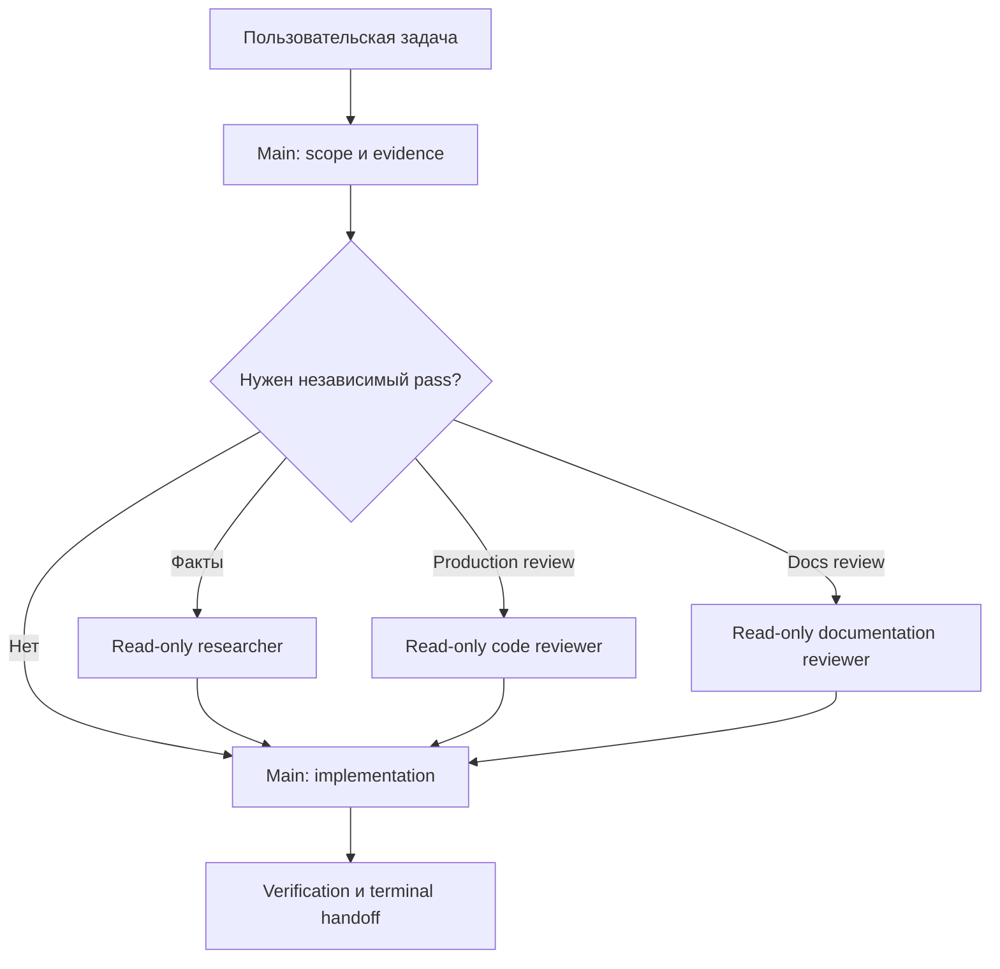

# Agent system OsEngine

**ID:** `AGENT-SYSTEM-README-001`
**Статус:** CURRENT OPERATOR GUIDE

Система переносит проверенные принципы agent workflow TXML Market в
`2Rukin/OsEngine`, но не копирует Java/FFM/единственный-connector assumptions.
Она адаптирована к C#/.NET/WPF, нескольким биржевым коннекторам, режимам
OsData/Tester/Optimizer/OsTrader, MCP и торговому риску.

## Как работает пользовательский flow

Пользователь передаёт обычную задачу Main. Выбирать skill или reviewer вручную
не нужно.

Main — единственная write-capable роль. Reviewers ничего не исправляют и
возвращают evidence/findings. Обязательный reviewer, который недоступен, даёт
`BLOCKED`, а не «review выполнено самим автором».

## Состав

| Слой | Канонический путь | Назначение |
|---|---|---|
| Общие правила | [`../../../AGENTS.md`](../../../AGENTS.md) | Permissions, sources, safety и Git |
| OsEngine rules | [`../../AGENTS.md`](../../AGENTS.md) | C#/.NET/WPF/build/test specifics |
| Compact workflow | [`../../../.agents/CLI_WORKFLOW_CONTRACT.md`](../../../.agents/CLI_WORKFLOW_CONTRACT.md) | Routing, live state, completion, evidence reuse |
| Conditional workflows | `../../../.agents/workflow/` | Scoped/full review, impact, external/live evidence |
| Canonical skills | `../../../.agents/skills/` | Research, review, checklist и C# XML docs |
| Native adapters | `../../../.codex/agents/`, `../../../.claude/` | Read-only tool-specific roles |
| Live state | [`ACTIVE_TASK.md`](ACTIVE_TASK.md) | Resume нетривиальной задачи |
| Full review registry | [`FULL_REVIEW_INDEX.md`](FULL_REVIEW_INDEX.md) | Exact review identities и owner triage |
| Offline acceptance | `bash .agents/validation/validate-agent-system.sh` | Проверка topology/contracts без запуска OsEngine |

## Основные режимы

### Implementation

Main фиксирует frozen scope, меняет минимальный набор files, выполняет
применимые deterministic checks, обновляет semantic docs/XML comments и
делегирует независимое review при runtime/test/safety impact.

### Documentation audit

`documentation-reviewer` сравнивает Markdown/XML comments с current code/tests
и `DOCMAP-001`. Он классифицирует drift, но не исправляет его.

### Scoped production review

Один finite cycle: `PRIMARY → FIX → VALIDATION_1 → TERMINAL`. Дополнительный
`VALIDATION_2` разрешён только для regression/proof error/незавершённого
in-scope path. Третьего прохода нет.

### Repository-wide review

Exact baseline получает один inventory, coverage validation и terminal report.
Повтор той же identity не запускается молча. Даже `MUST_FIX` сначала идёт на
owner triage; implementation начинается только по одобренным Finding IDs.

## Что адаптировано относительно TXML

- JavaDoc заменён на C# XML Documentation; нет массового backfill legacy code.
- Maven/JUnit заменены на `.NET 10`, solution и существующие test stands.
- Единственный TRANSAQ/native boundary заменён общим protocol/live boundary
  для всех connectors, MCP и real-order scenarios.
- Review checklist покрывает market data, causal backtest, Tester/live parity,
  financial precision, order/position/risk, WPF/concurrency, persistence,
  security и backpressure.
- Диаграммы используют Mermaid, как документация Order Flow.
- TXML project-level `danger-full-access` не перенесён. Native reviewers
  read-only; Main не получает дополнительных permissions.

## Safety boundary

Offline validator не компилирует и не запускает OsEngine, не открывает сеть, не
читает credentials и не проверяет semantic quality reviewer-а. MCP test stand,
live connector и real orders всегда требуют отдельного разрешения пользователя.

## Связанные документы

- [`DOCMAP-001`](../DOCUMENTATION_MAP.md)
- [`ADR-AGENT-001`](ADR-0001_AGENT_WORKFLOW.md)
- [`ORDER-FLOW-ROADMAP-001`](../OrderFlow/PRODUCTION_ROADMAP.md)
