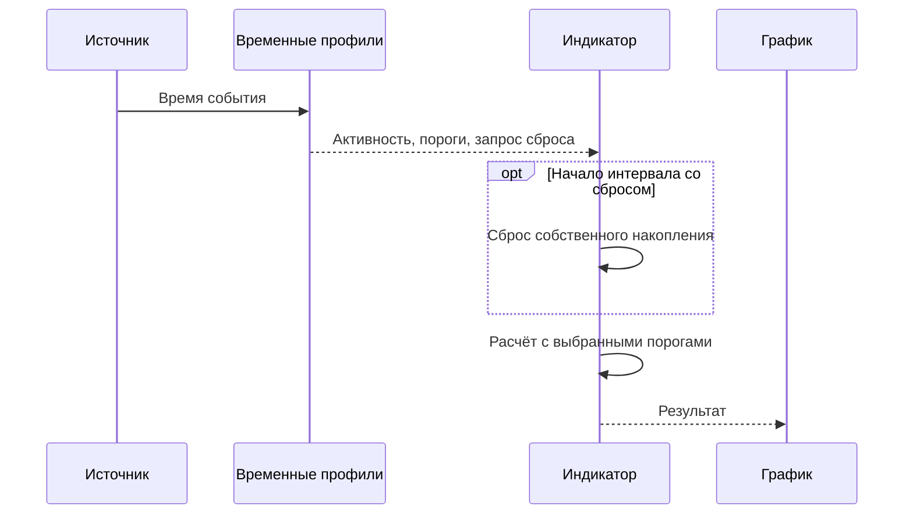

# INDICATOR-TIME-PROFILES-001: временные пороги индикаторов

**Статус:** CURRENT IMPLEMENTATION CONTRACT — OFFLINE EVIDENCE; физический UI/live не квалифицированы.

Расписание применяется к явно объявленным порогам объёма, дельты, открытого
интереса и количества сделок. Оно меняет расчёт. Время берётся из источника
без преобразования timezone; `HH:mm` включает всю указанную минуту с обеих
сторон. `23:00–01:00` — ночной интервал, одинаковые границы — одна минута.
Пересечения внутри одного расписания запрещены, независимые экземпляры могут
пересекаться. Вне интервалов пользователь выбирает базовые пороги либо
неактивность. Отсутствующее или выключенное расписание сохраняет прежнее
поведение; включённое расписание без интервалов отклоняется как ошибка.

Флажок сброса предназначен для накопительных потребителей: он запрашивает сброс
состояния на первом наблюдаемом событии нового интервала. Для Cloud этого
флажка нет: смена временного порога не разделяет цепочку и не очищает окружающее
окно. Цепочки по-прежнему определяются gap/range; режим Single — одной сделкой.

Общий компонент не определяет зависимости индикатора по имени и не добавляет
отсутствующие данные. OI допустим как метрика порога только у потребителя,
который уже получает OI. Семипольный tick text Order Flow OI не содержит.
В current каталоге обычных индикаторов параметры Volume/Delta/OI преимущественно
описывают периоды, а не метрические пороги. Такие параметры не превращаются
автоматически в пороги объёма.



## Работа в главном Order Flow

1. Нажать **Добавить Cloud** рядом с флажками расчётов. Каждый вызов создаёт
   независимый экземпляр; одинаковые параметры не объединяют экземпляры.
2. Задать название, цвет, одиночные сделки/цепочки, паузу, размах цены и базовые
   пороги. **Рассчитывать** управляет следующим запуском, **Показывать** — видом.
3. Открыть **Время работы и пороги**, включить расписание, добавлять строки
   интервалов. Например, `10:00–11:59` и `12:00–18:44` с разными объёмами.
   Пустое числовое поле наследует базовый порог; ноль в максимуме снимает предел.
4. Флажок базовых порогов вне интервалов выбирает продолжение либо неактивность.
   У Cloud нет сброса по времени: переход между интервалами меняет пороги,
   сохраняя обычные правила формирования цепочки.
5. Выполнить расчёт. Слои появятся на общем графике; **Добавленные Cloud**
   открывает отдельную таблицу, двойной щелчок раскрывает слой и находит метку.

Во вкладке **Экземпляры Cloud / время** можно менять, удалять, скрывать и
постфильтровать дополнительные экземпляры. Выбор **Delta / Cloud 1 / Cloud 2**
открывает тот же редактор расписаний для исходных расчётов. Для Delta в редакторе
доступен **Сброс при начале интервала**.
У обычного накопительного индикатора, например VWAP, этот механизм может быть
подключён через описанный ниже API; это не автоматическое подключение существующего VWAP.
Отдельные окна **Подбор Cloud** и **Cloud Explorer** сохраняют свои
собственные контракты. Их half-open ranges и ограничения числа calibration
rules не изменены. У новой коллекции экземпляров нет настроенного лимита;
затраты памяти/времени растут с числом экземпляров и размером результатов.

Новые слои используют свой цвет. Единственная пара **«Размер всех Cloud»** и
**«Контраст всех Cloud»** над графиком управляет Cloud 1/2 и всеми добавленными
экземплярами сразу, включая реплей и отдельное окно графика; пересчёт не нужен.
Подписи объёмов управляются общим для них
переключателем подписей Cloud 1. Исторический размер метки использует медиану
слоя, реплей — базовый порог суммы или одиночного тика, известный до запуска.
Таблица и график реплея получают только пройденную часть данных.

**Сохранить профили и Cloud / Загрузить профили и Cloud** — явное сохранение
JSON workspace `order-flow-time-1`: расписания Delta/Cloud 1/2 и полные настройки
дополнительных Cloud. Базовые настройки исходных Cloud 1/2 и Delta, файл тиков,
PriceStep и даты в этот workspace не входят. Автоматического сохранения нет.
Загрузка проверяется целиком до применения; изменения расчёта требуют запуска.

## Точные границы расчёта

| Потребитель | Применение порогов | Сброс |
|---|---|---|
| Cloud | Min/max физического объёма допускают тик в цепочку. Min/max суммы, абсолютной дельты и Trades определяют квалификацию и итоговый verdict | Сброса по интервалу/суткам нет; продолжают действовать gap/range и Single |
| Диагональный дисбаланс Cloud | Пороги объёма стороны, разности, отношения и процента дельты выбираются по времени. Если задан хотя бы один такой override, прохождение входит в квалификацию | Смена интервала не очищает окружающее окно; обычное истечение его длительности сохраняется, базовые cached floors не мутируют |
| Delta | Min/max абсолютной дельты, полного объёма окна и Trades проверяются перед созданием кандидата | Очищаются feature window, оба cooldown и таймер фона; ранее созданные labels продолжают получать будущие данные |
| Aindicator | Зарегистрированные ключи разрешаются внутри OnProcess; вне активного времени OnProcess пропускается и в series записывается 0 | Явный callback владельца индикатора; исторические series не удаляются |

Все границы метрик включительные. Delta здесь `abs(Buy−Sell)`, Trades — число
физических включённых сделок, не объём. Для Cloud Single минимум суммы заменён
минимумом тика; верхняя сумма/дельта/Trades продолжают действовать. Диагональные
пороги требуют выбранного источника `Inside/Context/Both`; при `Off` выключены.
Исходные диагональные фильтры без overrides сохраняют прежнюю постфильтрацию.
Сохранённые ценовые пары позволяют пересчитать scheduled floors; их основание
не заменяется данными из будущего. Legacy display-фильтр сохраняет диагональные
overrides рассчитанного расписания и применяет обычные дополнительные условия.

Расписание Cloud выбирается по timestamp физического тика, Delta — по времени
закрываемой группы одинаковых timestamp. У Delta и подключённых накопительных
индикаторов первое событие нового вхождения запрашивает включённый reset, даже
после пропущенных дней. Полночь внутри ночного интервала не даёт второго reset.
Выход к базовым порогам сам по себе не сбрасывает состояние. У Cloud reset
не применяется, в том числе при переходе суток. При неактивности данные не входят
в накопление; обычное истечение окон и ограничения gap/range сохраняются.
Ранее сохранённый `ResetOnStart=true` для Cloud нормализуется в false при
назначении Cloud settings и загрузке/сохранении workspace; он не меняет ни
расчёт, ни его canonical identity. Расписания Delta/Aindicator не нормализуются.

Первое прохождение Cloud сохраняется в `Qualified` и не переписывается.
Итоговый `ThresholdPassed` может стать false позже, например при превышении
максимального Trades. Такой Cloud сохраняется как evidence, но обычный показ
его скрывает. Неквалифицированные цепочки в результат не попадают.
Свечи цены/объёма и торговая лента на общем графике остаются полным рыночным
контекстом; расписание меняет признаки, кандидатов и Cloud, а не исходный OHLC.

Постфильтр дополнительного слоя применяется к сохранённому якорю Cloud и его
volume/delta/count/diagonal evidence. Он не перечитывает тики, не пересобирает
цепочки и не восстанавливает неквалифицированные цепочки.
Таблица содержит строки с verdict, график — прошедшие строки и явно выбранную
строку. Исходный result и экспорт при этом не меняются.

## Подключение обычного индикатора

Код общего компонента: [ThresholdTimeProfiles](../../OsEngine/Indicators/ThresholdTimeProfiles.cs),
[адаптер Aindicator](../../OsEngine/Indicators/Aindicator.TimeProfiles.cs).
В `OnStateChange(Configure)` после создания обычных параметров вызвать один раз:

```csharp
ConfigureThresholdTimeProfiles(
    new[] { new ThresholdDefinition("MinimumVolume", "Минимальный объём", ThresholdMetric.Volume) },
    ResetSegment);
```

В `OnProcess` читать порог через
`ResolveTimeThreshold("MinimumVolume", minimumVolume.ValueDecimal)`.
`ResetSegment(int firstIndex)` обязан очистить собственное накопление/границу
lookback, сохранив series и подписки. Он вызывается при полном пересчёте, в том
числе после отключения расписания, а также при включённом reset нового интервала.
Повторный callback для того же активного timestamp не выполняется. Сам
`OnProcess` может повторяться для формирующейся свечи: вклад этой свечи надо
заменять, а не повторно добавлять. Суммирование raw history должно самостоятельно
соблюдать границы reset и исключение неактивных данных; адаптер не переписывает
входные свечи и не управляет private state вложенных индикаторов.

`SetTimeProfiles` валидирует расписание и обновляет скалярный параметр
`Threshold time profiles v1`. Вызывающий код обязан сериализовать вызов с
обработкой, затем вызвать обычные `Reload` и `Save`. Строка Base64(JSON) сохраняется существующим
parameter storage и входит в `ParametersSpecification`. При включённом расписании
Optimizer пропускает cache готовых series: он не сохраняет private state callback.
Используется `Candle.TimeStart` во всех трёх режимах; `Process(List<decimal>)`
отклоняется при включённом расписании, поскольку реального времени там нет.

Вкладка **Временные пороги** появляется только у явно подключённого индикатора.
Нерегистрирующие индикаторы сохраняют UI/параметры/расчёт. В current каталоге
проверенные Volume/Delta/OI/Trades-потребители не имеют подходящих числовых
метрических порогов: их параметры периодов не подключены автоматически.
Legacy `IIndicator` не получает новый lifecycle. Общий компонент доступен
потребителям с собственным lifecycle через `ThresholdTimeCursor`.
`OpenInterest` поддержан моделью и проверен на синтетических Candle.OpenInterest;
Order Flow отклоняет OI-ключи, так как его семипольный файл не содержит OI.
Доставка OI с биржи требует отдельного изменения соответствующего источника.

## Идентичность и evidence

Пустые/выключенные новые настройки сохраняют legacy canonical/hash и старые
CSV/manifest bytes. Включённые профили и ID экземпляров входят в research identity;
порядок строк/ключей нормализуется, значения decimal инвариантны. Переименование,
цвет и видимость не меняют расчётную identity. Они сохраняются в workspace,
но не добавляются в неизменяемые артефакты расчёта.

При включённых расширениях экспорт добавляет `time-profiles.json`,
`time-threshold-verdicts.json`, `cloud-{instanceId}.csv` и
`cloud-{instanceId}-pairs.csv` для дополнительных слоёв. Имеющиеся legacy
файлы остаются на прежних путях. Version sidecar — `time-layers-1`.

Исполняемые проверки: [TimeProfileTests](../../Tests/OrderFlowResearch/TimeProfileTests.cs)
в существующем offline runner `Tests/OrderFlowResearch`. Они покрывают inclusive
минуты/ночь, пересечения, reset/preserve, scheduled diagonal floors, 40 экземпляров,
изолированность, prefix replay, JSON/артефакты, фактическое накопление и повторную
свечу Aindicator в Trader/Tester/Optimizer, отключение/Reload, синтетический OI,
рисование/hit-testing и создание новых окон без Show/Application.
Это component evidence: desktop focus/DPI, broker delivery OI и live execution
не проверены. Точный итог текущего запуска хранится в
[active task](../AgentSystem/ACTIVE_TASK.md).
