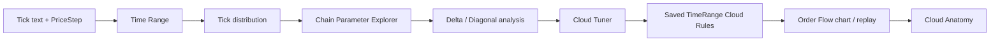

# ORDER-FLOW-CLOUD-CALIBRATION-001: предварительная статистика, временные профили и настройка Cloud

**Статус:** CURRENT IMPLEMENTATION CONTRACT — OFFLINE RESEARCH ONLY.

**Область:** только `OsData → Order Flow`, локальное offline-исследование тиков.  
**Ветка постановки:** `docs/order-flow-production-roadmap`.  
**Связанные current contracts:** `ORDER-FLOW-CLOUD-EXPLORER-V2-001`, `ORDER-FLOW-DATA-001`.  
**UI contract:** `UI-DETACHED-TABLES-001`.  
**Темы:** `CONTEXT_THEMES.md`.

Документ задаёт реализованную итерацию Order Flow. Это не новый общий модуль
«Статистика» и не торговая стратегия. Цель — до ручной настройки Cloud показать,
какими являются объёмы, цепочки, дельта и диагональный поток в разных участках
торгового дня, помочь человеку выбрать устойчивые параметры, затем сохранить
несколько независимых Cloud-правил для каждого временного диапазона и уметь
разобрать каждый получившийся Cloud до исходных тиков и ценовых уровней.

Никакой параметр в этом документе не является торговой рекомендацией. Модуль
не выбирает «лучший» вариант автоматически, не отправляет заявки, не считает
PnL и не использует будущую реакцию цены для выбора параметров этой итерации.

### Фактическая граница реализации

Точка входа — **«Подбор Cloud»** в существующем OsData → Order Flow.
Код расположен в `OsEngine/OsData/OrderFlow/Calibration/`; интеграция графика
и replay — в partial-файлах `OrderFlowResearchChart.Calibration.cs` и
`OrderFlowResearchUi.Calibration.cs`. Legacy Cloud 1/2 и Cloud Explorer остаются
отдельными режимами с прежним алгоритмом. Новое формирование использует
существующий `ExplorerCatalog`, диагональ — его сохранённые comparable pairs.

Практический порядок: задать input/dates/PriceStep в основном Order Flow →
открыть «Подбор Cloud» → выбрать profile → **«Сначала анализ тиков»** → выбрать
порог по histogram/quantile → явно сформировать сетку →
выбрать ячейку либо Single → применить post-фильтры в Tuner → явно сохранить
rule → загрузить сохранённые слои. Таблица rules открывает выбранное правило
для редактирования; копирование в другой range строит его независимый catalog.
Double-click метки или выбор строки события открывает точную Anatomy.

Один study обрабатывает один profile; несколько studies/rules независимо
сохраняются в одном output root. Предварительный tick-only study публикует
Data Quality/compact cache без формирования Single/Chain и без требования
валидной grid. Ошибка последующей grid не удаляет подготовленную статистику.
Raw text разбирается один раз при подготовке; grid в той же сессии использует
подготовленный SHA snapshot при совпадении пути, dates и PriceStep. Для обновления
изменившегося файла нужно явно повторить анализ тиков. При отсутствии совместимой
подготовки кнопка grid выполняет собственный один raw pass. Compact cache занимает
49 bytes на physical row выбранных дат.
Повторные filters, Anatomy и reopen не требуют исходного raw text. Все новые
таблицы открываются кнопками в nonmodal resizable windows; сортировка и фильтры
применяются ко всему источнику, не только текущей странице (250 rows).
Фильтр направления levels означает знак net delta уровня; у comparable pairs —
направление, прошедшее текущие diagonal thresholds. В comparison без направления
этот control отключён. Закрытие workspace закрывает принадлежащие ему таблицы.

Явные пределы: default grid 56 Chain cells + Single, default maximum 128
Chain cells (настраивается до 256), default buffer 250000 значений
(до 2000000), managed memory 1024 MB и artifacts 65536 MB. Дополнительно
один event ограничен 100000 суммарных inside/context pairs. Превышение budget
завершает study ошибкой без публикации частичного successful bundle.
На графике отображаются до 32 включённых совместимых rules и до 2000 последних
passed markers каждого слоя; полная история доступна в tables. Свечи используют
bounded display aggregation до 4000 bars на каждый поддерживаемый timeframe,
непосредственно из сохранённых bars, включая перенос в основной график и
переключение его timeframe. Это пределы представления, не усечение
formation catalog или статистики. Replay основного Order Flow читает сохранённые
events поступательно и показывает последние 2000 в достигнутом prefix по
`KnownSequence`; `OpenAtEnd` появляется только после EOF/Complete. Для replay
нужен обычный research run по тому же SHA-256, dates и PriceStep; перенос
сохранённого графика без такого run сам по себе replay не запускает.

Persistence: immutable `cloud-calibration-<hash>/` содержит manifest/formula
version, input SHA-256, compact ticks, bars, event catalogs/indexes и checksums.
Новый hash не перезаписывает старый bundle. До 1024 правил сохраняются отдельным
атомарно заменяемым `cloud-calibration-rules/rules.json`; semantic edit отключает
старую версию и сохраняет новую в одной транзакции. Custom profiles, pinned
thresholds/candidates — отдельный `cloud-calibration-workspace.json`, не часть
calculation identity. Название, enabled и visibility не меняют RuleId;
численно равные decimal values с разным scale имеют одинаковые semantic IDs.

Автоматическое evidence задают группы `CalibrationTests.cs` и
`CalibrationPresentationTests.cs` вместе с полным `Tests/OrderFlowResearch`:
границы, parity, exact arithmetic, persistence, global paging, реальные replay
prefix snapshots/EOF, смена timeframe, изоляция rule editor при смене диапазона,
подготовка histogram до grid и grid без raw файла после подготовки,
unshown-window lifecycle, XAML/theme и synthetic fixture на 1000000 ticks.
Unshown-window/XAML tests **не подтверждают** физические focus/mouse/DPI:
1366×768 при 100/125%, 1920×1080 при 150%, обе темы, restored/maximized —
`REQUIRES OWNER-RUN`. Нет claims profitability, live/Tester execution parity
или автоматического выбора лучших параметров.

---

## 1. Пользовательский результат

Пользователь загружает тот же tick text, который уже поддерживает Order Flow,
задаёт ручной `PriceStep` и период исследования. Далее он:

1. выбирает преднастроенный или произвольный временной диапазон;
2. видит распределение объёма одной сделки и выбирает `MinimumTickVolume`;
3. визуально исследует сетку `MaximumGapMilliseconds × MaximumRangeTicks`;
4. сравнивает несколько понравившихся вариантов, а не получает скрытый
   «оптимальный» ответ;
5. изучает обычную volume delta и новую описательную diagonal delta;
6. сохраняет один или несколько Cloud rules отдельно для Morning/Main/Evening,
   Saturday/Sunday, US pre-open или любого Custom range;
7. сразу видит, сколько событий и Cloud такие правила дают;
8. на графике выбирает Cloud и открывает его anatomy: исходные сделки,
   агрегацию по ценовым уровням, delta и диагональные пары.

Общий flow:

---

## 2. Интеграция в Order Flow и совместимость

### 2.1. Где находится функция

Функция является частью существующего `OsEngine/OsData/OrderFlow/`.
Не создавать отдельное приложение, общий модуль статистики или отдельный
верхнеуровневый пункт OsData.

В `OrderFlowResearchUi` добавить явную точку входа
**«Подбор Cloud» / «Cloud calibration»**. Она открывает отдельное изменяемое
по размеру рабочее окно Order Flow. Это окно остаётся частью Order Flow,
использует его input path, inclusive dates, `PriceStep`, локализацию,
графические соглашения, текущую тему и lifecycle.

Основное окно Order Flow не должно превращаться в экран с десятками новых
таблиц и полей. В нём остаются точка запуска, краткий статус и существующие
режимы. Рабочая область calibration живёт в своём окне по тому же принципу,
по которому Cloud Explorer является opt-in частью Order Flow.

### 2.2. Что нельзя сломать

Новый режим по умолчанию выключен. При его неиспользовании байтово и
семантически сохраняются существующие:

- Delta;
- legacy Cloud 1 / Cloud 2;
- `OrderFlowCloudAccumulator` и его `Qualified`;
- Cloud Explorer V2;
- существующие hashes и artifacts;
- replay, chart layers и статистика реакций;
- формат исходного tick text.

Не переписывать legacy Cloud 1/2 под session profiles и не мигрировать старые
настройки автоматически. Новые session-aware правила имеют отдельную identity.

### 2.3. Что обязательно переиспользовать

Не вводить вторую несовместимую семантику цепочки. При реализации опираться на:

- `OrderFlowTickReader` и его `SourceSequence`;
- правила формирования из `OrderFlowCloudAccumulator` /
  `ExplorerCatalog`;
- полный каталог `ExplorerCatalog`, где непустая цепочка сохраняется
  независимо от итогового объёма;
- `OrderFlowImbalanceSnapshot.Pairs` и точное сравнение decimal volumes;
- `ExplorerDistribution` или эквивалентный уже существующий механизм
  квантилей;
- существующий Order Flow chart/replay contract;
- существующие лимиты памяти, cancellation и atomic publication patterns.

Если для calibration нужен новый DTO/engine, он обязан вызывать общие
примитивы или иметь доказанную parity на одинаковом наборе тиков. Копия
алгоритма цепочки с постепенно расходящейся логикой не принимается.

---

## 3. Исходные данные и Data Quality

Поддерживается текущий формат:

`Date,Time,Price,Volume,Side,MicroSeconds,Id`.

Сохраняются действующие правила reader: decimal price/volume, положительный
объём, `Buy/Sell`, порядок строк как `SourceSequence`, отсутствие
дедупликации. `Id` сам по себе не создаёт новую идентичность Order Flow.

Перед статистикой показывать компактную карточку качества:

| Поле | Требование |
|---|---|
| Input SHA-256 | полный SHA текущего файла |
| Rows accepted | число валидных сделок выбранного периода |
| First / Last | первая и последняя source time |
| Source dates | число дат |
| Duplicate timestamps | число совпадающих timestamp |
| MicroSeconds=0 | число и доля таких строк |
| Buy / Sell rows | количество по стороне |
| Rejected | причина и строка, если reader отверг файл |

Ошибочный input не превращается в частичную статистику. Полный stack trace
остаётся в техническом логе, UI показывает понятную русскую причину.

Calibration не склеивает фьючерсные контракты и не выбирает rollover.
Выбор корректного файла/контракта остаётся ответственностью пользователя.

---

## 4. Временные профили

### 4.1. Общая модель

Каждый расчёт события выполняется внутри `TimeRangeProfile`.
Профиль содержит как минимум:

- стабильный `Id`;
- отображаемое имя;
- тип `Preset / Custom`;
- маску дней недели;
- `StartTime`;
- `EndTime`;
- режим source clock;
- optional timezone metadata для calendar-aware overlays;
- список собственных Cloud rules.

Цепочка никогда не пересекает:

- границу исходной календарной даты;
- начало/конец своего `TimeRangeProfile`.

Один physical tick может принадлежать нескольким **перекрывающимся**
профилям. Это допустимо и нужно, например, чтобы одновременно видеть
`FORTS Main` и `US pre-open 60m`. Между профилями события не объединяются.

### 4.2. Предустановки source clock

Встроенные интервалы трактуются как **время в самом файле**, без молчаливого
утверждения, что файл записан в конкретной timezone.

| Preset | Day mask | Интервал |
|---|---|---|
| FORTS Morning | Mon–Fri | 07:00–10:30 |
| FORTS Main | Mon–Fri | 10:30–19:00 |
| FORTS Evening | Mon–Fri | 19:00–23:50 включительно |
| MOEX Morning | Mon–Fri | 06:50–10:30 |
| MOEX Main | Mon–Fri | 10:30–19:00 |
| MOEX Evening | Mon–Fri | 19:00–23:50 включительно |
| Saturday | Sat | все тики исходной даты |
| Sunday | Sun | все тики исходной даты |

Для соседних внутридневных диапазонов используется единая семантика
`[StartInclusive, EndExclusive)`: Morning содержит время до 10:30,
Main — `[10:30, 19:00)`, Evening — начиная с 19:00. Чтобы пользовательское
«до 23:50 включительно» было однозначным, встроенный Evening хранит внутреннюю
границу `EndExclusive = 23:51:00`, а UI показывает `19:00–23:50`.
Тесты обязаны покрыть тики ровно в 10:30, 19:00, 23:50:00 и 23:51:00.

`Saturday` и `Sunday` специально не получают придуманного биржевого
расписания. Это отдельный day-type по фактически присутствующим тикам.
Пользователь может скопировать их в Custom и ограничить часы.

### 4.3. Custom

Пользователь может создать произвольный диапазон:

- имя;
- один или несколько дней недели;
- start/end;
- optional tag;
- optional timezone mapping.

В первой версии Custom не пересекает полночь. Для 23:00–01:00 создаются два
профиля; это сохраняет жёсткую source-date boundary.

### 4.4. US pre-open

Отдельная предустановка **«US pre-open 60m»** задаёт окно за 60 минут до
09:30 America/New_York и может пересекаться с Main.

Так как текущий tick contract не задаёт timezone файла, эта предустановка
**не активируется**, пока пользователь явно не выбрал source timezone.
После выбора преобразование выполняется через системную timezone database
с учётом DST; фиксированное «16:30/17:30 по Москве» в коде запрещено.
Timezone входит в identity исследования.

Holiday calendar США в эту итерацию не входит: это time-of-day overlay,
а не утверждение, что NYSE в конкретную дату действительно торговала.

---

## 5. Экран 1 — Tick Distribution

Это первый экран после выбора TimeRange. Его задача — выбрать осмысленный
`MinimumTickVolume`, а не угадывать порог.

### 5.1. Визуализация

Показывать histogram / empirical distribution по `Volume` physical ticks.
Основные quantiles:

`P50, P75, P90, P95, P99, P99.5, P99.9, Max`.

Переключатели:

- All;
- Buy;
- Sell.

Рядом с текущим порогом показывать:

- число прошедших тиков;
- долю от валидных тиков диапазона;
- число активных source dates;
- events / active day;
- median inter-event gap;
- P95 inter-event gap.

`active day` — source date с хотя бы одним валидным тиком данного
TimeRange. UI отдельно показывает число calendar dates, подходящих по
day mask, чтобы denominator был прозрачен.

### 5.2. Выбор порога

Порог можно:

- ввести вручную;
- выбрать щелчком по графику;
- выбрать из показанных quantiles;
- сохранить как pinned candidate.

Никакой percentile не применяется автоматически.

---

## 6. Формирование Chain

### 6.1. Базовое правило

Для выбранного `MinimumTickVolume` chain формируется в source order.

Тик eligible, если `Volume >= MinimumTickVolume`.
Мелкий тик ниже порога:

- не входит в Chain;
- не обновляет время последнего included tick;
- не меняет High/Low Chain;
- не разрывает Chain;
- продолжает участвовать в raw/context statistics, как в текущем Order Flow.

Первый eligible tick начинает candidate.

Следующий eligible tick входит в текущую Chain, если одновременно:

1. `current.Time - previousIncluded.Time <= MaximumGapMilliseconds`;
2. новый общий диапазон
   `max(High,current.Price) - min(Low,current.Price)`
   не превышает `MaximumRangeTicks × PriceStep`.

Равенство проходит.

Если нарушено хотя бы одно условие, старый candidate закрывается, а
нарушивший eligible tick начинает новый candidate. Если одновременно
нарушены gap и range, completion reason сохраняет текущую приоритетную
семантику Order Flow, а не создаёт новый несовместимый вариант.

Минимальный суммарный объём **не является условием формирования Chain**.
`MinChainVolume` — только post-formation Cloud filter.

### 6.2. Single и Chain

Поддерживаются два независимых source mode:

**Single:** каждый qualifying physical tick — самостоятельный event.  
**Chain:** группировка по правилам выше.

В chain catalog сохраняются и однотиковые группы для честной статистики.
Cloud rule типа Chain по умолчанию может требовать `TradeCount >= 2`,
но это filter, а не изменение границ. Физические Single events никогда
не склеиваются задним числом.

### 6.3. Поля Chain

Для каждого candidate сохранять:

- EventId;
- TimeRangeId;
- StartTime;
- LastIncludedTime;
- KnownAt / completion time;
- First/LastSourceSequence;
- CompletionReason;
- FirstPrice / LastPrice;
- Low / High / RangeTicks;
- DurationMilliseconds;
- TradeCount;
- TotalVolume;
- BuyVolume / SellVolume;
- Delta;
- DeltaPercent;
- LargestTick;
- VWAP;
- inside/context imbalance evidence;
- diagonal metrics из §8.

---

## 7. Экран 2 — Chain Parameter Explorer

### 7.1. Главное представление

Основное представление — **heatmap**, а не таблица строк.

Ось X: `MaximumRangeTicks`.  
Ось Y: `MaximumGapMilliseconds`.

Текущий `MinimumTickVolume` фиксирован для одной heatmap. Пользователь
может менять его и pin несколько вариантов для сравнения.

Базовый редактируемый набор точек исследования:

- Gap: 50, 100, 250, 500, 750, 1000, 1500, 2000 ms;
- Range: 1, 2, 3, 5, 8, 13, 20 ticks.

Это только default grid. Пользователь может удалить/добавить значения в
разумных resource limits.

### 7.2. Переключаемая метрика heatmap

Минимальный набор:

| Метрика | Смысл |
|---|---|
| Chains / active day | частота |
| Singles / active day | однотиковые chain groups |
| Median Chain Volume | типичный размер |
| P95 / P99 Chain Volume | хвост объёма |
| Median / P95 `abs(Delta)` | дельта |
| Median / P95 TradeCount | размер по числу сделок |
| Median / P95 Duration | длительность |
| Median / P95 actual RangeTicks | фактический диапазон |
| P95 `abs(DiagonalDelta)` | диагональный хвост |
| P95 StackLength | длина диагональной серии |
| NeighborSensitivity | устойчивость количества chains |

Tooltip ячейки показывает точные значения и число наблюдений.

### 7.3. Устойчивость / plateau

Программа не выбирает «оптимальный» gap/range.

Для центральной ячейки считать описательный
`NeighborSensitivityCount` по существующим непосредственным соседям:

`max(abs(ChainsPerDay_neighbor - ChainsPerDay_center)) / max(ChainsPerDay_center, epsilon) × 100`.

Меньшее значение означает только меньшую чувствительность **частоты** к
одному шагу сетки. Это не score качества и не основание автоматически
выбирать параметр.

В карточке кандидата дополнительно показывать диапазон соседних значений
для P95 Volume, P95 Delta, Duration и TradeCount. Plateau пользователь
оценивает визуально.

### 7.4. Pin / Compare

Кнопка **«Закрепить вариант»** сохраняет точку:

- TimeRange;
- MinimumTickVolume;
- Gap;
- Range;
- summary metrics.

Кнопка **«Сравнить варианты»** открывает отдельное табличное окно по правилам
§14. Сравниваются только описательные показатели. Итогового winner/rank нет.

---

## 8. Diagonal Delta

### 8.1. Совместимость с текущим diagonal imbalance

Не менять существующую семантику `OrderFlowDiagonalPair`.

Для каждого exact-neighbor pair:

- lower price = `P`;
- Sell = Sell volume на `P`;
- Buy = Buy volume на `P + PriceStep`;
- pair существует только когда обе стороны положительны;
- отсутствующий сосед не превращается в бесконечный ratio;
- цены должны быть ровно соседними по ручному `PriceStep`.

Существующий ratio/filter продолжает работать как раньше.

### 8.2. Новые описательные показатели

Для одного pair:

`PairDiagonalDelta = Buy(P + step) - Sell(P)`.

Положительное значение — преобладание aggressive Buy в диагональном
сравнении, отрицательное — aggressive Sell.

Для snapshot/event:

`DiagonalDelta = Σ PairDiagonalDelta` по всем comparable pairs.

Дополнительно:

`DiagonalComparableVolume = Σ (Buy + Sell)`.

Если comparable volume > 0:

`DiagonalDeltaPercent = DiagonalDelta / DiagonalComparableVolume × 100`.

Считать отдельно:

- `InsideDiagonalDelta`;
- `InsideDiagonalDeltaPercent`;
- `ContextDiagonalDelta`;
- `ContextDiagonalDeltaPercent`.

Эти значения не заменяют обычную `BuyVolume - SellVolume`.

### 8.3. Stacked sequence

Для исследуемого `RatioThreshold`, `MinimumDominantVolume` и
`MinimumDifference` вычислять:

- longest Buy stack;
- longest Sell stack;
- число passing Buy pairs;
- число passing Sell pairs;
- максимальный directional ratio;
- максимальную absolute pair delta.

Строгая sequence состоит из последовательных соседних comparable pairs
одного направления. Pair без обеих положительных сторон не является
comparable и разрывает strict sequence. Никакой синтетический
zero-denominator bridge в этой версии не вводится.

Порог sequence **не фиксируется в 10**. В статистике быстро показывать
распределения и частоты для длин `1/2/3/5/7/10/15`, а окончательный
`MinimumStackLength` выбирает пользователь.

### 8.4. Diagonal как Cloud mode

Diagonal не создаёт третью независимую сегментацию тиков. Сначала существует
Single или Chain event. Затем сохранённая price-profile evidence даёт
diagonal metrics.

Поэтому в модели правила разделить два независимых измерения:
`FormationMode = Single | Chain` и
`RuleKind = Standard | Diagonal`. В UI допускается отдельный shortcut
**Diagonal**, но при его создании явно виден base formation mode. Diagonal
rule всегда ссылается на исходный Single/Chain event и отличается набором
включённых filters. Это исключает циклическую схему «сначала diagonal
определяет Chain, затем Chain нужен для diagonal».

---

## 9. Временная визуализация

Для каждого выбранного candidate/rule показывать два графика.

### 9.1. Events by time

X — source time внутри TimeRange.  
Y — Count / Volume / `abs(Delta)` / `abs(DiagonalDelta)`.

Размер bucket выбирается из `5 / 15 / 30 / 60` минут.

### 9.2. Day × Time map

X — время дня.  
Y — source date.  
Ячейка/маркер — число событий или выбранная aggregate metric.

Переключатели:

- Single;
- Chain;
- Diagonal;
- passed Cloud rule.

Overlays показывают границы активного TimeRange и, при наличии,
перекрывающийся US pre-open.

Time map нужен именно для обнаружения неоднородности внутри Main.
Если пользователь увидел устойчивую отдельную зону, он создаёт Custom
TimeRange; система не дробит день автоматически.

---

## 10. Cloud Rules по каждому TimeRange

### 10.1. Модель

Каждый `TimeRangeProfile` имеет независимый список `CloudRule`.
Разрешено несколько rules одного типа.

CloudRule содержит:

- RuleId;
- Name;
- Enabled;
- TimeRangeId;
- FormationMode: Single / Chain;
- RuleKind: Standard / Diagonal;
- ссылку на exact formation spec;
- filter spec;
- display settings;
- provenance/version.

Настройки разных ranges не связаны общей mutable ссылкой. Команда
**«Копировать правило в…»** создаёт независимую копию.

Пример допустимой конфигурации:

- FORTS Morning → Chain «morning medium»;
- FORTS Morning → Single «morning large»;
- FORTS Main → Chain «main dense»;
- FORTS Main → Diagonal «main stacked sell»;
- FORTS Evening → Single «evening rare».

### 10.2. Formation identity

Изменение этих полей требует нового candidate catalog:

- TimeRange boundaries/day mask;
- PriceStep;
- FormationMode Single/Chain;
- MinimumTickVolume;
- MaximumGapMilliseconds;
- MaximumRangeTicks;
- context window, если его evidence не сохранена для нужной длины.

### 10.3. Post-formation filters

При наличии сохранённой evidence меняются без чтения raw tick file и без
изменения EventId:

- Min/Max TotalVolume;
- Min/Max TradeCount;
- Min/Max Duration;
- Min/Max actual RangeTicks;
- Min LargestTick;
- Delta direction;
- Min/Max signed Delta;
- Min/Max `abs(Delta)`;
- Min/Max DeltaPercent;
- Min/Max `abs(DeltaPercent)`;
- Inside/Context diagonal source;
- Min ratio;
- Min dominant volume;
- Min difference;
- Min/Max DiagonalDelta;
- Min/Max `abs(DiagonalDelta)`;
- Min/Max DiagonalDeltaPercent;
- MinimumStackLength;
- Buy/Sell/Any diagonal direction.

Все включённые filters объединяются AND. Отключённый filter не участвует.
Нет скрытых весов и score.

### 10.4. Use as Cloud Rule

Из закреплённого parameter candidate пользователь нажимает
**«Создать Cloud rule»**.

До сохранения показывается summary:

- TimeRange;
- formation parameters;
- filters;
- events total;
- events passed;
- Cloud / active day;
- median/P95 volume;
- median/P95 delta;
- median/P95 diagonal delta;
- active days.

Только после явного **«Сохранить правило»** оно становится доступно как
Order Flow layer. Сохранение candidate не меняет legacy Cloud 1/2.

---

## 11. Экран 3 — Cloud Tuner

Cloud Tuner работает поверх уже сформированного event catalog.

Слева — controls текущего CloudRule.  
В центре — distribution charts.  
Справа — summary выбранного rule.

Обязательные visual blocks:

1. Passed / total и Clouds / active day.
2. Distribution TotalVolume.
3. Signed Delta и `abs(Delta)`.
4. DeltaPercent.
5. DiagonalDelta / DiagonalDeltaPercent.
6. StackLength.
7. Duration.
8. TradeCount.
9. Time-of-day histogram.
10. Day × Time map.

Изменение post-filter обновляет эти визуализации сразу по сохранённым данным.
UI должен ясно различать:

**«Требует нового формирования»** и **«Фильтр отображения/отбора — применён сразу»**.

Ни одна кнопка «Применить фильтр» не должна случайно пересчитать formation
с несохранёнными полями.

---

## 12. Экран 4 — Cloud Anatomy

Double click / команда на Cloud в chart/replay открывает
**Cloud Anatomy** для exact `CloudId`.

Верхняя карточка не является таблицей и остаётся видимой:

| Поле | Содержание |
|---|---|
| Profile | TimeRange + Rule |
| Identity | CloudId / EventId / spec hashes |
| Time | Start / LastIncluded / KnownAt |
| Completion | reason |
| Price | First / Last / Low / High / Range |
| Flow | Volume / Buy / Sell / Delta / Delta% |
| Structure | TradeCount / LargestTick / Duration / VWAP |
| Diagonal inside | Delta / Delta% / best ratio / stack |
| Diagonal context | Delta / Delta% / best ratio / stack |

Ниже только кнопки открытия отдельных таблиц:

- **«Открыть таблицу: тики Cloud»**;
- **«Открыть таблицу: ценовые уровни»**;
- **«Открыть таблицу: диагональные пары»**;
- **«Открыть таблицу: context»**.

### 12.1. Ticks Cloud

Минимальные колонки:

`SourceSequence, Time, Price, Volume, Side`.

Дополнительно:

- ordinal внутри Chain;
- gap от предыдущего included tick;
- отклонение от first price в ticks.

### 12.2. Price levels

По каждому price level:

- Price;
- BuyVolume;
- SellVolume;
- Delta;
- TradeCount;
- share of Cloud volume.

### 12.3. Diagonal pairs

По каждому pair:

- LowerPrice;
- UpperPrice;
- SellLower;
- BuyUpper;
- PairDiagonalDelta;
- BuyRatioPercent;
- SellRatioPercent;
- passing direction для текущего rule;
- stack ordinal / stack id, если pair входит в passing sequence.

### 12.4. Aggregate anatomy statistics

Для выбранного CloudRule показывать distribution:

- ticks per Cloud;
- price levels per Cloud;
- volume concentration top level;
- LargestTick / TotalVolume;
- DeltaPercent;
- DiagonalDeltaPercent;
- StackLength;
- duration/range.

Это статистика состава Cloud, а не future outcome.

---

## 13. Таблицы: обязательное соответствие UI-DETACHED-TABLES-001

Эта новая функция **сразу** реализуется по `UI-DETACHED-TABLES-001`, даже
если глобальный перенос старых таблиц приложения ещё не закончен.

В основной calibration window **не должно быть пользовательских DataGrid**,
занимающих рабочую область. Каждая таблица открывается отдельной явно
подписанной кнопкой.

Обязательные detached tables:

| Кнопка | Таблица |
|---|---|
| Открыть таблицу: тики | qualifying/raw ticks текущего диапазона |
| Открыть таблицу: Chains | candidate chains |
| Открыть таблицу: диагональ | diagonal pairs/events |
| Открыть таблицу: сравнение | pinned parameter candidates |
| Открыть таблицу: Cloud rules | сохранённые rules range |
| Открыть таблицу: passed Clouds | Cloud текущего rule |
| Anatomy / тики | source rows Cloud |
| Anatomy / уровни | price aggregation |
| Anatomy / пары | exact diagonal pairs |
| Anatomy / context | context evidence |

Требования:

- отдельное resizable окно;
- повторное нажатие фокусирует уже открытое окно того же context;
- таблица поддерживает сортировку по заголовкам;
- длинные заголовки доступны полностью или через tooltip;
- horizontal scroll разрешён внутри окна;
- row/column virtualization включены для больших наборов;
- paging/streaming используется там, где full materialization опасна;
- выбор строки сохраняет связь с chart и exact ID;
- закрытие окна освобождает view subscriptions;
- закрытие таблицы не запускает новый расчёт;
- все кнопки основной calibration window остаются полностью видимыми.

---

## 14. Оформление Order Flow и темы

Новый UI визуально является частью Order Flow.

Обязательные правила:

- WPF window использует существующий resizable window style;
- фон, текст, borders, selection, hover, chart colors берутся из
  `DynamicResource` текущей темы;
- hardcoded UI colors не вводятся;
- WPF tables используют существующий Order Flow / WPF DataGrid style;
- если используется WinForms grid host, применять `DataGridFactory` и
  освобождать links при Dispose;
- переключение темы не требует перезапуска calibration;
- text/buttons используют существующий механизм локализации Order Flow;
- action areas не имеют фиксированной высоты, которая режет кнопки;
- длинные группы controls используют WrapPanel/адаптивную компоновку и
  вертикальную прокрутку content, а не скрытие команд;
- графики не переносятся в table windows только из-за соседства с данными.

Ручная UI-приёмка после реализации:

- 1366×768, 100% и 125%;
- 1920×1080, 150%;
- restored/maximized;
- DarkOrange и минимум одна светлая тема;
- мышь + клавиатура;
- открыть/изменить размер/прокрутить/закрыть каждую detached table.

---

## 15. Сохранение, identity и воспроизводимость

Разделить calculation identity и view state.

### 15.1. Calibration run

`CalibrationSpecHash` включает:

- input SHA-256;
- parser/schema version;
- FromDate / ToDate;
- PriceStep;
- TimeRange definitions;
- timezone metadata;
- MinimumTickVolume;
- gap/range grid;
- diagonal calculation version;
- resource-relevant settings, влияющие на результат.

### 15.2. CloudRule identity

`CloudRuleId` зависит от:

- TimeRange identity;
- exact formation identity;
- filter values;
- diagonal settings;
- rule schema version.

Имя и визуальная видимость не меняют semantic identity.

### 15.3. View state

Не входит в calculation hash:

- открытые/закрытые detached windows;
- сортировка/ширина колонок;
- выбранная heatmap metric;
- zoom;
- pinned UI selection, пока candidate не сохранён как rule;
- Show/Hide layer.

Сохранённый rule должен воспроизводимо открываться после перезапуска и
показывать исходные параметры, input provenance и версию формул.

Старый bundle никогда не перезаписывается результатом с другим hash.

---

## 16. Производительность и worker lifecycle

Контрольный объём — миллионы тиков, поэтому UI thread не выполняет полный
расчёт.

Требования:

- parsing/formation/grid evaluation выполняются background worker;
- cancel проверяется регулярно;
- progress показывает stage, processed rows/date, grid cell progress;
- один failed cell не публикуется как успешный;
- не держать весь raw input как object graph;
- использовать bounded buffers / compact cache / streaming;
- не выполнять O(N²) по числу тиков;
- default parameter grid имеет явный maximum cell budget;
- повторный Cloud filter не перечитывает raw text;
- повторный diagonal threshold/stack filter работает по сохранённым pairs,
  если необходимая pair evidence уже есть;
- file handles закрываются при cancel/failure;
- публикация artifacts атомарная через staging;
- main Order Flow остаётся отзывчивым.

Реализация grid может вести несколько bounded accumulators за один проход или
переиспользовать compact normalized cache. Требование к результату:
один parameter study не должен заново парсить текстовый файл для каждой
ячейки heatmap.

---

## 17. Сортировка и фильтры detached tables

Все аналитические таблицы read-only, кроме явно выделенного editor окна
Cloud rules.

Минимум:

- click header: ascending → descending → default;
- multi-column sort не обязателен;
- быстрый text/id filter;
- фильтр TimeRange;
- фильтр direction;
- min/max для числовых колонок;
- «Сбросить фильтры»;
- count `visible / total`.

Сортировка и table filter — view operation. Они не меняют EventId,
CloudRuleId и calculation hashes.

---

## 18. Приёмочные сценарии

| Область | Обязательная проверка |
|---|---|
| Legacy | Calibration off не меняет старые Cloud 1/2, Explorer bundles/hashes, chart/replay |
| Time boundary | тик 10:29:59.999 относится к Morning, 10:30 — к Main; 19:00 — к Evening; Chain не пересекает границу |
| Date boundary | Chain предыдущей source date закрывается и не продолжается следующим днём |
| Weekend | одинаковые часы Saturday и Sunday попадают в разные профили |
| Custom | пользовательская day mask + interval даёт только соответствующие rows |
| US pre-open | без source timezone preset disabled с понятным сообщением; с timezone DST меняет source-clock границы корректно |
| Tick quantiles | маленький deterministic набор даёт exact nearest-rank P50/P95 и правильный passed count |
| Chain threshold | `Volume == MinimumTickVolume` проходит |
| Gap | равенство MaxGap проходит; +1 tick времени разрывает |
| Range | равенство MaxRange проходит; превышение разрывает |
| Small tick | тик ниже MinimumTickVolume не входит и не разрывает Chain |
| Breaking tick | eligible breaking tick закрывает старую и начинает новую Chain |
| MinChainVolume | изменение фильтра не меняет EventId/границы и не читает raw file |
| Single | каждый qualifying physical row остаётся отдельным event, включая одинаковый timestamp |
| Delta | Buy-Sell и DeltaPercent совпадают с суммой исходных event ticks |
| Diagonal pair | Sell(P) сравнивается только с Buy(P+step); пропуск уровня не перепрыгивается |
| Diagonal zero | отсутствующая сторона не создаёт infinite ratio и разрывает strict stack |
| Diagonal sum | сумма PairDiagonalDelta совпадает с ручным expected |
| Stack | synthetic levels проверяют Buy/Sell longest stack для threshold 1/2/3/... |
| Heatmap | каждая cell совпадает с отдельным прямым расчётом тех же formation settings |
| Stability | NeighborSensitivity совпадает с формулой и не помечается как «best» |
| Pin/Compare | pinned candidates сохраняют exact parameters; Compare не ранжирует winner |
| Rule isolation | изменение Morning rule не меняет Main/Evening rules |
| Overlap | event может состоять одновременно в Main и US-pre-open, но IDs/rules каждого профиля независимы |
| Post filters | volume/delta/diagonal filters меняют passed set без нового formation |
| Anatomy | сумма rows anatomy = Cloud Volume/Buy/Sell/TradeCount; level aggregation и pairs сходятся |
| Tables | каждая таблица открывается кнопкой в отдельном окне, повторный click фокусирует то же окно |
| Theme/DPI | нет hardcoded colors, кнопки не обрезаны на обязательных размерах/DPI |
| Cancellation | cancel не публикует частичный successful bundle и освобождает input |
| Memory | контрольный большой файл не materialize целиком и не вызывает неограниченный рост |

---

## 19. Автоматические тесты

Расширить `Tests/OrderFlowResearch` отдельными группами, не смешивая с
profitability tests.

Минимальный набор:

- TimeRange membership/boundaries;
- Chain parity с current Explorer semantics;
- parameter-grid cell parity;
- quantiles;
- diagonal pair/delta/stack;
- post-filter no-rebuild;
- rule isolation;
- overlap profiles;
- identity/hash;
- cancellation;
- detached table window controller lifecycle, где это возможно без настоящего
  desktop focus;
- theme resources/static XAML contract;
- artifact round-trip.

Physical DPI/focus/mouse acceptance остаётся owner-run и не объявляется PASS
по unit tests.

---

## 20. Порядок реализации для агента

### Этап A — frozen baseline и parity

Зафиксировать current branch/HEAD, существующие Order Flow tests/hashes и
малые synthetic fixtures для legacy Cloud/Explorer. Никаких behavioral
изменений старых режимов.

### Этап B — TimeRange + raw statistics

Добавить immutable profiles, built-in presets, Custom, Data Quality,
Tick Distribution и worker/persistence boundary.

### Этап C — Parameter Explorer

Реализовать bounded grid, heatmap metrics, NeighborSensitivity,
pin/compare и отдельное окно comparison table.

### Этап D — diagonal metrics

Расширить сохранённую pair evidence вычисляемой DiagonalDelta,
DiagonalDeltaPercent и strict stacks без изменения legacy ratio semantics.

### Этап E — session Cloud rules

Добавить несколько независимых rules на range, Cloud Tuner, post filters,
save/apply и независимые chart layers.

### Этап F — Cloud Anatomy

Добавить summary card, переход из chart/replay и detached tables:
ticks/levels/pairs/context.

### Этап G — UI contract

Проверить `UI-DETACHED-TABLES-001`, темы, локализацию, resize/DPI,
отсутствие fixed-height action clipping.

### Этап H — verification

Solution build, полный offline OrderFlowResearch suite, agent validator,
diff check, semantic documentation review и production review. Ручной Windows
DPI/focus test пометить OWNER-RUN, если он не выполнен владельцем.

---

## 21. Что намеренно не входит

В этой итерации не реализовывать:

- оценку движения цены после события;
- MFE/MAE после Cloud;
- target-first/adverse-first optimization новых Cloud rules;
- автоматический выбор winner;
- ML;
- автоматический rollover фьючерса;
- стакан/Quotes;
- восстановление aggressor из bid/ask;
- торговые заявки;
- Tester/live execution;
- PnL, комиссии и проскальзывание;
- US holiday calendar;
- объединение разных контрактов.

Следующая отдельная итерация может исследовать
`Event → Future Price Reaction`, но только после того, как formation,
TimeRange profiles, diagonal metrics и Cloud anatomy воспроизводимы и
проверяемы без будущих данных.
