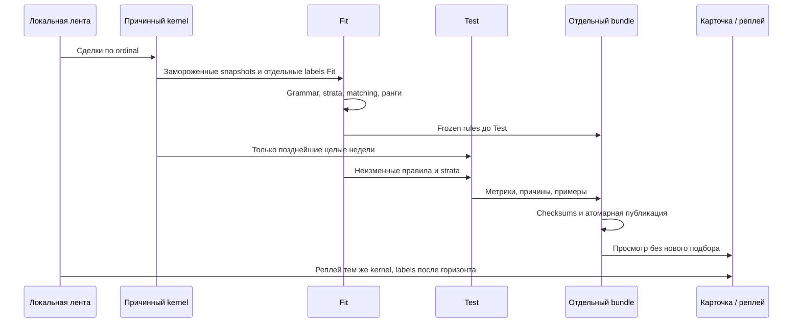

# ORDER-FLOW-CLOUD-EXPLORER-FOLLOWUP-001: исправления интерфейса и поиск предвестников движения

**Статус:** CURRENT IMPLEMENTATION CONTRACT — OFFLINE RESEARCH ONLY.
**База постановки:** `c4f76079f7bd42fbcc2b8c02ce920821b6cba73f`, ветка `docs/order-flow-production-roadmap`.
**База реализации:** `9a6aaa351079751eab8e91f3ae1c812c257da2a5` + рабочие изменения. Ниже сохранены критерии исходной постановки; фактический ограниченный алгоритм и evidence boundary уточнены в §6.
**Область:** локальный OsData → Order Flow → «Исследование Cloud». Без заявок, исполнения, Tester и доходности.

## 1. Задача и граница текущего поведения

Пользователь хочет узнать, **какие уже известные события предшествуют движению цены
до конца того же дня**. Проверять признаки одного дня и контекст текущей недели,
не требуя ручного перебора десятков параметров. Владелец выбирает файл и
контракт самостоятельно; выбор активного контракта и переходы ликвидности
остаются за пределами этой задачи.

Сейчас «Каталог» — список Cloud для выбранных правил, «Эпизоды» — дополнительный
выключенный по умолчанию модуль, а исследование `cloud-structure-study-1`
проверяет одну заданную комбинацию слоя/масштаба/триггера с горизонтами
`3/9/18` минут. Отдельный поиск комбинаций и каталог сценариев добавлены в
раздел **2.6 «Предвестники движения»**. Сохранить все действующие bundles, их схемы, legacy вкладки,
формулы и причинный реплей; новый поиск получает собственную версию и артефакт.
Точные действующие формулы — в [контракте V2](CLOUD_EXPLORER_V2_SPEC.md).

Сообщения владельца о русском тексте ошибки, «Сводке», графике и «Эпизодах»
зафиксированы в [реестре](TECHNICAL_DEBT.md). Это наблюдения на Windows, а не
автоматически воспроизведённые тесты. Оконная запись `TD-CLOUD-WINDOW-001`
остаётся закрытой.

## 2. Исправить ввод и сообщения об ошибках

Ранее `ExplorerRunSpec.Validate` объединял путь, даты, профили и лимиты общей
английской ошибкой. Действующий `ExplorerValidation` выполняет адресную проверку **до запуска worker**:
показать одну или список независимых ошибок на русском, назвать поле и способ
исправления, выделить вкладку/контрол. Порядок сообщений детерминирован;
не начинать расчёт и не публиковать bundle, если ввод отвергнут.

| Группа проверки | Пример текста в интерфейсе | Критерий |
|---|---|---|
| Файл и папка | «Укажите существующий файл сделок»; «Не удалось создать папку результатов: проверьте путь и права» | Проверять пустой путь, отсутствие/недоступность файла, путь папки и отказ записи; не терять системную причину в журнале |
| Даты | «Начальная дата позже конечной. Поменяйте даты местами или выберите другой период»; «Заполните обе даты либо оставьте обе пустыми» | Воспроизвести в том числе ввод 24.09.2026 → 07.09.2026; не показывать `Invalid Cloud Explorer input` |
| Диапазон данных | «В выбранном периоде нет сделок. Проверьте даты» | Показать после проверки файла; не подменять пустой результат успешным исследованием |
| Шаг цены | «Шаг цены должен быть положительным числом» | Пустая, нулевая, отрицательная или нечисловая строка не превращается молча в ноль |
| Слои и профиль | «Включите хотя бы один слой Cloud»; «Выбранный профиль эпизодов не участвует в расчёте» | Проверить выбранные профили, уникальность, существование ссылок исследования и соответствие эпизодного trigger |
| Поля параметров | «Поле „Окно темпа“: введите целое число не меньше 1» | Для каждого целого/дробного/`True/False`/`enum`/списка горизонтов: пустота, синтаксис, переполнение, диапазон, дубликат, зависимость; сообщать русское имя строки таблицы |
| Ограничение ресурсов | «Лимит памяти должен быть не меньше 64 МиБ» | Отдельно проверять предел памяти и кэш записей, сообщать допустимый интервал |
| Несовместимые режимы | «Для относительного триггера включите относительный объём или фон прежних дней и пересчитайте каталог» | Явно объяснять зависимость и требуемый новый расчёт |
| Исходный формат | «Ошибка в строке N файла сделок: …» | Сохранять номер строки и точную причину reader; несовпадающий SHA объяснять как изменение исходного файла |
| Открытие результата/реплей | «Сохранённый результат повреждён: контрольная сумма файла … не совпадает»; «Для реплея нужен исходный файл с тем же SHA» | Различать отсутствие файла, неподдерживаемую версию, checksum и нехватку прав |
| Отмена/память/диск | «Расчёт отменён; незаконченный результат не опубликован»; «Не хватает памяти для текущего лимита» | Понятное следующее действие и отсутствие частично опубликованного результата |

В пользовательской строке состояния и уведомлениях локализовать технические
`Unknown`, `EOF`, `Incomplete` и английские исключения там, где они мешают
пониманию; машинные коды допустимы в артефактах и рядом с русским объяснением.
Непредвиденная ошибка получает короткий русский текст с ID попытки; полное
исключение и stack trace остаются в диагностическом логе. Не скрывать
непредвиденную ошибку как «неверный ввод». Проверить все `Validate` и
`ExplorerOptions.Read` ветви, ошибки reader, хранилища и реплея, а не только
перепутанные даты.

**Приёмка:** таблица параметризованных корректных/некорректных вводов,
проверка названного поля и русского сообщения для каждой ветви; успешный
расчёт с прежними валидными значениями; аварийный I/O путь с безопасным
сообщением в UI и технической причиной в логе.

## 3. «Сводка», «Эпизоды» и график

### 3.1. Читаемая «Сводка»

До этой доработки сводка записывалась в многострочный `TextBoxSummary` и после установки
текста дополняется `AppendText`. На экране владельца видна одна строка в
середине большой области; причина конкретного расположения визуально не
проверена в этом окружении. Задать явную компоновку: заголовок, количество
Cloud всего/прошло по каждому профилю, доля одиночных, `Unknown`, квантили,
число включённых эпизодов/наблюдений (или «модуль выключен»), ссылки на
детализацию. Начало сводки видно сразу после расчёта; остальные блоки
расположены подряд и прокручиваются внутри вкладки с заметной прокруткой.
Длинный текст, изменение размера окна и масштаб Windows не прячут начало.
Изменение только видимости обновляет её показатели без пересчёта исходника,
а описательная статистика полного периода имеет явную подпись.

### 3.2. Почему пусты «Эпизоды»

`ExplorerEpisodeSpec.Enabled=false` по умолчанию: пустая таблица после запуска
с default ожидаема. Вместо немой пустоты показывать одно из разных состояний:
«Эпизоды выключены. Включите модуль на вкладке 2.4 и рассчитайте снова»;
«Модуль включён, за выбранный период эпизоды не найдены» с числом пригодных
Cloud и причинами; «Эпизоды закончились, вернитесь на первую страницу».
Показывать `N` эпизодов и `M` Cloud в них, профиль и применённые правила;
объяснять, что эпизод группирует близкие Cloud, а не является сделкой.
Постраничный переход привязан к выбранной таблице и не создаёт пустой
«первой» страницы другого раздела. Проверить выключенный модуль, включённый
с нулём, несколько страниц, выбранный профиль без Cloud и реплей.

### 3.3. Цена, метки и период на графике

До этой доработки `ExplorerChart` строил общий горизонтальный диапазон по Cloud, барам,
пивотам и наблюдениям, тогда как `LoadPage` загружал свечи по диапазону
только текущей страницы Cloud. Поэтому метки за пределами свечей могли
растянуть время. Колесо меняло только горизонтальный масштаб; отдельного изменения
шкалы цены не было. Критерий доработки — единый **явно показанный временной интервал**: для
выбранного Cloud/наблюдения/дня загрузить свечи и метки этого интервала из
сохранённого результата; метки вне интервала не растягивают ось. При
переключении страниц, таймфрейма и в отдельном окне сохранять соответствие
цены и меток; не перечитывать весь файл тиков ради каждой прокрутки.

Добавить независимый вертикальный масштаб и сдвиг оси цены, «Вписать цену»
и «Сбросить масштаб» с подсказкой управления; существующее горизонтальное
масштабирование и пользовательские линии сохраняются. Автомасштаб цены
учитывает только **видимые** свечи и выбранные видимые слои. Легенда прямо
расшифровывает жёлтые точки как подтверждённые экстремумы, круги/квадраты
Cloud и цвет/форму событий; `ObservedAt` и `KnownAt` не смешиваются. Когда
свечей на участке нет, показывать причину вместо графика с одними метками.

**Приёмка:** два удалённых друг от друга дня/страницы с пивотами; метка
попадает на свою свечу, полный ценовой участок загрузился, выбор даты
обновляет обе оси. Проверить отдельное окно, колесо X, колесо/элемент Y,
сброс, линии, разные разрешения окна, пропуски сделок и причинный реплей.

## 4. Новый режим «Найти предвестники движения»

### 4.1. Что задаёт человек

В разделе «Новый поиск» задать файл, inclusive даты и ручной шаг цены в
основном окне; в Explorer выбрать цель «рост», «снижение» либо «оба»,
исход «до конца того же дня» и контекст «сегодня», «текущая неделя» либо
«оба». По умолчанию — оба направления и оба контекста. Система показывает
границу дня **по дате исходной ленты**, число дней/недель, план ограничения
поиска и применённые профили. Порог движения задаётся объяснимым
предустановленным масштабом от причинной волатильности на момент события;
ручной порог доступен в «Дополнительно» и меняет ID исследования.
Недоступная причинная волатильность даёт `Unknown`, не нулевой порог.

Все численные настройки профилей остаются доступны для эксперта, но первый
поиск использует зафиксированную версию разумного набора слоёв и масштабов,
проверенную память и ограниченный budget гипотез. На экране показаны именно
применённые настройки; изменение их после результата создаёт отдельное
исследование. Выбор контракта/файла не автоматизируется.

### 4.2. Как появляются наблюдение и ответ

Из валидированной ленты построить/переиспользовать независимый каталог Cloud
и по необходимости эпизоды. На каждом заранее определённом причинном якоре
(например, достижение значимости префиксом Cloud, закрытие эпизода или
подтверждение структуры) сохранить `ObservedAt`, `KnownAt`, source sequence,
цену и только доступные к `KnownAt` признаки. Время начала будущего пути —
после якоря; ничего из финального Cloud или ещё не подтверждённого pivot не
добавлять задним числом. Хранить также все подходящие контрольные якоря и
исключения с причинами, чтобы знаменатель не зависел от найденного результата.

Внутридневный контекст описывает события текущей исходной даты **до якоря**:
знак/размер объёма, Cloud, эпизоды, структура, относительная активность и
расстояние до причинно известного VWAP/экстремума. Недельный контекст
использует завершённые исходные даты **с понедельника текущей календарной
недели** и уже прочитанную часть текущего дня. Будущие дни этой недели
неизвестны. Понедельник без прежних дней недели допустим с явной отметкой
«контекст недели пока пуст»; если файл или выбранный период начинается в
середине недели, сохранять «неполная неделя», не выдавать отсутствующую
предысторию за нулевую активность. Смена недели сбрасывает недельное окно;
временную зону и биржевую сессию из одного файла не выводить.

Последующий `label` рассчитывать отдельно по сделкам **этой же исходной даты**:
достигнут ли целевой порог раньше неблагоприятного, время первого касания,
максимальное движение с/против направления и изменение к последней доступной
сделке. По умолчанию сравнить фиксированные внутридневные горизонты и
«до конца дня»; каждый имеет отдельный знаменатель и полноту. Ни один
горизонт не продолжается на следующую дату. Если нет будущих сделок,
недостаточно ATR или конец исходного дня не доказан до EOF/границы выборки,
сохранить `NoFutureTrade`/`NoAtr`/`Incomplete` и объяснить исключение, не
считать это отрицательным исходом. Метки — путь цены, не исполнение заявки.

### 4.3. Как рождается найденный сценарий

Версионированная грамматика порождает простые понятные правила: одиночный
признак, порядок двух событий, сочетание недельного фона с сегодняшним
событием и максимум трёх условий. Бюджет кандидатов, сетка окон,
минимальное число **разных дат и недель**, способ разрешения перекрытий
и seed фиксируются **до просмотра исходов**. Сначала оценивать простые
варианты. При превышении лимита выдавать диагностическое число
рассмотренных/отсечённых правил, а не молча урезать поиск.

Разделить материал хронологически **целыми неделями** на Fit и Test; feature
window или label, пересекающий границу, помечать `Purged`. Правила, пороги,
сопоставимые контрольные якоря (время дня, активность, причинная
волатильность) и ранжирование подбирать **только на Fit**. На Test один раз
применить уже замороженные правила и показать частоты с числом разных дней
и недель, отличие от контроля, разброс по неделям и доли
`Unknown`/`Incomplete`. Перекрывающиеся будущие окна не считать
независимыми подтверждениями: одинаковая политика отбора для сценария
и контроля. Если Test мал, пуст или эффект не повторился, выводить
«недостаточно данных»/«не подтвердился»; не публиковать процент как
«готовый сигнал». Новый подбор после просмотра Test требует нового
неиспользованного периода; не объявлять Fit/Test финальным OOS.

`Исследовательский каталог` — список **сценариев**, отличный от каталога
Cloud. Каждая карточка содержит версию условия на русском, профиль,
масштаб/контекст, часы/цель, числа Fit/Test, контроль, причины исключений,
пример успеха и неудачи и ID исходных наблюдений. ИИ агент может читать
сохранённые результаты, группировать объяснения или предложить следующий
зафиксированный поиск; числа и отбор воспроизводит локальный движок, текст
агента не заменяет измерения.

### 4.4. Экран и визуализация

Поток: «Новый поиск» → «Ход расчёта и качество» → «Найденные сценарии» →
«Карточка сценария» → «График и реплей»; «Сохранённые исследования» открывают
готовый manifest без пересчёта. При пустом результате видны причины по
этапам: входные дни, Cloud, эпизоды, якоря, полные labels, кандидаты,
правила с достаточной поддержкой и проверенные правила. Прогресс показывает
этап/строки/события/память/время; отмена сохраняет старые опубликованные
исследования.

В карточке — два связанных вида: обзор уже прошедших дней текущей недели
и подробная цена выбранного дня с независимыми осями времени и цены.
Вертикальная отметка `KnownAt` отделяет доступные признаки от окрашенного
будущего участка. Клик по событию открывает его входящие Cloud и причины;
переключатель «успех / неудача / контроль» не выбирает только выигрышные
примеры. В реплее условия и счётчики открываются по мере поступления
сделок, метка результата — после завершения горизонта.

**Иллюстрация, не вывод из SRU6:** «Во вторник и среду были повторные эпизоды
продаж; в четверг к 11:00 подтверждена структура разворота. Достигла ли
цена порога роста до конца четверга чаще, чем в похожие четверги без этой
комбинации?» В интерфейсе должны быть видны оба знаменателя и дни без
движения.

## 5. Артефакты, производительность и проверка

Создать отдельный версионированный `cloud-pattern-search-<hash>` с manifest,
hash исходника/каталога/эпизодов и версии грамматики, копией применённого
spec, контролем времени/перекрытий, snapshots, отдельными labels,
перебранными/отброшенными правилами, карточками, examples и quality/reason
codes. Старые каталоги, study и видимость не перезаписывать. Предпросмотр
карточки не запускает новый расчёт; менять только фильтр показа можно
мгновенно. Запись через staging, публикация атомарна. Потоковые проходы,
ограниченные окна и индекс не загружают миллионы raw объектов или все
комбинации в память. Расчёт с одним файлом идёт только локально.

| Проверка реализации | Ожидаемое доказательство |
|---|---|
| Причинность | На каждом тике префикс реплея совпадает с независимым пересчётом префикса; future label недоступен на `KnownAt` |
| Неделя и день | Синтетические понедельник/пятница, неполная первая неделя, неделя с пропущенным днём, одинаковые timestamps: нет событий будущего дня и нет overnight label |
| Честное сравнение | Fit/Test по неделям, purge на границе, одинаковая политика перекрытий и контроля, пустой/малый Test с явным статусом |
| UI и качество | Русские ошибки из `2`, видимая сводка, объяснимо пустые эпизоды, совпадение диапазона свечей/меток, независимый вертикальный масштаб и график в отдельном окне |
| Совместимость | Не изменены legacy bundle/hashes, старые manifests открываются, отмена/плохой ввод не публикуют частичный результат |
| Нагрузка | Потоковый прогон полного предоставленного `SRU6.txt` с измеренными временем, пиком памяти и размером артефактов; без утверждения, что найден торговый паттерн |

Реализацию разбить на проверяемые изменения: ввод/экранные дефекты;
дополнение операционного руководства; причинный датасет и версионированный
автопоиск; каталог сценариев, график и реплей; offline тесты и отдельная
ручная проверка WPF владельцем. Техническая приёмка поиска не равна
подтверждённой экономической пользе.

## 6. Фактический алгоритм версии 1

`ExplorerPatternSpec/Kernel/Evaluation/Runner` реализуют отдельную версию
`cloud-pattern-search-1`, грамматику `causal-conditions-1`. Это ограниченный
детерминированный перебор, не произвольный поиск любой текстовой гипотезы.
Существующие `cloud-catalog-1`, `cloud-episodes-1`,
`cloud-structure-study-1` и их идентичности не меняются.

- Обычный старт: Cloud1/Narrow, Base, Wide с диапазонами 2/5/10 шагов,
  адаптацией диапазона по ATR и относительным объёмом; эпизоды Cloud1/Base.
  Экспертный флаг берёт применённые профили 2.1–2.4. Полный spec сохранён.
- Якори: первое достижение префиксом Cloud объёма 20, закрытие эпизода,
  подтверждение pivot и контрольный шаг 5 минут исходного времени.
  Порог объёма и шаг доступны в дополнительных параметрах. Все якори
  сохраняются, включая неизвестные и перекрывающиеся. События начала
  следующего дня не переносят закрытый предыдущий эпизод в новый дневной фон.
- Признаки: подписанная доля Buy−Sell дня/недели/Cloud, объём события,
  отношение к причинному относительному порогу, расстояния до дневного
  VWAP/экстремумов в ATR, число предыдущих сделок и закрытых Cloud/эпизодов,
  последние ordinals покупок/продаж и подтверждений high/low.
  WeekDays содержит только реальные наблюдаемые даты и текущий префикс.
  Недостающая дата не считается нулевой сессией.
- Базовый ATR — существующий причинный ATR20 предыдущих закрытых минут.
  Цель 1,5 ATR, неблагоприятный барьер 1 ATR; горизонты 15/60 минут и конец
  исходного дня. Будущие сделки имеют строго больший ordinal. На конце
  файла фиксированный горизонт с последней сделкой ровно на его границе
  полон; конец дня без следующей выбранной даты — неполон. Достигнутая
  цель сама по себе не делает неполный горизонт полным.
- Общая политика перекрытий: первый причинно доступный якорь с ATR занимает
  окно каждого горизонта; следующие якори до его конца включительно
  сохраняются с `Overlap`. Политика общая для всех профилей, сценариев и
  контроля. Для EOD это максимум один выбранный якорь на исходную дату;
  поздние внутридневные события поэтому не дают независимые EOD случаи.
- Грамматика: одиночные пороги дельты ±0,25, знак отклонения от VWAP,
  relative volume ≥1, наличие эпизодов; продажи Cloud → подтверждённый
  минимум либо покупки → максимум за 5/30/120 минут; пары и тройки разных
  признаков. Порядок при одинаковом времени определяется ordinal.
  Сначала одиночные условия, затем пары, затем тройки. По умолчанию
  рассматриваются первые 128 правил, максимум 12 карточек. Остальная
  сетка записана с `BudgetExcluded`, а не пропадает молча.
- Fit — первые 70% различных календарных недель (не менее одной при
  наличии Test), Test — оставшиеся полные недели. Если недель меньше двух,
  Test отсутствует. Пересечение окна истории признаков или label с
  границей даёт `Purged`. Для относительного фона сохраняется консервативная
  граница по числу наблюдаемых source-дат профиля, включая предыдущие недели.
- Сопоставление: одинаковый исходный час и терцили активности/ATR,
  обученные только на Fit по воспроизводимой reservoir-выборке до 8192
  якорей с seed 1701. В каждой ячейке берутся первые причинные N случаев и
  N контрольных якорей, N=min(численности групп). Outcome не участвует в
  выборе. `Unmatched` и `BalanceExcluded`, состав каждой группы и `Purged`
  сохранены отдельно. Неизвестное условие не считается контролем.
- Минимальная поддержка Fit: 3 разные даты и 2 недели **в каждой группе**.
  Положительное отличие от контроля ранжируется только на Fit; правила
  фиксируются в `frozen-fit.json` до чтения Test в evaluator. Test применяет
  те же правила и границы strata один раз. Менее двух разных дат в любой
  группе — «Недостаточно данных»; неположительное отличие — «Не подтвердился».
  Это разведочная проверка с множественным перебором, не final OOS.

Bundle содержит проверяемый manifest, `run-spec.json`, `pattern-spec.json`,
`snapshots`, отдельные `labels`, выбранные для оценки `evaluation`,
`grammar`, `fit-rules`, `fit-membership`, `test-membership`, `cards`,
`examples`, `frozen-fit.json`, `quality.json`. Таблицы используют `.bin` и
`.idx`; отсутствие исходного файла не мешает просмотру. Реплей требует
его исходный SHA и восстанавливает тот же kernel, не читая будущие finals.
Изменение Study-настроек причинных признаков также меняет hash поиска.

График загружает единый сохранённый временной срез свечей и маркеров, до
4000 меток каждого слоя. Ограничение явно показано; для остальных следует
сузить интервал. Прокрутка/масштабирование не сканируют raw-файл. Ctrl+колесо
управляет ценой, Ctrl+Shift+колесо — её сдвигом; «Подогнать цену» сохраняет X.
Реплей показывает до 250 последних объектов, а не будущие итоги периода.

Проверяемые offline fixtures перечислены в
[qualification](TESTING_AND_QUALIFICATION.md#поиск-предвестников-и-доработки-explorer).
Компонентный рендеринг и синтетические тесты не заменяют ручную проверку
реального окна, мыши и DPI владельцем. Полный SRU6-прогон измеряет техническую
нагрузку, не подтверждает торговое преимущество.
