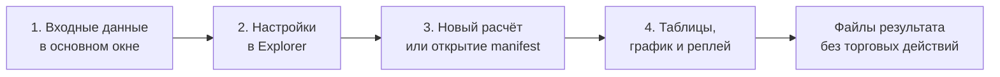

# ORDER-FLOW-CLOUD-EXPLORER-GUIDE-001: как пользоваться Cloud Explorer

**Статус:** CURRENT OPERATOR GUIDE — OFFLINE RESEARCH ONLY.

Этот документ — практическая инструкция для первого знакомства с отдельным
окном **«Исследование Cloud»**. Формулы, точные границы причинности и форматы
файлов находятся в
[контракте Cloud Explorer V2](CLOUD_EXPLORER_V2_SPEC.md), а подробное описание
всего Order Flow workbench — в
[Research MVP runbook](RESEARCH_MVP_RUNBOOK.md).

Cloud Explorer работает с локальной исторической лентой. Он не подключается к
брокеру, не отправляет заявки, не моделирует исполнение и не доказывает
прибыльность стратегии.

## 1. Быстрый старт

1. Откройте **OsEngine → Data / OsData → Order Flow**.
2. В верхней части основного окна укажите:
   - локальный файл тиков;
   - папку, куда записывать результаты;
   - ручной шаг цены;
   - начальную и конечную даты, если нужен не весь период.
3. Нажмите вкладку **«Исследование Cloud»**. Основное окно останется на прежней
   вкладке, а Cloud Explorer откроется отдельным окном. Повторное нажатие
   восстанавливает свёрнутое окно и активирует его.
4. Пройдите четыре пронумерованных шага в верхней части Explorer:
   **1. Данные → 2. Настройки → 3. Запуск → 4. Результат**.
5. Для первого знакомства оставьте значения по умолчанию и нажмите
   **«3.1 Рассчитать каталог / исследование»**.
6. Следите за нижней строкой состояния. После завершения откройте
   **«Сводку»**, затем **«Каталог»** и **«График и реплей»**.

Любой элемент управления имеет русскую подсказку при наведении. В таблицах
настроек пояснение также постоянно показано в последнем столбце.

Переключение обратно в Order Flow и ввод при открытом Cloud подтверждены
повторной ручной проверкой владельца. Ранее сообщённая
[проблема](TECHNICAL_DEBT.md#td-cloud-window-001--ввод-в-order-flow-при-открытом-cloud)
закрыта.
Закрытие OsData закрывает Order Flow и его исследовательские окна; закрытие
Order Flow закрывает Cloud Explorer и вынесенные графики с отменой их работы.

## 2. Шаг 1. Подготовьте данные

Explorer наследует входные поля из основного окна Order Flow. В отдельном окне
они намеренно не дублируются.

Минимально нужны:

- текстовый файл сделок в поддерживаемом формате;
- существующая или доступная для создания папка результата;
- положительный шаг цены;
- корректный период, если даты заполнены.

Файл проверяется полностью, даже если выбран короткий период. Даты включаются
с обеих сторон. Строки вне периода не используются для скрытого прогрева.
Исходный файл не добавляется в Git и не изменяется Explorer.

Если нужно поменять файл, папку, шаг цены или даты, вернитесь в основное окно
Order Flow и измените поля, не закрывая Cloud. Следующий запуск расчёта в
Explorer возьмёт актуальные значения этих полей. Закрытие Cloud отменяет
текущую работу Explorer; опубликованные файлы результата не удаляются.

## 3. Шаг 2. Настройте расчёт

### 3.1. Формирование

- **Cloud 1** — слой накопленных цепочек сделок.
- **Cloud 2** — второй независимый слой; в стандартном профиле это отдельные
  крупные сделки.
- **«Узкий / базовый / широкий»** — без флажка рассчитывается только `Base`;
  с флажком добавляются `Narrow` и `Wide` для каждого включённого слоя.
- **Профиль** — выбирает, какой слой и масштаб сейчас редактируется. Все шесть
  профилей остаются в списке, но в расчёт входят только включённые слои и
  масштабы.
- **Кэш записей** и **Память MiB** — защитные пределы операции. Это не
  обещание точного размера всего процесса.

### 3.2. Остальные вкладки настроек

| Вкладка | Для чего нужна | Как применяется |
|---|---|---|
| **2.2 Видимость** | Скрыть или показать уже рассчитанные строки выбранного профиля | Кнопкой **«3.3 Применить видимость»**, без нового чтения raw тиков |
| **2.3 Адаптация** | Настроить причинную адаптацию размера сделки, паузы, диапазона и активности | Только новым расчётом |
| **2.4 Эпизоды и экстремумы** | Включить объединение Cloud в эпизоды и подтверждённые swing-точки | Только новым расчётом |
| **2.5 Исследование** | Настроить triggers, watch, структуру и отдельные будущие горизонты | Только новым расчётом |

Логические значения вводятся как `True` или `False`. Для nullable-фильтра пустое
значение означает «без ограничения». `Unknown` означает недостаток причинно
доступного фона и не равен `Fail` или нулю.

После готового расчёта изменённые вычислительные параметры помечаются как
неприменённые. Кнопка видимости не применяет их случайно.

## 4. Шаг 3. Запустите или откройте результат

### Новый расчёт

Нажмите **«3.1 Рассчитать каталог / исследование»**. Explorer:

1. зафиксирует текущие входы и вычислительные параметры;
2. проверит исходный файл и его SHA-256;
3. построит или переиспользует совместимый каталог;
4. отдельно построит включённые эпизоды и исследование;
5. опубликует только законченные bundles.

Кнопка **«Остановить операцию»** запрашивает отмену. Незавершённый staging
текущего уровня удаляется; ранее опубликованные результаты сохраняются.

### Ранее сохранённый результат

Нажмите **«3.2 Открыть сохранённый результат»** и выберите `manifest.json`
каталога либо исследования. Explorer проверит версию, хэши и обязательные
файлы. Для просмотра сохранённых таблиц исходный tick-файл не нужен. Для нового
VWAP или реплея нужен тот же исходный файл, SHA которого записан в результате.

### Фильтры видимости

Выберите профиль, настройте вкладку **«2.2 Видимость»** и нажмите
**«3.3 Применить видимость»**. Эта операция:

- не меняет каталог и исследование;
- не пересчитывает SHA исходного файла;
- не переводит наблюдение между исследовательскими группами;
- использует один verdict для таблицы и графика.

## 5. Шаг 4. Изучите результат

Над результатами находятся постраничная навигация, поиск по ID Cloud и кнопка
папки файлов. Одна страница содержит до 250 записей. Чтобы показать Cloud,
связанные с эпизодом или наблюдением, используйте поле **«ID эпизода /
наблюдения»** на вкладке **«2.2 Видимость»**.

| Раздел | Что в нём смотреть |
|---|---|
| **Каталог** | Все Cloud выбранной страницы, verdict `Passed`, фактические параметры и подробности выбранной строки |
| **Сводка** | Количество событий, прошедшие фильтр строки, квантили и доли по профилям |
| **Эпизоды** | Группы соседних Cloud и полный список дочерних ID |
| **Наблюдения** | Причинные исследовательские события и доступный на тот момент контекст |
| **Будущие исходы** | Отдельные метки, ставшие известными после заданного горизонта |
| **Триггеры** | События, которыми было активировано наблюдение |
| **Экстремумы** | Swing-точки с отдельным временем факта и временем подтверждения |
| **Причины и активные наблюдения** | Почему watch завершён, исключён или ещё не закончен |
| **Сравнение групп** | Fit/Test-группы, размеры ячеек, Unknown и Incomplete |
| **График и реплей** | Визуальная связь цены, Cloud, эпизодов, VWAP, pivots и причинного времени |

Выберите Cloud в каталоге, чтобы увидеть точные времена, объёмы и параметры.
Двойной щелчок переводит к графику. Выбор эпизода делает его доступным для
anchored VWAP. Выбор наблюдения показывает связанный причинный участок.

Важно различать:

- `ObservedAt` — когда цена или объём фактически наблюдались;
- `KnownAt` — когда событие было квалифицировано или подтверждено;
- future label — что стало известно только после будущего горизонта.

`Passed=false` не удаляет строку из исходного результата. При включённом показе
отсечённых строк график рисует их серым.

## 6. График, VWAP и реплей

### Обычный график

- выберите таймфрейм и вид цены: свечи, бары или High-Low;
- колесо мыши меняет масштаб;
- `Shift` с колесом сдвигает видимую область;
- флажок **«Линия»** позволяет задать две точки;
- **«Очистить линии»** удаляет только временные рисунки Explorer;
- **«Отдельное окно графика»** переносит ту же поверхность, не создавая новый
  расчёт.

### Anchored VWAP

Сначала выберите Cloud или эпизод, затем нажмите
**«VWAP выбранного Cloud / эпизода»**. Флажок **«От первого trigger»** меняет
начало линии, а **«Полосы σ»** включает или скрывает полосы отклонения.
Операция заново читает raw сделки соответствующей даты и проверяет SHA файла.

### Причинный реплей

- **«Запустить реплей»** начинает последовательное чтение по сохранённому run
  spec открытого результата;
- **«Пауза»** останавливает или продолжает ход;
- **«Один тик»** обрабатывает ровно следующий raw ordinal;
- поле **«Тиков / кадр»** меняет частоту обновления экрана, но не порядок;
- **«Вернуться к истории»** возвращает полные итоговые таблицы.

В реплее future label появляется только после достижения его горизонта.
Формирующийся Cloud не получает будущий итоговый объём, а pivot не считается
известным до подтверждающего движения.

## 7. Где лежат файлы

Кнопка **«Открыть папку файлов»** открывает текущий bundle:

- `cloud-catalog-<hash>` — каталог, индексы, качество и сводка;
- `cloud-episodes-<hash>` — эпизоды и membership;
- `cloud-structure-study-<hash>` — observations, triggers, pivots, будущие
  метки и сравнение групп;
- `cloud-explorer-view` — отдельные настройки видимости;
- `cloud-explorer-attempts` — сведения о попытках, прогрессе и ошибках.

Не редактируйте опубликованные файлы вручную: при повторном открытии Explorer
проверяет контрольные суммы.

## 8. Частые вопросы и ошибки

| Ситуация | Что проверить |
|---|---|
| Окно не открылось повторно | Оно уже открыто: повторный выбор вкладки активирует существующее окно |
| Расчёт не начинается | Путь к файлу, папку результата, положительный шаг цены, даты и значения таблиц |
| В выбранном периоде пусто | В файле нет сделок между inclusive-датами; расширьте период |
| Изменение настройки не видно | Вычислительные поля требуют нового расчёта; только вкладка видимости применяется сразу |
| VWAP или реплей отклонён | Нужен исходный файл с тем же SHA-256, что записан в открытом результате |
| Показан `Unknown` | Для причинной оценки пока недостаточно предыдущего фона; это не `Fail` |
| Операция остановлена по памяти | Уменьшите период или осознанно измените защитный предел памяти |
| Manifest не открывается | Неизвестная версия, отсутствующий файл или несовпавшая checksum не принимаются |
| Таблица и график кажутся пустыми | Проверьте профиль, фильтры видимости, поиск ID Cloud и флаг показа отсечённых строк |

Полный перечень кодов ошибок входного файла и границы отмены находится в
[разделе «Ошибки и отмена» runbook](RESEARCH_MVP_RUNBOOK.md#6-ошибки-и-отмена).

## 9. Как правильно завершить работу

Закройте отдельное окно Explorer обычной кнопкой закрытия. Его текущая операция
будет отменена, обработчики и файловые ресурсы освобождены. Уже опубликованные
bundles не удаляются. После закрытия вкладка **«Исследование Cloud»** откроет
новое чистое окно.

Перед выводами по данным проверьте сводку качества, `ObservedAt`/`KnownAt`,
размеры групп и доли `Unknown`/`Incomplete`. Даже технически корректный результат
остаётся исследовательским и не является торговой рекомендацией.
