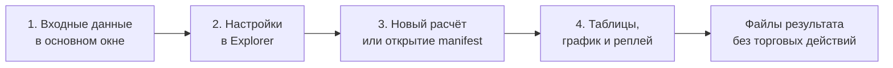

# ORDER-FLOW-CLOUD-EXPLORER-GUIDE-001: как пользоваться Cloud Explorer

**Статус:** CURRENT OPERATOR GUIDE — OFFLINE RESEARCH ONLY.

Этот документ — практическая инструкция для первого знакомства с отдельным
окном **«Исследование Cloud»**. Формулы, точные границы причинности и форматы
файлов находятся в
[контракте Cloud Explorer V2](CLOUD_EXPLORER_V2_SPEC.md), а подробное описание
всего Order Flow workbench — в
[Research MVP runbook](RESEARCH_MVP_RUNBOOK.md).
Автоматический поиск сочетаний и исправления интерфейса описаны в
[контракте доработки](CLOUD_EXPLORER_FOLLOWUP_SPEC.md). Новый пошаговый поиск
доступен в разделе 2.6 окна и описан в §10 этого руководства.

Cloud Explorer работает с локальной исторической лентой. Он не подключается к
брокеру, не отправляет заявки, не моделирует исполнение и не доказывает
прибыльность стратегии.

## 1. Быстрый старт

1. Откройте **OsEngine → Data / OsData → Order Flow**.
2. В верхней части основного окна укажите:
   - локальный файл тиков;
   - папку, куда записывать результаты;
   - ручной шаг цены;
   - начальную и конечную даты, если нужен не весь период.
3. Нажмите вкладку **«Исследование Cloud»**. Основное окно останется на прежней
   вкладке, а Cloud Explorer откроется отдельным окном. Повторное нажатие
   восстанавливает свёрнутое окно и активирует его.
4. Пройдите четыре пронумерованных шага в верхней части Explorer:
   **1. Данные → 2. Настройки → 3. Запуск → 4. Результат**.
5. Для первого знакомства оставьте значения по умолчанию и нажмите
   **«3.1 Рассчитать каталог / исследование»**.
6. Следите за нижней строкой состояния. После завершения откройте
   **«Сводку»**, затем **«Каталог»** и **«График и реплей»**.

Любой элемент управления имеет русскую подсказку при наведении. В таблицах
настроек пояснение также постоянно показано в последнем столбце.

Переключение обратно в Order Flow и ввод при открытом Cloud подтверждены
повторной ручной проверкой владельца. Ранее сообщённая
[проблема](TECHNICAL_DEBT.md#td-cloud-window-001--ввод-в-order-flow-при-открытом-cloud)
закрыта.
Закрытие OsData закрывает Order Flow и его исследовательские окна; закрытие
Order Flow закрывает Cloud Explorer и вынесенные графики с отменой их работы.

## 2. Шаг 1. Подготовьте данные

Explorer наследует входные поля из основного окна Order Flow. В отдельном окне
они намеренно не дублируются.

Минимально нужны:

- текстовый файл сделок в поддерживаемом формате;
- существующая или доступная для создания папка результата;
- положительный шаг цены;
- корректный период, если даты заполнены.

Файл проверяется полностью, даже если выбран короткий период. Даты включаются
с обеих сторон. Строки вне периода не используются для скрытого прогрева.
Исходный файл не добавляется в Git и не изменяется Explorer.

Если нужно поменять файл, папку, шаг цены или даты, вернитесь в основное окно
Order Flow и измените поля, не закрывая Cloud. Следующий запуск расчёта в
Explorer возьмёт актуальные значения этих полей. Закрытие Cloud отменяет
текущую работу Explorer; опубликованные файлы результата не удаляются.

## 3. Шаг 2. Настройте расчёт

### 3.1. Формирование

- **Cloud 1** — слой накопленных цепочек сделок.
- **Cloud 2** — второй независимый слой; в стандартном профиле это отдельные
  сделки. Они считаются «крупными» только относительно выбранного вами
  порога/фона; сам факт принадлежности Cloud 2 не доказывает крупный объём.
- **«Узкий / базовый / широкий»** — без флажка рассчитывается только `Base`;
  с флажком добавляются `Narrow` и `Wide` для каждого включённого слоя.
- **Профиль** — выбирает, какой слой и масштаб сейчас редактируется. Все шесть
  профилей остаются в списке, но в расчёт входят только включённые слои и
  масштабы.
- **Кэш записей** и **Память MiB** — защитные пределы операции. Это не
  обещание точного размера всего процесса.

### 3.2. Остальные вкладки настроек

| Вкладка | Для чего нужна | Как применяется |
|---|---|---|
| **2.2 Видимость** | Скрыть или показать уже рассчитанные строки выбранного профиля | Кнопкой **«3.3 Применить видимость»**, без нового чтения raw тиков |
| **2.3 Адаптация** | Настроить причинную адаптацию размера сделки, паузы, диапазона и активности | Только новым расчётом |
| **2.4 Эпизоды и экстремумы** | Включить объединение Cloud в эпизоды и подтверждённые swing-точки | Только новым расчётом |
| **2.5 Исследование** | Настроить triggers, watch, структуру и отдельные будущие горизонты | Только новым расчётом |

Логические значения вводятся как `True` или `False`. Для nullable-фильтра пустое
значение означает «без ограничения». `Unknown` означает недостаток причинно
доступного фона и не равен `Fail` или нулю.

После готового расчёта изменённые вычислительные параметры помечаются как
неприменённые. Кнопка видимости не применяет их случайно.

### 3.3. Что включено в первом запуске и зачем параметры комбинировать

При запуске с текущими значениями Cloud 1/Base собирает цепочки, Cloud 2/Base
показывает отдельные сделки. Узкий и широкий масштабы **выключены**; отбор
видимых записей начинается с суммы объёма `900` для каждого профиля. **Каталог
сохраняет и меньшие Cloud**: `900` в «2.2 Видимость» скрывает их в текущем
просмотре, но не стирает. Эпизоды и исследовательские наблюдения по структуре
по умолчанию **выключены**; расчёт подтверждённых экстремумов включён. Поэтому
пустые «Эпизоды» или «Наблюдения» в первом запуске ожидаемы, а жёлтые точки
экстремумов на графике могут присутствовать.

| Вопрос | Настройки | Как читать результат |
|---|---|---|
| Какие цепочки существуют до и после более низкого порога показа? | Оставьте «2.1 Формирование» без изменений; в «2.2 Видимость» уменьшите «Минимальная сумма» с `900` до `300` и нажмите «3.3 Применить видимость» | Состав каталога и ID не меняются; меняется число `Passed` и показ на графике. Это изучение распределения, не новая исследовательская гипотеза |
| Отдельная сделка или серия соседних сделок? | Сравните Cloud 2/Base с Cloud 1/Base, начиная с одинакового диапазона дат; выберите слой/масштаб в «Профиль» и его фильтры | Cloud 2/Base отмечает отдельные сделки; Cloud 1/Base собирает цепочки. Одна и та же активность может быть видна в обоих слоях; числа нельзя складывать как независимые случаи |
| Как посмотреть, объединяются ли соседние Cloud в одно событие? | В «2.4 Эпизоды и экстремумы» задайте «Включить модуль = True» для эпизодов и профиль Cloud1/Base, затем заново нажмите 3.1 | Откройте «Эпизоды» и посмотрите дочерние ID; отсутствие строк означает, что условия объединения/выбранный профиль не дали результата либо расчёт ещё не выполнен с новым флагом |
| Нужен ли объёмный trigger для исследуемой структуры? | В «2.5 Исследование» включите модуль, оставьте один профиль/тип trigger и заново рассчитайте | «Наблюдения» и «Сравнение групп» показывают `VolumeArmed` и `Control` при **одинаковых** правилах структуры; «Будущие исходы» содержат более поздний путь, отдельно от причинных признаков |

Если меняете паузу, размах, минимум отдельной сделки, адаптацию или включённые
масштабы, возникает **новый каталог**; сравнивайте сохранённые результаты с
разными идентичностями явно. Если меняете только видимость, это **другой
ракурс того же каталога**. При включении trigger по эпизоду сначала включите
эпизоды **того же профиля** и выполните новый расчёт. Не подбирайте много
порогов по одной и той же проверочной части данных: «удачные» примеры
появляются и от случайного перебора.

### 3.4. Какие семейства настроек имеет смысл сочетать

| Семейство | Какую гипотезу проверяете | Что пересчитывается |
|---|---|---|
| Размер сделки, пауза и размах формирования | «Одиночные крупные сделки важнее коротких серий?»; «Плотные серии отличаются от растянутых?» | Новый каталог: границы и состав Cloud могут измениться |
| Узкий / базовый / широкий масштаб | «Эффект заметен на одном размере ценовой зоны или на нескольких?» | Новый каталог дополнительных профилей; одно исходное движение может появиться в нескольких профилях |
| Адаптация размера/паузы/размаха и относительный фон | «Важен ли необычный объём относительно уже известного темпа и предыдущих дат?» | Новый каталог; в начале истории фон может быть `Unknown` |
| Фильтры видимости, включая объём/дельту и отсечённые строки | «Где находятся интересующие меня уже сформированные Cloud?» | Только показ после кнопки 3.3; вывод о частоте будущего движения от этого сам по себе не меняется |
| Пауза, длительность и зона эпизода | «Составляют ли соседние Cloud один участок активности?» | Новый расчёт эпизодов; исходные Cloud сохраняются |
| Порог trigger, структура, активность, VWAP и горизонты | «Меняется ли последующий путь после причинного объёмного события при одинаковой структуре цены?» | Новое исследование с отдельным ID; изменение горизонта меняет будущую метку |
| Таймфрейм и вид цены на графике | «Как удобнее просмотреть уже рассчитанное наблюдение?» | Только рисунок; событие и исход не пересчитываются |

Для первого знакомства достаточно оставить формирование неизменным,
разобраться с каталогом и поменять **один** фильтр видимости. Затем включить
эпизоды, если интересуют серии Cloud, либо исследование, если нужен
сопоставимый будущий исход. Опциональные адаптации и дополнительные масштабы
имеет смысл включать для конкретного вопроса, сравнивая новый ID со старым.
Эти таблицы помогают читать ручной режим; предстоящий автоматический поиск
будет составлять ограниченные сочетания сам.

## 4. Шаг 3. Запустите или откройте результат

### Новый расчёт

Нажмите **«3.1 Рассчитать каталог / исследование»**. Explorer:

1. зафиксирует текущие входы и вычислительные параметры;
2. проверит исходный файл и его SHA-256;
3. построит или переиспользует совместимый каталог;
4. отдельно построит включённые эпизоды и исследование;
5. опубликует только законченные bundles.

Кнопка **«Остановить операцию»** запрашивает отмену. Незавершённый staging
текущего уровня удаляется; ранее опубликованные результаты сохраняются.

### Ранее сохранённый результат

Нажмите **«3.2 Открыть сохранённый результат»** и выберите `manifest.json`
каталога либо исследования. Explorer проверит версию, хэши и обязательные
файлы. Для просмотра сохранённых таблиц исходный tick-файл не нужен. Для нового
VWAP или реплея нужен тот же исходный файл, SHA которого записан в результате.

### Фильтры видимости

Выберите профиль, настройте вкладку **«2.2 Видимость»** и нажмите
**«3.3 Применить видимость»**. Эта операция:

- не меняет каталог и исследование;
- не пересчитывает SHA исходного файла;
- не переводит наблюдение между исследовательскими группами;
- использует один verdict для таблицы и графика.

## 5. Шаг 4. Изучите результат

Над результатами находятся постраничная навигация, поиск по ID Cloud и кнопка
папки файлов. Одна страница содержит до 250 записей. Чтобы показать Cloud,
связанные с эпизодом или наблюдением, используйте поле **«ID эпизода /
наблюдения»** на вкладке **«2.2 Видимость»**.

| Раздел | Что в нём смотреть |
|---|---|
| **Каталог** | Все Cloud выбранной страницы, verdict `Passed`, фактические параметры и подробности выбранной строки |
| **Сводка** | Количество событий, прошедшие фильтр строки, квантили и доли по профилям |
| **Эпизоды** | Группы соседних Cloud и полный список дочерних ID |
| **Наблюдения** | Причинные исследовательские события и доступный на тот момент контекст |
| **Будущие исходы** | Отдельные метки, ставшие известными после заданного горизонта |
| **Триггеры** | События, которыми было активировано наблюдение |
| **Экстремумы** | Swing-точки с отдельным временем факта и временем подтверждения |
| **Причины и активные наблюдения** | Почему watch завершён, исключён или ещё не закончен |
| **Сравнение групп** | Fit/Test-группы, размеры ячеек, Unknown и Incomplete |
| **График и реплей** | Визуальная связь цены, Cloud, эпизодов, VWAP, pivots и причинного времени |

Выберите Cloud в каталоге, чтобы увидеть точные времена, объёмы и параметры.
Двойной щелчок переводит к графику. Выбор эпизода делает его доступным для
anchored VWAP. Выбор наблюдения показывает связанный причинный участок.
Для объёмного наблюдения сохраняется его watch VWAP, в том числе после
переключения полос σ. При переходе к другому событию эта линия сбрасывается.

Слово **«эпизод»** здесь означает набор соседних Cloud одного профиля,
удовлетворяющий правилам паузы, длительности и ценовой зоны. Это не заявка,
не позиция и не обязательно разворот цены. Если эпизодов нет после первого
запуска, проверьте флаг включения в «2.4» и пересчитайте; изменение одной
видимости их не создаёт. Пустое исследование также может означать, что
«Включить модуль» в «2.5» осталось `False`, а не то, что рынок не дал
паттернов. Подпись над эпизодами различает выключенный модуль, отсутствие
завершённых событий и конец страниц. Кнопки страниц действуют независимо
для выбранной таблицы; размер страницы — 250 строк.

Важно различать:

- `ObservedAt` — когда цена или объём фактически наблюдались;
- `KnownAt` — когда событие было квалифицировано или подтверждено;
- future label — что стало известно только после будущего горизонта.

`Passed=false` не удаляет строку из исходного результата. При включённом показе
отсечённых строк график рисует их серым.

### 5.1. Как сделать вывод из таблиц

Для объяснения отдельной находки идите по цепочке **Cloud → при необходимости
эпизод → trigger → наблюдение → будущий исход → сравнение групп**. У Cloud и
эпизода есть время фактических сделок; у экстремума — отдельное время, когда он
был подтверждён. Если видите `Unknown`, причинный фон не был доступен к нужному
моменту; `Incomplete` означает, что будущий горизонт не удалось полностью
проверить. Эти записи не должны превращаться в «успех» или «провал».

**Иллюстрация, не результат SRU6:** выбрали Cloud1/Base, включили trigger по
объёму и увидели наблюдение на пробое уровня. На графике отметьте `KnownAt`
trigger и время подтверждения нужного экстремума, затем откройте исход на
горизонте 18 минут. Один совпавший случай говорит лишь о том, что в этой
истории после наблюдения был отмеченный путь. Для вывода нужны число всех
подходящих наблюдений, контроль без объёмного trigger, неудачные примеры,
`Unknown`/`Incomplete` и проверка на более поздних датах. Цифры будущего
движения не являются доходностью сделки.

**Условный расчёт вывода:** в Fit у объёмной группы цель наступила первой
в 24 из 80 полных случаев, у контроля — в 20 из 100. Получается 30% против
20%, но этого ещё мало для вывода: нужно посмотреть, сколько было
`Unknown`/`Incomplete`, все ли учитываемые watch достигли пробоя и что
произошло на Test. Если в Test оказалось 2 из 8 против 4 из 10,
первоначальное отличие **не повторилось**. Все эти числа приведены только
для объяснения чтения результата; это не измерение по вашему файлу и не
доходность. Низкая численность Test означает, что уверенный вывод делать
рано, даже если проценты выглядят привлекательными.

Расчёт на вкладке 2.5 проверяет **выбранную вами** гипотезу с исходными горизонтами
`3/9/18` минут и сроком наблюдения `60` минут. Он не ищет автоматически все
комбинации параметров и не проверяет движение до конца дня с недельным
контекстом. Для такой цели используйте **отдельный режим 2.6**, описанный ниже.

## 6. График, VWAP и реплей

### Обычный график

- выберите таймфрейм и вид цены: свечи, бары или High-Low;
- колесо мыши меняет **горизонтальный** масштаб времени; вертикальное
  масштабирование цены пока отсутствует;
- `Shift` с колесом сдвигает видимую область;
- флажок **«Линия»** позволяет задать две точки;
- **«Очистить линии»** удаляет только временные рисунки Explorer;
- **«Отдельное окно графика»** переносит ту же поверхность, не создавая новый
  расчёт.

Жёлтые кружки — отмеченные на графике экстремумы цены (`pivot`); круг Cloud
обозначает накопленную цепочку, квадрат Cloud — одиночный тик. Время на оси —
время исходного файла, не автоматически биржевой часовой пояс. Свечи и метки
загружаются для одного интервала. Далёкие метки его не расширяют. Заполненная
золотая точка — подтверждённый экстремум, контур — ещё предварительный;
время факта отличается от времени подтверждения.

Ctrl+колесо меняет масштаб **цены**, Ctrl+Shift+колесо — сдвигает её.
«Подогнать цену» возвращает автоматическую цену по видимому интервалу,
не меняя время и рисунки; «Сброс осей» возвращает обе оси. Лимит отображения
4000 меток слоя обозначается в строке состояния — сузьте интервал для
остальных. Отдельное окно использует ту же панель и управление.

### Anchored VWAP

Сначала выберите Cloud или эпизод, затем нажмите
**«VWAP выбранного Cloud / эпизода»**. Флажок **«От первого trigger»** меняет
начало линии, а **«Полосы σ»** включает или скрывает полосы отклонения.
Операция заново читает raw сделки соответствующей даты и проверяет SHA файла.

### Причинный реплей

- **«Запустить реплей»** начинает последовательное чтение по сохранённому run
  spec открытого результата;
- **«Пауза»** останавливает или продолжает ход;
- **«Один тик»** обрабатывает ровно следующий raw ordinal;
- поле **«Тиков / кадр»** меняет частоту обновления экрана, но не порядок;
- **«Вернуться к истории»** возвращает полные итоговые таблицы.

В реплее future label появляется только после достижения его горизонта.
Формирующийся Cloud не получает будущий итоговый объём, а pivot не считается
известным до подтверждающего движения.

## 7. Где лежат файлы

Кнопка **«Открыть папку файлов»** открывает текущий bundle:

- `cloud-catalog-<hash>` — каталог, индексы, качество и сводка;
- `cloud-episodes-<hash>` — эпизоды и membership;
- `cloud-structure-study-<hash>` — observations, triggers, pivots, будущие
  метки и сравнение групп;
- `cloud-explorer-view` — отдельные настройки видимости;
- `cloud-explorer-attempts` — сведения о попытках, прогрессе и ошибках.

Не редактируйте опубликованные файлы вручную: при повторном открытии Explorer
проверяет контрольные суммы.

## 8. Частые вопросы и ошибки

| Ситуация | Что проверить |
|---|---|
| Окно не открылось повторно | Оно уже открыто: повторный выбор вкладки активирует существующее окно |
| Расчёт не начинается | Путь к файлу, папку результата, положительный шаг цены, даты и значения таблиц |
| Неожиданная ошибка с ID попытки | Короткое сообщение остаётся в окне; технический журнал находится в `%LOCALAPPDATA%/OsEngine/CloudExplorer/Diagnostics/<ID>.log`. Передайте ID и журнал для диагностики, не меняя исходник |
| В выбранном периоде пусто | В файле нет сделок между inclusive-датами; расширьте период |
| Изменение настройки не видно | Вычислительные поля требуют нового расчёта; только вкладка видимости применяется сразу |
| VWAP или реплей отклонён | Нужен исходный файл с тем же SHA-256, что записан в открытом результате |
| Показан `Unknown` | Для причинной оценки пока недостаточно предыдущего фона; это не `Fail` |
| Операция остановлена по памяти | Уменьшите период или осознанно измените защитный предел памяти |
| Manifest не открывается | Неизвестная версия, отсутствующий файл или несовпавшая checksum не принимаются |
| Таблица и график кажутся пустыми | Проверьте профиль, фильтры видимости, поиск ID Cloud и флаг показа отсечённых строк |
| «Эпизоды» пусты | По умолчанию модуль выключен; включите его на вкладке 2.4 и запустите новый расчёт |
| Перепутаны даты | Русское сообщение указывает начальную дату. Исправьте порядок в основном окне; расчёт до исправления не начинается |
| Нужна подробная сводка | Она начинается с заголовка сверху, прокрутка показывает блоки всех профилей и включённых модулей |

Полный перечень кодов ошибок входного файла и границы отмены находится в
[разделе «Ошибки и отмена» runbook](RESEARCH_MVP_RUNBOOK.md#6-ошибки-и-отмена).

## 9. Как правильно завершить работу

Закройте отдельное окно Explorer обычной кнопкой закрытия. Его текущая операция
будет отменена, обработчики и файловые ресурсы освобождены. Уже опубликованные
bundles не удаляются. После закрытия вкладка **«Исследование Cloud»** откроет
новое чистое окно.

Перед выводами по данным проверьте сводку качества, `ObservedAt`/`KnownAt`,
размеры групп и доли `Unknown`/`Incomplete`. Даже технически корректный результат
остаётся исследовательским и не является торговой рекомендацией.

## 10. Найти предвестники движения

1. В основном Order Flow выберите файл, шаг цены и обе даты либо весь файл.
2. В отдельном Cloud откройте **2.6 «Предвестники движения»**. По умолчанию
   выбраны оба направления и оба контекста: сегодняшний день и уже известная
   часть недели с понедельника. Для первого поиска оставьте экспертные
   профили выключенными — применятся фиксированные Narrow/Base/Wide.
3. Нажмите **«Найти предвестники движения»**. На вкладке
   **«Предвестники: сценарии → 2. Ход и качество»** отображается применённый
   план; внизу окна — этап, сделки, события, память и время. Общая кнопка
   остановки отменяет расчёт, не удаляя старые результаты.
4. После расчёта проверьте воронку: сколько дат/недель, Cloud, эпизодов,
   якорей, полных исходов и проверенных правил. Пустой результат допустим:
   например, мало недель, недостаточно полного будущего пути или нет
   сопоставимых контрольных случаев.
5. На вкладке **3. Найденные сценарии** выберите строку. Карточка показывает
   русское условие, цель и горизонт, частоты обеих групп Fit/Test, разные
   даты/недели, разброс по неделям, неизвестные/неполные случаи и причины
   сокращения знаменателя при сопоставлении.
6. Выберите **успех**, **неудачу** или **контроль**. Если примера нет,
   интерфейс объяснит это. Обзор недели ниже содержит только известные на
   якоре дни, включая незаконченный текущий день. «Неполная неделя» означает
   отсутствие предыстории, не нулевую активность.
7. **«5. Пример на графике»** открывает сохранённую цену дня: голубая граница
   — `KnownAt`, затенение справа — будущее, не признаки. Клик по Cloud
   открывает его строку и подробности. **«5. Причинный реплей»** читает тот
   же исходный файл по порядку; кнопки шага/старта/паузы находятся на графике.
   Вернувшись к карточке во время реплея, вы увидите только уже доступные
   якори, условия и закрывшиеся метки, без полных исторических итогов.
8. **«Сохранённые исследования»** открывает `manifest.json` из
   `cloud-pattern-search-<hash>` без нового подбора. Просмотр не требует
   raw-файла; реплей сверяет его SHA. Кнопка папки открывает bundle поиска.

При быстрой смене сценария или класса примера старый пример убирается сразу.
Если чтение ещё идёт, окно загрузит последний выбранный вариант после него;
результат прежнего выбора не подставляется под новую карточку.

Дополнительные числа фиксируются **до** исходов: по умолчанию цель 1,5 ATR,
барьер 1 ATR, 15/60 минут и конец исходного дня, 128 правил, 12 карточек.
Если причинный ATR недоступен, исход неизвестен. Перекрывающиеся горизонты
исключаются общей политикой; EOD использует только первый допустимый якорь
дня, поэтому число независимых примеров EOD не превышает число дат.

Fit обучает правила и контрольные границы, Test проверяет их один раз на
позднейших **целых неделях**. «Эффект повторился» — только исследовательское
описание выборки. Издержки, исполнение, риск и прибыль не моделируются.
После просмотра Test новый подбор требует нового неиспользованного периода;
переключение настроек на том же Test не создаёт независимое подтверждение.
