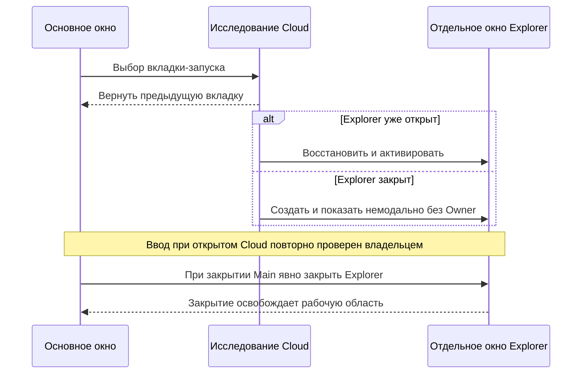
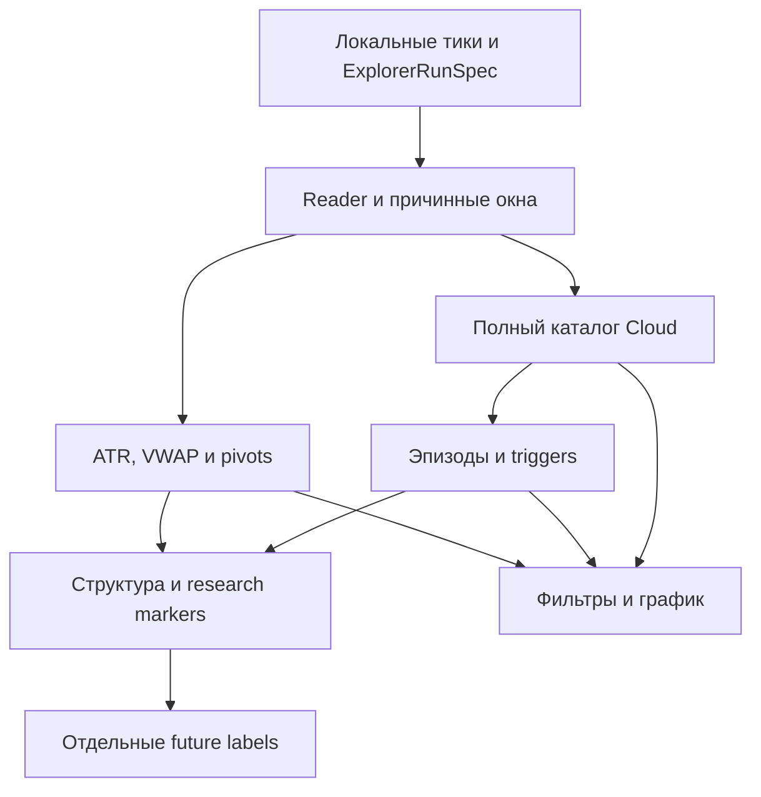

# ORDER-FLOW-CLOUD-EXPLORER-V2-001: полный каталог и исследование реакции на объём

**Статус:** CURRENT IMPLEMENTATION CONTRACT — OFFLINE RESEARCH ONLY.
**Ветка:** `docs/order-flow-production-roadmap`. **База постановки:** `40b79a1b3eca77e19d22905660b05067cff777d4`.
**Режим:** только локальное исследование в OsData; ни один описанный «сигнал» не отправляет заявку.

Новый режим реализован отдельно в `OsEngine/OsData/OrderFlow/Explorer/`.
Документ сохраняет формулы и критерии исходного задания; пошаговые операции
экрана — в [руководстве пользователя](CLOUD_EXPLORER_USER_GUIDE.md), подробная
граница поведения — в [runbook](RESEARCH_MVP_RUNBOOK.md#48-исследование-cloud--отдельный-explorer-v2),
граница фактических проверок — в [qualification](TESTING_AND_QUALIFICATION.md#cloud-explorer-v2).
Наличие кода не означает допуск к торговле или ручную проверку полного окна ОС.

## 1. Что должен получить пользователь

1. Обычное окно Order Flow по умолчанию работает **ровно как на указанной базе**: Delta, Cloud 1/2, их пороги и `Qualified`, таблицы, диагональный перевес, статистика реакций, график, реплей, hashes и старые exports сохраняют семантику. Ни один старый результат не мигрируется и не перезаписывается.
2. Явная новая вкладка-запуск **«Исследование Cloud»** открывает отдельное окно и запускает в нём отдельный расчёт по тому же локальному файлу, ручному `PriceStep` и inclusive датам. Сначала пользователь получает полный каталог цепочек **для выбранных им правил формирования**, затем меняет фильтры без перечитывания исходных тиков. Каталог не означает перебор всех комбинаций настроек.
3. В этом же новом режиме доступны причинная относительная оценка объёма, подстройка ценового диапазона к волатильности и паузы к темпу ленты, несколько заранее заданных масштабов, эпизоды из соседних Cloud, anchored VWAP с полосами σ, подтверждённые экстремумы и исследовательская разметка конструкции «понижающиеся хаи/лои → более высокий лой → пробой хая» (и зеркальной конструкции). Каждый модуль включается независимо. **Все модули входят в этот этап**; их последовательная реализация ниже — порядок работ внутри одного задания, не перенос функций на будущий этап.
4. Таблицы, сводка, график и реплей показывают, **когда** данные стали известны. Будущая реакция цены хранится и рисуется только как отдельная последующая метка результата исследования.

Источник фактов о текущем поведении: [runbook](RESEARCH_MVP_RUNBOOK.md#45-cloud-цепочки-сделок), [контракт входных данных](DATA_REPLAY_CONTRACT.md), исходники `project/OsEngine/OsData/OrderFlow/OrderFlowClouds.cs`, `OrderFlowCloudFilter.cs` и `OrderFlowCloudStatisticsEngine.cs`. Этот документ задаёт **новый** режим. При конфликте текущего кода и этого target сначала сохранять действующее поведение и обсуждать конфликт, не менять legacy молча. `STRATEGY_LIFECYCLE.md` и `EXECUTION_MODEL.md` сохраняют границу между исследовательским событием и торговым исполнением.

## 2. Вход и совместимость

Использовать существующий `OrderFlowTickReader`: `Date,Time,Price,Volume,Side,MicroSeconds,Id`, необязательный заголовок, `decimal`-цены/объёмы, `Buy/Sell`, положительные значения. `Id` игнорировать; идентичные строки не удалять; `SourceSequence` — порядок строк. Временная зона не задана; не выдавать source clock за МСК или биржевой clock. Шаг цены остаётся **ручным**. Все строки проверяются существующим reader, даже вне выбранных дат; за пределами дат признаков и невидимого прогрева нет. Новый результат записывается только после принятого полного чтения и сверки SHA-256 файла. Старые настройки/артефакты/исследование `cloud-reaction-study-1` не менять.

Отдельно регистрировать отсутствие точности времени: когда `MicroSeconds=0`, упорядоченность строк с одной секундой известна только **внутри этого файла** по `SourceSequence`; нельзя приписывать такой последовательности микросекундное опережение другого инструмента или реальный интервал между сделками внутри секунды. Новый режим не требует акции Сбера, Quotes или другого инструмента.

Контрольный пользовательский файл `SRU6.txt` хранится **вне Git**: 151 MiB на диске в данном окружении, 3 130 667 сделок, 174 календарные даты с 16.03.2026 по 17.09.2026; SHA-256 `435ea400ffcc45cd3215be0806f660368a024d1c2942b8eed8aa8e3d2fed1f7b`. Поле `MicroSeconds` во всех строках равно `0`; число сделок по месяцам сильно различается (март 7 015, июль 1 329 413). Это **проверка входа и нагрузки**, а не основание объявить конкретный объёмный порог удачным. Файл и его фрагменты в репозиторий не добавлять.

## 3. Результат и независимые сущности

Новый режим не меняет `ResearchSpecHash` уже существующего расчёта. Разделить идентичности: `CatalogSpecHash` = полный SHA-256 исходного файла + parser version + выбранные даты + ручной `PriceStep` + версия и параметры формирования/адаптации/профилей; `EpisodeSpecHash` = `CatalogSpecHash` + версия и правила объединения; `StudyHash` = нужные каталожный/эпизодный hashes + версия/параметры порога trigger, swing, активности, optional VWAP gate и будущих горизонтов. Изменение episode/study spec не перестраивает сам каталог. **Иммутабельный `ExplorerRunSpec`** ссылается на эти три точные версии/хеша (эпизодный/study ref может отсутствовать при выключенном модуле) и на полные вычислительные параметры; он передаётся worker и реплею вместо текущих значений полей UI. Параметры **показа** хранить в отдельном редактируемом UI-профиле `<OutputRootPath>/cloud-explorer-view/<CatalogSpecHash>.json` с версией схемы и атомарной записью: он не входит в hashes неизменяемых результатов и не меняет старые настройки окна. При смене любого вычислительного spec создаётся новый соответствующий bundle; старый остаётся доступен.

| Сущность | Что хранить | Когда известна |
|---|---|---|
| Raw deal | Валидированный источник `Time`, `SourceSequence`, `Price`, `Volume`, `Side` | После чтения строки |
| Catalog Cloud | Все непустые цепочки, в том числе меньше прежней `MinimumSumVolume`; границы, фактические объём/число/дельта/длительность/размах, inside/context, причина окончания, выбранный профиль и provenance | Префикс развивается по тикам; итог — после закрытия или `OpenAtEnd` |
| Trigger snapshot | Неизменяемый префикс в первый момент достижения **предварительно зафиксированного** порога значимости: время, ordinal, сумма, delta, цена, High/Low, VWAP и применённый порог | На соответствующем тике, не задним числом |
| Episode | Упорядоченные ID и снимки дочерних Cloud одного масштаба, паузы, цены, их сумму и отдельно общий объём сырых сделок интервала | Префикс до закрытия; финальный состав — после закрытия |
| Anchored VWAP | Линии VWAP и ±1σ/±2σ от явного якоря; статус доступности якоря | На каждом уже прочитанном тике после якоря |
| Swing pivot | Цена/время/ordinal фактической вершины и отдельные время/ordinal **подтверждения** | Только при обратном движении на нужную величину |
| Structure observation | ID активировавшего объёма, исходный нисходящий/восходящий контекст, последовательность уровней, время события пробоя и диагностический уровень отмены | После всех требуемых подтверждений/пробоя |
| Future label | Последующее движение, MFE/MAE и полнота горизонта | Только после соответствующего будущего участка |

`CatalogId = CatalogSpecHash + layer + scale + FirstSourceSequence`: один и тот же ID у формирующегося префикса и окончательной цепочки; `LastSourceSequence` — поле финала, не часть стабильного ID. ID эпизода включает `EpisodeSpecHash` и первый Cloud; события других слоёв/масштабов не сливать по совпадению времени. Внешний `CloudId` legacy не менять. У постфильтра нет права изменять любой ID, состав, границу, порог на старте или исходный объект.

## 4. Полный каталог и фильтрация

### 4.1. Формирование

Для каждого включённого слоя проходить поток один раз в порядке reader. Режим цепочек повторяет текущие правила: размер отдельной сделки ≥ заданного положительного `MinimumTickVolume`; разница времени с **последней включённой** сделкой ≤ `MaximumGapMilliseconds`; `max(high,newPrice) − min(low,newPrice) ≤ MaximumRangeTicks × PriceStep`. Равенство проходит. Мелкие сделки не прерывают цепочку, но входят в уже существующее окно окружения; нарушившая условие подходящая сделка завершает старую цепочку и начинает новую. `Side` не влияет на границу. При разрыве по времени и цене причина `Gap`; `OpenAtEnd` не означает реального закрытия.

**Отличие нового каталога:** сохранять каждую непустую цепочку независимо от суммы; не использовать `MinimumSumVolume` как условие публикации. Начальное значение параметров формирования в новой вкладке можно скопировать из открытого legacy слоя, но это отдельный профиль. Выбор **«Все валидные сделки»** отключает порог отдельного тика, включая дробные объёмы меньше 1; без выбора используется положительный порог. Для режима одиночных тиков каждый прошедший отбор физический тик сразу даёт один законченный каталоговый Cloud; чтобы фильтровать также сделки ниже старого порога Cloud 2, пользователь включает «Все валидные сделки» или задаёт меньший порог и пересчитывает каталог. Одиночные тики не превращать в накопленную цепочку.

`MaximumGapMilliseconds`, `MaximumRangeTicks`, минимум включаемого тика, режим single/chain, окно окружения и `PriceStep` — **параметры формирования/сохранённых показателей**. Их изменение требует нового каталога. У каждого Cloud хранить исходные buy/sell и независимые inside/context профили по текущему контракту; контекст привязан к последнему включённому тику, не к более позднему `CompletedAt`. Окончание выборки и выбранной даты помечать отдельно; новый каталог не заглядывает за границы выбранного периода.

Для произвольного пользовательского порога отображения каталог хранит компактную последовательность накопленных объёмов и source ordinal включённых тиков в **отдельном потоковом индексном файле**, чтобы при необходимости определить первый момент пересечения без чтения сырых тиков. Эта последовательность не заменяет неизменяемый legacy `Qualified`; в таблицах итогового каталога её не загружать целиком в память. Если пользователь меняет только видимость, достаточно итоговых полей; индекс нужен для точного causal trigger в новом исследовании. Полный raw volume между дочерними Cloud для §6 получать отдельным причинным потоковым проходом при вычислении `EpisodeSpecHash`; менять episode rules — пересчёт эпизодов, но не каталога и не старого исследования.

### 4.2. Фильтры готового каталога

Каждый слой и масштаб фильтруются независимо; верхняя граница пустая означает отсутствие ограничения, обе заданные границы включительны. Изменять следующие условия **без чтения исходного файла и без пересборки**: сумма объёма; итоговое число сделок; `SingleTrade`/`Accumulated`; длительность; **фактический** размах в `PriceStep`; знак и диапазон дельты/её модуля в процентах (inside Cloud и отдельно context); уже сохранённые диагональные inside/context ratio, доминирующий объём и разность; relative-volume percentile/status; статусы доступности адаптивных оценок; часовой интервал source clock; ID заранее посчитанного эпизода/сигнала. Для `DeltaPercent` выполнять точное сравнение исходных `decimal` объёмов до округления UI, независимо от `ImbalanceSource=Off`; включение диагонального фильтра **не требуется**. Не путать `SidePercent` по количеству сделок с `DeltaPercent` по объёму.

Размах готовой цепочки как фильтр **не равен** изменению максимального разрешённого размаха при формировании. То же для числа сделок и суммарного объёма. Вычислять `pass` из сохранённых неизменяемых показателей, не менять их при фильтрации. UI показывает «всего / прошло» для каждого слоя/масштаба и то же в таблице и обеих версиях графика. Отсечённые Cloud остаются в таблице; опция серого показа возвращает их метки и соответствующие вершины Cloud-ломаной. ПКМ/двойной клик точно выделяет строку по ID, в том числе отфильтрованную. Серый показ не превращает отсечённое событие в detector trigger.

Проверка: порог суммы `900 → 300 → 900` должен возвратить **точно тот же** набор ID/маркеров и те же исходные hashes без повторного `OrderFlowTickReader`; каталог `[400,400,400,1200]` оставляет при 900 только последний, при 300 все четыре. Три 400 не сливаются из-за порога отображения.

### 4.3. Сводка

Показывать отдельно для каждого слоя/масштаба число всех цепочек, single/accumulated, неполных на EOF, медиану, p25/p75/p90/p95/p99 их **итогового** объёма, долю ≥ текущего пользовательского порога и разбивку по датам/выбранному времени. Квантили детерминированны: отсортированный список положительных объёмов, элемент с индексом `ceil(p × N) − 1`, `p` в (0,1]. Пустой набор — «нет данных»; доля считается по полному каталогу, не по уже отобранному. Этот раздел описывает весь выбранный период и **не является** исторически доступным в каждой его точке значением.

## 5. Адаптация к рынку

Ни одно значение ниже не считать доказанно оптимальным. Это **воспроизводимые стартовые настройки исследования**: видимый профайл, версии формул и осмысленные статус/запасной вариант. Каждый переключатель включается отдельно; выключенные параметры остаются прежними ручными. Все переключатели формирования и их коэффициенты входят в `CatalogSpecHash`; правила эпизода — в `EpisodeSpecHash`, критерии значимости/структуры — в `StudyHash`.

| Ручка нового режима | Формула, доступная **до первого включаемого тика** цепочки | Стартовый fallback/статус |
|---|---|---|
| `MinimumTickVolume` | При опциональном адаптивном отборе p75 по последним 1 000 валидным сырым тикам **той же source-даты**, минимум 200 предыдущих; отсортировать и взять nearest-rank | Если истории нет: ручной порог; `NoTickBaseline` |
| `MaximumGapMilliseconds` | При опциональной адаптации темпа `clamp(ceil(2 × 30 000 / N30), 1 000, 5 000)`, где `N30` — число **предыдущих** валидных сделок за скользящие 30 секунд той же даты; нужен `N30 ≥ 20` | Иначе ручная пауза (например 1 000 мс); `NoPaceBaseline` |
| `MaximumRangeTicks` | При опциональной адаптации `clamp(ceil(0,2 × ATR20 / PriceStep), 1, 40)`. ATR — цена, только 20 последних полных `M1` TR и предыдущее закрытие; никакой связи с выбранным TF экрана | Иначе ручной диапазон (например 5 тиков); `NoAtrBaseline` |
| Порог относительного объёма Cloud | При включении relative filter p95 **итоговых объёмов** последних 200 прежних законченных цепочек того же профиля; не меньше 50, только окончания с ordinal **строго меньше** первого ordinal текущей цепочки, только 5 последних source-дат | Иначе `NoVolumeBaseline`: относительная оценка неизвестна, без подмены порогом 900 |

`clamp(x,a,b)=min(max(x,a),b)`; `ceil` — вверх. Числа 200/1 000/0,2/p95/границы разрешить редактировать и отображать в параметрах; не подгонять их на всём файле. Заранее подготовить у каждой цепочки фактически применённые `tick/gap/range/volume` и reasons fallback. **Заморозить на старте цепочки**: растущая цепочка не меняет собственные ограничения. До текущего тика сначала прочитать прежнее состояние, выбрать профиль; только после решения обновить буферы сырых тиков. Опорное распределение относительного объёма берёт и прежние маленькие цепочки. Значение `p95` используется при росте цепочки, так что `TriggerSnapshot` фиксируется на первом пересечении; до готовности порога относительный trigger не возникает. Последующая смена display-порога не переносит этот trigger назад во времени.

Для ATR новой адаптации отделять source-даты и разрывы больше пяти минут: первый TR после разрыва начинает новый прогрев, в 20 завершённых TR до начала цепочки не могут попасть цены после разрыва. При нуле ATR — `NoAtrBaseline`. Использовать только `TimeEnd ≤ время начала цепочки`; незакрытую текущую M1 и будущий High/Low не учитывать. Обычный `cloud-reaction-study-1` с его текущей формулой ATR **не изменять**. Для `MicroSeconds=0` пауза всё равно считается по имеющимся секундным меткам и source ordinal; в UI пометка «точность источника 1 с», без фиктивной миллисекундной точности.

Дополнительный необязательный фон **«то же время прежних дат»**: сравнить итоговые объёмы законченных цепочек в пределах ±15 минут исходного времени старта с последними 20 предыдущими source-датами; минимум 50 записей, p95 nearest-rank, иначе `NoTimeOfDayBaseline`. Показать рядом с rolling p95, применять только выбранный пользователем тип фона; текущую дату и будущие даты никогда не включать. При отсутствии достаточного фона относительный фильтр принимает трёхзначный статус `Unknown`, а не выдаёт «не прошёл» или «прошёл». Фильтр «только необычные» показывает только `Pass`, отдельно отображает число `Unknown`.

Активность допуска оценивать **отдельно от каталога**: фильтр/исследовательский gate по числу сделок в предыдущих 5 минутах (пример для первого прогона: ≥20) и паузе от предыдущей сделки (≤60 с), оба значения настраиваемые. Часовой срез действует по source clock; по умолчанию охватывает весь выбранный период. Гейт влияет только на постановку исследовательского наблюдения, не удаляет другие Cloud. Для `Unknown` истории сигнал блокируется с явным reason, Cloud всё равно виден. Не выбирать границы активного отрезка по уже увиденным «удачным» разворотам.

Вариант **«Несколько масштабов»** по умолчанию выключен: максимум три независимо версионируемых профиля «узкий / базовый / широкий»; при ручном диапазоне начальные 2/5/10 тиков, при ATR коэффициенты 0,1/0,2/0,4. Порог тика и пауза из соответствующего выбранного профиля; каждый поток цепочек имеет собственные ID, оценки и табличный счётчик. Одни и те же сырые тики допустимы в нескольких масштабах. Совпадающие события других масштабов **не считать независимыми подтверждениями** и не суммировать их объёмы; экран умеет включать/выключать каждый масштаб. Изменение профиля масштаба — новый расчёт.

## 6. Объёмный эпизод: связь соседних Cloud без потери деталей

Модуль явно включается поверх **одного** слоя и масштаба каталога; при выключении его отсутствие не меняет цепочки. Эпизод образует последовательность **законченных** соседних Cloud по возрастающему `FirstSourceSequence`, если одновременно:

1. новая цепочка начинается на той же source-дате, что первая, и `next.StartTime − previous.Time ≤ EpisodeMaxPause` (начально 5 с);
2. длительность от начала первого Cloud до последнего включённого тика нового ≤ `EpisodeMaxDuration` (начально 30 с);
3. объединённый `max(High) − min(Low) ≤ EpisodeMaxZoneTicks × PriceStep` (начально 10 тиков; опционально `ceil(0,4 × ATR20/PriceStep)` с границами 2..80 и заморозкой при начале эпизода).

Равенства проходят. Нарушивший любое правило Cloud начинает **новый** эпизод, прежний закрывается только в момент появления достаточного для решения законченного следующего Cloud; EOF даёт `EpisodeOpenAtEnd`. Неполный child `OpenAtEnd` не выдавать за завершённый эпизод. Buy/Sell направление не является требованием объединения; внутри записать `ChildIds`, их порядок, интервалы, цены и дельту отдельно. При суммировании внутри одного слоя сделки детей не повторяются; отдельно фиксировать объём **всех** сырых сделок от якоря эпизода до последнего включённого тика, включая тики ниже порога каталога. Показать «3 Cloud по 400» как три дочерних события и как эпизод 1200, если выполнены все три правила; не превращать эпизод в Cloud 1200 и не терять паузы или рост цены между детьми.

Эпизод может активировать наблюдение при первом превышении предварительно выбранного порога по уже **законченным** дочерним Cloud; сохранить `EpisodeTrigger` с временем/ordinal обнаружения и набором детей на тот момент. Дальнейшие дети не меняют этот снимок. Порог редкости эпизода рассчитывается отдельно по предыдущим завершённым эпизодам той же конфигурации, тем же правилом прежних 200/минимум 50/p95; p95 Cloud и p95 эпизода не смешивать. Режим «порог фиксированный» принимает decimal-сумму, независимую от фильтра отображения.

## 7. Anchored VWAP и полосы σ

Пользователь выбирает один Cloud или эпизод, а затем якорь: `FirstSourceSequence` первой сделки Cloud/эпизода (по умолчанию), `TriggerSnapshot.SourceSequence` или явный выбранный Cloud. От первого включённого raw тика до каждого последующего уже прочитанного raw тика **той же source-даты** вести `W = ΣVolume`, `VWAP = Σ(Price×Volume)/W`, `σ = sqrt(Σ(Volume×(Price−VWAP)²)/W)`; на практике использовать устойчивый взвешенный online-алгоритм для `decimal` сумм/моментов, а не вычитать две большие близкие суммы. Показывать `VWAP`, `VWAP±σ` и `VWAP±2σ`; все валидные сырые сделки входят в суммы, даже если они меньше `MinimumTickVolume` или отфильтрованы. При `W=0` линии нет, ошибка decimal переполнения/непредставимой суммы отклоняет расчёт с причиной, без тихого округления. На следующей дате якорь заканчивается, незаметного переноса через ночь нет.

Расчёт одной выбранной линии и её видимых chart samples выполнять на фоне, с проверкой исходного SHA, отменой и ограниченным кэшем; **не строить линии одновременно для миллионов Cloud**. Изменение только видимости/цвета/полос не перечитывает файл; выбор нового якоря может запустить отдельный проход и не меняет каталог. График объясняет, что линия от начала события ретроспективно доступна лишь после его распознавания. В реплее её `KnownAt` равен `TriggerSnapshot`/`EpisodeTrigger` у значимого события; для **вручную выбранного Cloud ниже порога** — причинному `CompletedAt/CompletionSourceSequence` (для одиночной сделки — её тику), а для `OpenAtEnd` — только EOF, без будущих кадров. Такой ручной якорь служит отображению и сам не активирует детектор. В реплее линия появляется не раньше `KnownAt`, хотя её первый расчётный тик мог быть раньше. Данные линии для **конкретного** якоря можно начать накоплять заранее от начала цепочки, но в реплее не брать готовые будущие chart samples исторического просмотра. Эта линия учитывает **все** raw тики после якоря и потому не равна `Cloud.Qualified.Vwap`, считающему только включённые в цепочку сделки. Отношение пробоя к VWAP отображать как отдельно включаемое исследовательское условие; по умолчанию VWAP — контекст, а не обязательное условие входа. Для **сравнения с контрольной группой** optional VWAP gate §8 использует другую, одинаковую для обеих групп линию от `StructureWatch.WatchStart`; выбранный вручную/event VWAP остаётся отдельным контекстом и не влияет на сопоставление.

## 8. Экстремумы после объёма и исследовательская конструкция

### 8.1. Причинный автомат swing

Считать подтверждённые экстремумы цены по **всем валидным сырым сделкам**, независимо от выбранного TF и наличия Cloud, в пределах source-даты. Метод directional change:

1. На первом тике даты начать неопределённое направление, запомнить цену и ordinal. Первый отход вверх/вниз на величину `SwingReversalTicks × PriceStep` задаёт начальный подтверждённый low/high соответственно. Пока направления нет — нет подтверждённых pivots.
2. В восходящем плече обновлять максимум только при строго большей цене. Первое снижение от него **не меньше** заранее замороженной величины подтверждает high: сохранить фактический максимум с его временем и ordinal, и отдельно `ConfirmedAt/ConfirmedSequence` текущего тика; начать нисходящее плечо. Для low зеркально. При равной максимальной цене сохранить первый ordinal.
3. Величину обратного движения выбирать при **начале данного плеча** по последнему завершённому причинному ATR20: `max(1,ceil(0,2 × ATR20/PriceStep))`; при недостатке данных использовать настраиваемый ручной `SwingReversalTicks` (начально 5) и зафиксировать fallback. Не менять уже начатое плечо. Пределы ATR и разрывы те же, что в §5.
4. Отмечать неподтверждённый край как `Provisional`; не включать в историю подтверждённых поворотов и не пересчитывать прошлые подтверждения. Пропуск периода, новая дата, недостаток данных явно видны.

Считать pivots весь доступный предшествующий участок выбранной даты, чтобы к моменту Cloud был известен тренд. **Объём включает наблюдение**, но не создаёт цену экстремума; не требовать новый Cloud у каждого pivot. Для последующего сравнения тот же автомат работает также без объёмного gate.

### 8.2. Исследовательское событие Long/Short

Long по исходной идее пользователя:

1. Когда **уже подтверждённые** экстремумы текущей source-даты впервые дают два последовательных понижения high (`H0 > H1`) и low (`L0 > L1`), открыть один базовый `StructureWatchLong`: `WatchStart` = более поздний ordinal подтверждений `H1/L1`. Он существует для обеих сравниваемых групп. Если в течение watch пришёл причинный `TriggerSnapshot` Cloud либо `EpisodeTrigger`, сохранить первый trigger ID/time и сделать watch `VolumeArmed`; именно с этого момента показать его пользователю как `WatchLong`. Если объём был раньше, когда тренд ещё не подтверждён, пометить `NoTrendContext`, задним числом watch не активировать. Предшествующие экстремумы остаются контекстом до Cloud.
2. Дождаться нового **подтверждённого** low `L2 > L1`; равный low выделить как отдельный статус `EqualLow`, не подменять условием более высокого. Между `L1` и `L2` должен быть подтверждённый high `H2` (хай отката/отскока). `H2` и `L2` могут быть подтверждены **до trigger**, если пробоя `H2` ещё не было: Cloud допустим на повторном откате непосредственно перед пробоем. Если любой подтверждённый low до `L2` обновил `L1`, закрыть watch как `Invalidated`.
3. Только на raw тике **позже** `L2.ConfirmedSequence`, с `Price > H2.Price`, зафиксировать breakout и поставить на график **research StructureLong** с признаком `VolumeArmed` или `Control`. Для вооружённого объёмом watch этот тик также обязан быть позже trigger; для контрольного trigger отсутствует. Два условия на одном и том же тике не считать последовательными; цена пробоя и source ordinal фиксируются. Диагностический уровень отмены/условного стопа = `L2.Price − PriceStep`, с подписью «ориентир по цене сделки; исполнение и риск не рассчитаны». Отдельно показать старый `L1` для оценки структуры. Short зеркален: `H0 < H1`, `L0 < L1` (восходящие highs/lows), подтверждённый lower high `H2 < H1` и последующий пробой ниже low между `H1` и `H2`; ориентир = `H2.Price + PriceStep`. Контрольные маркеры по умолчанию скрыты, в исследовании включаются отдельным флажком.
4. Watch истекает через настраиваемые 60 минут **от общего `WatchStart`**, на исходе source-даты или при противоположном сломе исходной структуры. Повторные триггеры во время активного watch помечать как `AdditionalEvidence`, **не** запускать второй идентичный watch; статус/ID исходного наблюдения не менять. Отсутствие активных сделок не продлевает 60 минут при появлении следующего тика. Проверку optional `Price > anchored VWAP` (Short `<`) проводить **на тике пробоя** по одинаковой для обеих групп причинной линии, начатой на `WatchStart` и включающей все последующие raw тики (§7); когда данных нет, `UnknownVWAP`, не молчаливый PASS. Смена контекста открывает следующий watch лишь после терминального исхода прежнего; один breakout даёт максимум одно наблюдение каждого направления.

`StructureLong/Short` — **исследовательский маркер**, не `TradeIntent`, ордер, fill, позиция или готовая стратегия. Нельзя рассчитать доходность входа по цене тика пробоя и условного стопа без стакана, latency, комиссий и модели исполнения. Не подключать этот детектор к `BotPanel`, Tester, коннектору или MCP-торговле. Существующие Delta candidates и Cloud reaction statistics не переименовывать и не подавлять.

## 9. Сопоставление с будущей реакцией

Добавить отдельную версионированную оценку `cloud-structure-study-1`, не изменяя `cloud-reaction-study-1`. **Для всех** базовых `StructureWatchLong/Short` из §8.2 время ноль и TTL одинаковы: `WatchStart` после подтверждения исходного тренда, 60 минут или выбранная длительность. Допуск по выбранному часу/активности и доступность обязательного относительного фона проверять **одинаково на `WatchStart`**: брать только строго предыдущие данные профиля; `Unknown` фон/активность при обязательном gate исключают watch из обеих групп с сохранённой причиной. На тике breakout назначить группу **до просмотра будущего**: `VolumeArmed`, если в интервале `[WatchStart, breakout)` пришёл хотя бы один квалифицированный причинный Cloud/episode trigger; иначе `Control`. Для watch, завершившегося без breakout, зафиксировать группу на terminal ordinal: `VolumeArmed`, если trigger пришёл строго до него, иначе `Control`. Одновременные trigger и breakout/terminal тик не вооружают уже закрывающийся watch. В контрольной группе работают те же swing, price/ATR, часовое окно, activity gate и тестовая дата; watch без breakout записан со своим исходом, а не скрыт. Смена фильтра **видимости** не переводит observation между группами. Сравнивать уже обнаруженные breakout по одному времени начала будущего пути; показывать также вероятность и число breakout среди **всех terminal watch каждой группы**, чтобы volume gate не создавал ложную «точность» от отбора только завершённых фигур. Не делать вывод «Cloud помогает» из доли разворотов среди только заранее отфильтрованных удачных примеров.

Сохранять отдельно causal observations (`Trigger`, levels, breakout time/ordinal, известные VWAP/ATR/status) и future labels. По умолчанию использовать причинный ATR20 на **тике breakout** (§5), горизонты `3/9/18` минут, `TargetAtr=1,5` и `AdverseAtr=1`. Эти значения редактируемы и входят в `StudyHash`. Для breakout цены `P0`, направления `s=+1` Long / `−1` Short и только **последующих** строк `SourceSequence > breakout ordinal` и `tick.Time ≤ breakout.Time + horizon` (включая более поздние ordinals с тем же timestamp) задать `d = s × (Price−P0)`, `target = 1,5×ATR`, `adverse = 1×ATR` (или выбранные коэффициенты), оба строго положительны. `TargetFirst` при первом `d ≥ target`, `AdverseFirst` при первом `d ≤ −adverse`, `Timeout` при полном горизонте и отсутствии обоих касаний, `NoFutureTrade` при полном горизонте без будущей сделки, `Incomplete` при обрыве периода до конца горизонта. Целевой горизонт **не продолжается на следующую source-дату**: если `breakout.Time + horizon` переходит через полночь, outcome сразу получает `Incomplete/DateCutoff` независимо от последующих сделок. В остальном полный горизонт требует прочитанной сделки не раньше его конца либо последующей смены source-даты, доказывающей завершение предыдущей даты; одна только выбранная конечная дата этого не доказывает. В одном raw тике обе положительные границы недостижимы, одинаковое время разных строк разрешается source ordinal. `SignedReturn = d` последнего будущего тика горизонта в **единицах цены**; `MFE = max(0,max d)/ATR`, `MAE = max(0,max (−d))/ATR` по всему горизонту, оба в единицах ATR даже после первого касания. Без будущих сделок `SignedReturn/MFE/MAE` отсутствуют. Если ATR недоступен/нулевой, событие остаётся причинным маркером, но получает `NoAtrLabel` и не входит в сравнение исходов. Никакого округления барьеров к сетке торговой заявки; это путь сделок, не цена исполнения. Для одинаковых timestamps порядок **внутри одной ленты** — `SourceSequence`; не сравнивать секундные timestamps двух рынков.

Один study run выбирает **один слой, один масштаб и один тип trigger** (Cloud или Episode) и сравнивает его `VolumeArmed`/`Control` без суммирования параллельных масштабов. До оценки фильтра и группы отсортировать все breakout этого run по `(time, SourceSequence, direction)`; взять первое событие, затем следующее только строго после конца его **максимального** горизонта — общая последовательность для обеих групп. Сохранить отсечённые как `OverlapExcluded`, не выбирать им замену после просмотра результата. Fit — первые 70% наблюдаемых source-дат (округлить вниз, минимум 1 и максимум `N−1`), Test — последующие; одна дата даёт только Fit/`NoTest`. Breakout с horizon через границу групп либо с началом предыстории swing/ATR до границы Test пометить `Purged`. Границы ATR низкий/средний/высокий вычислять только по Fit, ближайшими tertiles, затем применять неизменно в Test; час source clock и пороги активности должны совпадать в сравниваемых группах. Показать состав/численность каждой ячейки; пустые ячейки — `InsufficientSample`. Изменение коэффициентов после просмотра Test требует нового неиспользованного интервала. Показать число случаев и долю `Unknown`/`Incomplete`, а не один «процент побед».

## 10. Экран и операции пользователя

Рабочую область нового режима разделить на **«Формирование (новый расчёт)»**, **«Видимость (применить сразу)»**, **«Адаптация и активность»**, **«Эпизоды/VWAP/экстремумы»**, **«Исследование»**. Значения, изменённые после последнего расчёта формирования, явно пометить как *не применены*; кнопка фильтра не применяет их случайно. Сохранить ручной шаг цены, два независимых слоя, режим single Cloud 2, существующие рисунки и выбор TF. Старое окно/вкладки при выключенном новом режиме не получают новых фильтров и не теряют настройки. В заголовке результата показывать версии/profile/hash и диапазон дат.

Вкладка **«Исследование Cloud»** в основном окне служит точкой запуска: при её
выборе основное окно возвращается к предыдущей вкладке, а вся рабочая область
Explorer в коде открывается через `Show()` без назначения WPF Owner и Topmost.
Переключение обратно в основное окно и ввод при открытом Explorer подтверждены
повторной ручной проверкой владельца. Ранее зарегистрированная
[проблема](TECHNICAL_DEBT.md) закрыта; автоматические тесты не проверяют
фокус настоящих окон ОС.
Повторный выбор восстанавливает свёрнутое окно и активирует его; после его
закрытия следующий выбор создаёт новое.
Закрытие Explorer или основного окна отменяет его собственную работу и освобождает
обработчики. Режим нескольких масштабов остаётся прежним флажком
**«Узкий / базовый / широкий»** внутри **«Формирование»**: по умолчанию рассчитан
только Base, включение добавляет Narrow и Wide каждого выбранного слоя, а все
шесть профилей редактируются в общем списке и не меняют уже опубликованный результат.

В таблицах каталога добавить пагинацию/виртуализацию, поиск по ID и источник provenance, отдельные колонки «всего / прошло», объёмный percentile/status, фактические параметры формирования, first trigger и его доступность, число детей эпизода. Выбор Cloud показывает карточку внутренних сделок/паузы/изменение цены, соседние Cloud и выбранный anchored VWAP; отдельная таблица episodes сохраняет все child IDs. Не пытаться разместить 3 млн меток одновременно: рендерить только видимый диапазон с уплотнением пикселей, но выбор по ID и точная таблица остаются доступными. Метки отдельного тика остаются квадратами, цепочек кругами; эпизоды, VWAP/σ и подтверждённые/неподтверждённые pivots визуально различать. Слой filtered-out — серый, и таблица/подсказки/Cloud-ломаная/отдельное окно используют **один verdict**.

Отдельно показывать `ObservedAt` (фактический экстремум/старт объёма), `KnownAt` (квалификация/закрытие/подтверждение) и, если есть, последующий label. При выборе research marker подсветить активировавший Cloud, child Cloud эпизода, H/L и доступный в момент пробоя VWAP. Смена масштаба, display-фильтра или варианта картинки не меняет `CatalogId`, snapshots или будущие labels. По умолчанию новый режим выключен, новых торговых кнопок нет.

## 11. Причинный реплей

Реплей нового режима повторно читает/проверяет файл тем же reader и **тем же сохранённым `ExplorerRunSpec`/CatalogSpecHash/EpisodeSpecHash/StudyHash**, а не текущими несохранёнными полями. После каждого тика обработать в порядке: состояния прошлых сырых окон → зафиксированные настройки начинающейся цепочки → обновить цепочки/профили/эпизод → обновить online VWAP → обновить swing и watch → проверить research marker → опубликовать неизменяемый префикс кадра. Это одна последовательная очередь без скрытой сортировки. Физический порядок строк с одной секундой сохраняется; один тик шага реплея меняет ровно один такой префикс.

Формирующиеся цепочка/эпизод рисуются только по прочитанным дочерним событиям. Порог `900` на префиксе не использует будущий итог `1200`; статус и объём меняются только после поступления нужного тика. Предыдущая Cloud становится законченной, когда причинно обработан следующий разрывающий подходящий тик; `OpenAtEnd` — только EOF. Pivots показывать неподтверждёнными до обратного движения, затем не переносить время знания на фактический хай/лой. Линия VWAP и σ появляется только после признания якорного события и заканчивается текущим тиком. Future label появляется только после будущих сделок/завершения горизонта. Отфильтрованная на графике метка не удаляет состояние автомата, но не может задним числом стать trigger при переключении отображения: запуск новой исследовательской гипотезы с иным порогом — **отдельный** versioned study по сохранённому prefix index. Старый реплей и его hashes не менять.

## 12. Артефакты и память

Схемы/версии новых сущностей и формулы зафиксировать в manifest каждого уровня; запись через staging, атомарная публикация только законченного результата. Старые `clouds.csv`, `clouds2.csv`, их pair trees, `manifest.json`, `observations.csv`, `candidates.csv` и `cloud-study-*` **не перезаписывать**. Новые отдельные директории: `cloud-catalog-<full CatalogSpecHash>` (manifest, quality, потоковый каталог, prefix index, сводка), `cloud-episodes-<full EpisodeSpecHash>` (manifest, children и episodes) и `cloud-structure-study-<full StudyHash>` (manifest, причинные trigger/pivots/VWAP samples/observations, отдельный `future-labels.csv`, README с границами интерпретации). Profile/display настройки хранить отдельно; не включать только видимость в исходные hashes. Любое исследование по другому правилу trigger имеет свой StudyHash. Для повторного открытия проверять версии и checksums; неизвестную версию не выдавать за старую. Не менять существующие bundles при сбое нового исследования.

Использовать потоковый reader, ограниченные rolling buffers, запись каталога/индекса по частям и виртуализированные таблицы. **Не держать одновременно** 3 млн raw DTO, все возможные якорные VWAP или все визуальные элементы. Сохранять cancelled/error reason и прогресс (строки, текущая дата, уже опубликованные Cloud, память/длительность без спама логов); отмена освобождает file handle и не публикует частичный bundle. Порог расхода памяти сделать конфигурируемым или явно ограничить кэш; при превышении — понятная ошибка, а не зависание WPF. Исключения decimal/повреждение input не подавлять. Изменение только фильтров — работа по готовому каталогу/индексу без нового SHA/чтения сырых тиков.

## 13. Порядок реализации внутри этого задания

1. Зафиксировать golden behavior старого режима на маленьких искусственных наборах и исходные hashes; добавить новый opt-in request/result/bundle, не меняя обработчики старой кнопки `Запустить`.
2. Ввести disk-backed полный каталог обеих форм Cloud, prefix index, отдельные настройки формирования/фильтров, независимую дельту, сводку, виртуализированные таблицы и общий verdict в обоих графических окнах.
3. Добавить причинные ATR/темп, rolling/time-of-day volume baseline, activity/time slice и до трёх независимых масштабов; экспортировать эффективные пороги и fallback на каждую цепочку.
4. Построить эпизоды с неизменяемыми children/trigger; anchored VWAP/σ одного выбранного якоря; swing automaton и Long/Short research markers. Развести фактическое время экстремума и время знания.
5. Подключить те же события к тиковому реплею; добавить separate study и future labels, хронологическое сравнение с контролем без Cloud; завершить help/runbook текущего поведения **после реализации**, без преждевременного объявления функции готовой.
6. Проверить acceptance ниже, устранить найденные регрессии и оформить offline evidence. Модуль считается законченным, когда весь список пройден, даже если реализация разбита на несколько коммитов.

## 14. Приёмка

| Набор | Обязательная проверка |
|---|---|
| Старое поведение | При новом режиме off байтово совпадают golden legacy exports/hashes и результаты Cloud 1/2, replay, статистика, действующие рисунки/фильтры внутри открытого окна. Ни один старый bundle не изменён. |
| Формирование | Chain 400/400/400/1200 при сумме 900 сохраняет все четыре; порог включаемого тика, равенство паузы/размаха, разрыв и EOF ведут к указанным границам/причинам. Single tick хранит каждую сделку отдельно, в том числе с одинаковым timestamp/Id. |
| Фильтры | `900→300→900` возвращает точно те же ID/метки; ноль чтений исходного файла; изменение фактического размаха только скрывает цепочку, изменение максимума формирования создаёт новый spec. Дельта фильтруется при выключенном диагональном ratio; оба слоя, оба окна и реплей согласованы. |
| Адаптация | Переключение/заморозка tick/gap/range/volume профиля воспроизводимы по prefix-only входу; ATR текущей незакрытой минуты, будущие дни в time-of-day baseline и собственная цепочка в volume baseline не входят. `Unknown` не подменяется нулём; без достаточного фона срабатывает документированный fallback. |
| Эпизод | 3×400 внутри заданной зоны — один episode с тремя children; нарушение любой из паузы/общей длительности/зоны — новый episode; пересекающиеся масштабы не складываются. Идентичные времена не меняют порядок `SourceSequence`. |
| VWAP и pivots | Ручной маленький набор проверяет raw PV и weighted σ при тиках ниже порога Cloud, начало/конец даты, первые 20 TR, подтверждение high/low **позже** цены самого экстремума и одинаковые High/Low. |
| Структура | При H0>H1, L0>L1, затем L2>L1 и пробое выше H2 появляется один Long только после подтверждения L2; равный/более низкий L2, пробой до подтверждения, истёкшее watch и отсутствие исходного тренда не дают Long. Проверить зеркальный Short и статус no-trade/Unknown. |
| Будущие данные | На каждом кадре сравнить state нового streaming replay с отдельным пересчётом **только того же префикса**; кадр N не содержит финальный объём, новый pivot, VWAP sample или future label N+1. Проверить timestamp ties и `MicroSeconds=0`. |
| Интеграция | На `SRU6.txt` весь указанный диапазон проходит SHA и принимает 3 130 667 строк; записать wall time, пик памяти, размер артефактов и отзывчивость виртуализированного экрана. Проверить ранний март и активный июль, смену дат/часов, отсутствие истории, отмену, повтор и ограничение ресурсов. Не принимать O(N²) рост времени или загрузку всех raw объектов в память. |
| Граница | Нет заявок, операций с брокером, PnL или claims о прибыльности. Existing `cloud-reaction-study-1` и старые документы говорят о реализованном лишь после фактической проверки. |

При изменении реализации обязательны сборка solution, offline OrderFlowResearch
tests, проверка документов и независимые production/documentation reviews.
Первоначальный documentation-only коммит не являлся evidence реализации.
