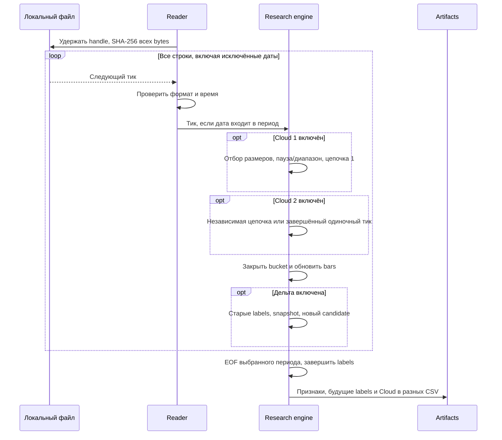

# ORDER-FLOW-DATA-001: контракт данных и причинного replay

**Статус:** TARGET CONTRACT — PARTIALLY IMPLEMENTED BY RESEARCH MVP.

Текущий вход Order Flow — один локальный файл тиков одного реального инструмента.
Пользователь получает файл самостоятельно. Workbench читает его на месте,
не скачивает и не копирует в OsData Set. Session/cost metadata, торговый replay
Tester и live adapter остаются target; текущие операции описаны в [runbook](RESEARCH_MVP_RUNBOOK.md).

## 1. Формат локального файла

UTF-8 (ASCII совместим), необязательный BOM. Разделитель — запятая, ровно семь
полей; кавычки CSV и разделители внутри полей не поддерживаются. Необязательный
заголовок допустим только в первой физической строке:

```text
Date,Time,Price,Volume,Side,MicroSeconds,Id
20260918,100000,100.00001,2,Buy,123456,opaque-id
```

| Поле | Контракт импорта |
|---|---|
| Date | Ровно 8 цифр `yyyyMMdd`, существующая календарная дата |
| Time | Ровно 6 цифр `HHmmss`, существующее время суток |
| Price, Volume | Положительный `decimal`, десятичная точка, без группировки и exponent; объём используется как записан |
| Side | `Buy` или `Sell`, регистр несущественен; не выводится из изменения цены |
| MicroSeconds | Целое 0..999999 — дробная часть секунды в этом контракте |
| Id | Техническое седьмое поле; содержимое полностью игнорируется, не сохраняется в DTO/CSV и не участвует в расчётах, группировке, сортировке или дедупликации |

Эффективное время = Date + Time + MicroSeconds × 10 ticks `DateTime`.
`DateTimeKind.Unspecified`: временная зона не назначается и не пересчитывается.
Это явно выбранная семантика импорта, не гарантия совместимости со всеми
историческими producer-вариантами `Trade.MicroSeconds` платформы.
Если источник использует другие единицы, файл предварительно преобразует владелец.

Пустые строки пропускаются, строки длиннее 4096 символов отклоняются.
Невалидная кодировка, число, сторона или регрессия эффективного времени
отклоняют весь research result. Порядок файла не исправляется сортировкой.
Новые профили перевеса Cloud отклоняют также непредставимую **точно** в `decimal`
сумму объёмов уровня, стороны или всего профиля: `TICK_INVALID` с пояснением
о точности; переполнение диапазона — `TICK_NUMERIC_OVERFLOW`. Тихое округление
таких агрегатов не допускается, в том числе при исключении тиков из окна.
Все строки сделок учитываются, включая полностью одинаковые: поле Id
не анализируется и не определяет уникальность сделки. `SourceSequence` — порядковый номер тика без
заголовка и пустых строк. Имя файла служит только пользовательским обозначением
инструмента, а не доказательством биржевой спецификации.

## 2. Ручные параметры и период

`PriceStep` обязателен, положительный `decimal`: поддерживаются значения больше
1 и `0.00001`; UI принимает точку или запятую. В файле шаг отсутствует и из
разницы соседних цен не угадывается. Барьеры и порог изменения цены равны
числу тиков × PriceStep; тот же шаг определяет ценовой диапазон Cloud и
соседние цены диагональных сравнений. Автоопределение шага не выполняется. Отдельного множителя объёма нет.

`FromDate` и `ToDate` либо обе пустые (весь файл), либо обе заданы в порядке
начало ≤ конец. Обе календарные даты включаются целиком до последней
микросекунды конечной даты. Вне периода строки продолжают проверяться, но не
попадают в buckets, окно, labels, график или counts выбранных сделок.
До начала нет скрытого warmup, после конца нет скрытого дополнения labels.
Начальное окно может быть неполным: отдельного прогрева/запрета кандидатов нет.

Внутри периода clock windows непрерывны: полночь не сбрасывает состояние,
клиринги/сессии не распознаются. Промежутки без тиков не заполняются. Для
будущей внутридневной торговли календарь и reset/cutoff потребуют отдельной реализации.

## 3. Последовательный причинный replay

1. Один поток открывает файл с `FileShare.Read`, хеширует все хранимые bytes
   SHA-256 и читает текст с того же handle; на Windows запись/замена запрещены
   до освобождения handle.
2. Reader проверяет каждый тик в исходном порядке, затем применяется фильтр дат.
3. Выбранный тик по порядку строки поступает в каждый включённый Cloud-аккумулятор.
   Сначала каждый слой обновляет собственное окно окружения всеми выбранными
   тиками, затем применяет Cloud size filter. Cloud 1 строит цепочки; Cloud 2 независимо строит цепочки или сразу завершает
   отдельный прошедший порог тик. Техническое Id не участвует ни в одном режиме.
   Одновременно тики одного эффективного времени собираются в закрытый bucket.
4. При включённой дельте bucket сначала обновляет labels ранее созданных кандидатов.
5. Display bars строятся в любом режиме. При включённой дельте обновляются
   скользящее окно и snapshot, затем проверяется новый candidate. Его собственный bucket не входит в label.
6. На EOF обрабатывается последний bucket; labels завершаются по времени
   последнего выбранного тика. Будущий horizon за этой границей — `Incomplete`.
   Последняя Cloud-цепочка сохраняется как OpenAtEnd, без утверждения о завершении.

Оба профиля перевеса и постфильтр описаны канонически в
[runbook](RESEARCH_MVP_RUNBOOK.md#перевес-объёма-и-диагональный-фильтр).
Снимок inside/context прикреплён к последнему включённому source ordinal Cloud.
Разрывающий или мелкий последующий тик не обновляет снимок старой цепочки;
доступный live-prefix окружения и сохранённый context Cloud могут различаться.
Фильтр не удаляет raw Cloud из результата и не влияет на формирование цепочек.
Снимок сохраняет полное неизменяемое дерево сравнимых пар; фильтр показа может
выбрать другие пары по новым порогам без доступа к файлу. UI отделяет эти фильтры
от request формирования; его исходные hashes/CSV не меняются.

Визуальный реплей поверх этого ядра описан в [runbook](RESEARCH_MVP_RUNBOOK.md#46-реплей-по-исходным-тикам).
Он сохраняет порядок/формулы и не создаёт новые bundles: pacing выполняется перед
выбранным тиком, а prefix snapshot — после обновления обоих Cloud и текущего bucket.
Незакрытый bucket накладывается только на копии display bars; features/candidates
вычисляются после его закрытия. Нормализация размера Cloud в реплее использует
заранее заданный порог объёма, а не будущую статистику всего результата.



Внутри timestamp причинные признаки используют суммы и VWAP. Произвольный
порядок одинакового времени не применяется для определения очередности
достижения противоположных барьеров **кандидатов дельты**. Display OHLC отдельно сохраняет первую
и последнюю цену по порядку файла. Cloud тоже зависит от source order,
включая равные timestamps: разрыв цены может разделить такие тики. Завершённые
цепочки не являются причинным признаком на времени последнего включённого тика;
точные правила и completion fields канонически заданы в [runbook](RESEARCH_MVP_RUNBOOK.md#45-cloud-цепочки-сделок).

Отдельная [статистика Cloud](RESEARCH_MVP_RUNBOOK.md#47-статистика-реакций-cloud)
использует completion source ordinal и цену тика завершения. Последующие строки
того же timestamp допустимы как будущее; это явное отличие от labels дельты.
Перед измерением реакций выполняется новый полный hash/read с одного защищённого
handle и сверка SHA-256 с источником готовых Cloud. Строки вне дат по-прежнему
валидируются, но не прогревают ATR и не дополняют горизонты. Cloud не перестраиваются;
ошибка входа не публикует частичное исследование. Собственный bundle статистики
отделён от исходного; методика/схема и отмена канонически описаны в runbook.

## 4. Provenance, ошибки и воспроизводимость

Manifest содержит один `Input`: каноническое имя, обозначение инструмента,
размер, SHA-256, число успешно прочитанных тиков, первый/последний timestamp,
`ReadComplete`, `FailureReasonCode`; отдельно — выбранные даты, PriceStep,
ResearchSpec и версии parser/normalizer/features/labels/artifacts.
Полный hash источника не заменяется hash выбранного отрезка. Он фиксирует все
сырые bytes, поэтому меняется и при редактировании технического поля; это
проверка версии файла, а не использование Id в расчётах. NormalizedEventHash,
FeatureHash, CloudHash и Cloud2Hash от содержимого технического поля не зависят.
NormalizedEventHash описывает выбранные события с source ordinal, без технического Id;
FeatureHash — все рассчитанные snapshots; CandidateHash включает observation identity.
CloudHash/Cloud2Hash отдельно включают группы своего слоя, completion evidence,
inside/context исходные объёмы и **все** пары, источник фильтра и вердикт исходного request; manifest хранит включённые
расчёты и их эффективные параметры. Отключённая дельта не хранит окно/labels.

Повторный прогон одинаковых bytes, имени и параметров даёт те же результаты.
Новая identity создаётся при изменении имени, bytes, параметров или версии схемы.
Старый bundle не перезаписывается; совпадающий переиспользуется лишь при
побайтовом равенстве всех ожидаемых файлов. Детали — в [runbook §5](RESEARCH_MVP_RUNBOOK.md#5-artifact-bundle).

Input failure возвращает rejected audit result с доступной metadata. При
ошибке посередине файла могут сохраниться частичные counts/observations;
они не являются принятым исследованием. `ReadComplete=false` означает, что
файл не проверен до EOF. Ошибка derived arithmetic может возникнуть и после
полного чтения: acceptance и failure code всё равно обязательны.
Неверный request и отмена не публикуют rejected bundle; ошибка записи output
не гарантирует artifact. Reader освобождает handle при ошибке и отмене.

## 5. Граница ресурсов и дальнейшая квалификация

Строка и reader buffers ограничены; окно хранит тики своего интервала, bucket
хранит все сделки одного времени. Cloud хранит агрегаты и снимок первой квалификации
текущей цепочки каждого включённого слоя, а результат — все прошедшие фильтр
группы. У каждого слоя есть очередь тиков контекстного окна и инкрементальные
индексы пар занятых цен; изменение уровня затрагивает не более двух диагоналей,
не сканирует весь ценовой диапазон. Окно ограничено временем, но не числом строк;
совпавшие timestamps могут удерживать много сделок. Снимки профиля содержат
итоговые объёмы, пары-свидетели и корень неизменяемого сортированного дерева всех
сравнимых пар. Обновление копирует путь дерева, старые снимки сохраняют прежние
узлы; это структурное разделение памяти, не копия всего профиля на каждом тике.
Сохранённые исторические корни увеличивают общий объём памяти. В SingleTicks один Cloud может приходиться на каждую строку; replay
копирует коллекции, поэтому второй слой может существенно увеличить затраты памяти. Results, journal и строки CSV накапливаются
в памяти: постоянная память для произвольного многомесячного файла не обещана.
Выбор дат ограничивает replay results, но не время полной валидации источника.
Отмена проверяется при чтении/hash, при вытеснении тиков окружения, между buckets
и перед возвратом/экспортом;
внутри обработки большого bucket задержка возможна. Начавшийся export завершается
без кооперативной отмены.

Обязательны tests формата, микросекунд, дат, no-look-ahead, последнего bucket,
повторного запуска и immutable output. Реальные count/hash/performance и
визуальные проверки фиксируются отдельно по [qualification](TESTING_AND_QUALIFICATION.md).
Исследовательские тики не доказывают возможность исполнения заявки;
[execution contract](EXECUTION_MODEL.md) остаётся самостоятельной будущей задачей.
