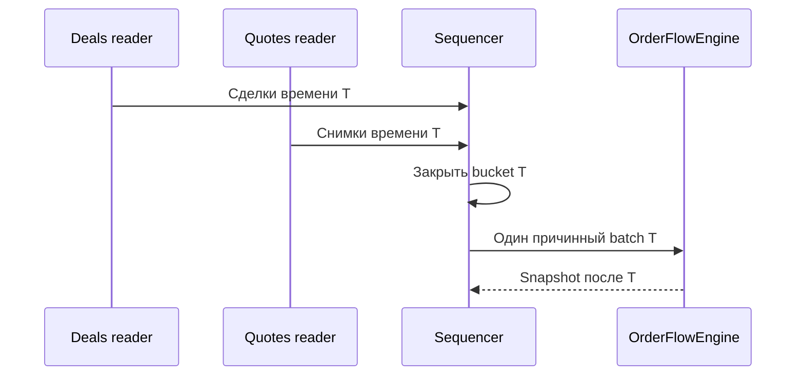

# ORDER-FLOW-DATA-001: контракт данных и причинного replay

**Статус:** TARGET CONTRACT — PARTIALLY IMPLEMENTED BY RESEARCH MVP.

**Назначение:** определить, какие данные принимает Order Flow контур и в каком
порядке история может быть передана исследовательскому ядру и Tester без
look-ahead.

Полный contract ещё не реализован. Текущий OsData workbench покрывает одну
локальную пару, QSH v4 readers, filename/header checks, закрытые timestamp
buckets, previous-closed-book policy, quality reason codes и deterministic
hashes. Он не покрывает multi-day import, session/instrument/cost metadata,
Tester/live adapters и full-day qualification. Точная граница описана в
[ORDER-FLOW-MVP-RUNBOOK-001](RESEARCH_MVP_RUNBOOK.md).

## 1. Граница контракта

Входом одного исторического торгового дня является атомарная пара QSH:

- `<instrument>.<date>.Deals.qsh` — сделки с ценой, объёмом и стороной
  агрессора;
- `<instrument>.<date>.Quotes.qsh` — последовательные снимки стакана.

Наличие пары не доказывает точный порядок Deals и Quotes внутри одинаковой
миллисекунды. Контракт поэтому гарантирует причинное воспроизведение только на
уровне закрытых временных buckets и не заявляет восстановление биржевого
order-level потока.

Запрещено:

- назначать сторону сделки случайно или выводить её из движения цены, если
  источник уже содержит `Buy/Sell`;
- выбирать для сделки ближайший по модулю времени стакан, если он мог появиться
  в будущем;
- склеивать разные реальные фьючерсные контракты в исполняемую цену;
- принимать неполную пару за полноценный Order Flow набор.

## 2. Что предоставляет пользователь

Пользователь выбирает инструмент и диапазон дат, затем импортирует или загружает
парные файлы. Для каждого реального контракта дополнительно задаются либо
подтверждаются:

| Группа | Обязательные сведения |
|---|---|
| Инструмент | Идентификатор контракта, биржа/класс, `PriceStep`, `PriceStepCost`, `Lot`, `VolumeStep`, валюта, экспирация |
| Сессия | Биржевая временная зона, торговые интервалы, клиринги, сокращённые дни, запрет новых входов и cutoff закрытия |
| Издержки | Комиссия на вход/выход и идентификаторы latency/slippage профилей |
| Источник | Тип/версия формата, происхождение файлов и известная семантика timestamp/side |

Импортёр копирует исходные файлы в набор данных. Пользователь не должен вручную
раскладывать их по внутренним каталогам OsEngine.

## 3. Неизменяемый manifest

Принятый набор получает версионируемый manifest. Он содержит:

- имена, размеры и checksums обоих файлов;
- instrument/session/cost metadata;
- версии parser, normalizer и схемы manifest;
- исходную и нормализованную временные зоны;
- число Deals и Quotes, диапазоны времени, дубли и обратный ход времени;
- долю неизвестной или некорректной стороны сделки;
- пустые и пересечённые стаканы, некорректные цены/объёмы;
- пропуски, клиринги и распределение возраста причинно доступного стакана;
- итог `accepted` либо `rejected` по каждому дню с reason codes.

После принятия raw-файлы считаются immutable. Изменение файла, metadata или
parser создаёт новую версию набора; старый результат не перезаписывается.

## 4. Нормализованные события

Каждое событие получает общую оболочку. Имена будущих C# типов здесь не
фиксируются; фиксируется смысл полей.

| Поле | Смысл |
|---|---|
| Dataset/instrument/trading date | Однозначно связывает событие с manifest и реальным контрактом |
| Event kind | `Deal` либо `Quote` |
| Source timestamp | Время из файла без более сильного заявления о его происхождении |
| Capture/receive timestamp | Заполняется только если реально присутствует в источнике |
| Source sequence | Стабильная позиция записи внутри своего файла |
| Normalized timestamp | Время в единой выбранной зоне после документированного преобразования |
| Bucket ID | Идентификатор группы одинакового нормализованного timestamp |
| Payload | Поля сделки либо упорядоченные уровни стакана |
| Quality flags | Stale, gap, invalid side/book, session boundary и другие причины ограничения данных |

Для `Deal` обязательны цена, положительный объём и `Buy/Sell`. Для `Quote`
обязательны упорядоченные bid/ask уровни с положительными ценами и
неотрицательными объёмами. Правила агрегации повторяющихся ценовых уровней
фиксируются версией normalizer.

## 5. Детерминированный merge

На один инструмент работает один consumer:

1. Deals и Quotes читаются двумя независимыми reader в стабильном файловом
   порядке.
2. Sequencer выбирает минимальный следующий нормализованный timestamp.
3. Все события обоих потоков с этим timestamp собираются в один bucket.
4. Порядок внутри каждого исходного файла сохраняется, но произвольный
   межпоточный порядок Deals/Quotes не используется как информация.
5. Сделки внутри bucket агрегируются порядково-независимыми операциями. Для
   состояния стакана берётся последняя валидная Quote-запись bucket по
   стабильной последовательности Quotes-файла.
6. Снимок признаков и переход торгового кандидата публикуются только после
   закрытия bucket.
7. Новый intent не может активироваться или исполниться на событии этого же
   bucket.

### 5.1. Стакан для признаков

- Для связи отдельной сделки со стаканом разрешён только последний валидный
  quote из **предыдущего закрытого bucket**.
- Финальный quote текущего bucket доступен в post-bucket snapshot, но по нему
  нельзя утверждать, что он существовал до конкретной сделки того же timestamp.
- Каждый признак, использующий стакан, содержит `bookAge` и quality state.
- При превышении порога stale признак помечается недоступным; последнее значение
  не протягивается молча.

Такой подход может потерять часть краткосрочной информации, зато не создаёт
искусственного преимущества из неизвестного порядка одной миллисекунды.

### 5.2. Время решения и заявки

Различаются как минимум:

| Время | Определение |
|---|---|
| Event time | Timestamp исходного Deal/Quote |
| Bucket close time | Логический момент, когда собраны все события одного timestamp |
| Snapshot/signal time | Не раньше закрытия породившего bucket |
| Intent time | Момент решения frozen policy |
| Activation time | Intent time плюс выбранная latency |
| Fill time | Время причинно последующего стакана, на котором смоделировано исполнение |

Точная модель заявки находится в
[ORDER-FLOW-EXECUTION-001](EXECUTION_MODEL.md).

## 6. Выходы replay

Один прогон формирует:

- поток нормализованных закрытых buckets;
- стабильный hash нормализованных событий;
- diagnostic snapshots ядра;
- журнал quality flags и отброшенных событий;
- наблюдения исследования по
  [ORDER-FLOW-RESEARCH-001](RESEARCH_PROTOCOL.md);
- при frozen strategy — intents и журнал исполнения.

Research, Tester и будущий shadow/live adapter используют один контракт
нормализованного события. Различаться могут только adapter и документированные
ограничения источника.

## 7. Инварианты и приёмка

Контракт считается реализованным только при доказательстве:

1. Одинаковая пара файлов и manifest дают одинаковые event hash и snapshots.
2. Время закрытых buckets не идёт назад.
3. Перестановка Deals относительно Quotes внутри одинакового timestamp не
   создаёт более ранний signal/order/fill.
4. Изменение событий после времени T не меняет snapshots и решения до T.
5. Ни один fill не использует стакан до activation time.
6. Переход даты, клиринга и конца файла не теряет последний bucket.
7. Неполная/повреждённая пара и неоднозначная metadata отклоняются до
   исследования.
8. Полный торговый день обрабатывается без потери событий и неограниченного
   роста памяти.

Тестовый набор и обязательное evidence определены в
[ORDER-FLOW-QUALIFICATION-001](TESTING_AND_QUALIFICATION.md).
