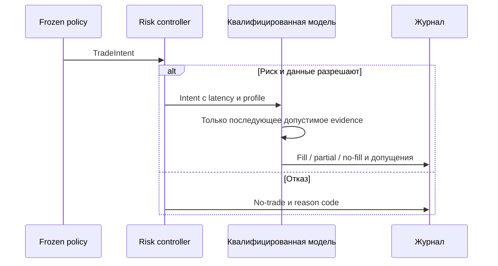

# ORDER-FLOW-EXECUTION-001: модель исполнения и риск-контур

**Статус:** TARGET EXECUTION CONTRACT — NOT IMPLEMENTED.

Cloud-группировка также не раскрывает котировки или доступный объём исполнения;
визуальный объём цепочки не является гарантированным fill.

## 1. Граница текущих данных

Order Flow использует только ленту сделок. Тики позволяют исследовать дельту,
реакцию цены и будущий market path. Из них нельзя определить доступные bid/ask,
spread, очередь или объём, который смогла бы исполнить новая заявка.
Текущий workbench не моделирует заявки, fills, расходы или PnL.

Прежняя обязательная модель прохода по уровням не применяется к этому входу.
Перед реализацией execution требуется отдельно утвердить и квалифицировать
модель, совместимую с доступными данными. Нельзя молча заменить её fill по
цене следующего тика или считать Volume сделки доступным объёмом для робота.
ResearchAccepted означает только принятие исследовательского replay.

## 2. Что должен определить будущий execution profile

| Область | Обязательное решение до реализации |
|---|---|
| Данные и предположения | Какие сведения наблюдаются, какие моделируются, ограничения и независимое evidence |
| Цена/объём fill | Правила доступности, ограничение объёма, partial/no-fill, недопустимость бесплатного улучшения цены |
| Время | Signal, intent, activation после latency, submission и fill — разные события |
| Расходы | Комиссии, ценовые издержки и adverse slippage; отсутствие наблюдаемого spread не означает нулевой spread |
| Контракт | PriceStepCost, lot, volume rules, валюта и реальные правила инструмента |
| Сессия | Часовая зона, клиринг, запрет входов и внутридневной cutoff |
| Evidence | Synthetic/golden tests, калибровка и чувствительность к неподтверждённым допущениям |

Версия profile фиксируется до просмотра результатов. Baseline, adverse и
severe-but-plausible assumptions проходят одинаковые тесты. Ни одна цена или
ликвидность не считается наблюдаемой только потому, что её требует модель.
Пассивное исполнение по касанию и положение в очереди без доказательства исключены.

## 3. Сохраняемые причинные требования

Signal не создаёт позицию. Policy формирует `TradeIntent`/`ExitIntent`:
identity, instrument/direction, signal/intent time, desired/max volume,
maximum acceptable price, expiry, risk reference, StrategySpec/profile version.
Risk controller одобряет либо отвергает intent с reason code.

Активация не раньше intent time + latency. Событие, породившее candidate,
не используется для его исполнения. Все fill inputs должны быть причинно
доступны после активации. Без достаточного evidence результат — no-fill/
expiry/rejection, а не автоматически выгодное исполнение.

Диаграмма — target flow. Эти компоненты не подключены к текущему workbench.

## 4. Order, stop и risk lifecycle

Будущие состояния: IntentReceived, RiskRejected, PendingActivation, Active,
PartiallyFilled, Filled, CancelPending, Cancelled/Expired/Rejected и Reconciling.
Команды идемпотентны по Intent ID + Order command ID; повтор события не создаёт
вторую заявку. Position формируется только фактически исполненным объёмом.

Stop/invalidation создаёт exit intent, но не гарантирует цену исполнения.
При partial opening защищается исполненная часть; отмена остатка и выход —
отдельные команды. Поздний fill после cancel учитывается reconciliation.
Перед cutoff новые входы блокируются, остатки отменяются, выход и сверка
продолжаются даже без новых тиков по отдельному session timer.

До отправки нужны режим, data/session health, contract sizing, лимиты сделки/
дня/портфеля, отсутствие незавершённого reconciliation и контроль overnight.
Risk может уменьшить объём или отказать, но не меняет направление идеи.
Для live сохраняются IDs, фактический объём/средняя цена, pending actions,
дневной риск и версии; после reconnect новые входы запрещены до сверки с брокером.

## 5. Evidence, observability и parity

Execution results хранятся отдельно от market-path labels: времена, fills,
комиссии/допущения, отказы, profile/config hashes и при достаточном evidence PnL.
Log не содержит credentials или authenticated payload. Отчёт показывает
чувствительность к assumptions и no-fill/partial/expiry, а не одну «точную» прибыль.

Future Tester/shadow/live должны разделять StrategySpec, признаки, intent/risk
семантику и order state machine. Источник данных, simulated latency и broker
execution различаются явно. Текущий tick importer не заявляет parity с Tester
или каждым legacy producer времени/side. Existing платформенные режимы не изменены.

До `Execution qualified` по [qualification](TESTING_AND_QUALIFICATION.md)
simulation PnL не используется для выбора торговой policy или экономического
допуска. Достаточность тиков для delta research не закрывает этот этап.
