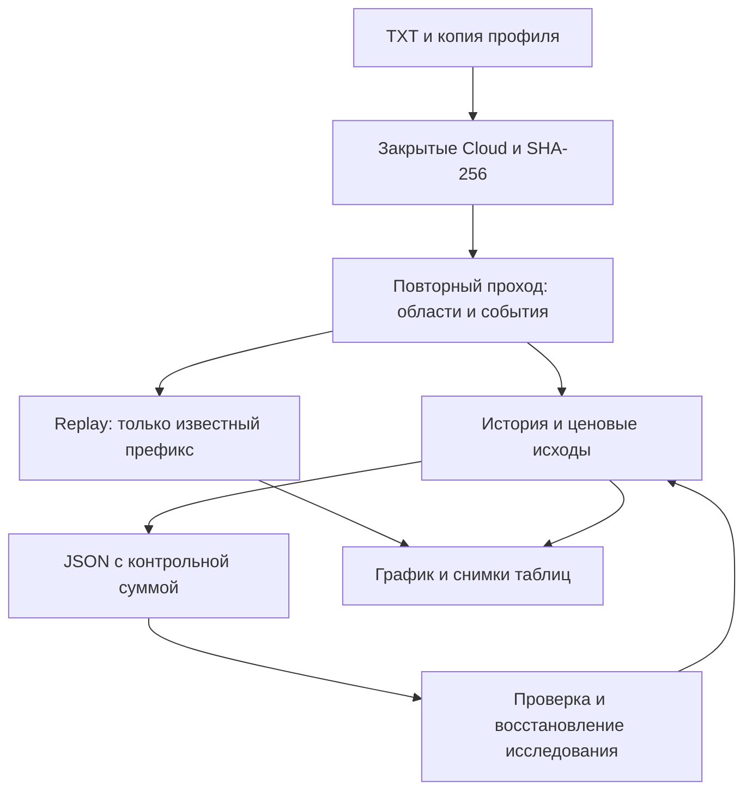

# ORDER-FLOW-CONTEXT-001: «Контекст рынка» — руководство и контракт расчёта

**Статус:** CURRENT IMPLEMENTATION GUIDE / CONTRACT — OFFLINE RESEARCH ONLY.
**Ветка:** `feature/order-flow-multiscale-context`, база `088add98b728f8088fb18ff2e59c8d4113ad043c`.
**Версия профиля/результата:** `flow-context-1`.
**Код:** `project/OsEngine/OsData/OrderFlow/Context/`, `OrderFlowResearchChart.Context.cs`, `OrderFlowResearchUi.Context.cs`.

«Контекст рынка» — самостоятельное окно с **одним графиком**. Цена остаётся
серыми линиями High/Low. На ней совмещаются объёмные области трёх масштабов,
VWAP, TWAP, полосы разброса, подтверждённая структура и события ленты.
Cloud используется внутри для выделения исходных цепочек; прежние окна,
настройки и статистика Clouds продолжают работать отдельно.

Система исследует локальную историю и её причинный replay. Она не отправляет
заявки. Ни начальные настройки, ни примеры ниже не являются найденной
прибыльной стратегией. Будущие исходы — движение рынка, без исполнения,
комиссии, проскальзывания и расчёта торгового PnL.

## 1. Первый запуск за пять шагов

1. В `OsData → Order Flow` нажмите **«Контекст рынка»**. Откроется отдельное
   изменяемое по размеру окно; его таблицы открываются отдельными кнопками.
2. Выберите один TXT одного инструмента. Для первого запуска задайте один
   день в полях **«С» / «По»**. Обе границы включаются. Если обе даты пусты,
   читается весь файл; одна пустая дата считается ошибкой.
3. Нажмите **«Настройки инструмента»**. Проверьте имя, шаг цены и торговые
   интервалы. Начальное `00:00–24:00` — техническое допущение, а не расписание
   биржи. Время не переводится: используется дата/время из файла.
4. Выберите периоды формирования **«Локальный / Рабочий / Старший»**, затем
   нажмите **«Рассчитать систему»**. Во время расчёта статус показывает прогресс;
   прежний успешный результат остаётся на графике до замены.
5. Откройте **«Таблица областей»** или **«Таблица событий»**. Двойной щелчок
   по строке, либо кнопка **«Показать выбранное на графике»**, переносит график
   к выбранному эпизоду. Двойной щелчок по ромбу открывает карточку под графиком.

Начните с одного дня: подробное исследование может содержать десятки тысяч
событий и большой JSON. Лимит отклоняет весь запуск с понятной ошибкой,
а не выдаёт усечённый результат за полный. Файл полностью проверяется даже
при выборе одного дня; это сохраняет единую identity исходника.

## 2. Три масштаба и таймфрейм цены

| Управление | Что меняет | Нужен новый расчёт |
|---|---|---|
| Локальный / Рабочий / Старший | Максимальное время формирования исходной области, включая ожидание закрытия её Cloud | Да |
| «Цена» | Только агрегацию серых High/Low, от 15 секунд до календарного месяца | Нет |
| Настройки каждого масштаба | Пороги Cloud, размеры/объём области, длительность продолжения, пробой, удержание, swing | Да |
| «Слой» | Все масштабы или один выбранный масштаб | Нет |
| Области / VWAP / TWAP / полосы / структура / ромбы | Видимость соответствующей части готового расчёта | Нет |
| Вид события / «После прогрева» | Фильтр графика, таблицы событий и статистики | Нет |

Периоды формирования не означают фиксированные свечные сетки. Например,
`2 мин / 15 мин / 1 ч` — три независимо настроенных детектора областей,
а не пересчёт одного детектора по трём OHLC. Пороги объёма и ширины тоже
задаются отдельно. Lifetime отсчитывается от подтверждения области;
он не равен периоду формирования.

Профиль копируется в момент запуска. Изменение настроек готовит следующий
запуск; график не меняет смысл уже рассчитанного результата. После смены
инструмента обязательно проверьте его профиль и шаг цены: инструмент не
определяется достоверно по содержимому TXT автоматически.

## 3. Как читать один график

| Элемент | Смысл |
|---|---|
| Серые High/Low | Диапазон цены на выбранном TF, без ярких свечей |
| Синий / оранжевый / фиолетовый | Локальный / рабочий / старший масштаб |
| Прямоугольник | Замороженные границы исходных завершённых Cloud, от первого источника до подтверждения |
| Точечное продолжение | Верх/низ исходной области и её начальная средняя цена |
| Сплошная линия | VWAP всех исходных сделок от якоря и далее, пока область активна |
| Штриховая линия | TWAP, средняя по фактически допустимому времени |
| Пара точечных полос | VWAP ± выбранный множитель объёмно-взвешенной σ: 0,5 / 1 / 1,5 / 2 / 3 |
| Ломаная структуры | Только уже подтверждённые экстремумы; вершина стоит в момент экстремума, появляется после подтверждения |
| Голубой / жёлтый ромб | Совпадающие размеры / ускорение ленты |
| Зелёный / красный ромб | Направление исследуемой реакции вверх / вниз; не команда на сделку |

По умолчанию график показывает выбранную область, доступных родителей и
непосредственных детей; без выбора — последнюю область каждого масштаба
в видимом участке. Связанные с областью ромбы подчиняются этому же выбору,
события самой ленты остаются доступны. **«Все области»** включает полный слой.
**«Снять выбор»** возвращает автоматический выбор последних областей при
прокрутке. Для совместной иерархии оставьте **«Слой → Все масштабы»**.

Родство временное: новый младший эпизод получает уже известного активного
старшего родителя. Цена дочерней области может находиться вне старого
прямоугольника — это позволяет исследовать откаты после выхода. Родитель
не назначается задним числом. У события собственной области её координаты
имеют приоритет; прочие масштабы описывают доступный текущий контекст.

Полосы σ показывают разброс исполненных цен, а не вероятность разворота.
Расположение выше VWAP и выше TWAP — две разные характеристики: объёмная
средняя и временная средняя могут расходиться.

## 4. Настройки инструмента и событий

Общие настройки и каждый масштаб находятся на отдельных вкладках.
Все числовые пороги сопровождаются единицами. Несколько торговых интервалов
задаются как `09:00-14:00;14:05-18:50;19:05-23:50`; это пример записи,
**не готовый календарь инструмента**. Интервалы не пересекаются и не переходят
через полночь. Сессию через полночь необходимо разбить на части; сутки всё
равно являются границей расчёта областей и внутридневных исходов.

| Параметр | Трактовка |
|---|---|
| Минимальный tick / сумма Cloud / gap / range | Существующий детектор Cloud применяется независимо для каждого масштаба; объём исходной завершённой цепочки сохраняется целиком |
| Число Cloud / объём области / ширина | Условия подтверждения объединённой области |
| Максимальная пауза между Cloud | Допустимый интервал от конца предыдущего до начала следующего Cloud |
| Продолжение после подтверждения | Сколько область остаётся активной, если раньше не закончилась сессия или политика замещения |
| Хранить активными N последних областей | **Политика модели**, а не скрытый memory cap: новый эпизод завершает самый старый на том же масштабе; причина `ReplacedByNewArea` сохраняется |
| Пробой в шагах / удержание в секундах | Граница должна быть пройдена с буфером; затем позиция удерживается до наблюдаемого подтверждающего тика |
| Swing в шагах | Минимальное обратное движение для подтверждения экстремума |
| Адаптация ширины / swing | Множители диапазона прошлых цен; 0 отключает адаптацию, нижняя граница остаётся фиксированной |
| Окно локальных событий | Непересекающиеся окна по времени источника, по умолчанию 5 секунд |
| Фон TPS | Предыдущие окна на заданном интервале времени; нулевые секунды входят в знаменатель |
| Доля одинаковых размеров | Доля **числа** сделок одной пары `(сторона, размер)` внутри закрытого окна |
| Минимум абсолютной дельты / объёма | Например 0,6 соответствует разделению объёма 80%/20%, а не 60%/40% |
| Максимальное продвижение агрессии | Ограничение изменения цены по направлению агрессии; встречное движение также допускается |
| Ослабшая волна / предыдущая | Сравнение объёма одной стороны в двух соседних окнах без нового соответствующего экстремума |
| Прогрев | События сохраняются, но исходы до окончания прогрева не рассчитываются |
| Интервал точек линий | Плотность сохранения линий; не меняет события, их признаки или исходы |

Кандидат поглощения требует преобладающей агрессии и малого продвижения.
Кандидат угасания — уменьшения объёма стороны без продолжения экстремума.
Они не доказывают iceberg, наличие конкретного участника или исполнение
институционального алгоритма. Ритмический heartbeat-детектор из отдельной
целевой спецификации `ORDER-FLOW-TICK-PATTERNS-001` здесь не реализуется;
текущий контракт описывает именно многомасштабный контекст.

## 5. Ручные области

1. Перейдите в **«Вся история»**. Выберите слой; при **«Все масштабы»**
   ручная область относится к рабочему масштабу.
2. Нажмите **«Выделить область: два клика»**, укажите два угла по времени и
   цене. Временная вспомогательная линия соединяет точки. Escape отменяет её.
3. Нажмите **«Добавить выделение как якорь»** и пересчитайте систему.
   Более ранняя точка задаёт начало, более поздняя — момент знания области.
   Обе точки должны быть в одной дате и одном разрешённом интервале сессии.
4. **«Очистить ручные якоря»** удаляет их из следующего профиля. Уже
   рассчитанное исследование остаётся до нового запуска.

Максимум 100 якорей. Повтор одинакового якоря отклоняется. Если до момента
подтверждения в его интервале больше нет сделок, якорь не переносится в
следующую сессию. Временные рисунки очищаются при входе в replay. Отдельного редактора одной строки якоря пока нет:
можно очистить список либо отредактировать массив `ManualAnchors` в JSON
профиля и загрузить его с валидацией. Исходные моменты начинаются с первой
подходящей сделки; подтверждение — на первом доступном тике не раньше
указанного времени. Нельзя размечать будущее в replay.

Ручная разметка после просмотра последующего движения — пример для анализа.
Для проверки распознавания выбирайте якорь до открытия будущего и отдельно
сравнивайте результат с автоматическими областями на новых датах.

## 6. Replay, карточки и таблицы

**«Реплей»** читает исходные сделки; затем эта кнопка переключает паузу и
продолжение. Скорости: 1, 10, 100, 1000. На паузе **«Один тик»** продвигает
одну исходную сделку, включая отдельные строки с одинаковым временем.
Большие паузы проигрыватель пропускает по существующей политике replay.
**«Вся история»** возвращает сохранённый исторический результат.

Области, линии, экстремумы и события доступны только после их
`KnownSequence`/`Sequence`. Исторический overlay рассчитан тем же причинным
ядром заранее и показывается по префиксу; цена в replay строится из сырого
префикса. Будущие исходы скрыты в карточке **на всём протяжении replay**,
таблица исходов заблокирована, включая последний кадр. Для их изучения
надо явно вернуться в историю.

Таблицы областей и событий — фиксированные снимки момента открытия.
Сортировка колонок не пересчитывает систему. Чтобы обновить срез replay,
закройте таблицу и откройте снова; повтор кнопки активирует существующее
окно. Смена фильтров или режима закрывает старые таблицы. Карточка показывает
момент наблюдения отдельно от момента подтверждения, дельту, объём, TPS,
расстояния от VWAP/TWAP в шагах цены, σ-координату и возвраты.

## 7. Сохранение и воспроизведение

- **«Сохранить / загрузить профиль»** — настройки именно этого инструмента,
  сессии, горизонты и ручные якоря. Загрузка готовит следующий расчёт.
- **«Сохранить исследование»** — готовые области, линии, события, исходы,
  ценовые интервалы и полный профиль. **«Открыть исследование»** проверяет
  схему и контрольные суммы и работает без исходного TXT.
- Для replay требуется исходный TXT с тем же SHA-256. Если он перемещён,
  раскройте источник и выберите его новый путь; hash по-прежнему обязателен.
- Запись идёт во временный файл рядом с назначением, затем атомарно заменяет
  явно выбранный файл. Отмена до публикации сохраняет предыдущее назначение.
  Незавершённый временный файл удаляется. Ошибка не устанавливает новый run.
- Предел исследования — 512 МБ JSON, профиля при загрузке — 1 МБ. Есть
  отдельные лимиты числа областей, событий, точек. Для исходов хранятся
  максимум два миллиона исходных строк: сутки и их граничная группа на полуночи. Изучайте историю частями.

В исходнике читаются семь полей `Date,Time,Price,Volume,Side,MicroSeconds,Id`;
пример: `20260622,105000,28950,10,Buy,0,1`. Последнее поле не используется как
порядок: порядок — номер сделки `SourceSequence`. Повторные строки не
удаляются, неизвестный Side и обратное время отвергаются. Первая/вторая
подготовительные проходки и replay должны иметь одинаковый SHA-256.

## 8. Исходы и смысл статистики

В **«Статистика исходов»** группы разделены по виду события, направлению,
сочетанию трёх контекстов и горизонту. `V` означает VWAP, `T` — TWAP.
Отсутствующая область и отсутствие времени для TWAP показаны отдельно.
Фильтры масштаба, типа и прогрева применяются к этим же событиям.

Изменение цены ориентировано по направлению события. Для направления вниз
падение даёт положительное изменение. MFE — наибольшее движение по
направлению, MAE — против него; единица — **шаг цены**, не деньги.

| Статус / поле | Что означает |
|---|---|
| `Complete` | Есть исходные данные, закрывающие горизонт, без недопустимого пробела; входит в средние |
| `Incomplete` | EOF не подтверждает окончание горизонта; будущая доходность отсутствует |
| `DataGap` | Разрыв пересекает путь либо последняя цена слишком далека от конца горизонта |
| `OutsideDay` | Горизонт вышел за последнюю разрешённую границу дня |
| `OutsideSession` | Промежуточный горизонт попал в исключённое время сессии |
| `TargetFirst` / `StopFirst` | Какой фиксированный ценовой барьер наблюдался первым |
| `AmbiguousSameTimestamp` | Обе стороны барьера достигнуты с одинаковым временем; нельзя обосновать исполнение по очереди строк |
| `Neither` | Ни один барьер не наблюдался |
| Дней / семейств | Грубая проверка разнообразия: много событий одной области не являются независимыми испытаниями |

Горизонты задаются в минутах через `;`, дополнительно включается EOD до
конца последнего интервала дня. Все строки с временем **ровно Due** входят
в путь. Завершение становится известно только по первой исходной строке
**строго позже Due**. Поэтому последняя дата файла часто имеет неполный EOD.
При конце дня `24:00` допустимые сделки ровно на полуночи входят в
завершающийся горизонт, а также остаются исходными сделками новой даты.
Вся равновременная группа должна быть прочитана до финализации.
Даже для неполных исходов MFE/MAE описывают лишь наблюдённую часть и не входят
в средние Complete. Данные вне заданных сессий не участвуют в пути цены.

Фиксированные цель/стоп описывают движение от цены подтверждения события.
Это не тест входа на следующем тике и не стоп под произвольным swing.
`ЦельПервойПроцент` — доля TargetFirst среди полных наблюдений, включая
Neither и неоднозначные пути в знаменателе; это не процент прибыльных сделок.

## 9. Что и как оптимизировать

Автоматического оптимизатора стратегии в этом окне нет. Применяйте
воспроизводимый подбор небольшого числа параметров через сохранённые профили.

| Этап | Что менять | Что оценивать |
|---|---|---|
| Данные | Шаг, торговые интервалы, допустимый gap | Ненулевые сделки, доля DataGap/Incomplete, соответствие времени источнику |
| Области | Периоды, Cloud volume/gap/range, объём/ширина области | Достаточное число эпизодов разных дат; понятные исходные границы |
| Масштабы | Lifetime, число последних активных, адаптация к прошлому диапазону | Связь локальных эпизодов со старшими; устойчивость при соседних порогах |
| События | Окно, минимальный объём/число сделок, TPS, доля одинаковых размеров, прогрев | Частота и качество кандидатов; реакция по контекстам |
| Подтверждение | Swing, buffer пробоя, hold | Задержка распознавания и доля ложных возвратов |
| Исходы | Горизонты, фиксированные цель/стоп | Полные пути, MFE/MAE, среднее/медиана, зависимость от дня и семейства |

Пример процедуры: ранние 20 торговых дней — подбор, следующие 10 — проверка.
Это пример разделения, а не требование достаточной статистической мощности.
Все эпизоды одного дня держите в одной части. На ранней части сравните
небольшую сетку, например периоды `2/15/60` и `5/30/120` минут; сохраните
профили `SR_fit_A.json`, `SR_fit_B.json` и исследования с датами в имени.
Сначала изменяйте только один класс параметров из таблицы.

Затем зафиксируйте профиль и примените его к поздним датам **без подстройки**.
Сравните устойчивость по дням, число семейств, медиану, долю неполных путей,
MFE/MAE и соседние параметры. Если после просмотра позднего участка профиль
изменён, этот участок уже участвовал в подборе — нужна следующая нетронутая
история. Комиссии/проскальзывание и правила исполнения потребуют отдельного
торгового теста; исходы данного окна их не заменяют.

Не оптимизируйте оттенок, TF цены или SampleSeconds как предиктор: они не
меняют расчёт события. Не переносите абсолютные пороги с SR на RI/S1 без
отдельного профиля и проверки шага цены.

## 10. Как исследовать торговые сценарии

Ниже — три **проверяемые гипотезы**, не готовая инструкция открытия реальной
позиции. Сначала проходите их в replay: отметьте доступный контекст,
условие подтверждения и отмены до просмотра будущего. Пропуск ситуации
без подтверждения — такой же фиксируемый результат, как найденный пример.

| Сценарий | Последовательность и условие решения | Отмена |
|---|---|---|
| Откат после выхода вверх | Старшая область уже известна → цена вышла над верхней границей → вернулась к ней → локально продажи ослабли без нового минимума → подтверждён локальный минимум и затем пробит структурный максимум. Разделяйте варианты выше/ниже старших VWAP и TWAP | Новый минимум ниже опорного локального минимума либо подтверждённый уход под старшую область |
| Неудачный выход вверх | Покупки у верхней границы без продвижения → кандидат поглощения → возврат внутрь → пробой известного локального минимума. Сравните исходы при цене выше и ниже объёмной/временной средней | Повторный выход над известным максимумом с удержанием и продвижением |
| Продолжение после сжатия | Старшая структура направлена вверх → образовалась узкая локальная область → выход вверх сопровождается TPS → цена удержалась снаружи. Проверьте, даёт ли согласие VWAP/TWAP дополнительную информацию | Подтверждённый возврат внутрь либо пробой противоположной границы локальной области |

Числовой пример чтения, не рыночный сигнал: область `[100;104]`, шаг `1`,
цена подтверждения `106`, старший VWAP `102`, TWAP `103`. Координаты цены:
`+4` шага от VWAP, `+3` от TWAP, `+2` от верхней границы. При последующем
возврате к `104` и локальном подтверждении нельзя использовать экстремум,
который ещё не подтверждён в текущем replay. Условия входа, размер позиции,
предельный риск и фактическая постановка стопа должны быть сформулированы
отдельно; данный модуль их не исполняет.

## 11. Точный математический и причинный контракт

- Из существующего детектора принимаются только **закрытые** Cloud.
  Незакрытая цепочка на EOF/границе сессии не объявляется завершённой.
  Первый проход находит исходные начала и моменты знания; второй проходит
  все исходные сделки. Скрытые суммы от начала не видны раньше закрытия.
- Область подтверждается на первом доступном тике после выполнения порогов.
  `Low/High`, parent, первая средняя, объём источника и предшествующий фон
  фиксируются. Поздний объём не расширяет исходный прямоугольник.
- Объёмный якорь использует **все** сделки от начала до текущего момента,
  включая подтверждающий тик ровно один раз, а не только отобранные Cloud.
  `CloudMean` отдельно описывает оборот/объём завершённых цепочек.
- VWAP = `sum(price × volume) / sum(volume)`. σ — корень из объёмно-взвешенной
  population variance вокруг текущего VWAP, не отклонение ряда прошлых VWAP.
  При σ=0 нормированное расстояние отсутствует. Сырые положительные суммы
  и произведения проверяются на представимость decimal; статистические
  деления/моменты имеют конечную точность decimal, корень вычисляется double.
- TWAP = интеграл **предыдущей** цены по длительности / допустимая длительность.
  Одинаковое время даёт нулевой временной вес. Весь интервал длиннее gap,
  пересечение даты или интервала сессии исключаются без интерполяции.
- Предшествующий диапазон адаптации использует только тики до первого
  исходного тика Cloud. Swing-порог фиксируется при подтверждении области.
  Наклон VWAP использует отдельные 60-секундные опорные моменты; плотность
  сохранения линий на него не влияет.
- Окно ленты подтверждается первой следующей сделкой в другом окне.
  Пробел сбрасывает фон, формирующуюся область и прогрев; EOF не закрывает
  незавершённое окно. Same-size группирует `(Side, Volume)`, TPS сравнивает
  закрытое окно с предшествующим фоном, exhaustion сравнивает соседние окна.
- Активность заканчивается на первом наблюдаемом тике новой сессии/даты,
  истечения lifetime или замещения новым эпизодом по явной политике N.
  Старые области/события сохраняются. Незавершённая область на EOF так и
  остаётся «активна / конец данных», без выдуманного закрытия рынка.
- Исходы вычисляются отдельно по индексам цен одних суток: бинарный поиск
  границ, дерево min/max и первого барьера. Будущий путь не изменяет признаки,
  вид события или цвет его исторической метки.

Следующая схема показывает границы вычисления и показа:



## 12. Проверки и граница доказательств

Portable stand линкует **неизменённые production sources** ядра, runner,
TXT-reader и Cloud detector. Две host-заглушки — только enum `Side` с теми же
значениями и неиспользуемый здесь локализатор; математика/парсер не подменены.

Из корня репозитория, с .NET 10:

```bash
dotnet run --project project/Tests/OrderFlowContext/OsEngine.OrderFlowContext.Tests.csproj
dotnet build project/OsEngine/OsEngine.csproj -p:EnableWindowsTargeting=true
dotnet build project/OsEngine.sln -p:EnableWindowsTargeting=true
bash .agents/validation/validate-agent-system.sh
git diff --check
```

Прогон собственного файла и сохранение проверяемого исследования:

```bash
dotnet run --project project/Tests/OrderFlowContext/OsEngine.OrderFlowContext.Tests.csproj -- --input /path/01-SRU6.txt 2026-06-22 2026-06-22 /path/study.json
```

CLI-пример задаёт технические интервалы `09:00–23:50` и стандартные пороги;
они нужны для повторяемой проверки адаптера, не являются квалификацией
биржевого календаря. Реальные TXT и большие результаты в Git не включаются.

Проверки покрывают ручные oracle VWAP/TWAP/σ, нулевое время, разрывы,
prefix parity событий и линий, замороженные границы, causal parent вне
прямоугольника, ручной якорь, отсутствие двойного учёта, незавершённые исходы,
равные timestamps на Due, неоднозначные барьеры, независимость от
SampleSeconds, собственные координаты области, длинный первый Cloud,
точность raw notional, фильтры статистики, детерминизм двух реальных проходов,
round-trip/hash, повреждённый результат и отмену сохранения. Дополнительные
регрессии проверяют midnight/EOD с сохранением событий новой даты, уникальность
ручных якорей, запрет переноса через сессию и индекс исходов против
независимого построчного oracle.

Физическое WPF-поведение на Windows остаётся **OWNER-RUN**: открытие окна,
100/150/200% DPI, маленький размер, мышь/zoom/выбор ромба, смена слоёв,
manual two-click, повторное открытие таблиц, pause/step/history и закрытие
окна во время фоновой работы. Кросс-сборка XAML на Linux этого не доказывает.
Проверка исходного файла не подтверждает экономическое преимущество или
полноту рыночной ленты.

## 13. Типичные вопросы

| Наблюдение | Что проверить |
|---|---|
| Нет областей | Даты и сессии, шаг цены, Cloud/region volume, ширина, срок формирования; незакрытые цепочки не публикуются |
| Слишком много меток | Выключить «Все области», выбрать слой/тип события, увеличить пороги следующего запуска; снять старый выбор при переходе на другой день |
| TWAP отсутствует | Ещё нет допустимого положительного времени между сделками |
| После смены профиля график прежний | Нажать «Рассчитать систему»; загрузка профиля сама расчёт не запускает |
| Много DataGap | Сверить расписание и качество источника; не увеличивать gap только ради красивых результатов |
| Последний EOD Incomplete | Файл не содержит строки строго позже конца горизонта |
| Replay не открывается | Выбрать исходный TXT с тем же hash; проверить путь и доступность файла |
| Лимит событий/точек/JSON | Уменьшить даты, увеличить обоснованные пороги, увеличить интервал точек; не считать отклонённый run успешным |
| Старший родитель пропал при фильтре | Выбрать «Все масштабы»; однослойный режим намеренно скрывает другие цвета |

## 14. Связанные материалы

- [Индекс Order Flow](README.md), [основной workbench](RESEARCH_MVP_RUNBOOK.md).
- [Целевая отдельная статистика отпечатков](TICK_PATTERN_STATISTICS_SPEC.md):
  она шире реализованных здесь локальных событий и не объявляется выполненной.
- [Sierra Chart: VWAP и варианты полос](https://www.sierrachart.com/index.php?ID=108&page=doc/StudiesReference.php) — внешний контекст; точная формула этой реализации дана выше.
- [Bookmap: absorption/exhaustion](https://bookmap.com/learning-center/en/supply-demand-setups/supply-demand-setups/absorption-exhaustion) — терминология; наши кандидаты используют доступную ленту, без стакана.
