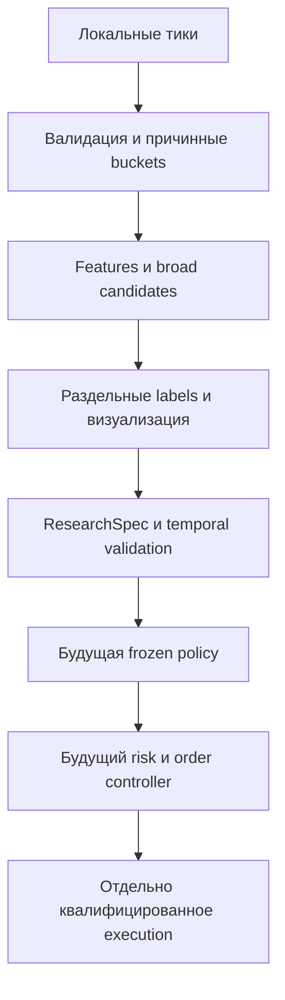

# ORDER-FLOW-ROADMAP-001: roadmap исследования дельты и реакции цены

**Статус:** TARGET ROADMAP — RESEARCH MVP SLICE.

Текущий Order Flow — изолированный OsData workbench для локального файла тиков.
Переход на этот источник и исключение показателей стакана заданы владельцем.
Сетевое получение данных не входит в реализацию. Текущий checkout и executable
tests определяют реализованное поведение; прежний аудит другого baseline не
является evidence этого импорта. Контракты перечислены в [индексе](README.md).

## 1. Гипотеза и границы

Исследуется значимый агрессивный поток, которому цена не соответствует:
отрицательная дельта при удержании/росте цены может создать Long candidate;
положительная при удержании/снижении — Short. Это гипотеза, а не торговый вход.
Сторона берётся из файла, не восстанавливается по цене.

Тики достаточны для этих признаков. Они не доказывают скрытого участника,
iceberg, исполнимый объём или прибыльность. Если эффект не подтверждается
на независимых данных и после обоснованных расходов, результат — `no-go`.

## 2. Реализованный исследовательский контур

Пользователь открывает OsData → Order Flow, выбирает файл, обе даты или весь
период, обязательный decimal PriceStep и параметры. Формат и replay определяет
[DATA-001](DATA_REPLAY_CONTRACT.md), операции — [runbook](RESEARCH_MVP_RUNBOOK.md).
Workbench не копирует источник, не создаёт торговые заявки и не изменяет Tester.

| Компонент | Текущая ответственность |
|---|---|
| OrderFlowTickReader | Полный raw hash, строгий текстовый формат, исходный порядок и microseconds |
| OrderFlowResearchEngine | Фильтр дат, закрытые timestamp buckets, один consumer |
| FeatureWindow | Buy/Sell volume, delta, trade count, изменение VWAP и response |
| Broad detector | Независимые Long/Short условия и direction-specific cooldown |
| MarketPathLabeler | Отдельные future horizons/barriers, без leakage в признаки |
| ArtifactWriter | Immutable JSON/CSV, provenance и reason-coded rejection |
| Cloud | Независимые tick-chain calculations по публичному описанию; локальные правила/ограничения в runbook |
| WPF presenter | Один график, слои дельты/Cloud; вкладки настроек; 21 TF, масштаб Cloud, отдельное окно, линии, виды цены/Cloud-путь, шкала времени, zoom и прокрутка |

Ядро исследовательского расчёта не зависит от WPF, BotTabSimple или коннектора.
Окно признаков, display timeframe и будущий label horizon — три разные шкалы.
Для 3/9/18 минут задаются окна 180/540/1080 секунд. Интервалы отображения и
коэффициент размера Cloud описаны в [runbook](RESEARCH_MVP_RUNBOOK.md#44-график-и-сводка).
Смена вида не пересчитывает candidates или Cloud.

## 3. Целевая архитектура

Research dataset и registry помогают выбрать простую объяснимую policy.
Robot adapter в будущем использует existing BotPanel/BotTabSimple и общий
lifecycle платформы, без второго параллельного торгового контура.
Live adapter потребует самостоятельного доказательства time/side parity.
`Trade.GetSaveString` помогает сопоставить формат, но strict reader намеренно
не наследует permissive legacy parsing и не обещает универсальную семантику MicroSeconds.

## 4. Последовательность работ

| Этап | Результат и критерий |
|---|---|
| 1. Data/replay | Synthetic format/precision/date/ordering tests; закреплённые реальные hashes/counts и ресурсный профиль |
| 2. Features/visualization | Ручные ожидаемые формулы, причинность, совпадение CSV/markers/journal на выбранных эпизодах |
| 3. Research dataset | ResearchSpec, background/candidates/labels, experiment registry, temporal split/purge и контроль leakage |
| 4. Execution qualification | Отдельное решение о модели для имеющихся данных, assumptions/costs, synthetic/golden evidence до использования PnL |
| 5. Policy selection | Price-only, delta и delta+response controls; при необходимости frozen ML ranker; ограниченный budget вариантов |
| 6. Strategy freeze и historical go | Одна StrategySpec до final OOS; устойчивость на независимых днях/контрактах и adverse assumptions |
| 7. Robot/risk/recovery | Order lifecycle, idempotency, partial/cancel/late fills, restart, daily risk и cutoff |
| 8. Shadow/paper | Сравнение features/intents, калибровка execution assumptions, сверка позиций |
| 9. Limited live | Разрешённый владельцем точный сценарий, минимальный риск, monitoring и runbook |

MVP покрывает части этапов 1–3. Наличие multi-date reader не закрывает session
calendar, golden qualification, registry или economic gate. Загрузчик больше
не является запланированным этапом. Execution/model/live этапы не реализованы.

## 5. Стратегия и исполнение

[Strategy lifecycle](STRATEGY_LIFECYCLE.md) отделяет candidate от confirmation,
no-trade, intent и position. Неудавшийся Long не является Short. Future policy
имеет собственное подтверждение, expiry, risk/session gates и exit priorities.
Свечная окраска не заменяет формулу detector.

[Execution contract](EXECUTION_MODEL.md) фиксирует ограничение тиков: из них
не наблюдаются spread или доступная ликвидность. Fill по следующему trade
нельзя автоматически объявить честной моделью. До отдельной квалификации
расходы и net PnL не используются для торговых выводов.

## 6. Приёмка и исследовательская дисциплина

Технические и экономические критерии разделены в
[qualification](TESTING_AND_QUALIFICATION.md). Synthetic PASS доказывает только
свой checkpoint и свои сценарии. Проверки owner-файла требуют immutable hash,
настроек, выбранных дат, counts и точного resource/evidence boundary.

Сравниваются price-only, price+delta и price+delta+response. ML допускается
только при устойчивом приросте к простому baseline. Split хронологический;
перекрывающиеся окна/labels очищаются. Все варианты учитываются; final OOS
не используется для подбора параметров. Не предполагается, что исследования
других видов order flow доказывают пользу именно этого tick detector.

Инженерный допуск требует determinism, причинности, диагностики и будущих
risk/recovery tests. Экономический — отдельного evidence после расходов,
устойчивости по дням/контрактам и соседним параметрам. Отсутствие evidence
не заменяется красивыми метками на графике.
