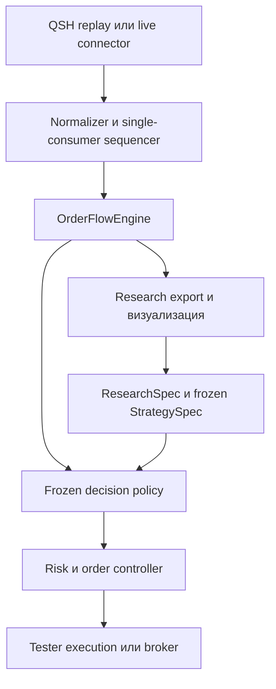

# Production-ready roadmap: Order Flow робот

**Статус:** согласованный TARGET roadmap; offline Research MVP реализует
ограниченный vertical slice, полный roadmap не завершён.

**База исследования:** `master` форка `2Rukin/OsEngine`, commit
[`f54de33961d45f73319ae1c7313f2854bcb27398`](https://github.com/2Rukin/OsEngine/commit/f54de33961d45f73319ae1c7313f2854bcb27398).

**Граница:** внешний upstream не рассматривается как источник требований или реализации.

**Текущий этап:** доступен research-only workbench для первичной проверки одной
QSH пары; StrategySpec, execution, robot и economic qualification отсутствуют.

Подробные контракты данных, исследования, стратегии, исполнения и квалификации
находятся в [индексе Order Flow](README.md). Roadmap задаёт последовательность и
границы; специализированные документы являются источниками подробной семантики.

## 1. Цель и границы проекта

Нужно построить воспроизводимый исследовательский и торговый контур для проверки гипотезы:

> Значимый агрессивный поток в одну сторону, которому цена не соответствует либо отвечает
> движением в противоположную сторону, может содержать информацию о последующем движении.

Пример long-ситуации: агрессивная дельта отрицательная, но цена удерживает уровень либо растёт;
после отдельного подтверждения робот может открыть long. Для short все условия зеркальны.

Проект должен:

- работать на парных QSH-потоках `Deals + Quotes`;
- одинаково рассчитывать признаки в истории, shadow-режиме и live;
- позволять визуально разбирать кандидатов, подтверждения, входы и исполнения;
- исключать look-ahead и оптимистичное исполнение;
- поддерживать внутридневное удержание от минут до часов, но не переносить позицию через ночь;
- допускать результат **no-go**, если преимущество после издержек не подтвердится.

Production-ready здесь означает инженерную воспроизводимость и контролируемый риск. Это не
гарантия прибыльности: экономический допуск получается только на независимых данных.

## 2. Результат аудита текущего `master`

| Область | Что уже есть | Решение |
|---|---|---|
| Сделки | [`Trade`](../../OsEngine/Entity/Trade.cs) хранит цену, объём, время, микросекунды и `Side` | Переиспользовать после проверки семантики конкретного источника |
| QSH Deals | [`DealsStream`](../../OsEngine/OsData/BinaryEntity/DealsStream.cs) читает цену, объём и сторону сделки | Переиспользовать; не применять эвристики случайного назначения стороны |
| QSH Quotes | В движке есть чтение снимков стакана | Переиспользовать reader, но добавить парное воспроизведение |
| Загрузка QScalp | [`QscalpMarketDepthServer`](../../OsEngine/Market/Servers/QscalpMarketDepth/QscalpMarketDepthServer.cs) ищет и загружает только `Quotes.qsh` | Расширить до атомарной пары `Deals + Quotes` и локального импорта |
| OsData | Создаёт наборы в `Data\Set_<имя>\<инструмент>\<TimeFrame>` | Расширить контрактом данных, manifest и отчётом качества |
| Tester | [`TesterServer`](../../OsEngine/Market/Servers/Tester/TesterServer.cs) распознаёт оба типа QSH | Переделать replay: сейчас на одну дату выбирается первый найденный файл и один reader |
| События робота | [`BotTabSimple`](../../OsEngine/OsTrader/Panels/Tab/BotTabSimple.cs) предоставляет сделки, стакан, заявки, исполнения и позиции | Переиспользовать через тонкий адаптер |
| Исполнение | Тестер умеет исполнять заявки по тикам или стакану | Текущая модель исполняет весь объём по лучшей цене; для исследования непригодна без доработки |
| Индикаторы | [`Aindicator`](../../OsEngine/Indicators/Aindicator.cs) работает по `List<Candle>` | Использовать только как средство отрисовки, не как источник тикового сигнала |
| Внешние серии | Есть [`EmptyIndicator`](../../OsEngine/Indicators/EmptyIndicator.cs) и [`CustomDataInIndicatorSample`](../../OsEngine/Robots/TechSamples/CustomDataInIndicatorSample.cs) | Переиспользовать как основу вывода рассчитанных ядром серий |
| Метки на графике | Есть [`PointElement`](../../OsEngine/Charts/CandleChart/Elements/PointElement.cs) и `BotTabSimple.SetChartElement` | Переиспользовать для кандидатов, сигналов, заявок, исполнений и выходов |
| Свечная дельта | Есть [`DeltaByCandles`](../../OsEngine/Indicators/Scripts/DeltaByCandles.cs) | Не использовать как ядро; допускается только сравнительная визуализация после проверки расчёта |
| Optimizer | Backend частично знает MarketDepth, но соответствующий пункт UI отключён | Не использовать на первых этапах; сначала обеспечить корректные replay и execution |

## 3. Критическое ревью предыдущего roadmap

| Статус | Находка | Исправление в этой редакции |
|---|---|---|
| **Блокер** | Наличие двух QSH-файлов было почти приравнено к синхронному потоку | Введён отдельный парный reader, причинный merge и детерминированная политика одинаковых timestamp |
| **Блокер** | Метрика «ближайший стакан к сделке» может выбрать снимок из будущего | Для связи отдельной сделки с признаками используется только quote из предыдущего закрытого bucket; same-timestamp quote доступен лишь post-bucket snapshot, а исполнение использует только причинно последующий quote после activation time |
| **Блокер** | QSH и текущий QScalp-коннектор не гарантируют корректные `PriceStep`, `PriceStepCost`, `Lot` и календарь | Спецификация контракта стала обязательной частью импорта и тестового manifest |
| **Блокер** | Live-сделки и стакан могут приходить из разных потоков | Между адаптерами и ядром добавлена одна последовательная очередь с единственным consumer |
| **Блокер** | План обещал консервативно моделировать очередь лимитных заявок без order-level данных | Пассивное исполнение исключено из версии 1; исследуются taker/marketable заявки и частичные исполнения по видимому стакану |
| **Блокер** | Переход от общих слов «сильная дельта» к роботу оставался неформальным | Перед торговой реализацией обязателен версионируемый `StrategySpec` с точными состояниями, порогами и правилами отмены |
| **Блокер** | Candidate, торговый сигнал и сделка могли быть приняты за одно событие, а подбор правил — перенесён сразу в Tester или неформальный «ИИ-анализ» | Разделены causal snapshots, observation dataset, labels, frozen policy, intent и execution; Tester и датасет используются последовательно |
| **Существенно** | Индикатор назывался необязательным, хотя без него трудно оценить качество точек | Визуализация стала обязательным исследовательским результатом до реализации заявок |
| **Существенно** | Обычный `Aindicator` мог быть ошибочно принят за место расчёта стратегии | Он получает свечи, поэтому отображает уже рассчитанные снимки ядра и не пересчитывает сигнал самостоятельно |
| **Существенно** | Временные, объёмные и trade-count окна могли породить неконтролируемый перебор параметров | В одном эксперименте фиксируется один основной способ построения окна; остальные сравниваются как отдельные версии |
| **Существенно** | Таймфрейм сигнала, таймфрейм графика и срок удержания смешивались | Эти три шкалы разделены; визуальный M1 не закрывает позицию и не определяет сигнал |
| **Существенно** | Полный production-робот планировался до экономической проверки гипотезы | Исторический `go/no-go` перенесён перед реализацией live risk/order controller |
| **Существенно** | Не была явно предусмотрена сверка состояния после реконнекта и перезапуска | Добавлены persisted risk state, reconciliation позиций/заявок и защита от повторных команд |
| **Существенно** | «Production-ready» могло звучать как обещание прибыльности | Разделены инженерный и экономический допуски; любой из них может завершиться `no-go` |

Проверенные ранее файлы SRH4, SRH5 и SRZ6 показали 100% размеченных Buy/Sell и близость
ближайшего снимка стакана не более 100 мс примерно для 97,7–99,2% сделок. Это подтверждает
пригодность к исследованию секундных и минутных эффектов, но **не** доказывает причинную
доступность стакана. На этапе аудита данные проверяются заново по предыдущему, а не ближайшему
снимку. Точный HFT-порядок внутри одной миллисекунды из этих данных не восстанавливается.

## 4. Что делает пользователь

### 4.0. Доступный сейчас Research MVP

Пользователь открывает OsData → `Order Flow`, выбирает одну локальную пару QSH,
папку результата и параметры research run. Workbench выдаёт quality report,
causal observations, broad candidates, отдельные market-path labels, journal и
диагностический график `Sec15`/`Sec30`/`Min1`. Он не импортирует пару в `Set`,
не запускает Tester и не рассчитывает заявки или PnL. Пошаговая инструкция — в
[ORDER-FLOW-MVP-RUNBOOK-001](RESEARCH_MVP_RUNBOOK.md).

### 4.1. Историческое исследование

1. Открывает OsData и создаёт набор, например `Set_OrderFlow_SR`.
2. Выбирает инструмент, конкретный фьючерсный контракт и диапазон дат.
3. Выбирает один из двух входов:
   - загрузить пару QSH из настроенного источника;
   - импортировать уже имеющиеся парные файлы из выбранной папки.
4. На каждый торговый день предоставляет либо получает:
   - `<instrument>.<date>.Deals.qsh`;
   - `<instrument>.<date>.Quotes.qsh`.
5. Проверяет или заполняет карточку контракта: шаг цены, стоимость шага, лот, шаг объёма,
   валюта, комиссия, дата экспирации, часовой пояс и торговые сессии.
6. Запускает проверку. День попадает в исследование только после отчёта качества.
7. В Tester выбирает набор, robot/research mode, даты, версию `StrategySpec` и профиль издержек.
8. После прогона открывает график и журнал событий, сравнивает кандидатов, подтверждения,
   фактические входы и причины отказов.

Внутреннее место хранения пары:

`Data\Set_<имя>\<инструмент>\MarketDepth\`

Пользователь не должен вручную раскладывать данные по внутренним каталогам. Импортёр копирует
оригинальные файлы, рассчитывает checksums и формирует manifest.

### 4.2. Shadow, paper и live

1. Пользователь выбирает live-коннектор, инструмент, портфель и ту же версию стратегии.
2. Система проверяет возможности коннектора: `Trade.Side`, полный стакан, timestamps, типы
   заявок, частичные исполнения, восстановление ордеров и доступность серверной защиты.
3. Сначала запускается shadow: сигналы и предполагаемые исполнения записываются, заявки не идут.
4. Затем paper или минимальный разрешённый объём.
5. Live включается только после экономического и инженерного допуска.

## 5. Контракт данных

### 5.1. Обязательные данные

| Сущность | Обязательные поля |
|---|---|
| Deal | контракт, timestamp источника, цена, объём, `Buy/Sell`, идентификатор или стабильная последовательность файла |
| Quote | контракт, timestamp источника, упорядоченные bid/ask уровни, объёмы по уровням |
| Instrument | `PriceStep`, `PriceStepCost`, `Lot`, `VolumeStep`, валюта, экспирация |
| Session | биржевая зона, разрешённые интервалы, клиринги, сокращённые дни, время принудительного выхода |
| Costs | комиссия на вход/выход, профиль latency и дополнительного adverse slippage |

Склеенные непрерывные фьючерсы не используются как цены исполнения. Сначала исследуется каждый
реальный контракт; объединять статистику можно только поверх контрактных результатов.

### 5.2. Manifest набора

Manifest хранит:

- имена, размеры и checksums исходных файлов;
- instrument/session metadata;
- выбранную временную зону и правила нормализации;
- версию parser/normalizer;
- число deals/quotes, диапазоны времени и дубли;
- долю неизвестной стороны;
- распределение возраста последнего причинно доступного стакана;
- разрывы, пересечения с клирингом и итог `accepted/rejected` по дням.

Исходные QSH после принятия считаются immutable. Повторный прогон по тому же manifest должен
давать тот же hash последовательности нормализованных событий.

### 5.3. Временная семантика

- Не называем QSH timestamp биржевым временем, пока это не подтверждено форматом источника.
- В нормализованном событии различаются source time, receive/capture time при наличии и внутренний sequence.
- Стакан может использоваться для сделки только если он уже был доступен к её времени.
- События с одинаковой миллисекундой собираются в bucket; произвольный порядок внутри bucket не
  используется для создания преимущества.
- Решение появляется после закрытия bucket, а заявка становится активной не раньше следующего
  причинно последующего стакана после заданной latency.

## 6. Целевая архитектура

| Компонент | Ответственность |
|---|---|
| Data adapter | Читает QSH либо события коннектора, но не считает стратегию |
| Normalizer | Приводит инструмент, время, цены, объёмы и стороны к единому контракту |
| Sequencer | Один consumer, стабильный порядок, buckets одинакового времени, контроль stale data |
| `OrderFlowEngine` | Скользящие окна, дельта, реакция цены, контекст и диагностические snapshots |
| Research exporter | Сохраняет causal observations отдельно от будущих labels и результатов исполнения |
| Decision policy | Frozen rule/model policy переводит candidate в `NoTrade`, ожидание или `TradeIntent` |
| Strategy state machine | `Idle → Candidate → Confirmed/Invalidated/Expired → Intent/NoTrade → Cooldown` |
| Visual presenter | Привязывает snapshots к свечам выбранного графического таймфрейма |
| Risk controller | Размер, дневные лимиты, сессия, stale/disconnect kill switch |
| Order controller | Жизненный цикл заявки, partial fills, cancel/replace, reconciliation и идемпотентность |
| Tester execution | Причинное исполнение по последующему стакану с latency и ограниченной ликвидностью |

Ядро не зависит от WPF, `BotTabSimple`, Tester или конкретного коннектора. История и live используют
одинаковые normalizer events и один `OrderFlowEngine`. Подробные границы компонентов заданы в
[data/replay](DATA_REPLAY_CONTRACT.md), [research](RESEARCH_PROTOCOL.md),
[strategy](STRATEGY_LIFECYCLE.md) и [execution](EXECUTION_MODEL.md) contracts.

## 7. Как будет строиться стратегия

### 7.1. Три независимые шкалы времени

| Шкала | Назначение | Принцип |
|---|---|---|
| Окно признаков | Обнаружить поток и реакцию цены | Скользящие event windows; закрытие свечи не обязательно |
| Таймфрейм визуализации | Сделать ситуацию понятной человеку | По умолчанию M1; не влияет на сигнал |
| Удержание позиции | Дождаться реализации либо отмены гипотезы | Минуты или часы, но не позднее внутридневного cutoff |

Исследуются временные, объёмные и trade-count окна, но они не смешиваются бесконтрольно. Для
каждого эксперимента заранее фиксируется основной тип окна и небольшой набор соседних значений.

### 7.2. Рассчитываемые признаки

- агрессивный Buy/Sell volume;
- абсолютная и нормированная дельта;
- число сделок и средний размер сделки;
- изменение цены, диапазон и продвижение цены на единицу направленного потока;
- удержание/пробой зафиксированного уровня;
- spread и возраст последнего стакана;
- видимый imbalance top-N уровней;
- изменение видимой ликвидности только как признак снимков, а не доказанный order-level OFI.

### 7.3. Начальная проверяемая гипотеза

Чтобы не смешивать разные идеи, первая версия исследует одну последовательность:

1. Без знания будущего фиксируется контекст: импульс или выход из локального диапазона и уровень.
2. Наблюдается первый возврат к уровню.
3. На long-кандидате присутствуют значимые агрессивные продажи и отрицательная дельта, но цена
   не продвигается вниз либо растёт. На выбранном графическом таймфрейме это может выглядеть как
   зелёная свеча с красной дельтой, но цвет свечи не является входным признаком стратегии.
4. Кандидат **не является входом**. Требуется последующее подтверждение: восстановление цены и
   потока покупателей после момента кандидата.
5. Уровень, минимум наблюдения, maximum acceptable entry, причина отмены и время сигнала
   фиксируются и не передвигаются задним числом.
6. Short строится зеркально.

«Поглощение» является операциональной меткой состояния потока и цены. Она не доказывает
скрытый iceberg, личность участника или его намерение.

### 7.4. От кандидата к торговой политике

Broad detector сначала создаёт исследовательские Long/Short candidates, а не
заявки. Сохраняются все candidates, включая invalidated, expired и отвергнутые
policy, после чего будущий путь размечается отдельно от причинных признаков.

На development/validation сравниваются объяснимый rule-based baseline,
price-only control и, только при достаточном объёме данных, дополнительный
статистический/ML ranker. Неудавшийся Long candidate не становится Short:
противоположная сделка требует независимого Short candidate и confirmation.

Tester используется после этого для причинного исполнения frozen policy, а не
как единственный инструмент ручного просмотра. Полный протокол датасета,
labels, временных splits и границы автоматического анализа задан в
[ORDER-FLOW-RESEARCH-001](RESEARCH_PROTOCOL.md).

### 7.5. Выход и управление позицией

Версия 1 до отдельного исследования:

- одна идея и одна позиция на инструмент;
- усреднение выключено;
- stop/invalidation задаётся структурой сигнала и отдельным денежным пределом;
- возможны выход по разрушению гипотезы, противоположному подтверждённому состоянию,
  защитному уровню или времени;
- максимальное удержание не фиксируется искусственно пятью минутами: оно исследуется отдельно
  на горизонтах от минут до часов;
- перед внутридневным cutoff новые входы запрещаются, заявки отменяются, остаток ликвидируется и
  сверяется с брокером;
- изменение визуального таймфрейма не изменяет exit.

Перед historical validation и final OOS одна policy замораживается в
`StrategySpec vN`: точные формулы, окна, пороги, приоритеты состояний, вход,
выход, cooldown, model artifact при наличии и session policy. Synthetic
execution model разрабатывается и тестируется независимо до этого freeze.
Изменение правила создаёт новую версию, а не переписывает старые результаты.

## 8. Визуализация точек входа

Визуализация обязательна для исследования, но не участвует в принятии торгового решения.

### 8.1. Таймфреймы

| Режим | Назначение |
|---|---|
| `Sec15` или `Sec30` | Разбор порядка кандидата, подтверждения и исполнения внутри минуты |
| `Min1` | Основной режим оценки точек и контекста; значение по умолчанию |
| `Min5` | Обзор длительного внутридневного контекста и удержания |

Один и тот же сигнал получает тот же event timestamp на любом графике. На M1 несколько событий
могут попасть в одну свечу, поэтому точный порядок читается из журнала или на `Sec15/Sec30`.

### 8.2. Области графика

| Область | Что отображается |
|---|---|
| Price / `Prime` | Свечи, зафиксированный уровень, candidate, confirmed signal, order submitted, partial/full fill, exit и stop |
| Delta | Signed delta по display bar; отдельно Buy/Sell volume при необходимости |
| Response | Нормированная реакция цены на поток и текущее состояние автомата |
| Liquidity / quality | Spread, book imbalance, возраст стакана и признак stale/invalid data |

Маркеры сигнала и исполнения различаются: хороший сигнал может не исполниться, а плохое
исполнение не должно менять историческую точку сигнала.

### 8.3. Техническая основа визуализации

- `OrderFlowEngine` публикует immutable `DiagnosticSnapshot` и события переходов состояния.
- Presenter агрегирует snapshots в выбранный display timeframe.
- Серии выводятся через механизм внешних данных наподобие `EmptyIndicator`.
- Точки и подписи выводятся через `PointElement`.
- Индикатор не читает тики повторно и не имеет собственной копии торговых правил.
- Для каждого marker в журнале хранятся точное время, версия стратегии, значения признаков и причина.

Критерий готовности: значения на графике, event log и результат движка совпадают на golden dataset.

## 9. Парный replay и causal processing

Новый режим Tester должен одновременно держать два reader на инструмент/день и выбирать следующий
timestamp из обоих потоков.

Полная временная и bucket-семантика задана в
[ORDER-FLOW-DATA-001](DATA_REPLAY_CONTRACT.md); ниже приведена roadmap-сводка.

Обязательные свойства:

- оба файла относятся к одному контракту и торговой дате;
- порядок воспроизводим между запусками;
- ни один quote из будущего не используется в признаке или исполнении;
- bucket одинакового времени имеет фиксированную политику;
- signal time, order activation time и fill time различаются;
- replay не пропускает сделки из-за перехода дня или переключения файла;
- хеш нормализованных событий и итоговые snapshots совпадают при повторном прогоне;
- время нормализуется в одной биржевой зоне, при этом исходное значение сохраняется.

Политика одинаковой миллисекунды проверяется стресс-тестом: перестановка событий внутри bucket не
должна создавать заявку раньше конца bucket. Если результат стратегии сильно зависит от такой
перестановки, гипотеза для этих данных отклоняется.

## 10. Модель исполнения версии 1

Канонический подробный контракт находится в
[ORDER-FLOW-EXECUTION-001](EXECUTION_MODEL.md); ниже приведены границы версии 1.

### 10.1. Поддерживается

- taker или marketable limit входы и выходы;
- активация после заданной latency на первом причинно последующем стакане;
- проход по доступным уровням стакана;
- частичные исполнения и неисполненный остаток;
- комиссия, spread, дополнительный adverse slippage;
- отказ при stale/пустом стакане или превышении maximum acceptable price;
- stop как порог действия, а не гарантированная цена сделки;
- несколько stress-профилей издержек.

Из-за снимочной природы Quotes даже такой fill остаётся моделью. Итоговая проверка должна показывать
не одну точную прибыль, а диапазон для baseline и ухудшенных execution assumptions.

### 10.2. Не поддерживается в версии 1

- гарантированное пассивное исполнение по касанию;
- место заявки в очереди;
- точное восстановление добавлений, отмен и скрытой ликвидности;
- maker rebate как бесплатное улучшение результата;
- исполнение на том же событии, которое породило сигнал.

Пассивные стратегии возвращаются в scope только при появлении данных и модели, позволяющих
обосновать queue position. Штатный `Touch/Intersection/FiftyFifty` не является достаточной моделью.

## 11. Робот, риск и восстановление

Торговая оболочка на `BotPanel/BotTabSimple` должна быть тонкой. Она передаёт данные в очередь,
получает `TradeIntent` и управляет заявками через отдельные state machines.

Обязательные механизмы:

- режимы `Off`, `Shadow`, `Paper`, `Live`;
- idempotency ключ для каждой идеи и команды;
- одна активная идея/позиция на инструмент в версии 1;
- расчёт размера по денежному риску и спецификации контракта;
- лимит потерь на сделку, день и совокупную открытую позицию;
- блокировка входов при stale data, пропусках, disconnect и несовпадении позиции;
- отдельное состояние `Opening`, `PartiallyFilled`, `Open`, `Closing`, `Reconciling`, `Blocked`;
- защита фактически исполненного объёма, а не исходного order volume;
- отмена остатка и обработка запоздалого fill;
- persisted daily risk, открытая идея и номера заявок;
- при старте/реконнекте запрос реальных позиций и активных заявок до разрешения новых входов;
- независимый session timer: отсутствие новых тиков не отменяет процедуру выхода;
- runbook аварийного закрытия и ручной резервный доступ к брокеру.

Серверный stop/IOC/OCO/reduce-only нельзя считать доступными универсально. Их семантика проверяется
для выбранного live-коннектора; иначе используется согласованный безопасный fallback.

## 12. Проверка и исследовательский протокол

Этот раздел является краткой сводкой. Датасет, labels и автоматический анализ
определяет [ORDER-FLOW-RESEARCH-001](RESEARCH_PROTOCOL.md), а обязательное
evidence и ворота —
[ORDER-FLOW-QUALIFICATION-001](TESTING_AND_QUALIFICATION.md).

### 12.1. Технические тесты

1. Unit: QSH parser, normalizer, bucket policy, окна, state machine, risk и order state.
2. Property/invariant: время не идёт назад, объём не становится отрицательным, fill не превышает
   доступный остаток, после block новые заявки не появляются.
3. Synthetic streams: заранее известные green-price/red-delta сценарии, отмена сигнала и stale book.
4. Golden replay: QSH pair → hash events → snapshots → markers → intents.
5. No-look-ahead: изменение будущих событий не меняет уже созданные snapshots и сигналы.
6. Integration: replay → research harness → execution → journal с partial fills.
7. Recovery: перезапуск в состояниях opening/open/closing и запоздалое исполнение после cancel.
8. Performance: отсутствие потерь событий и ограниченная память на полном торговом дне.

### 12.2. Проверка экономической гипотезы

Сначала сравниваются контрольные версии:

| Вариант | Состав |
|---|---|
| A | Только ценовой контекст и подтверждение |
| B | Цена + агрессивная дельта |
| C | Цена + дельта + реакция цены на поток |
| D | Дополнительно стакан, но только при причинно свежем quote |
| E, если применимо | Лучший простой baseline + frozen ML ranker кандидатов |

Если C не превосходит A после одинаковых издержек, order flow не добавляет полезной информации.
Если D не превосходит C, стакан не включается в production-сигнал.
Если E не даёт устойчивого прироста относительно простой policy, ML не включается
в production-версию.

Данные делятся хронологически:

- development — формулы и небольшой заранее ограниченный набор вариантов;
- validation — выбор одной версии;
- final out-of-sample — однократный допуск без дальнейшей подгонки;
- walk-forward по нескольким реальным контрактам и режимам рынка.

Одна идея целиком относится к одному сегменту. Границы очищаются от перекрытия окон признаков и
исходов. Нормирование использует только прошлые сессии и не склеивает экспирации как реальные сделки.

Оцениваются:

- net PnL после всех расходов;
- expectancy и доверительный интервал с группировкой по дням;
- maximum drawdown и хвостовые убытки;
- MAE/MFE и время жизни эффекта от секунд до часов;
- число независимых идей, fills и пропущенных входов;
- концентрация результата по дням, контрактам и времени сессии;
- чувствительность к соседним параметрам, latency и ухудшению fill;
- превосходство над ценовым контрольным вариантом.

Автоматическая оптимизация не запускается, пока paired replay, snapshots и execution не прошли
golden tests. Победитель большого перебора без учёта всех проверенных вариантов не принимается.

## 13. Этапы реализации и ворота

| Этап | Результат | Ворота перехода |
|---|---|---|
| 0. Baseline и target contracts | Закреплённый commit, карта reuse/modify/build, комплект документов и ADR ключевых решений | Источники, границы и последовательность согласованы; target не выдан за current implementation |
| 1. Data contract и fixtures | Схема событий, manifest, instrument/session metadata, synthetic/golden fixtures и causal quality report | На контрольных QSH-днях нет неучтённых будущих quotes и двусмысленных полей |
| 2. Acquisition/import | Парная загрузка и локальный импорт в OsData, immutable raw files | Повторный импорт идемпотентен, неполная пара отклоняется |
| 3. Paired replay | Два reader, merge, buckets и single-consumer sequencer | Повторный прогон имеет одинаковый event hash; no-look-ahead тесты зелёные |
| 4. Feature engine + visualization | `OrderFlowEngine`, causal snapshots, neutral research export, M1/Sec markers и event log; candidates и заявок ещё нет | Формулы и snapshot IDs воспроизводимы; график совпадает с journal/golden scenarios |
| 5. ResearchSpec, candidates и market-path labels | Frozen `ResearchSpec`, broad candidates/background sample, MFE/MAE/barrier outcomes, temporal split/purge и experiment registry; execution PnL ещё не рассчитывается | Features отделены от future market-path labels, leakage tests зелёные, final OOS не просмотрен |
| 6. Execution model и simulation results | Taker fills, latency, levels, partials, комиссии, risk interface, stress profiles и отдельные execution outcomes/net PnL | Нет fill на событии сигнала; liquidity ledger и synthetic execution invariants проходят; simulation results не смешаны с raw labels |
| 7. Policy discovery и StrategySpec | Rule-based/price-only controls, ограниченное исследование filters и optional ML ranker; выбрана одна policy | `StrategySpec` и artifacts заморожены по development/validation до открытия final OOS |
| 8. Historical qualification | Контрольные варианты A–D/E, final OOS, walk-forward и отчёт устойчивости | Формальное решение `go/no-go`; подтверждён incremental value, а не только лучший PnL |
| 9. Robot + production risk | Только после `go`: тонкий BotTab adapter, order/risk state machines, persistence и reconciliation | Тесты дублей, partial fills, restart, cutoff и emergency exit проходят |
| 10. Shadow/paper | Live market data через то же ядро, измерение latency и расхождений | Features/intents воспроизводимы, simulated и broker outcomes различены, позиции/ордера сверяются |
| 11. Limited live | Минимальный объём, мониторинг, runbook и постепенный допуск | Выполнены инженерный и экономический критерии; нет критических инцидентов |

После согласования roadmap каждый этап планируется отдельно: задачи, интерфейсы, изменяемые файлы,
тесты, миграции форматов, критерии приёмки и rollback. Реализация следующего этапа не начинается до
закрытия ворот предыдущего.

Текущий Research MVP является контролируемым vertical slice частей этапов 1,
3, 4 и 5, а не закрытием их ворот. Для закрытия по-прежнему нужны реальные
golden/full-day pairs, полная metadata/session модель, import, temporal
split/registry и пройденное build/test evidence. Этапы 2 и 6–11 им не
реализованы.

## 14. Определение готовности

### 14.1. Инженерный допуск

- один и тот же event stream даёт один и тот же результат;
- отсутствует look-ahead;
- график, журнал, signal и fill различены и воспроизводимы;
- риски переживают перезапуск;
- partial fills, отмены и поздние fills не создают переворот или дубли;
- при disconnect/stale/mismatch новые входы блокируются;
- принудительное внутридневное закрытие и reconciliation испытаны;
- мониторинг сообщает о потере данных, задержке, отказе заявки и расхождении позиции.

### 14.2. Экономический допуск

- правила были зафиксированы до final OOS;
- положительный результат сохраняется после комиссии, spread, latency и ухудшенного fill;
- order-flow вариант превосходит сопоставимый price-only контроль;
- результат не сосредоточен в нескольких днях или одном контракте;
- соседние разумные параметры не превращают результат в противоположный;
- риск и drawdown укладываются в заранее утверждённые границы.

### 14.3. Основания для `no-go`

- преимущество исчезает после обычных расходов;
- результат возникает только при использовании будущего quote или спорного порядка одной миллисекунды;
- passive fill является основным источником прибыли без доказуемой модели очереди;
- стратегия не превосходит price-only контроль;
- прибыль держится на небольшой группе эпизодов;
- live shadow систематически расходится с historical replay.

`No-go` не является провалом реализации: он предотвращает запуск недоказанной стратегии на реальные деньги.

## 15. Исследовательские ориентиры

Roadmap опирается на проверяемую идею реакции цены на поток, а не на обещание, что конкретный
дисбаланс гарантирует движение:

- Cont, Kukanov, Stoikov — [The Price Impact of Order Book Events](https://arxiv.org/abs/1011.6402);
- Gould, Bonart — [Queue Imbalance as a One-Tick-Ahead Price Predictor](https://arxiv.org/abs/1512.03492);
- Kolm, Turiel, Westray — [Deep order flow imbalance](https://onlinelibrary.wiley.com/doi/10.1111/mafi.12413).

Эти работы обосновывают направление исследования, но не доказывают прибыльность описанного робота
на фьючерсах MOEX. Она устанавливается только описанным выше протоколом.
