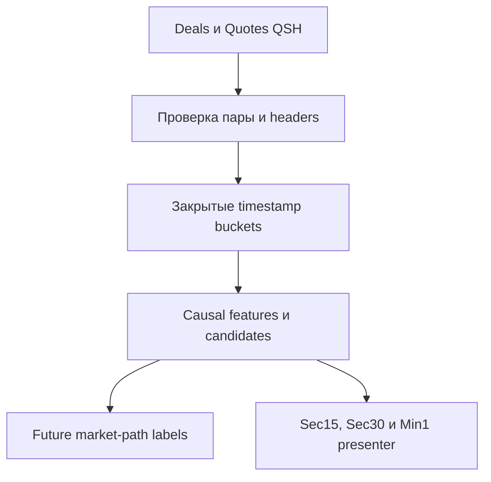

# ORDER-FLOW-MVP-RUNBOOK-001: первичная проверка Order Flow

**Статус:** CURRENT IMPLEMENTATION GUIDE — RESEARCH ONLY.

**Граница evidence:** workbench проверяет одну локальную пару QSH, причинные
признаки, broad candidates и будущий путь цены. Он не создаёт заявки, не
моделирует fill, не считает PnL и не подтверждает прибыльность или live parity.

## 1. Что реализовано

В OsData добавлен изолированный пункт `Order Flow`. Он запускает общий
single-consumer research flow:



Реализация находится в `OsEngine/OsData/OrderFlow/`. Existing Tester и его
модель исполнения этим MVP не изменены.

## 2. Что предоставляет пользователь

Для одного инструмента и торгового дня нужны:

- `<instrument>.<yyyy-MM-dd>.Deals.qsh`;
- `<instrument>.<yyyy-MM-dd>.Quotes.qsh`;
- локальная папка для результата;
- параметры одного `ResearchSpec`: окно признаков, минимальная абсолютная
  дельта, минимальное изменение цены против направления потока, глубина стакана,
  stale threshold, cooldown,
  горизонты labels и barriers.

Workbench читает QSH v4 в raw, GZip или Deflate форме. `PriceStep` берётся из
пятичастного instrument header, `VolumeStep` — из `VolumeStep` comment. Поля
ручного override оставляют пустыми, если header корректен. Override фиксируется
warning reason code и требует отдельной проверки владельцем.

В этой версии lot, `PriceStepCost`, валюта, комиссия, session calendar и
execution profiles не собираются. Поэтому даже принятый research replay не
готов к расчёту торгового результата.

## 3. Как запустить первичную проверку

1. Запустить OsEngine и открыть `Data` / OsData.
2. Нажать `Order Flow`.
3. Выбрать `Deals QSH`. Если парный Quotes-файл лежит рядом под ожидаемым
   именем, второе поле заполнится автоматически.
4. Проверить `Quotes QSH` и папку результатов.
5. Зафиксировать параметры эксперимента. Начальные значения UI являются только
   отправной точкой, а не доказанными торговыми порогами.
6. Нажать `Запустить` и дождаться terminal статуса.
7. Сначала прочитать `Сводку` и quality reason codes. Кандидаты нельзя
   интерпретировать, если результат имеет статус `RESEARCH REJECTED`.
8. В таблице `Кандидаты` выбрать строку. Двойной клик открывает соответствующий
   участок графика; `Sec15`, `Sec30` и `Min1` меняют только отображение.
9. Сверить строку features, marker и `Журнал событий`.
10. Повторить запуск с теми же файлами и параметрами: event, feature и candidate
    hashes должны совпасть, а workbench должен переиспользовать идентичный
    immutable artifact bundle.

## 4. Как читать результат

### 4.1. Causal-признаки

Окно содержит Buy/Sell volume, delta, число сделок, изменение цены и response.
Reference price каждого timestamp bucket является VWAP его сделок, поэтому
перестановка Deals одного timestamp не меняет snapshot.
Spread, top-N imbalance и book age рассчитываются только по последнему
валидному стакану из **предыдущего закрытого bucket**. Финальный Quote текущего
timestamp становится доступен лишь следующему bucket.

Окно времени замкнуто с обеих сторон: для snapshot времени `T` остаются сделки
с `time >= T - FeatureWindowSeconds`. Все цены ниже выражены в абсолютных
единицах цены инструмента, объёмы — в декодированных единицах `VolumeStep`.

| Поле | Точная формула текущей схемы `order-flow-features-1` |
|---|---|
| `ReferencePrice` | `sum(price * volume) / sum(volume)` для сделок bucket `T` |
| `BuyVolume`, `SellVolume` | Сумма объёма соответствующей source side в окне |
| `Delta` | `BuyVolume - SellVolume` |
| `TradeCount` | Число валидных сделок в окне |
| `PriceChange` | `ReferencePrice(T) - VWAP(самого раннего timestamp bucket окна)` |
| `PriceResponse` | `0` при нулевой delta, иначе `PriceChange / abs(Delta)` |
| `Spread` | `BestAsk - BestBid` предыдущего валидного закрытого book bucket |
| `BookImbalance` | `(BidVolumeTopN - AskVolumeTopN) / (BidVolumeTopN + AskVolumeTopN)`; `0` при нулевой сумме |
| `BookAgeMilliseconds` | `T - BookTime` в миллисекундах; `-1`, если причинного book нет |

### 4.2. Candidate

Версия `flow-price-resilience-1` создаёт broad Long при
`Delta <= -MinimumAbsoluteDelta` и
`PriceChange >= MinimumPriceChangeTicks * PriceStep`. Short требует
`Delta >= MinimumAbsoluteDelta` и зеркальное отрицательное изменение цены.
При нулевом price threshold это соответствует удержанию/росту против sell flow.
Cooldown подавляет соседние дубликаты отдельно по каждому направлению.

Candidate — исследовательская гипотеза. В MVP нет confirmation, eligible signal,
trade intent, order или position. Неудавшийся Long не создаёт Short.

### 4.3. Future label

Для каждого заранее заданного горизонта отдельно рассчитываются signed return,
MFE, MAE, времена экстремумов и порядок `TargetFirst`, `InvalidationFirst`,
`AmbiguousSameTimestamp`, `Neither`, `NoFutureTrade` либо `Incomplete`.
Интервал будущего равен `(CandidateTime, CandidateTime + Horizon]`: сделки
candidate bucket не входят.

`SignedReturn` — абсолютное изменение цены со знаком направления от candidate
reference до VWAP последнего будущего bucket в горизонте; это не процент, не
тики и не PnL. MFE/MAE и barriers проверяют каждую отдельную будущую сделку.
Distance barrier равна `ticks * PriceStep`; времена хранятся в миллисекундах от
candidate. Значение `-1` означает, что соответствующий экстремум/barrier не
достигнут. Если target и invalidation встречаются в одном timestamp, их
внутренний порядок не считается известным и outcome равен
`AmbiguousSameTimestamp`, независимо от последовательности строк Deals-файла.
`Incomplete` означает, что данные закончились до конца горизонта;
`NoFutureTrade` — горизонт завершён без будущих сделок.

### 4.4. Визуализация

На графике показаны price bars, display-bar delta, последняя response и book
imbalance. OHLC строится по первой/последней сделке в стабильном порядке
Deals-файла и намеренно отделён от order-independent VWAP causal feature.
Красная подложка области стакана означает missing/stale состояние.
Треугольники — broad candidates; цвет использует самый короткий label только
для диагностики. Выбор таймфрейма и строки не вызывает новый расчёт ядра.

## 5. Artifact bundle

Папка имеет deterministic identity из trading date, input hash и ResearchSpec
hash. Input hash включает роли `Deals`/`Quotes`, канонические semantic filenames
и SHA-256 точных хранимых bytes; переименование поэтому создаёт новую identity.
Если папка уже существует, новый результат сравнивается побайтово; иной контент
не перезаписывает прежний bundle.

| Файл | Содержание |
|---|---|
| `manifest.json` | Версии схем, QSH metadata/checksums, параметры и replay hashes |
| `quality.json` | Acceptance, counters и reason codes |
| `observations.csv` | Только causal features и identity |
| `candidates.csv` | Broad candidate identity/reason, без future outcome |
| `market-path-labels.csv` | Только будущий market path по candidate ID |
| `event-journal.csv` | Quality/candidate/label audit trail |
| `bars-sec15.csv`, `bars-sec30.csv`, `bars-min1.csv` | Те же diagnostic данные в display buckets |

Раздельные CSV не являются разрешением автоматически присоединять labels к
feature vector. Любой последующий анализ обязан сохранять разделение из
`ORDER-FLOW-RESEARCH-001`.

## 6. Reason codes и отказ

Стабильные rejection codes текущей схемы:

| Коды | Значение |
|---|---|
| `PAIR_FILE_INSTRUMENT_MISMATCH`, `PAIR_TRADING_DATE_MISMATCH` | Семантические имена пары расходятся |
| `PAIR_HEADER_INSTRUMENT_MISMATCH`, `PAIR_FILE_HEADER_INSTRUMENT_MISMATCH`, `PAIR_STEP_MISMATCH` | Header пары либо filename/header identity несовместимы |
| `PAIR_TIME_RANGES_DISJOINT` | Фактические Deals/Quotes ranges не пересекаются; без session metadata такая пара отклоняется |
| `QSH_INVALID`, `QSH_IO_ERROR`, `QSH_NUMERIC_OVERFLOW` | Неподдерживаемый, обрезанный, malformed либо численно некорректный QSH |
| `DEAL_TIME_REGRESSION`, `QUOTE_TIME_REGRESSION` | Время соответствующего source идёт назад |
| `DEAL_SIDE_UNKNOWN`, `DEAL_VALUE_INVALID` | Нет source Buy/Sell либо цена/объём неположительны |
| `DEALS_EMPTY`, `QUOTES_EMPTY`, `QUOTES_NO_VALID_BOOK` | Нет обязательного потока либо ни одного валидного двухстороннего book |

Warnings: `QSH_STEP_OVERRIDE` требует ручной проверки шага;
`EXECUTION_METADATA_NOT_COLLECTED` напоминает, что PnL недоступен;
`BOOK_EMPTY`, `BOOK_CROSSED_OR_LOCKED`, `BOOK_INVALID_LEVEL` исключают отдельный
snapshot, но не всю пару, пока остаётся хотя бы один валидный book. Feature
quality принимает `OK`, `BOOK_NOT_CAUSALLY_AVAILABLE` либо `BOOK_STALE`.
Journal дополнительно использует `CANDIDATE_COOLDOWN`, candidate reasons
`SELL_FLOW_PRICE_RESILIENCE`/`BUY_FLOW_PRICE_RESILIENCE` и terminal
`RESEARCH_ACCEPTED`/`RESEARCH_REJECTED`.

Пустой, locked/crossed или некорректный отдельный стакан получает warning,
исключается из обновления причинно доступного book state и увеличивает возраст
последнего валидного снимка. Кандидат при missing/stale book остаётся видимым с
соответствующим quality code, чтобы пользователь мог оценить проблему, а не
получить молчаливое заполнение.

## 7. Offline verification

Synthetic test stand создаёт временные QSH пары во время запуска и удаляет их
после завершения. Raw market data в Git не добавляются.

Из каталога `project/`:

```bash
dotnet run --project Tests/OrderFlowResearch/OsEngine.OrderFlowResearch.Tests.csproj
dotnet build OsEngine/OsEngine.csproj
dotnet build OsEngine.sln
```

Сценарии проверяют causal previous-book association, зеркальные Long/Short,
deterministic repeat, same-timestamp Quote/Deal/barrier invariants, source-order
display OHLC, изменение только future labels при изменении suffix, filename
identity и canonical case-variant reuse, disjoint ranges, malformed quote count, отказ
mismatched/unknown-side/truncated данных, разделение CSV, GZip и Deflate input.
Эти тесты не
заменяют прогон реального полного дня, визуальную сверку владельцем и будущую
квалификацию execution model.

## 8. Что намеренно не реализовано

- копирование QSH в OsData `Set` и массовый multi-day import;
- полная instrument/session/cost card и temporal split/purge registry;
- confirmation/invalidation/expiry state machine и frozen StrategySpec;
- Tester/Optimizer paired mode;
- orders, latency, liquidity ledger, partial fills, commission и PnL;
- robot, risk, shadow, paper и live adapters;
- экономический `go/no-go`.

Следующий этап не должен превращать diagnostic outcome в сделку. Сначала на
реальных owner-файлах закрываются data/replay/features acceptance и только
после этого отдельно реализуется execution model из `ORDER-FLOW-EXECUTION-001`.
