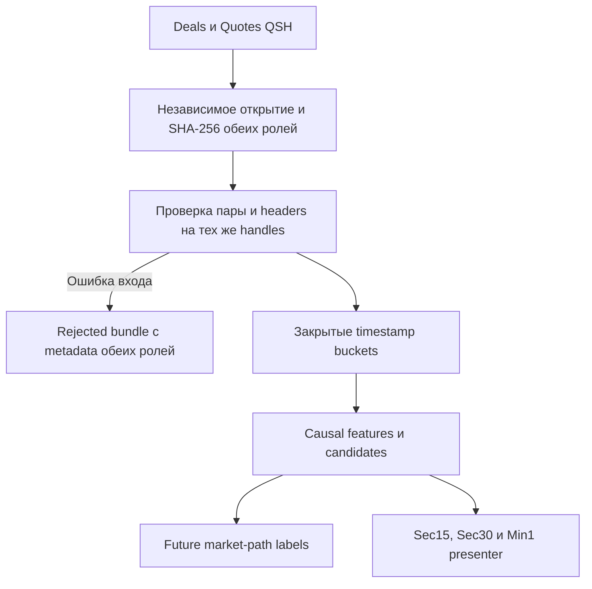
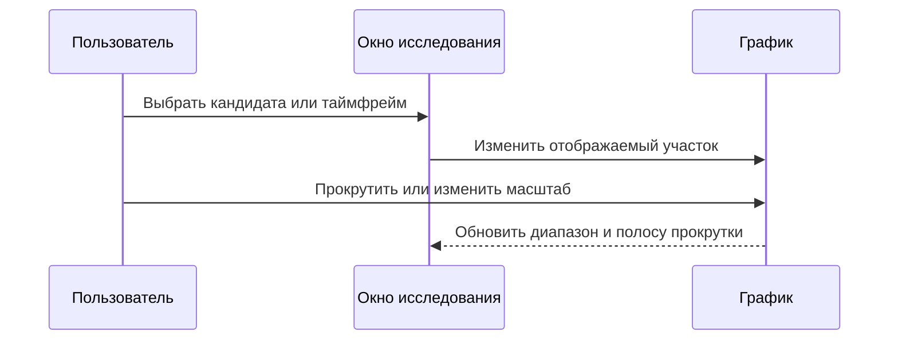

# ORDER-FLOW-MVP-RUNBOOK-001: первичная проверка Order Flow

**Статус:** CURRENT IMPLEMENTATION GUIDE — RESEARCH ONLY.

**Граница evidence:** workbench проверяет одну локальную пару QSH, причинные
признаки, broad candidates и будущий путь цены. Он не создаёт заявки, не
моделирует fill, не считает PnL и не подтверждает прибыльность или live parity.

## 1. Что реализовано

В OsData добавлен изолированный пункт `Order Flow`. Он запускает общий
single-consumer research flow:



Реализация находится в `OsEngine/OsData/OrderFlow/`. Existing Tester и его
модель исполнения этим MVP не изменены.

## 2. Что предоставляет пользователь

Для одного инструмента и торгового дня нужны:

- `<instrument>.<yyyy-MM-dd>.Deals.qsh`;
- `<instrument>.<yyyy-MM-dd>.Quotes.qsh`;
- локальная папка для результата;
- параметры одного `ResearchSpec`: окно признаков, минимальная абсолютная
  дельта, минимальное изменение цены против направления потока, глубина стакана,
  stale threshold, cooldown,
  горизонты labels и barriers.

Workbench читает QSH v4 в raw, GZip или Deflate форме. `PriceStep` берётся из
пятичастного instrument header, `VolumeStep` — из `VolumeStep` comment. Поля
ручного override оставляют пустыми, если header корректен. Override фиксируется
warning reason code и требует отдельной проверки владельцем.

В этой версии lot, `PriceStepCost`, валюта, комиссия, session calendar и
execution profiles не собираются. Поэтому даже принятый research replay не
готов к расчёту торгового результата.

### Параметры окна

Подсказка доступна при наведении на подпись или поле. Тик — один `PriceStep`;
порог 5 тиков при `PriceStep=1` равен 5 единицам цены.

| Поле интерфейса | Смысл и единицы |
|---|---|
| Окно сек | Скользящий интервал сделок назад для признаков. 180 / 540 / 1080 — 3 / 9 / 18 минут. Это не таймфрейм свечей. |
| Мин дельта | Минимальный абсолютный перевес BuyVolume − SellVolume; объём в единицах VolumeStep. Порог 100 допускает delta ≤ −100 для Long либо ≥ +100 для Short при выполнении условия цены. |
| Тики цены | Минимальное изменение цены против преобладающего потока: вверх для Long при отрицательной delta, вниз для Short при положительной delta. Ноль допускает удержание цены. Используются VWAP начального и текущего timestamp окна, не open/close свечи. |
| Уровни стакана | До N ближайших уровней с каждой стороны для дисбаланса объёмов. |
| Возраст стакана мс | Максимальный возраст предыдущего валидного стакана. 1000 мс = 1 секунда; превышение помечает BOOK_STALE, но diagnostic candidate сохраняется. |
| Пауза мс | Минимальный интервал между кандидатами одного направления. 5000 мс = 5 секунд; Long и Short имеют отдельный отсчёт. |
| Фон сек | Интервал сохранения фоновых наблюдений на доступных trade timestamps. Если в этот момент создан кандидат, отдельная background row не создаётся. Пропуски времени не заполняются синтетическими наблюдениями. |
| Горизонты сек | Отдельные интервалы вперёд от кандидата: 60;300;900 — 1, 5, 15 минут. Не меняют окно признаков. |
| Цель тики | Расстояние от candidate reference в благоприятную сторону: вверх для Long, вниз для Short. |
| Против, тики | Расстояние против кандидата: вниз для Long, вверх для Short. Прежняя подпись «Отмена тики» означала эту же границу, а не отмену заявки. |
| Шаг цены вручную | Подтверждённый размер тика вместо QSH metadata; пустое поле использует header. |
| Шаг объема вручную | Подтверждённый шаг объёма вместо QSH metadata; пустое поле использует comment. |

Цель и противоположная граница используются только для будущих labels.
Например, Long при reference 30000, шаге 1 и обоих порогах 5 проверяет
достижение 30005 и 29995. Заявки при этом не создаются.

## 3. Как запустить первичную проверку

1. Запустить OsEngine и открыть `Data` / OsData.
2. Нажать `Order Flow`.
3. Выбрать `Deals QSH`. Если парный Quotes-файл лежит рядом под ожидаемым
   именем, второе поле заполнится автоматически.
4. Проверить `Quotes QSH` и папку результатов.
5. Зафиксировать параметры эксперимента. Начальные значения UI являются только
   отправной точкой, а не доказанными торговыми порогами.
6. Нажать `Запустить` и дождаться terminal статуса.
7. Сначала прочитать `Сводку` и quality reason codes. Кандидаты нельзя
   интерпретировать, если результат имеет статус `ИССЛЕДОВАНИЕ ОТКЛОНЕНО` / `RESEARCH REJECTED`.
8. В таблице `Кандидаты` выбрать строку. Двойной клик открывает соответствующий
   участок графика; `Sec15`, `Sec30` и `Min1` меняют только отображение.
9. Сверить строку features, marker и `Журнал событий`.
10. Повторить запуск с теми же файлами и параметрами: event, feature и candidate
    hashes должны совпасть, а workbench должен переиспользовать идентичный
    immutable artifact bundle.

## 4. Как читать результат

### 4.1. Causal-признаки

Окно содержит Buy/Sell volume, delta, число сделок, изменение цены и response.
Reference price каждого timestamp bucket является VWAP его сделок, поэтому
перестановка Deals одного timestamp не меняет snapshot.
Spread, top-N imbalance и book age рассчитываются только по последнему
валидному стакану из **предыдущего закрытого bucket**. Финальный Quote текущего
timestamp становится доступен лишь следующему bucket.

Окно времени замкнуто с обеих сторон: для snapshot времени `T` остаются сделки
с `time >= T - FeatureWindowSeconds`. Все цены ниже выражены в абсолютных
единицах цены инструмента, объёмы — в декодированных единицах `VolumeStep`.

| Поле | Точная формула текущей схемы `order-flow-features-1` |
|---|---|
| `ReferencePrice` | `sum(price * volume) / sum(volume)` для сделок bucket `T` |
| `BuyVolume`, `SellVolume` | Сумма объёма соответствующей source side в окне |
| `Delta` | `BuyVolume - SellVolume` |
| `TradeCount` | Число валидных сделок в окне |
| `PriceChange` | `ReferencePrice(T) - VWAP(самого раннего timestamp bucket окна)` |
| `PriceResponse` | `0` при нулевой delta, иначе `PriceChange / abs(Delta)` |
| `Spread` | `BestAsk - BestBid` предыдущего валидного закрытого book bucket |
| `BookImbalance` | `(BidVolumeTopN - AskVolumeTopN) / (BidVolumeTopN + AskVolumeTopN)`; `0` при нулевой сумме |
| `BookAgeMilliseconds` | `T - BookTime` в миллисекундах; `-1`, если причинного book нет |

### 4.2. Candidate

Версия `flow-price-resilience-1` создаёт broad Long при
`Delta <= -MinimumAbsoluteDelta` и
`PriceChange >= MinimumPriceChangeTicks * PriceStep`. Short требует
`Delta >= MinimumAbsoluteDelta` и зеркальное отрицательное изменение цены.
При нулевом price threshold это соответствует удержанию/росту против sell flow.
Cooldown подавляет соседние дубликаты отдельно по каждому направлению.

Candidate — исследовательская гипотеза. В MVP нет confirmation, eligible signal,
trade intent, order или position. Неудавшийся Long не создаёт Short.

### 4.3. Future label

Для каждого заранее заданного горизонта отдельно рассчитываются signed return,
MFE, MAE, времена экстремумов и порядок `TargetFirst`, `InvalidationFirst`,
`AmbiguousSameTimestamp`, `Neither`, `NoFutureTrade` либо `Incomplete`.
Интервал будущего равен `(CandidateTime, CandidateTime + Horizon]`: сделки
candidate bucket не входят.

`SignedReturn` — абсолютное изменение цены со знаком направления от candidate
reference до VWAP последнего будущего bucket в горизонте; это не процент, не
тики и не PnL. MFE/MAE и barriers проверяют каждую отдельную будущую сделку.
Distance barrier равна `ticks * PriceStep`; времена хранятся в миллисекундах от
candidate. Значение `-1` означает, что соответствующий экстремум/barrier не
достигнут. Если target и invalidation встречаются в одном timestamp, их
внутренний порядок не считается известным и outcome равен
`AmbiguousSameTimestamp`, независимо от последовательности строк Deals-файла.
`Incomplete` означает, что данные закончились до конца горизонта;
`NoFutureTrade` — горизонт завершён без будущих сделок.

### 4.4. Визуализация

Сводка занимает высоту вкладки, начинается сверху и прокручивается до конца.
Подписи сводки локализованы; reason codes, исходные сообщения, пути и hashes
сохраняются без изменения.

На графике четыре панели с числовыми шкалами:

- **Цена / OHLC:** свечи выбранного display timeframe. OHLC строится по
  первой/последней сделке в стабильном порядке Deals-файла и отделён от VWAP
  causal feature. Свечи без сделок не добавляются; время из QSH без пересчёта.
- **Дельта свечи:** Buy − Sell только за отображаемую свечу. Она отличается от
  дельты скользящего окна в таблице кандидатов.
- **Отклик окна:** последний `PriceChange / abs(Delta)` окна в этой свече.
- **Дисбаланс стакана:** последний top-N imbalance в свече, от −1 до +1.
  Положительное значение означает перевес bid volume, отрицательное — ask.
  Красная подложка означает missing/stale. Missing разрывает линию;
  stale значение показано как диагностическое с предупреждением.

Наведение на свечу показывает время, OHLC, дельту, отклик и состояние стакана.
Колесо мыши над графиком и горизонтальная полоса прокрутки перемещают видимый
участок по всему файлу. Кнопки `Начало` / `Конец` открывают крайние свечи,
`+` / `−` меняют число видимых свечей, `Весь период` показывает весь файл.
Строка диапазона показывает видимое время и номера свечей относительно общего
количества. На маленьком окне вкладка также прокручивается вертикально.
Выбор timeframe сохраняет середину видимого участка по времени; полный обзор
остаётся полным. Выбор строки центрирует кандидата, затем ручная прокрутка
не возвращается к нему при перерисовке. `К кандидату` возвращает выбранную метку.

Треугольник вверх — Long, вниз — Short. Цвет отражает **будущий** исход по
самому короткому горизонту, указанному в легенде: зелёный — TargetFirst,
красный — InvalidationFirst, жёлтый — AmbiguousSameTimestamp, синий — Neither,
серый — Incomplete/NoFutureTrade или отсутствие label. Золотой контур отмечает
выбранного кандидата. В одной свече метки могут перекрываться; точные времена
доступны в таблице и выбранной строке под графиком. Цвет не является причинным
признаком или торговым допуском. Выбор timeframe, строки, масштаба и прокрутка
не вызывают новый расчёт ядра.



## 5. Artifact bundle

Папка имеет deterministic identity из trading date, input hash и ResearchSpec
hash. Input hash включает роли `Deals`/`Quotes`, канонические semantic filenames
и SHA-256 точных хранимых bytes; переименование поэтому создаёт новую identity.
При отказе подготовки роли в input identity дополнительно входит её reason code.
Parser `qsh-v4-paired-2` и artifact schema `order-flow-research-artifacts-2`
отделяют новые bundles от предыдущей версии. Каждый файл открывается один раз:
SHA-256 и decoding используют тот же handle, удерживаемый до завершения replay.
На Windows `FileShare.Read` запрещает запись и замену открытого файла.

Observation key включает полные `InputHash` и `ResearchSpecHash`, дату snapshot,
bucket sequence, observation type, detector version и direction. Изменение
ResearchSpec меняет ключи candidate и background rows, даже если конкретные
значения признаков совпали. `CandidateId` и `SnapshotId` остаются локальными
для bundle; между экспериментами строки связываются по observation key.
Если папка уже существует, новый результат сравнивается побайтово; иной контент
не перезаписывает прежний bundle.

| Файл | Содержание |
|---|---|
| `manifest.json` | Версии схем, QSH metadata/checksums, параметры и replay hashes |
| `quality.json` | Acceptance, counters и reason codes |
| `observations.csv` | Только causal features и identity |
| `candidates.csv` | Broad candidate identity/reason, без future outcome |
| `market-path-labels.csv` | Только будущий market path по candidate ID |
| `event-journal.csv` | Quality/candidate/label audit trail |
| `bars-sec15.csv`, `bars-sec30.csv`, `bars-min1.csv` | Те же diagnostic данные в display buckets |

Раздельные CSV не являются разрешением автоматически присоединять labels к
feature vector. Любой последующий анализ обязан сохранять разделение из
`ORDER-FLOW-RESEARCH-001`.

## 6. Reason codes и отказ

Стабильные rejection codes текущей схемы:

| Коды | Значение |
|---|---|
| `PAIR_FILE_INSTRUMENT_MISMATCH`, `PAIR_TRADING_DATE_MISMATCH` | Семантические имена пары расходятся |
| `PAIR_HEADER_INSTRUMENT_MISMATCH`, `PAIR_FILE_HEADER_INSTRUMENT_MISMATCH`, `PAIR_STEP_MISMATCH` | Header пары либо filename/header identity несовместимы |
| `PAIR_TIME_RANGES_DISJOINT` | Фактические Deals/Quotes ranges не пересекаются; без session metadata такая пара отклоняется |
| `QSH_FILE_MISSING`, `QSH_ACCESS_DENIED` | Выбранный файл/каталог отсутствует либо доступ к чтению запрещён |
| `QSH_INVALID`, `QSH_IO_ERROR`, `QSH_NUMERIC_OVERFLOW` | Неподдерживаемый, обрезанный, malformed либо численно некорректный QSH |
| `DEAL_TIME_REGRESSION`, `QUOTE_TIME_REGRESSION` | Время соответствующего source идёт назад |
| `DEAL_SIDE_UNKNOWN`, `DEAL_VALUE_INVALID` | Нет source Buy/Sell либо цена/объём неположительны |
| `DEALS_EMPTY`, `QUOTES_EMPTY`, `QUOTES_NO_VALID_BOOK` | Нет обязательного потока либо ни одного валидного двухстороннего book |

Ошибки открытия, хеширования и header decoding каждой роли обрабатываются
независимо: отказ Deals не мешает собрать header Quotes и наоборот. Rejected
bundle содержит обе роли, доступные filename/size/SHA-256/header fields и
`FailureReasonCode`. `HeaderComplete` истинен только после всех header checks;
непрочитанные поля partial header не являются подтверждённой metadata. Для
неоткрытого файла `FileSize` и `Sha256` равны `null`. Ошибка header запрещает
replay всей пары, поэтому counts остаются нулевыми. Пустые поля пути и неверные
числовые настройки остаются ошибками request validation без bundle; ошибка
записи output также не гарантирует artifact. Отмена запуска распространяется
как cancellation без rejected bundle.

Warnings: `QSH_STEP_OVERRIDE` требует ручной проверки шага;
`EXECUTION_METADATA_NOT_COLLECTED` напоминает, что PnL недоступен;
`BOOK_EMPTY`, `BOOK_CROSSED_OR_LOCKED`, `BOOK_INVALID_LEVEL` исключают отдельный
snapshot, но не всю пару, пока остаётся хотя бы один валидный book. Feature
quality принимает `OK`, `BOOK_NOT_CAUSALLY_AVAILABLE` либо `BOOK_STALE`.
Journal дополнительно использует `CANDIDATE_COOLDOWN`, candidate reasons
`SELL_FLOW_PRICE_RESILIENCE`/`BUY_FLOW_PRICE_RESILIENCE` и terminal
`RESEARCH_ACCEPTED`/`RESEARCH_REJECTED`.

Пустой, locked/crossed или некорректный отдельный стакан получает warning,
исключается из обновления причинно доступного book state и увеличивает возраст
последнего валидного снимка. Кандидат при missing/stale book остаётся видимым с
соответствующим quality code, чтобы пользователь мог оценить проблему, а не
получить молчаливое заполнение. В текущем diagnostic DTO `BookAvailable` означает
наличие предыдущего валидного book: при stale его spread/imbalance сохраняются
для разбора вместе с `BookStale=true` и `BOOK_STALE`. Это не допуск устаревших
значений в будущую торговую policy; target data contract требует исключать их
из пригодных для решения признаков.

## 7. Offline verification

Synthetic test stand создаёт временные QSH пары во время запуска и удаляет их
после завершения. Raw market data в Git не добавляются.

Из каталога `project/`:

```bash
dotnet run --project Tests/OrderFlowResearch/OsEngine.OrderFlowResearch.Tests.csproj
dotnet build OsEngine/OsEngine.csproj
dotnet build OsEngine.sln
```

Сценарии проверяют causal previous-book association, зеркальные Long/Short,
deterministic repeat, same-timestamp Quote/Deal/barrier invariants, source-order
display OHLC, изменение только future labels при изменении suffix, filename
identity и canonical case-variant reuse, disjoint ranges, malformed quote count, отказ
mismatched/unknown-side/truncated данных, разделение CSV, GZip и Deflate input.
Дополнительные regressions проверяют missing/locked/malformed-header bundles,
metadata обеих ролей и содержимое manifest/quality JSON, удержание input handle,
разные observation keys при смене ResearchSpec, точные формулы spread/response/
top-N, границы окна и book age, а также отсутствие Short после adverse Long label.
Два UI regression-сценария проверяют summary layout/scroll с настоящим
implicit TextBox style из App.xaml, сохранность строк на двух языках и доступ
ко всей истории при прокрутке, zoom, selection и смене timeframe. Они работают
на STA без Application/Window и не запускают OsEngine.
Версия detector проверяется в составе ключа; её compile-time замена отдельным
исполняемым сценарием не моделируется. Эти тесты не
заменяют прогон реального полного дня, визуальную сверку владельцем и будущую
квалификацию execution model.

## 8. Что намеренно не реализовано

- копирование QSH в OsData `Set` и массовый multi-day import;
- полная instrument/session/cost card и temporal split/purge registry;
- confirmation/invalidation/expiry state machine и frozen StrategySpec;
- Tester/Optimizer paired mode;
- orders, latency, liquidity ledger, partial fills, commission и PnL;
- robot, risk, shadow, paper и live adapters;
- экономический `go/no-go`.

Следующий этап не должен превращать diagnostic outcome в сделку. Сначала на
реальных owner-файлах закрываются data/replay/features acceptance и только
после этого отдельно реализуется execution model из `ORDER-FLOW-EXECUTION-001`.
