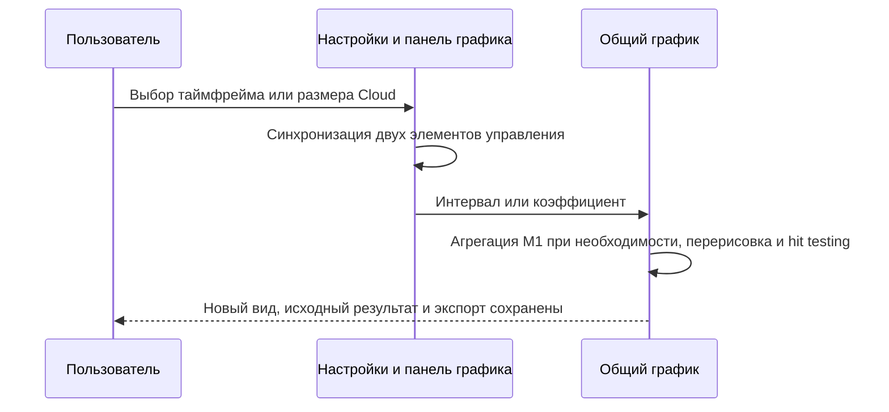
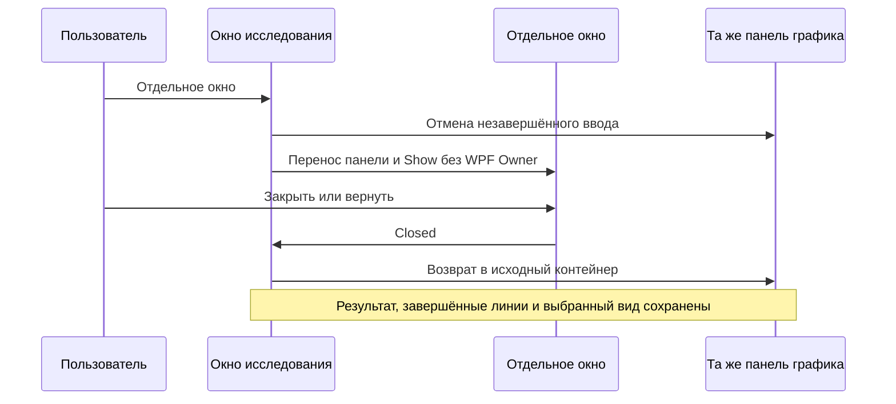
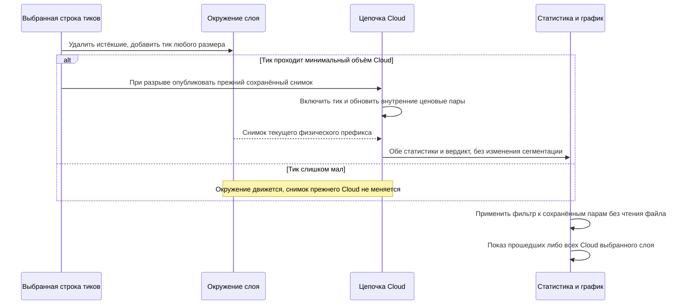
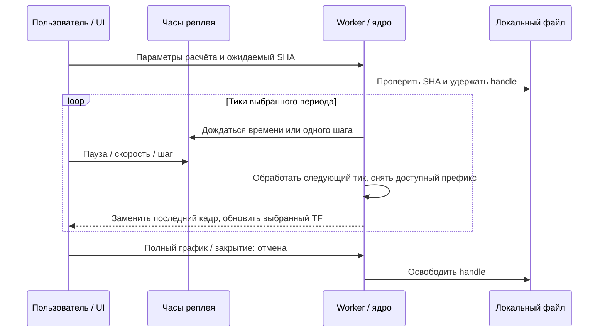
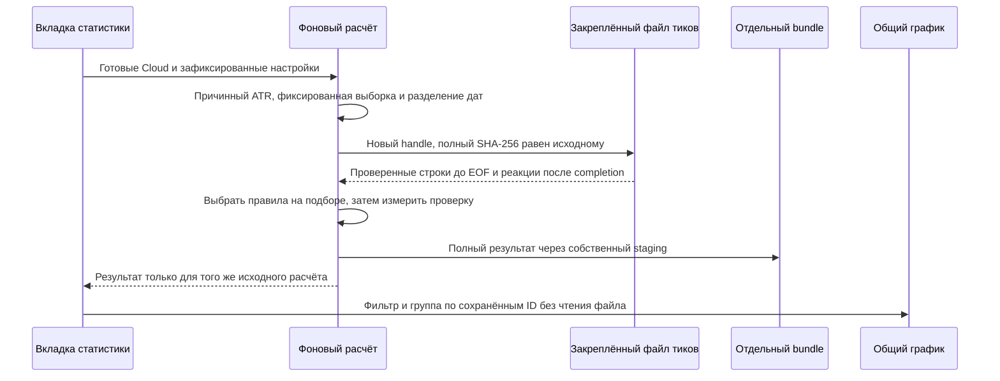
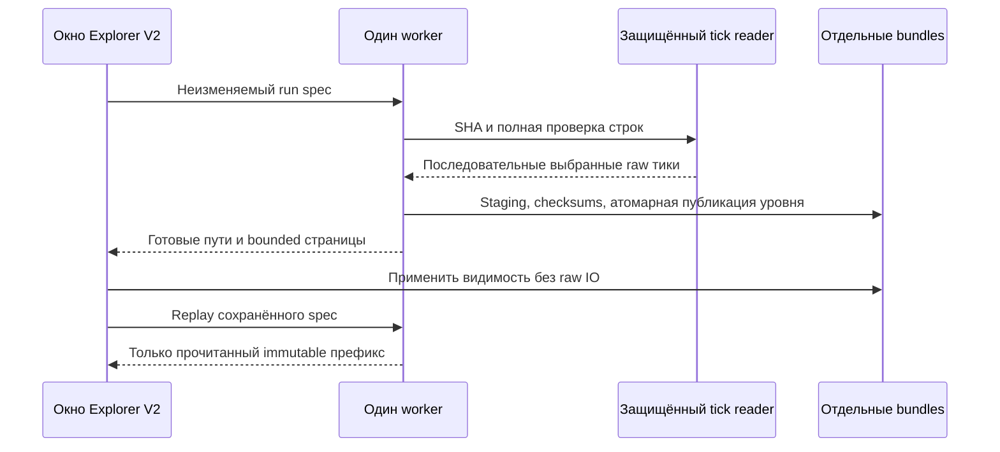

# ORDER-FLOW-MVP-RUNBOOK-001: первичная проверка Order Flow

**Статус:** CURRENT IMPLEMENTATION GUIDE — RESEARCH ONLY.

Workbench в OsData исследует локальные тики: цену, дельту и реакцию цены на
поток сделок, а также Cloud-цепочки объёма. Дельта, Cloud 1 и Cloud 2 включаются независимо.
Дельта создаёт broad candidates и отдельные будущие market-path labels.
Заявки, fill и PnL не рассчитываются; торговая прибыльность не подтверждается.

## 1. Что реализовано

Код: [OrderFlowResearchEngine](../../OsEngine/OsData/OrderFlow/OrderFlowResearchEngine.cs),
[расчёты](../../OsEngine/OsData/OrderFlow/OrderFlowResearchCalculations.cs),
[reader](../../OsEngine/OsData/OrderFlow/OrderFlowTickReader.cs).
Вход — один локальный UTF-8 файл одного инструмента:

```text
Date,Time,Price,Volume,Side,MicroSeconds,Id
20260918,100000,100.00001,2,Buy,123456,trade-id
```

Заголовок необязателен. Полная схема, порядок, ошибки и семантика микросекунд
описаны только в [контракте данных](DATA_REPLAY_CONTRACT.md#1-формат-локального-файла).
Файлы пользователь загружает самостоятельно. Сетевого загрузчика в Order Flow
нет; стакан и его показатели исключены. Другие режимы данных OsEngine не меняются.

## 2. Параметры

Кнопка **Order Flow** в коде OsData открывает одно окно через `Show()`.
Повторное нажатие восстанавливает свёрнутое окно исследования и активирует его.
Свободное переключение и ввод при открытом Cloud ещё не прошли ручную приёмку;
сохраняющийся дефект отложен в [технический долг](TECHNICAL_DEBT.md).
Закрытие OsData явно закрывает Order Flow, Cloud Explorer и графики,
отменяя выполняемую исследовательскую работу.

Тик цены — один вручную заданный `PriceStep`. При шаге 0,00001 расстояние
5 тиков равно 0,00005; при шаге 5 — 25. Объём используется как записан в файле.

| Поле | Смысл |
|---|---|
| Файл тиков | Локальный `.txt`/`.csv` выбранного инструмента; имя служит его обозначением |
| Папка результатов | Место неизменяемых JSON/CSV bundles |
| Период: начало / конец | Обе даты включительно. Оба поля намеренно пустые — весь файл; кнопка «Весь файл» очищает период. Одно пустое или конец раньше начала — ошибка |
| Шаг цены | Обязательный положительный decimal, например `5`, `0,00001` или `0.00001`; значение не угадывается |
| Окно сек | Сделки за последние N секунд: 180 / 540 / 1080 = 3 / 9 / 18 минут. Не таймфрейм графика |
| Мин дельта | Порог абсолютной разницы BuyVolume − SellVolume в исходных единицах объёма |
| Тики цены | Минимальное движение цены против преобладающего потока, в PriceStep; ноль допускает удержание цены |
| Пауза мс | Минимальный интервал между кандидатами одного направления; Long и Short имеют отдельные таймеры |
| Фон сек | Интервал фоновых snapshots по доступным timestamp; новый candidate заменяет фон того же времени |
| Горизонты сек | Сколько смотреть вперёд от кандидата, например `60;300;900`. Отдельный label на каждый горизонт |
| Цель тики | Благоприятная дистанция от опорной цены: вверх для Long, вниз для Short |
| Против, тики | Неблагоприятная дистанция: вниз для Long, вверх для Short; это исследовательская граница |

Подсказки с назначением, единицами и способом применения доступны у всех полей
Delta/Cloud, кнопок, заголовков и ячеек таблиц, в том числе у отключённых полей.
Перенесённая в отдельное окно панель сохраняет те же подсказки. Начальные значения — параметры эксперимента,
а не выбранная торговая политика. При выборе нового файла через диалог поле
шага цены очищается. Перед каждым запуском проверьте шаг и период.
Если неверная дата была стёрта самим календарным полем, ошибка всё равно
блокирует запуск. Исправьте дату вводом/выбором или явно нажмите `Весь файл`.

Настройки разделены на вкладки `Дельта`, `Cloud`, `Cloud 2`, `График`. Отметьте
`Рассчитать дельту`, `Рассчитать Cloud 1`, `Рассчитать Cloud 2` в любой непустой комбинации. Неактивный расчёт не исполняется;
его поля не требуют ввода. Шаг цены и период общие. На вкладке `График` можно
скрывать уже рассчитанные слои без повторного чтения файла. Изменение параметров
расчёта вступает в силу только после нового запуска. Фильтры показа Cloud применяются
отдельной кнопкой без запуска расчёта. Вкладка результатов `Статистика` содержит
[исследование реакций завершённых Cloud](#47-статистика-реакций-cloud).

## 3. Как запустить

1. Открыть OsEngine → Data / OsData → `Order Flow`.
2. Выбрать локальный файл тиков и папку результатов.
3. Указать шаг цены и при необходимости обе даты периода.
4. Выбрать расчёт дельты и/или любого из двух Cloud, настроить соответствующие вкладки; нажать `Запустить`.
5. Дождаться завершения. Полностью проверяется весь файл, даже при узком периоде.
6. Прочитать `Сводку`: acceptance, выбранные ticks и время, число прочитанных
   source ticks, полный прочитанный диапазон, candidates, hashes и reason codes.
   При `ИССЛЕДОВАНИЕ ОТКЛОНЕНО` частичные результаты не интерпретируются.
7. В `Кандидатах` выбрать строку; двойной клик открывает её на графике.
8. Сверить точное время, окно дельты, цену и журнал. Повторить с теми же
   параметрами для проверки воспроизводимости.

Вне дат нет ни прогрева окна, ни дополнения будущих labels. Начальное окно
может быть короче заданной длительности. Полночь не сбрасывает окно/cooldown;
сессии и клиринги автоматически не распознаются. Длинный разрыв без тиков не
создаёт искусственных свечей или сделок.

## 4. Как читать результат

### 4.1. Причинные признаки

На закрытом timestamp `T` окно включает сделки `[T − WindowSeconds, T]`.

| Поле схемы `tick-flow-features-2` | Формула |
|---|---|
| ReferencePrice | VWAP всех сделок текущего timestamp: Σ(price × volume) / Σ(volume) |
| BuyVolume / SellVolume | Суммы исходного объёма соответствующей стороны в окне |
| Delta | BuyVolume − SellVolume |
| TradeCount | Количество тиков в окне, включая повторяющиеся Id |
| PriceChange | Текущий VWAP − VWAP самого раннего timestamp окна |
| PriceResponse | PriceChange / abs(Delta); при Delta=0 используется 0 |

Цены/отклонения выражены в единицах цены, не в процентах и не в деньгах PnL.
У каждого принятого snapshot `DataQualityCode=OK`: это соответствие импортному
контракту, не подтверждение полноты биржевого источника или торговый допуск.

### 4.2. Кандидат

`flow-price-resilience-1`: Long требует `Delta <= −MinimumAbsoluteDelta` и
`PriceChange >= MinimumPriceChangeTicks × PriceStep`. Short зеркален:
`Delta >= MinimumAbsoluteDelta`, `PriceChange <= −MinimumPriceChangeTicks × PriceStep`.
При нулевом пороге цены удержание допустимо. Проверка идёт после каждого
закрытого timestamp, а не после каждой свечи. Cooldown отдельно подавляет
соседние Long и Short. Failed Long не создаёт Short.

Это простая гипотеза расхождения дельты и реакции цены; swing/pivot divergence,
confirmation, intent, order и position не реализованы.

### 4.3. Будущий label

Интервал `(CandidateTime, CandidateTime + Horizon]` исключает собственный
bucket кандидата. SignedReturn — изменение до VWAP последнего будущего bucket
со знаком направления. MFE (≥0) и MAE (≤0) проверяют каждую отдельную сделку.
Дистанция барьера = ticks × PriceStep. Задержки до экстремумов/барьеров
сохраняются в **микросекундах**, `-1` означает отсутствие достижения.

| Outcome | Значение |
|---|---|
| TargetFirst | Благоприятный барьер достигнут раньше противоположного |
| InvalidationFirst | Неблагоприятный барьер первым |
| AmbiguousSameTimestamp | Оба барьера впервые достигнуты в одном эффективном timestamp; порядок строк не используется |
| Neither | Есть будущие сделки, но ни один барьер не достигнут |
| NoFutureTrade | Horizon истёк внутри наблюдаемого периода, сделок в нём не было |
| Incomplete | Последний выбранный тик раньше конца horizon, даже если барьер уже был достигнут |

Различные микросекунды сохраняют порядок. Эти исходы описывают рыночные цены,
не исполнения и не прибыль.

### 4.4. График и сводка

Сводка многострочная и прокручивается, показывает включённые расчёты и число Cloud.
График один; при включённом слое рассчитанной дельты он имеет три панели:

- **Цена / OHLC**: первая/последняя сделка по порядку файла и экстремумы свечи.
- **Дельта свечи**: Buy − Sell за отображаемую свечу; отличается от дельты окна кандидата.
- **Отклик окна**: последний PriceResponse окна в этой свече.

При выключенном слое дельты ценовая панель занимает всю высоту.
Выбор таймфрейма доступен прямо над графиком и во вкладке настроек `График`;
оба переключателя синхронизированы. Доступен 21 интервал: 15/30 секунд,
1/2/3/5/10/15/20/30/45/60 минут, 2/3/4/6/8/12 часов, день, неделя и месяц. Старшие собираются
из M1 в кэше графика: OHLC, суммы объёма/дельты и последний отклик. Расчёт
признаков/кандидатов не меняется. Границы привязаны к исходным календарным
часам без пересчёта зоны; H4 начинается в 00/04/08/12/16/20 часов.
D1 начинается в 00:00, W1 — в понедельник 00:00; месяц — первого числа в 00:00
и заканчивается в начале следующего календарного месяца. Учитываются длина
месяца и високосный год; пустые интервалы пропускаются.
Неполные крайние свечи не означают наличие данных за полный интервал.

Колесо меняет масштаб у курсора. `Shift + колесо`, перетаскивание графика или
полоса прокрутки перемещают участок. Нижняя временная шкала показывает дату
и время; её перетаскивание меняет горизонтальный масштаб. `Начало`, `Конец`,
`+`, `−`, `Весь период` и `К кандидату` помогают навигации. В строке диапазона
видны даты обоих концов и номера свечей. Все свечи одинаковой ширины; пустые
интервалы пропущены. После выбора кандидата ручная прокрутка не сбрасывается.

Изменения отображения применяются в UI-потоке к уже рассчитанному результату:



Треугольник вверх — Long, вниз — Short. Цвет отражает **будущий** outcome
самого короткого horizon: зелёный TargetFirst, красный InvalidationFirst,
жёлтый AmbiguousSameTimestamp, синий Neither, серый Incomplete/NoFutureTrade
или отсутствие label. Золотой контур — выбранный кандидат. Метки в одной
свече могут перекрываться; точное время с микросекундами есть в таблице.

#### Отдельное окно

Кнопка **«Отдельное окно»** переносит график вместе с панелью управления,
рисованием, прокруткой и подписями в отдельное немодальное окно. Его можно
развернуть или переместить на другой монитор.
Это тот же график: текущий участок,
таймфрейм, размер Cloud и рисунки сохраняются. Повторный расчёт не запускается.

Крестик окна или **«Вернуть в основное окно»** возвращает панель назад. В основном
окне кнопка **«Показать окно графика»** активирует уже открытое окно. Двойной клик
кандидата/Cloud также выводит его вперёд. Закрытие исследовательского окна закрывает
и отдельное окно графика. Новый результат отображается там, где график сейчас открыт.



#### Свободное поле и ценовая сетка

Ползунок **«Поле справа, %»** резервирует 0–90% ширины ценовой панели,
по умолчанию **5%**. Это свободное место после видимых данных, а не сутки
и не фиктивные свечи. Свечи, Cloud и вершины линий используют одну временную
шкалу; в свободной зоне можно рисовать. Подсказки свечей там нет. Полоса
прокрутки по-прежнему охватывает все реальные свечи, включая реплей.
Горизонтальная сетка продолжается через свободное поле; её decimal-цены
подписаны слева с теми же уровнями. Размер поля сохраняется в открытом окне.

#### Рисование линий

В панели **«Рисование»** выберите **«Горизонтальная»** или **«Наклонная»**,
затем укажите две точки с разным временем на ценовой панели. Горизонтальная линия сохраняет цену
первой точки, вторая задаёт другой конец по времени. Наклонная соединяет обе
цены. После второй точки выбранный инструмент остаётся активным: можно сразу
рисовать следующую линию. До завершения линия пунктирная; **Esc** отменяет
незавершённый ввод и явно возвращает **«Выбор / прокрутка»**.

- Клик по линии выбирает её. Перетаскивание за середину переносит обе точки
  вместе, сохраняя наклон на текущем графике; за концы — меняет форму.
  Перенос работает и при активном инструменте рисования, пока новая линия не начата.
  На оси со сжатыми пропусками сохраняется расстояние в свечах и разность цен,
  а не одинаковый сдвиг обеих дат в секундах.
- **«Цвет»** открывает штатную палитру. **«Толщина»** — от 1 до 6 условных пикселей WPF.
- **«Продолжить влево/вправо»** превращает отрезок в луч или бесконечную прямую,
  обрезанную ценовой панелью. Направление определяется временем, а не порядком кликов.
- Изменение оформления применяется к выбранной линии и становится настройкой новых линий.
- **«Удалить линию»** или **Delete** при фокусе на графике удаляет выбранную линию;
  **«Очистить линии»** удаляет все. В режиме «Выбор / прокрутка» перетаскивание пустого места прокручивает график.

Точки хранят исходное время и decimal-цену без округления к шагу инструмента.
Завершённые рисунки переживают zoom, прокрутку, смену таймфрейма и перенос окна.
При смене таймфрейма/слоёв/правого поля или переносе окна незавершённая линия
отменяется; выбранный инструмент сохраняется.
Пропуски данных на оси сжаты: время в пропуске отображается на границе следующей
имеющейся свечи. Если обе точки попали в один X, показывается конечный вертикальный
отрезок; продолжение влево/вправо для него не определяется. Совпавшие точки дают точку.

Рисунки временные: установка нового результата и закрытие исследования удаляют их.
В JSON/CSV они не сохраняются, расчёты и hashes не меняют. Это пользовательские
пометки, не торговые сигналы или заявки.

#### Вид цены и график по Cloud

Поле **«Вид»** переключает отображение без повторного расчёта:

| Вид | Отображение |
|---|---|
| Свечи | Тело Open–Close и тень High–Low |
| Бары OHLC | Вертикаль High–Low, Open слева и Close справа |
| Линии High/Low | Две ломаные по максимумам и минимумам последовательных свечей |
| Серые High/Low | Те же две ломаные приглушённым серым цветом, как фон режима Cloud; без включения Cloud-ломаной |

Флажок **«График по Cloud»** показывает High/Low выбранного таймфрейма приглушённым
серым фоном, а поверх — отдельные ломаные включённых слоёв: голубую для Cloud 1
и фиолетовую для Cloud 2, через **Time/Price каждого Cloud** своего слоя, то есть
через цены кружков на последних тиках цепочек. Между соседними Cloud проводится
отрезок, в том числе когда внутри видимого участка нет Cloud. Перед первым и
после последнего Cloud линия не продолжается.

Это независимость вершин от свечей: Cloud не группируются по таймфрейму и не
прореживаются, но сохраняют исходное время на общей оси со сжатыми пропусками.
Это не равноудалённый событийный график и не автоматический zigzag. При одинаковом
времени порядок Cloud сохраняется, возможен вертикальный отрезок. Вершины используют
итоговую цену Cloud, не Qualified/VWAP и не High/Low внутри цепочки.

Нужен выполненный расчёт Cloud. При отсутствии облаков появляется пояснение,
остаётся серый фон. «Показать Cloud 1/2» во вкладке «График» и флажки
«Cloud 1/2» над графиком независимо скрывают весь слой: кружки, подсказки и его
ломаную. Включение отображения требует предварительно рассчитанного слоя.
Переключение видимости не пересчитывает данные. Отключение «График по Cloud» возвращает ранее выбранный вид цены.
Режимы и рисунки доступны также в отдельном окне. Эта историческая визуализация
не создаёт новые Cloud, признаки или торговые сигналы и не меняет экспорт.

### 4.5. Cloud: цепочки сделок

Код ядра: [OrderFlowClouds.cs](../../OsEngine/OsData/OrderFlow/OrderFlowClouds.cs).
Основание — [официальное руководство SBProX Clouds](https://www.manula.com/manuals/sbprox/sbprox-8/1/ru/topic/5-4-1-clouds),
прочитанное 22.09.2026. Описанный там принцип: отбор тиков по объёму,
ограничение соседней паузы и общего ценового размаха, затем проверка суммы;
фигура привязана к последнему тику цепочки. Это самостоятельная реализация
публичного описания, **не доказанная идентичность закрытому коду SBProX**.

Локальная версия `tick-cloud-chain-4` реализует базовый MVP: максимальную
цепочку отобранных тиков с ограниченными соседней паузой и общим размахом.
Предоставленный владельцем проект ADR о Clouds имеет статус PROPOSED и не
заменяет действующий контракт импорта. В частности, техническое поле Id полностью
игнорируется по указанию владельца; разрешены только Buy/Sell; Unknown отклоняется.
PriceStep задаёт дистанции, но импорт не проверяет кратность всех цен его сетке.

| Настройка | Расчёт и границы |
|---|---|
| Мин. объём тика / Tick Limit | Учитываются только `Volume >= min`; объёмы исходные, без множителя |
| Мин. сумма / Summ Limit | Суммарный объём цепочки должен быть не меньше порога |
| Пауза, мс / Delay | Между соседними прошедшими отбор тиками, включительно; `0` допускает одинаковые timestamps |
| Диапазон, тики / Range | `max(Price) − min(Price)` всей цепочки не превышает `RangeTicks × PriceStep`; `0` требует одну цену |

Отброшенные по размеру тики не изменяют время, цену, объём или VWAP цепочки.
Тик, нарушивший паузу или размах, завершает старую цепочку и начинает новую;
при обоих нарушениях reason=`Gap`. Достижение суммы само по себе цепочку не
закрывает. Buy и Sell могут входить в одну цепочку. Порядок строк, включая
одинаковое время/Id, сохраняется; календарного сброса нет. За пределами
выбранных дат цепочка не дополняется.

При первом достижении минимальной суммы фиксируется отдельный **Qualified**
snapshot: время и source ordinal тика, цена, Low/High, сумма и Buy/Sell volume,
число тиков и VWAP только уже включённого префикса. Позднейшие тики этот
снимок не меняют. Это единственные Cloud-поля, пригодные для анализа в момент
квалификации; итоговые поля цепочки на это время ещё неизвестны.

Итог содержит First/Last source ordinal (номера тиков, не поле Id), времена начала
и последнего тика, First/Last/Low/High price, объём и число сторон, Delta,
максимальный тик, VWAP, размах в цене/тиках, изменение цены и длительность.
`Kind=SingleTrade` означает один тик в итоговой цепочке; `Accumulated` — два
или больше. Это классификация результата, не отдельный режим сегментации.
`UnknownVolume=0`, поскольку импорт Unknown не поддерживает. Цены и объёмы
считаются decimal без округления к биржевой сетке.

`Time`/`Price` метки — последний включённый тик. `CompletedAt` и
`CompletionSourceSequence` — следующий подходящий тик, установивший разрыв.
Последняя цепочка получает `OpenAtEnd`, пустой CompletedAt и пунктирный контур;
она экспортируется при достаточной сумме, но окончание файла не доказывает
рыночного завершения. Это относится и к одиночной цепочке. Таймера live timeout
в offline-модуле нет. `CloudId` включает первый/последний SourceSequence и
уникален лишь внутри bundle; между запусками используйте также InputHash и
ResearchSpecHash. Cloud не создаёт Delta candidate или future label.

#### Второй слой и одиночные тики

Cloud 2 имеет отдельные параметры и по умолчанию выбран режим **«Одиночные тики»**
с порогом объёма 1000 (его можно изменить). Каждая физическая строка с объёмом
**не ниже** порога сразу создаёт отдельный Cloud. Совпавшее время и одинаковый
технический Id не объединяют сделки. Мелкие тики не накапливаются.
`Qualified`, якорь и `CompletedAt` относятся к самой сделке;
`CompletionSourceSequence=LastSourceSequence`, `CompletionReason=SingleTick`.
Нет ожидания следующей сделки, `Forming` или `OpenAtEnd`.

Сумма цепочки, пауза и диапазон в этом режиме неактивны и не парсятся; effective
settings нормализуются к сумме=порогу тика, паузе=0 и диапазону=0. Снятие флажка
включает второй независимый расчёт цепочек по правилам выше. Cloud 1 остаётся
цепочечным расчётом. Переключатели «Рассчитать» определяют следующий запуск,
переключатели отображения управляют уже рассчитанными слоями. Возможны один любой
Cloud, оба вместе и любое сочетание с дельтой. Отключённые настройки не проверяются.
Слои читают один поток, имеют отдельные таблицы, hashes и CSV; ID второго начинаются
с `CL2-`. Изменение Cloud 2 не меняет признаки дельты или Cloud 1, но меняет общую
ResearchSpecHash и зависящие от неё observation identity/CandidateHash.

На общем графике Cloud 1 — полупрозрачные круги, Cloud 2 — кольца с толстым контуром; зелёный означает больше тиков
Buy, красный — Sell, синий — равенство. Это цвет по **числу**, а не объёму тиков;
в подсказке отдельно показаны объёмы и процент `100 × (BuyCount − SellCount) / TradeCount`.
Фактические котировки Ask/Bid не восстанавливаются. Размер — собственное визуальное
преобразование, не SBPro rating и не пропорциональная объёму площадь круга.
Радиус в WPF-единицах равен `size × (4 + 20 × log2(1 + (Volume/reference)^contrast))`.
В обычном историческом просмотре `reference` — медиана положительных объёмов
**всего установленного результата соответствующего слоя**, рассчитанная один раз по копии. Она не
меняется при прокрутке, масштабе оси или выборе TF. Между разными периодами
радиусы напрямую не сравниваются: медиана может отличаться.

- **Размер Cloud**: общий множитель `size`, **0,1×..3×**, по умолчанию 1×.
  Значение 2× удваивает все радиусы и области наведения одинаково.
- **Контраст Cloud**: степень `contrast`, **0,5..10**, по умолчанию 2.
  Повышение усиливает различия объёмов относительно опорного значения.
  При медиане 750, size=1 и contrast=2 радиусы объёмов 500/1000 примерно
  14,6/33,5; жёсткого верхнего ограничения для больших объёмов нет.
- **Объёмы Cloud**: по умолчанию включены. Точное значение печатается, если
  подпись помещается внутри видимой части круга и ценовой панели. Маленькие
  круги остаются без подписи; при перекрытии подписи могут накладываться.

Размер, контраст и подписи каждого слоя независимы. При перекрытии наведение
выбирает Cloud 2, нарисованный поверх Cloud 1. Формула радиуса вычисляется
в устойчивой логарифмической форме без переполнения на contrast=10.
Размер и контраст доступны над графиком и во вкладке настроек `График`,
синхронизируются также в отдельном окне. Подсказка контраста показывает опорный
объём. В реплее используется заранее известная минимальная сумма цепочки
или порог одиночного тика отдельно для каждого слоя вместо
медианы будущего результата (см. следующий раздел). Настройки визуализации
сохраняются между расчётами в открытом окне; не меняют фильтры, hashes и экспорт.
Одиночный Cloud с `TradeCount=1` рисуется **квадратом**, в том числе в режиме
цепочек; накопленный Cloud — кругом. Масштаб/контраст и подписи объёма применяются
к обоим видам. Наведение учитывает полную квадратную область одиночной метки.
Метки могут перекрываться; все записи доступны в таблице и через её контекстное меню.

Completion metadata, pixel scale и процент для подсказки — явные локальные
правила; не заявляется идентичность закрытому SBProX. Дополнительные фильтры
Detection/MaxTick, специальные режимы одинаковых/дублирующихся тиков
и Smart не реализованы в базовом MVP. Формула Smart в руководстве
не раскрыта. Режимы со спредом невозможны на данном входе без котировок.

#### Перевес объёма и диагональный фильтр

В настройках **каждого** слоя раскройте **«Imbalance / Перевес»**. Оба варианта
статистики вычисляются всегда при включённом расчёте Cloud:

| Источник | Включённые сделки |
|---|---|
| Внутри Cloud | Только тики данной цепочки, прошедшие её минимальный объём тика |
| Окружающий поток | Все выбранные по датам тики в `[время якоря − окно, время якоря]`, включая текущую строку и мелкие сделки ниже порога Cloud |

Окно окружения задаётся отдельно для каждого слоя в секундах, по умолчанию 30.
Это параметр формирования сохранённых данных вне блока фильтров: его изменение,
как и изменение шага цены/параметров цепочки, требует кнопки `Запустить`.
Оно не зависит от свечей и окна признаков дельты. Начальное окно может быть
неполным; сделки до выбранной даты не используются. При одинаковом timestamp
учитываются только уже прочитанные строки до `LastSourceSequence` включительно.
Для текущей цепочки снимки обновляются только при включении нового тика в Cloud.
Поздний отфильтрованный тик, разрывающий тик и EOF их не переписывают. Поэтому
контекст относится к якорю, а не к более позднему времени `CompletedAt`.

**Дельта объёма, %** = `100 × (BuyVolume − SellVolume) / (BuyVolume + SellVolume)`.
Она имеет знак и диапазон −100..100%. Прежний процент по количеству сделок остаётся
отдельным полем **«Перевес числа, %»**. `Buy/Sell` читаются прямо из `Side` файла:
workbench не переопределяет сторону по цене и не подтверждает её происхождение.
Для трактовки как агрессора такое значение должен предоставлять источник.

**Диагональное соотношение** сравнивает `Buy(p + PriceStep)` и `Sell(p)`.
Ручной шаг цены остаётся обязательным. Сравниваются именно соседние цены:
пропущенные уровни не перескакиваются, округление к сетке не выполняется.
Нулевой/отсутствующий противоположный объём означает **«нет сравнения»**, не
бесконечный перевес. Пара с равными объёмами не имеет доминирующей стороны.
Для каждой стороны статистика показывает максимальное соотношение среди её
доминирующих пар: `Buy/Sell × 100%` либо `Sell/Buy × 100%`. При равном соотношении
выбирается пара с меньшей нижней ценой. Например, Buy 600 на цене 101 и Sell 200
на цене 100 при шаге 1 дают Buy 300% (3:1); объёмная дельта этих двух сделок — 50%.

| Параметр | Действие |
|---|---|
| Фильтр | Выключен / Внутри Cloud / Окружающий поток / Оба, одна сторона; по умолчанию выключен |
| Направление | Покупки / Продажи / Любое; при «Оба» одна и та же сторона должна пройти оба источника |
| Соотношение, % | Не меньше 100; по умолчанию 300. Порог включителен: 300 означает не меньше 3:1 |
| Мин. объём стороны | Минимальный объём доминирующей стороны **в сравниваемой паре**, не всего Cloud; по умолчанию 0 |
| Мин. разность | Минимальная абсолютная разность объёмов пары; по умолчанию 0 |
| Мин. дельта, % | Дополнительный порог 0..100 для всего выбранного профиля: Buy требует Δ% ≥ порога, Sell — Δ% ≤ −порога. 0 отключает это условие |
| Мин./макс. тиков Cloud | Итоговое число включённых сделок во всём Cloud, обе границы включительны; 0 для максимума означает без ограничения. Это не число тиков до первого Qualified. Работает и при выключенном Imbalance |

Порог объёма и разности применяется к каждой паре **до** выбора подходящей пары.
Большое отношение 10:1 на малом объёме не мешает другой паре 600:200 пройти
порог 300% и минимальный объём 500. В подсказке отдельно видны лучшие пары вообще
и лучшие пары после порогов объёма/разности: цены, оба объёма и отношение.
Решение о пороге и порядок пар сравниваются точными произведениями decimal
(при необходимости целочисленно с учётом масштаба); отображаемые отношения
округляются до двух знаков. Экспорт сохраняет также исходные объёмы пары.
Промежуточные суммы и разности для сравнения порогов тоже не округляются.
Если сумму объёмов профиля невозможно сохранить точно в `decimal` (например,
`10000000000000000000000000000 + 0.1`), расчёт отклоняется с `TICK_INVALID`
и пояснением о точности. Переполнение диапазона даёт `TICK_NUMERIC_OVERFLOW`.
Это предотвращает потерю малого тика при удалении большого из окна окружения;
округлённый процент в таблице не используется как решение фильтра.

Примените фильтр кнопкой **«Применить фильтры»** соответствующего слоя.
Она использует готовые снимки всех сравнимых пар, не читает файл и не строит цепочки
заново. Параметры второго слоя остаются прежними. При выключенном Imbalance его
пороги не парсятся; границы числа тиков всё равно проверяются.
Таблица сохраняет все Cloud с текущим `ImbalancePassed`; статус под фильтром показывает
прошедшие/все и реально рассчитанную длительность окружения. Сводка и CSV исходного
расчёта не переписываются. Фильтры UI не входят в spec/hash исходного запуска:
UI рассчитывает оба профиля с выключенным постфильтром, затем применяет условия показа.
Программный request по-прежнему может зафиксировать исходный фильтр в своём bundle.

ПКМ по строке `Clouds` или `Cloud 2` → **«Показать на графике»** включает нужный слой,
открывает общий либо уже отделённый график и выбирает точный Cloud по ID.
Даже отсечённая фильтром запись временно видна с золотой обводкой; фильтр и raw result
не меняются. Двойной клик имеет то же действие. Меню относится к строке под мышью,
не к ранее выбранной строке; на пустом месте/заголовке оно не открывается.

На графике по умолчанию остаются прошедшие Cloud: фильтр одинаково применяется
к меткам, подсказкам и вершинам ломаной. Над графиком флажки **«Отсечённые Cloud 1/2»**
независимо возвращают непройденные метки серым и включают их в Cloud-линию без
повторного расчёта, в том числе в отдельном окне и реплее. Медиана размеров по-прежнему
вычисляется по всем исходным Cloud слоя: переключение фильтра показа не меняет размеры.

Одиночный тик имеет внутреннюю Δ% = +100% или −100%, но **не имеет внутренней
диагональной пары**, поэтому внутренний/совместный диагональный фильтр он не проходит.
Контекстный фильтр применим: например, Sell 200 на цене 100, затем одиночный
Buy 1000 на цене 101 дают контекстный Buy 500% при шаге 1.

В реплее вердикт формирующейся цепочки может меняться с новыми включёнными тиками;
сохранённые кадры неизменны. Итоговые показатели относятся к последнему префиксу,
их нельзя переносить назад на время первого Qualified. Фильтр числа тиков в реплее
использует только уже потреблённый префикс. Все сравнимые пары сохраняются в
неизменяемых деревьях и входят в Cloud hashes; изменение параметров показа не меняет
эти hashes или исходное разбиение.



Диагональная схема опирается на открытые описания
[Sierra Chart](https://www.sierrachart.com/index.php?l=doc%2FNumbersBars.php) и
[ATAS](https://help.atas.net/en/support/solutions/articles/72000606631).
Выбор максимальной пары внутри Cloud/окружения, семантика окна и режима «Оба» —
явные локальные правила. Не заявляется точное воспроизведение закрытого SBProX.

### 4.6. Реплей по исходным тикам

После успешного расчёта откройте график, выберите нужный таймфрейм и нажмите
**«Реплей»**. Он повторно читает исходные сделки выбранного периода с параметрами
**отображаемого расчёта**. Изменённые после расчёта поля не подменяют эти параметры.
Свечи формируются постепенно **на выбранном TF**; TF можно менять на ходу, включая
дневной, недельный и месячный. Cloud сохраняют время и цену тиков, независимо от TF.

| Управление | Действие |
|---|---|
| Реплей / Пауза / Продолжить | Начать период с первого выбранного тика, остановить или продолжить ход времени |
| Один тик | После подтверждённой паузы обработать ровно следующую сделку, в том числе при совпадающем времени; во время Play/подготовки кнопка недоступна |
| Скорость | 0,25×; 0,5×; 1×; 2×; 5×; 10×; 25×; 50×; 100×; 250×; 500×; 1000× исходного времени |
| Пропуск пауз > 60 с | По умолчанию включён: перескочить к следующей сделке, если исходный интервал строго больше минуты; не меняет математику Cloud/дельты |
| Полный график | Отменить воспроизведение и вернуть исходный результат и прежний диапазон просмотра |
| Заново | После завершения воспроизвести выбранный период с начала |

Смена скорости сохраняет уже прошедшее виртуальное время; время на паузе не
накапливается. Нажмите «Пауза» и дождитесь доступности «Один тик»: worker сначала
завершает уже допущенную сделку, публикует кадр и подтверждает остановку на границе
тиков. Шаг делает переход сразу, без ожидания промежутка. График следует
за новыми свечами, пока его правая граница совпадает с концом доступных данных;
при прокрутке в прошлое автослежение отключается. Кнопка перехода в конец
возвращает слежение. При возврате к полному графику сохраняется выбранный TF,
а прежний временной диапазон покрывается свечами этого TF; на более крупном
интервале границы округляются наружу до границ свечей. Панель реплея переносится
вместе с графиком в отдельное окно.

В режиме цепочек Cloud появляется после достижения минимальной суммы, затем растёт и перемещается
по уже поступившим тикам. `Forming` с пунктирным контуром — ещё формирующаяся
цепочка; `Qualified` сохраняет снимок первого пересечения порога. Следующий
подходящий разрывающий тик устанавливает окончательные поля предыдущей цепочки.
`OpenAtEnd` ставится только после конца выбранных данных. Цвет круга использует
текущее число Buy/Sell тиков. Ломаная каждого видимого слоя соединяет только доступные в кадре Cloud.
Cloud 2 в режиме одиночных тиков появляется сразу завершённым на своей сделке.
Опорный объём размера фиксируется на весь реплей отдельно для каждого слоя:
минимальная сумма цепочки либо порог одиночного тика. Будущая медиана не влияет
на картинку; при возврате восстанавливается историческая медиана соответствующего
слоя и размеры могут измениться.

Расчёт дельты, если включён, использует прежнее правило закрытого timestamp bucket.
Кандидат появляется после получения следующего времени или EOF; цвет будущего
исхода появляется лишь после расчёта соответствующего горизонта. У формирующейся
свечи OHLC/объём/дельта включают все уже потреблённые тики. Для базовых свечей
15/30/60 секунд PriceResponse хранит последний закрытый bucket этой базовой свечи
(ноль до первого). Старшие TF наследуют response последней Min1: первый pending
bucket новой минуты временно даёт ноль и на M5/старше, даже если раньше внутри
этой старшей свечи уже были закрытые buckets. В реплее недоступны таблицы
и сводка полного результата, а также изменение расчётных параметров. Настройки
графика, масштабирование и рисование остаются доступны.

[Session](../../OsEngine/OsData/OrderFlow/OrderFlowReplaySession.cs) использует то же
[ядро](../../OsEngine/OsData/OrderFlow/OrderFlowResearchEngine.cs) и
[clock](../../OsEngine/OsData/OrderFlow/OrderFlowReplayClock.cs). Перед первым кадром
полный SHA файла должен совпасть с успешным расчётом; изменённый файл требует нового
расчёта. Worker владеет reader/накопителями; UI получает копии коллекций и изменяемых
снимков через единственный заменяемый кадр. Обычные кадры публикуются не чаще пяти
раз в секунду; промежуточные кадры могут быть пропущены, **тики расчёта не пропускаются**.
Шаг, пауза и окончательный кадр имеют отдельную публикацию. Все строки файла, включая
исключённые даты, проверяются до окончательного завершения. При ошибке возвращается
полный исторический результат и показывается ошибка; закрытие окна отменяет worker.



Это визуальный offline-реплей без заявок/исполнения и новых artifact bundles.
Копирование накопленной истории и построение геометрии требуют времени и памяти;
заданная скорость не является гарантией производительности на большом файле.

### 4.7. Статистика реакций Cloud

Это отдельное исследование `cloud-reaction-study-1`, доступное после принятого
расчёта хотя бы одного Cloud. Оно повторно проверяет тот же локальный файл и
измеряет будущий путь цены; цепочки Cloud переиспользуются. Фильтры показа не
ограничивают исходную выборку исследования. Код: [модель](../../OsEngine/OsData/OrderFlow/OrderFlowCloudStatistics.cs),
[расчёт](../../OsEngine/OsData/OrderFlow/OrderFlowCloudStatisticsEngine.cs),
[поиск правил](../../OsEngine/OsData/OrderFlow/OrderFlowCloudStatisticsSearch.cs).

1. Откройте вкладку результатов **«Статистика»**, задайте методику и нажмите
   **«Рассчитать статистику»**. Доступна отдельная отмена; закрытие окна также отменяет работу.
2. Сравните продолжение и разворот отдельно по слоям, волатильности и горизонту.
   Читайте число случаев вместе с процентом: высокий процент на малой выборке недостаточен.
3. Выберите строку → **«Показать рекомендуемые параметры на графике»** (либо ПКМ).
   Условия выбранной строки и её группа волатильности применяются к готовому слою
   без чтения файла. Второй слой сохраняет свой фильтр. Кнопка не меняет параметры
   формирования Cloud и не создаёт торговых заявок.

| Поле | Значение по умолчанию и единицы |
|---|---|
| ATR, свечей | 20 завершённых минутных свечей; не зависит от TF графика |
| Цель, ATR | 1,5 × причинный ATR в единицах цены |
| Против, ATR | 1 × тот же ATR |
| Горизонты, мин | `3;9;18`, от момента завершения Cloud |
| Подбор, % дат | Первые 70% наблюдаемых календарных дат; остаток — проверка |
| Мин. случаев | 30 в прошедшем фильтр подборе и проверке для статуса достаточной выборки |

ATR здесь — **простое арифметическое среднее**, не сглаживание Уайлдера:
`TR = max(High − Low, abs(High − previousClose), abs(Low − previousClose))`.
Для ATR20 нужны 21 реально наблюдаемая минутная свеча: первая даёт previousClose.
Входят только свечи с `TimeEnd <= CompletedAt`; незавершённая текущая минута
и её будущие экстремумы не участвуют. Пропуски не заполняются, previousClose берётся
из предыдущей наблюдаемой свечи. До начала выбранного периода прогрева нет.
Барьеры выражены в цене без округления на биржевой шаг — это исследование пути,
не готовые цены заявок. Если положительная дистанция после умножения округляется
в decimal до нуля, исследование завершается ошибкой без публикации результата;
нулевые барьеры не допускаются. Ручной PriceStep остаётся параметром исходного Cloud.

В исследование входят только Cloud с подтверждёнными `CompletedAt` и
`CompletionSourceSequence`, ненулевой итоговой объёмной дельтой и положительным ATR.
Продолжение следует знаку этой дельты, разворот имеет противоположное направление.
Отсчёт начинается **с цены тика завершения**, который может отличаться от последнего
включённого тика и цены кружка. Прогноз на время Qualified из итоговых полей не строится.
Будущими считаются последующие source ordinals, в том числе с тем же timestamp;
порядок первого касания определяется физическим порядком строк. Это отличается
от bucket-правила кандидатов дельты (§4.3).

Граница горизонта включительна. Исходы: `TargetFirst`, `AdverseFirst`, `Timeout`.
Последний означает, что сделки были, но ни одна граница не достигнута до конца окна.
Доля успеха = TargetFirst / все полные наблюдения, включая Timeout и AdverseFirst.
Недостаточное покрытие файла или отсутствие будущих сделок хотя бы в одном горизонте
исключает событие из всех сравниваемых горизонтов; раннее касание цели не отменяет
требования полного покрытия. MFE/MAE — максимальные движения **в пользу/против** в ATR,
оба неотрицательны и измеряются за весь горизонт, даже после первого касания.
Это движение рыночных цен, не PnL исполненной позиции.

До поиска фильтров фиксируется выборка отдельно для каждого слоя: первое событие,
затем следующее строго позднее конца максимального горизонта предыдущего принятого
события. Отсечённый позднее фильтром случай не заменяется соседним. Это уменьшает
повторный учёт одного движения, но не доказывает независимость наблюдений.
Слои не объединяются в одну статистическую выборку.

Даты делятся хронологически; число дат подбора округляется вниз и ограничено 1..N−1.
На одной дате доступны только результаты подбора, подтверждения нет. Из подбора
исключаются события, чей максимальный горизонт достигает границы проверки.
В проверке весь интервал признаков должен лежать после границы: начало цепочки,
начало сохранённого контекстного окна и предыдущая свеча для самого раннего TR.
Пограничные события получают `Purged`. Фиксированное прореживание выполняется
до этого исключения, поэтому исключённое событие не создаёт дополнительную замену.

Границы низкой/средней/высокой волатильности — 1/3 и 2/3 квантили ATR полных
случаев подбора слоя (`floor((N−1)×q)`); есть также группа «Все». Равенство относится
к нижней группе; при равных квантилях средняя группа может быть пустой.
Ограниченная сетка содержит максимум 48 правил до удаления повторов:
базовое без фильтра; предел числа тиков 1/2/3/5/10; для Inside/Context/Both
отношения 100/200/300/500/1000%, дельта 25/50/75%, пороги объёма стороны и
разности по 50/75/90% квантилям сохранённых пар **подбора**. При проверке отдельного
порога дельты/объёма/разности отношение равно 100%; направление фильтра — любое.
Это сетка отдельных условий, не полный перебор всех их комбинаций; настройки
формирования цепочек не оптимизируются.

В каждой группе/реакции/горизонте правило выбирается только на подборе по нижней
границе Уилсона для доли успехов (двусторонние 95%; при равенстве — больше случаев,
далее порядок сетки). Кандидат должен иметь заданное минимальное число случаев;
базовое правило остаётся ориентиром даже при малой выборке. Только после выбора
считается проверка этого правила и базовая доля успеха на проверке. Статус
«Прирост на проверке» требует достаточных чисел случаев, улучшения границы на
подборе и более высокой доли успеха относительно базы на проверке.
Это описательное сравнение, **не доказательство статистической значимости или прибыли**:
граница Уилсона не скорректирована за поиск правил, зависимость и повтор экспериментов.
Ручная донастройка после просмотра проверки делает этот участок частью подбора;
для новой проверки нужен следующий неиспользованный период.

Кнопка показа выделяет **все** причинно подходящие завершённые Cloud слоя/группы,
включая пересекающиеся, пограничные и не имеющие полного будущего. Поэтому число
видимых меток может превышать число случаев статистики. Фокус — первый подходящий
Cloud проверки, иначе первый подходящий вообще. Статус фильтра показывает группу;
обычная кнопка применения фильтра снимает это ограничение по сохранённым ID.



Методика использует идею ценовых и временной границ из исследования
[Hudson & Thames](https://hudsonthames.org/does-meta-labeling-add-to-signal-efficacy-triple-barrier-method/).
ATR20, завершение Cloud, сетка и двухчастное разделение — **локальная адаптация**,
не воспроизведение их ML-модели. Работа
[Bailey и López de Prado](https://www.davidhbailey.com/dhbpapers/deflated-sharpe.pdf)
обосновывает необходимость учитывать выбор лучшего результата из множества испытаний;
Deflated Sharpe Ratio, ML и полноценная многоэтапная квалификация здесь не реализованы.

### 4.8. Исследование Cloud — отдельный Explorer V2

Для первого запуска используйте отдельное русское
[руководство пользователя](CLOUD_EXPLORER_USER_GUIDE.md). Этот раздел фиксирует
подробную границу поведения и интерпретации реализованного режима.

Это opt-in вкладка-запуск результатов, не замена прежней кнопке `Запустить` и не новая
торговая стратегия. При нажатии она открывает весь Explorer в отдельном немодальном
окне и возвращает основное окно к предыдущей вкладке. Explorer создаёт собственный расчёт по общим верхним полям
файла, периода и ручного шага. Прежние фильтры, рисунки, replay, `Qualified`
и статистика реакций остаются в своих вкладках. Формулы, причинный порядок,
единицы и обязательные границы описаны в
[ORDER-FLOW-CLOUD-EXPLORER-V2-001](CLOUD_EXPLORER_V2_SPEC.md).

1. Нажмите вкладку **«Исследование Cloud»** — рабочая область откроется отдельным
   окном. Повторное нажатие активирует уже открытое окно; после закрытия можно
   открыть новое. В **«Формирование»** выберите Cloud 1/2, профиль `Cloud1/Base`
   или другой слой/масштаб. По умолчанию Cloud 2 — отдельные тики. Флажок
   **«Узкий / базовый / широкий»** добавляет `Narrow` и `Wide` каждого выбранного
   слоя; без него следующий расчёт использует только `Base`. Все шесть профилей
   остаются доступны в списке, у каждого собственные правила и фильтры.
2. Во вкладке **«2.3 Адаптация»** настройте только нужные модули.
   Логические значения вводятся как `True`/`False`; пустой nullable-фильтр
   означает отсутствие ограничения. `Unknown` не равен нулю или `Fail`.
3. Эпизоды и study независимо включаются в **«2.4 Эпизоды и экстремумы»**
   и **«2.5 Исследование»**. Study выбирает один профиль и Cloud либо Episode trigger.
   Swings могут рассчитываться без study; структурное исследование использует
   swings как обязательную внутреннюю зависимость. Профиль episode trigger
   должен совпадать с профилем включённых эпизодов.
   Для относительного Cloud-trigger необходимо включить `Относительный объём`
   или `Фон того же времени прежних дат` выбранного профиля. Несовместимая
   гипотеза отклоняется до расчёта; относительный Episode-trigger имеет свой фон.
4. Нажмите **«3.1 Рассчитать каталог / исследование»**. Изменённые после расчёта
   вычислительные поля помечаются как неприменённые. Только изменение правил
   формирования создаёт другой каталог; изменение study/эпизодов переиспользует
   проверенный каталог, выполняя отдельный проход исходного reader.
5. В **«2.2 Видимость»** настройте выбранный профиль и нажмите
   **«3.3 Применить видимость»**.
   Это читает только сохранённые производные файлы: исходный файл и его SHA
   не перечитываются. Дельта Cloud/окружения работает и при диагонали `Off`.
   Связанный ID эпизода/наблюдения пересекается с остальными фильтрами.

Каталог и вспомогательные таблицы выдаются страницами по 250 записей; поиск ID
относится к каталогу. Отсечённые строки остаются в таблице с `Passed=false`;
график показывает их серым при включённом `ShowFiltered`. Клик Cloud открывает
точные параметры и до 100 первых включённых сделок из prefix index. Соседи в
карточке — ближайшие в текущей странице, не обещание глобального nearest lookup.
Эпизод хранит все child IDs; таблица membership связывает каждый завершённый
Cloud с эпизодом. Выбор observation подсвечивает причинные уровни/детей и
доступный на событии watch VWAP. `ObservedAt` и `KnownAt` не взаимозаменяемы.

**«VWAP выбранного Cloud / эпизода»** вычисляет одну выбранную линию по всем
raw сделкам даты, включая мелкие; флажок позволяет начать от первого trigger.
Это отдельное полное чтение с проверкой SHA, не операция фильтра. Линия имеет
не более 2048 точек отображения; моменты учитывают все подходящие raw строки.
Ручной якорь незавершённого Cloud становится видимым в replay только на EOF.
При снятии выбора строки или установке другого результата выбранный якорь
сбрасывается. Якорь другого catalog/episode hash отклоняется до чтения raw файла.

График использует ту же оценку фильтра, что таблица, и переносится вместе с
панелью в отдельное окно. Доступны выбранный TF, свечи/бары/High-Low, квадраты
одиночных тиков, круги цепочек, рамки эпизодов, VWAP/σ и pivots. Колесо меняет
масштаб, Shift+колесо сдвигает видимую часть страницы. `Линия` задаёт две точки;
при выключенном рисовании линию можно переносить за тело. Это собственные
временные пометки V2, они не изменяют рисунки прежнего графика. Экран уплотняет
совпадающие пиксели и длинные OHLC-диапазоны (до 4000 записей); точные данные
остаются в файлах. Крайние TF-свечи ограничены диапазоном загруженной страницы.

**«Запустить реплей»**, **«Пауза»**, **«Один тик»** используют сохранённый run spec,
не текущие неприменённые поля. Пауза завершает находящийся в обработке тик;
шаг обрабатывает один следующий raw ordinal, EOF — отдельный шаг финализации.
Экран хранит последние 250 объектов каждого типа и текущие формирующиеся
объекты. Итоговые таблицы и сравнение скрыты до возврата кнопкой
**«Вернуться к истории»**;
future label появляется лишь после известного горизонта. Фильтры применяются
к доступному кадру, но не переводят observation между исследовательскими группами.
Связанные ID в replay разрешаются только по эпизодам/наблюдениям текущего кадра.

Результаты: `cloud-catalog-<hash>`, `cloud-episodes-<hash>` и
`cloud-structure-study-<hash>`. Manifest каждого уровня содержит схему,
идентичность, версии формул и checksums обязательных файлов. Каталог содержит
seekable `.bin/.idx`, компактный prefix index, `quality.json`, `summary.json`
и `catalog-slices.csv`; study хранит раздельные observations, triggers, pivots,
watch VWAP, `future-labels.csv`, `comparison.csv` и `study-summary.json`.
В **«Сравнение групп»** доступны состав ячеек, доли Unknown/Incomplete и
число breakout среди всех terminal watches. Пустые ячейки не являются успехом.

**«3.2 Открыть сохранённый результат»** принимает manifest каталога или study,
проверяет схемы
и checksums без чтения source. Для последующего replay/VWAP нужен исходный
файл из верхнего поля с тем же SHA. Загруженный результат использует сохранённые
настройки; поля редактирования остаются будущим, явно неприменённым запуском.
Видимость хранится отдельно в `cloud-explorer-view`, попытки с прогрессом и
ошибками — в `cloud-explorer-attempts`. Незнакомая/повреждённая схема отклоняется.

Worker не блокирует dispatcher; отмена закрывает reader и удаляет только staging
текущего уровня. Уже опубликованный каталог не теряется при отказе study.
Парные data/index writers освобождаются и при отказе второго открытия или
закрытия первого; первичная I/O-причина сохраняется, второй close failure
передаётся вместе с ней.
Начальные ограничения: 250000 записей в ограничиваемых кэшах и 1024 MiB managed
памяти процесса; оба настраиваются. Это защитный предел, не гарантированный
лимит working set всей WPF-платформы. Превышение выдаёт ошибку, не отбрасывает тики.
V2 не запускает Tester, сервер, заявки, PnL или оценку прибыльности.



## 5. Artifact bundle

Схемы: parser `tick-text-1`, normalizer `tick-closed-bucket-3`, features
`tick-flow-features-2`, labels `market-path-microseconds-2`, artifacts
`tick-flow-artifacts-7`, Cloud `tick-cloud-chain-4`. Прежние результаты не мигрируются и не перезаписываются.

Папка `tick-flow-<первая выбранная дата или empty>-<input prefix>-<spec prefix>`.
Input identity включает parser version, имя файла в верхнем регистре и полный
raw SHA-256; при недоступном hash используется failure code. Параметры,
PriceStep, даты, переключатели расчётов, версия artifacts/Cloud и параметры
Cloud исходного request входят в ResearchSpecHash. Последующие фильтры показа — нет. Параметры отключённой дельты обнуляются, Cloud/Cloud2=null
при выключенном соответствующем Cloud; изменение полей выключенного расчёта не меняет identity. Observation key содержит полные
InputHash/ResearchSpecHash, дату, bucket sequence, тип, detector version и
direction. CandidateId/SnapshotId локальны для bundle. Между экспериментами
связывайте строки по полному observation key.

| Файл | Содержание |
|---|---|
| manifest.json | Один Input, параметры, CalculateDelta/CalculateCloud/CalculateCloud2, отдельные settings/count/passed-count/hash обоих Cloud, параметры перевеса и версии |
| clouds.csv | Qualified prefix отдельно от итоговой цепочки; якорь/completion/provenance, Δ объёма %, источник фильтра/PASS, inside/context volumes/Δ%/число пар и лучшие/подходящие пары с ценой, объёмами и отношением |
| clouds2.csv | Cloud 2 в той же схеме; SingleTick завершён на собственной строке. При отключённом слое только заголовок |
| cloud-pairs.csv / cloud2-pairs.csv | Все сохранённые Inside/Context пары: cloud_id, profile, lower_price, buy_volume, sell_volume; сортировка по цене внутри профиля. Для произвольных новых порогов показа |
| quality.json | Acceptance, counts выбранного периода и reason codes |
| observations.csv | Причинные features и identity |
| candidates.csv | Candidate identity/reason без future outcome |
| market-path-labels.csv | Будущее по CandidateId, времена `*_us` |
| event-journal.csv | Quality, candidates, cooldown, label outcomes |
| bars-sec15.csv / bars-sec30.csv / bars-min1.csv | Базовые свечи и diagnostic values; старшие TF доступны в UI |

Timestamp CSV имеет шесть знаков дробной секунды. Экспорт сначала создаёт
свой staging-каталог и публикует готовый bundle. Существующий результат
переиспользуется только при идентичных bytes, иной контент вызывает отказ.
Раздельные labels и окончательные Cloud-группы нельзя незаметно присоединять
к causal feature vector по времени якоря. В отключённых расчётах CSV имеют только заголовки.

Статистика публикуется рядом в отдельном `cloud-study-<полный StudyHash>`:
`study.json` содержит настройки, события с реакциями, выбранные правила/метрики/ID;
`reactions.csv` — будущие реакции, `README.txt` — границы интерпретации.
StudyHash включает версию/настройки методики, InputHash, ResearchSpecHash и оба
CloudHash. Каталог исходного расчёта не меняется. Повтор допускается только при
побайтовом равенстве трёх файлов; несовпадение вызывает ошибку без перезаписи.

## 6. Ошибки и отмена

| Code | Причина |
|---|---|
| TICK_FILE_MISSING / TICK_ACCESS_DENIED | Файл отсутствует или недоступен |
| TICK_INVALID | Неправильный формат/кодировка/side/значение/время; ошибки строк содержат номер |
| TICK_IO_ERROR | Ошибка открытия/чтения, в том числе файл занят записью |
| TICK_NUMERIC_OVERFLOW | Derived decimal arithmetic вышла за диапазон |
| TICK_TIME_RANGE | Окно/горизонт выходит за поддерживаемый диапазон DateTime |
| TICKS_EMPTY | В выбранном периоде нет тиков |

`Input.ReadComplete=false` означает незавершённую валидацию файла. При ошибке
посередине возможны частичные counts/features: весь result rejected.
Warning `EXECUTION_METADATA_NOT_COLLECTED` означает, что costs/fills не моделируются.
Журнал также содержит `CANDIDATE_COOLDOWN`, `SELL_FLOW_PRICE_RESILIENCE`,
`BUY_FLOW_PRICE_RESILIENCE`, `RESEARCH_ACCEPTED`/`RESEARCH_REJECTED`.

Неверные поля request не создают bundle. `Отмена` проверяется при hash/read,
между buckets и перед экспортом. Экспорт после начала не прерывается.
Большой bucket может задержать реакцию. Закрытие окна запрашивает отмену;
UI больше не принимает результат после закрытия. Ошибки идут в штатный log.
Общая память зависит от периода: results/journal/CSV накапливаются, поэтому
для первичного визуального анализа удобно выбрать несколько дат.

Расчёт статистики имеет собственный worker и отмену. Новый reader удерживает
один handle для SHA-256 и полного чтения; изменение bytes со времени расчёта Cloud
требует нового исходного запуска. Ошибка/отмена не публикует частичную рекомендацию.
Отмена проверяется при hash/read, обходе событий/правил и между стадиями экспорта;
синхронная JSON-сериализация может задержать отмену до конца этой стадии.
Закрытие не ждёт worker на UI-потоке; поздний результат не устанавливается в окно.
Большие коллекции событий/сохранённых пар и подбор могут потребовать много памяти;
оценка скорости на файле владельца остаётся отдельной проверкой.

## 7. Offline verification

Из `project/`:

```text
dotnet run --project Tests/OrderFlowResearch/OsEngine.OrderFlowResearch.Tests.csproj
dotnet build OsEngine.sln
```

Стенд создаёт временные текстовые fixtures без сети и удаляет их. Проверяет
формат/side/time, микросекунды, независимость расчётов от Id, ручной decimal step, inclusive dates,
causality, labels, повторный экспорт и ошибки. WPF component tests проверяют
многострочную сводку с реальным App.xaml TextBox style, прокрутку/zoom/time axis,
агрегацию и rendering всех 21 TF без запуска Application/Window. Реальные XAML
привязки проверяются в обе стороны: таймфрейм и размер Cloud. Проверяются масштаб
нарисованных кружков, область наведения и неизменность результата/экспорта.
Ввод дат проверяется через настоящий `DatePickerTextBox PART_TextBox` и
потерю фокуса: ошибочный ввод, исправление, календарь и намеренная очистка.
Cloud fixtures проверяют фильтры и классификацию, пример владельца, неизменность
Qualified при будущем суффиксе, отсутствие Id в нормализованных событиях/экспорте, microsecond boundaries, decimal range,
отдельные/совместный расчёты, completion/EOF, artifacts и слои общего графика.
Imbalance fixtures проверяют диагональные пары, точные пороги/floors, отсутствие
соседей/нулей, оба источника/направления, границы окон, фильтрованные размеры,
одинаковое время и разрывающий тик без утечки будущего, неизменность кадров/цепочек,
CSV и фильтрацию графика. Инкрементальный индекс сравнивается с прямым пересчётом.
Новые postfilter/statistics fixtures описаны в [qualification](TESTING_AND_QUALIFICATION.md);
они проверяют отдельную границу причинности и сохранности исходных результатов.
D1/W1 проверяют полночь, понедельник, границу года и високосный день. Месячная
агрегация проверяет разную длину месяцев, февраль високосного года, пропуски
и неполные крайние интервалы.
Missing-file/missing-parent проходят последовательный тест одинакового rejected bundle.
Проверки рисунков покрывают source-time/decimal преобразования, сжатые пропуски,
отрезки/лучи в обе стороны, совпавший X, выбор/перемещение концов и целой линии, сохранение инструмента, цвет/толщину,
сброс результата и неизменность экспорта. Проверяется приоритет активного drag
временной шкалы над предпросмотром незавершённой линии; состояние capture задаётся
в компонентном тесте, реальный захват мыши ОС не выполняется.
Перенос панели проверяется между двумя
контейнерами с разными namescope, включая двусторонние привязки и освобождение.
Для Explorer V2 отдельный markup fixture проверяет четыре пронумерованных шага,
русские hover-подсказки, общий стиль WPF-таблиц и штатный стиль обоих окон.
Тесты видов цены проверяют фактическую геометрию свечей/OHLC/High-Low; Cloud-путь —
соседей за экраном, равное время, все 21 TF, серый фон и неизменность результатов.
Реальное открытие/закрытие окна ОС, фокус и mouse capture этим не подтверждаются.
Это не полноценный ручной smoke всего окна; конкретный PASS относится только
к зафиксированному checkpoint. Реальные данные не добавляются в Git.

## 8. Что остаётся будущей работой

Session/cost card, experiment registry, полный train/validation/final-OOS protocol,
торговый confirmation state machine, frozen StrategySpec, Tester execution, robot/risk/
shadow/live и economic qualification отсутствуют. Локальные split/purge вкладки
статистики и research-only swings/watches V2 не заменяют эти этапы. Лента сделок достаточна
для описанных delta/price признаков, но не раскрывает bid/ask spread, доступный
объём исполнения или очередь. Следующий этап определяется по
[qualification](TESTING_AND_QUALIFICATION.md), а не по цвету маркеров.
