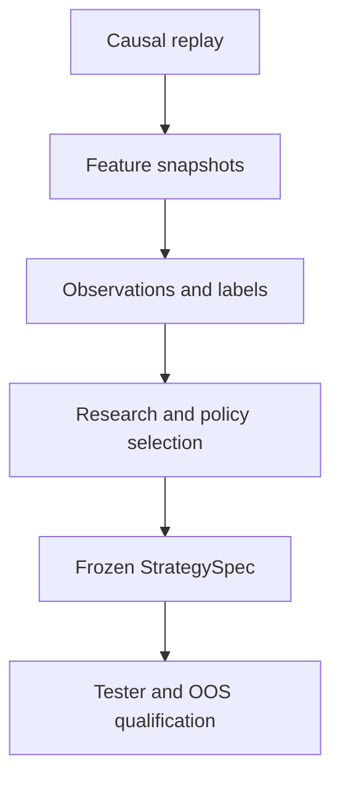

# ORDER-FLOW-RESEARCH-001: исследовательский протокол и датасет наблюдений

**Статус:** TARGET RESEARCH CONTRACT — PARTIALLY IMPLEMENTED BY RESEARCH MVP.

**Назначение:** определить, как из причинного потока строятся наблюдения,
проверяются гипотезы и выбирается торговая политика без подглядывания в будущее
и подгонки final out-of-sample.

Текущий workbench реализует causal observations, broad candidates, background
sampling, отдельные future market-path labels и immutable artifacts для одной
пары файлов. Experiment registry, temporal split/purge, статистический анализ,
policy selection и final OOS остаются target. См.
[runbook](RESEARCH_MVP_RUNBOOK.md).

## 1. Основной ответ

Tester и массив наблюдений не являются альтернативами:

- **исследовательский контур** сохраняет все релевантные кандидаты, добавляет
  будущие labels и помогает понять, какие сочетания признаков имеют устойчивое
  преимущество;
- **торговый контур Tester** воспроизводит уже frozen policy, причинно
  моделирует заявки и считает результат после расходов.

Ручной просмотр графика используется для проверки смысла признаков и разбора
ошибок, но не заменяет массовую статистическую проверку.

## 2. Разделение сущностей

| Сущность | Что означает | Использует будущее |
|---|---|---|
| Snapshot | Полное причинно доступное состояние признаков после bucket | Нет |
| Observation | Сохранённый snapshot с причиной включения в исследовательский датасет | Нет |
| Candidate | Направленная гипотеза `Long`/`Short`, порождённая заранее описанным detector | Нет |
| Confirmation/invalidation | Последующий причинный переход candidate state | Нет |
| Label | То, что произошло после observation на заранее заданном горизонте | Да, только offline |
| Trade intent | Решение frozen policy запросить сделку | Нет |
| Simulation result | Результат причинной модели исполнения intent | Да, но только как результат теста |

Label никогда не входит в feature vector и недоступен strategy state machine.
Экспорт признаков и labels физически либо логически разделяется так, чтобы
ошибка join не могла незаметно передать будущее в решение.

## 3. ResearchSpec до сбора результатов

До расчёта labels создаётся неизменяемый `ResearchSpec vN`. Он фиксирует:

- dataset/manifest versions и реальный контракт;
- unit of observation и детерминированную sampling policy;
- формулы признаков, типы и размеры окон;
- broad candidate detector для Long и Short;
- правила объединения/подавления перекрывающихся кандидатов;
- label horizons, barriers, cutoff и источник reference price;
- development/validation/final OOS границы;
- заранее выбранные базовые сравнения и основные метрики;
- допустимый небольшой budget экспериментов.

Изменение любого пункта создаёт новый ResearchSpec и новый experiment ID.
Старые строки и результаты не перезаписываются.

## 4. Какие наблюдения сохраняются

Записывать только фактические сделки робота нельзя: это скрывает отвергнутые
ситуации и создаёт selection bias. Версия 1 сохраняет:

1. каждое появление broad Long/Short candidate;
2. каждый переход candidate: подтверждение, invalidation, expiry;
3. детерминированную контрольную выборку background snapshots без кандидата;
4. data-quality отказ, если он совпал с потенциальным решением.

Экспорт каждого bucket допустим как диагностический режим, но не является
обязательным форматом обучения: соседние buckets сильно зависимы и могут
создать ложное ощущение большого числа независимых примеров.

### 4.1. Идентичность строки

Строка однозначно определяется составным ключом:

`dataset version + instrument + trading date + bucket ID + observation type + detector version + direction`.

Повторный прогон обязан либо воспроизвести ту же строку, либо завершиться
ошибкой несовместимости версий.

### 4.2. Группы полей

| Группа | Примеры |
|---|---|
| Идентичность | Experiment ID, manifest hash, instrument, session/date, bucket, direction |
| Поток сделок | Buy/Sell volume, delta, число сделок, средний/крупный размер, нормированные значения |
| Цена и реакция | Изменение, диапазон, локальный уровень, продвижение цены на единицу потока, удержание/пробой |
| Стакан | Spread, top-N imbalance, book age, видимая ликвидность, quality flags |
| Контекст | Время сессии, volatility/liquidity regime, расстояние до клиринга/cutoff |
| Candidate state | Причина, возраст, confirmation/invalidation level, expiry, detector version |
| Доступность | Пропуски, stale source, unknown side, invalid book и иные reason codes |

Все нормировки в строке рассчитываются только по текущему и прошлому. Если
нужна статистика прошлых сессий, её cutoff и версия сохраняются явно.

## 5. Market-path labels и отдельные execution results

### 5.1. Market-path labels: результат этапа 5

Один будущий `price up/down` недостаточен. Для каждого заранее заданного
горизонта сохраняются:

- signed return относительно candidate direction;
- maximum favorable excursion (`MFE`) и maximum adverse excursion (`MAE`);
- время до MFE/MAE и до первого достижения заданных barriers;
- порядок `target first` / `invalidation first` / `neither`;
- достижение session cutoff;
- наличие причинно доступного стакана для гипотетической активации.

Reference price, горизонты и barriers задаются в ResearchSpec. Эти labels
описывают будущую траекторию рынка, но не моделируют заявку и не называются
прибылью.

Поскольку допустимое удержание составляет от минут до часов, первая разведка
использует ограниченный набор заранее выбранных горизонтов. Выбирать лучший
горизонт задним числом по final OOS запрещено.

### 5.2. Execution results: только после квалификации этапа 6

После того как [ORDER-FLOW-EXECUTION-001](EXECUTION_MODEL.md) прошёл свои
synthetic/invariant tests, для observations отдельным набором рассчитываются:

- activation/fill times и использованные book snapshot IDs;
- full/partial/no-fill, исполненный объём и VWAP;
- комиссия, spread, latency и adverse slippage;
- net PnL/MAE/MFE позиции по каждому заранее заданному execution profile;
- отказ/expiry и соответствующие reason codes.

Execution results связываются с observation key и версиями StrategySpec/
execution profile, но не добавляются в causal feature vector и не
перезаписывают market-path labels. До закрытия `Execution qualified` gate они
не могут использоваться для выбора policy или называться доказанной прибылью.

## 6. Как формируется торговая политика

Работа идёт от простого и проверяемого к более сложному:

1. Проверить качество и распределение признаков, дубликаты и leakage.
2. Оценить broad candidates без фильтров и понять, где/когда эффект исчезает.
3. Построить объяснимый rule-based baseline с малым числом параметров.
4. Сравнить его с price-only control на одинаковых событиях и издержках.
5. Только при достаточном числе наблюдений проверить дополнительный
   статистический/ML ranker кандидатов.
6. Выбрать одну policy на development/validation и оформить `StrategySpec vN`.
7. Заморозить код, параметры, model artifact и thresholds до final OOS.

Стратегия отвечает не на вопрос «был ли дисбаланс», а на вопрос «имеет ли этот
кандидат положительное ожидаемое значение после издержек и разрешён ли он
текущим состоянием/риском».

## 7. Граница автоматического анализа и ML

Автоматический анализ допускается как воспроизводимая часть исследования, но не
как неформальная передача таблицы языковой модели с просьбой найти лучшие
параметры.

Если используется ML:

- модель ранжирует или отбрасывает уже определённые кандидаты;
- target, features, loss, sampling, seed и hyperparameter budget фиксируются;
- сохраняются training code/version, feature schema, parameters и hash model
  artifact;
- одинаковая inference-реализация применяется в Tester, shadow и live;
- model score не обходит candidate lifecycle, session/data-quality gates,
  risk controller и execution model;
- сравниваются calibration, coverage и net expectancy, а не только accuracy;
- сложная модель обязана превзойти rule-based и price-only baselines на
  validation, а затем на untouched OOS;
- отсутствие стабильного прироста означает возврат к простой policy либо
  `no-go`.

Языковая модель может помочь сформулировать гипотезы или разобрать отчёт, но её
ответ не является измерением, model artifact или основанием для сделки.

## 8. Временное разделение данных

Данные делятся только хронологически:

| Сегмент | Разрешённое использование |
|---|---|
| Development | Формулы, диагностика, ограниченный поиск параметров и обучение |
| Validation | Выбор одной версии policy, threshold и execution profile |
| Final out-of-sample | Однократное решение `go/no-go`; после просмотра не дообучается |
| Forward/shadow | Проверка переноса на новые данные и live/replay parity |

Одна торговая идея и весь её label horizon должны лежать внутри одного
сегмента. Между сегментами удаляются наблюдения, чьи feature windows или future
labels пересекают границу (`purge`); величина буфера фиксируется в ResearchSpec.

Разбиение производится по торговым дням и реальным контрактам, а не случайным
перемешиванием строк. Walk-forward повторяет только заранее заданный процесс и
не превращает каждый следующий тестовый участок в новый development без учёта
числа попыток.

## 9. Визуальная проверка

Для каждой версии автоматически формируется выборка эпизодов:

- успешные и неуспешные candidates;
- подтверждённые, invalidated и expired;
- принятые и отклонённые policy;
- хорошие сигналы с плохим исполнением и наоборот;
- разные интервалы сессии и volatility/liquidity regimes.

Эпизоды выбираются детерминированно и стратифицированно, а не только из лучших
сделок. График M1 используется по умолчанию, `Sec15/Sec30` — для порядка внутри
минуты. Источником истины остаётся event journal; display timeframe не меняет
features, state transitions и labels.

## 10. Реестр экспериментов

Каждый запуск сохраняет минимум:

| Поле | Назначение |
|---|---|
| Experiment/ResearchSpec ID | Неизменяемая идентичность гипотезы |
| Code commit и config hashes | Воспроизводимость расчёта |
| Dataset/manifest hashes | Точная версия входных данных |
| Feature/label schema versions | Защита от несовместимого join |
| Split boundaries и purge | Доказательство временной изоляции |
| Все проверенные variants | Учёт множественного перебора |
| Execution profiles | Baseline и ухудшенные предположения |
| Metrics/coverage/rejections | Результат и область применимости |
| Decision | `continue`, `revise`, `freeze`, `no-go` с причиной |

## 11. Выход этапа исследования

До перехода к final OOS должны существовать:

- принятый manifest и causal replay evidence;
- `ResearchSpec vN` и воспроизводимый observation dataset;
- отчёт о data quality, leakage и effective sample size по дням;
- rule-based baseline и price-only control;
- model card/artifact только если ML действительно добавляет результат;
- один frozen `StrategySpec vN` по
  [ORDER-FLOW-STRATEGY-001](STRATEGY_LIFECYCLE.md);
- полный список проверенных вариантов и неизменённый final OOS.

Критерии доказательности и `go/no-go` заданы в
[ORDER-FLOW-QUALIFICATION-001](TESTING_AND_QUALIFICATION.md).
