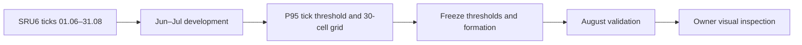

# SRU6: подбор параметров Cloud за июнь–август 2026

**Document ID:** `ORDER-FLOW-SRU6-CALIBRATION-2026-001`  
**Статус:** RESEARCH REPORT — OWNER VISUAL VALIDATION PENDING  
**Дата расчёта:** 28.09.2026  
**Инструмент:** локальный файл `SRU6.txt`  
**Период:** 01.06.2026–31.08.2026 включительно

## 1. Рекомендация для первого визуального просмотра

Это параметры для проверки на графике, а не доказанная торговая система.
Формирование Chain одинаково для трёх интервалов:

| Поле Cloud | Значение |
|---|---:|
| Одиночные сделки вместо цепочек | выключено |
| Максимальная пауза | 2000 мс |
| Максимальный размах цены | 5 тиков |
| Окружение | 30 секунд |
| Диагональный перевес | Off |
| Максимальные пороги | 0 — без ограничения |
| Вне заданных интервалов | не рассчитывать |

В редакторе **«Время работы и пороги»** добавьте три периода. В этом редакторе
обе границы времени включительны, поэтому интервалы ниже не перекрываются.
Расписание применяется каждый день недели; ожидаемая частота ниже получена
отдельным контрольным прогоном именно с таким режимом:

| Время файла, ежедневно | Мин. объём тика | Мин. объём Cloud | Мин. абсолютная дельта | Мин. число сделок | Ожидаемо за активный день, Jun–Jul | Ожидаемо за активный день, Aug |
|---|---:|---:|---:|---:|---:|---:|
| 07:00–10:29 | 10 | 85 | 75 | 2 | 14.69 | 14.96 |
| 10:30–18:59 | 14 | 367 | 343 | 2 | 11.78 | 6.59 |
| 19:00–23:50 | 10 | 89 | 82 | 2 | 10.27 | 6.00 |

Базовые поля экземпляра можно заполнить значениями утренней строки; при
включённом режиме «вне интервалов не рассчитывать» фактические пороги берутся
из строк расписания. Направление дельты оставьте `Any`: здесь использован модуль
дельты, а знак удобно оценить визуально отдельно. Сброс для Cloud не применяется;
переход времени меняет пороги и не разрывает уже начатую цепочку.

Первичный подбор выполнен на стандартных профилях FORTS с маской Пн–Пт. Главный
редактор Cloud не имеет маски дней недели и применяет эти строки ежедневно.
Поэтому приведённые выше частоты взяты из дополнительного прогона с маской всех
дней и теми же уже замороженными порогами. Выходные не использовались для выбора
порогов.

Остаётся различие на границе интервалов. Calibration считает каждый TimeRange
отдельно и завершает цепочку на его границе. Основной Cloud с расписанием порогов
сохраняет цепочку при смене интервала. Поэтому события прямо около 10:30 и 19:00
могут отличаться; при визуальной проверке их нужно посмотреть отдельно. Внутри
интервалов формула Gap/Range совпадает.

Почему основная сессия строже: в исходном weekday-подборе одинаковый
percentile-фильтр P75 давал 39.86 Cloud/день в августе и перегружал бы график.
Для неё взят P95. Утро и вечер оставлены на P75, чтобы сохранить достаточно
примеров для просмотра.

## 2. Два готовых альтернативных режима

Если на графике всё ещё слишком много меток, используйте P95 во всех интервалах:

| Время | Мин. объём Cloud | Мин. абсолютная дельта | Jun–Jul / день | Aug / день |
|---|---:|---:|---:|---:|
| 07:00–10:29 | 265 | 256 | 3.12 | 3.07 |
| 10:30–18:59 | 367 | 343 | 11.78 | 6.59 |
| 19:00–23:50 | 295 | 280 | 2.20 | 1.29 |

Если, наоборот, примеров мало, используйте P75 во всех интервалах:

| Время | Мин. объём Cloud | Мин. абсолютная дельта | Jun–Jul / день | Aug / день |
|---|---:|---:|---:|---:|
| 07:00–10:29 | 85 | 75 | 14.69 | 14.96 |
| 10:30–18:59 | 120 | 105 | 54.88 | 31.33 |
| 19:00–23:50 | 89 | 82 | 10.27 | 6.00 |

Не рекомендую начинать с фильтра `TradeCount >= P95`. Его перенос оказался
хуже: для основной сессии частота снизилась с 18.47 до 7.14 события в день,
отношение August/Development 0.39. У фильтра по объёму это отношение 0.54.

## 3. Почему выбраны Gap 2000 и Range 5

`Range = 5` расположен внутри устойчивой области, а не на краю сетки. Для
`Gap = 2000` чувствительность частоты к непосредственным соседям составила:

| Профиль | NeighborSensitivity | Jun–Jul, Chain/день | Aug, Chain/день | Volume P95, Dev → Aug | abs(Delta) P95, Dev → Aug |
|---|---:|---:|---:|---:|---:|
| FORTS Morning | 2.50% | 83.44 | 90.52 | 265 → 245 | 256 → 234 |
| FORTS Main | 2.76% | 327.13 | 178.43 | 367 → 363 | 343 → 357 |
| FORTS Evening | 3.85% | 45.04 | 27.95 | 295 → 282 | 280 → 282 |

В основной и вечерней сессиях активность августа ниже, однако хвосты объёма и
дельты почти не изменились. Поэтому переносимыми выглядят пороги размера события,
а не обещание постоянного числа событий в день.

У файла секундная точность времени: все 2,635,837 строк выбранного периода имеют
нулевую микросекундную часть. Поэтому Gap 100, 250 и 500 мс дают одинаковое
формирование: они различают только события с одним и тем же значением секунды.
Gap 2000 мс осмысленно добавляет связь между соседними секундами. Исходный
порядок строк при совпадающем времени сохраняется.

Для выбранной формации типичный Cloud содержит две сделки. P95 числа сделок —
7 утром и в основной сессии, 6 вечером. P95 фактического диапазона равен ровно
5 тикам во всех профилях; P95 длительности — 2–3 секунды. Это согласуется с
выбранными границами, но визуально нужно проверить, не склеиваются ли разные
рыночные эпизоды.

## 4. Данные и методика

Файл содержит 3,130,667 строк с 16.03.2026 по 17.09.2026. В запрошенном
диапазоне использовано 2,635,837 строк:

| Сегмент | Даты | Строки | Source dates | Активные будни в профиле |
|---|---|---:|---:|---:|
| Development | 01.06–31.07 | 1,869,529 | 59 | 45 |
| Validation | 01.08–31.08 | 766,308 | 27 | 21 |

Development использован для выбора P95 объёма отдельного тика и точки сетки.
После этого пороги были заморожены и без подгонки применены к августу. Проверены
три source-clock профиля и 30 комбинаций в каждом сегменте:

- Gap: 100, 250, 500, 1000, 2000 мс;
- Range: 1, 2, 3, 5, 8, 13 тиков;
- PriceStep: 1;
- Chain в итоговых таблицах требует `TradeCount >= 2`;
- всего 180 пар «профиль × сегмент × комбинация».

Стандартные FORTS-профили этой сетки имеют `DayMask = 62`, то есть Пн–Пт.
После выбора параметров выполнен отдельный контрольный прогон выбранной формации
с `DayMask = 127`, который соответствует ежедневному расписанию главного Cloud:

| Интервал | Активные даты Jun–Jul | Активные даты Aug | Primary events Jun–Jul | Primary events Aug |
|---|---:|---:|---:|---:|
| 07:00–10:30 half-open | 59 | 27 | 867 | 404 |
| 10:30–19:00 half-open | 59 | 27 | 695 | 178 |
| 19:00–23:51 half-open | 45 | 21 | 462 | 126 |

В утреннем и основном интервалах файл содержит активные выходные даты; вечером
таких дат нет. `Events/day` в рекомендации делит число событий на активные даты
конкретного интервала, а не на все календарные дни периода.

Распределение объёма физических тиков:

| Профиль | Dev ticks | P50 | P90 | P95 | P99 | Aug ticks | Aug P95 | Aug P99 |
|---|---:|---:|---:|---:|---:|---:|---:|---:|
| Morning | 267,030 | 2 | 6 | 10 | 25 | 158,134 | 10 | 25 |
| Main | 1,403,637 | 2 | 8 | 14 | 36 | 529,405 | 10 | 30 |
| Evening | 167,596 | 2 | 6 | 10 | 29 | 67,872 | 10 | 25 |

Соседних строк с одинаковым timestamp: 1,466,633 в development и 580,803 в
validation. Это показатель точности времени, а не удалённые дубликаты сделок.
Все строки сохранены и рассчитаны в исходном порядке.

## 5. Полная компактная таблица проверенной сетки

`Dev/day` и `Aug/day` считают только цепочки из двух и более сделок. `Sens.` —
максимальное относительное изменение частоты у непосредственного соседа сетки.

### FORTS Morning

| Gap, ms | Range | Dev/day | Aug/day | Sens., % | Dev V95 | Aug V95 | Dev absΔ95 | Aug absΔ95 |
|---:|---:|---:|---:|---:|---:|---:|---:|---:|
| 100 | 1 | 67.1 | 75.0 | 6.8 | 198 | 184 | 194 | 184 |
| 100 | 2 | 71.7 | 77.8 | 6.4 | 200 | 197 | 198 | 197 |
| 100 | 3 | 74.5 | 79.7 | 3.8 | 215 | 198 | 210 | 197 |
| 100 | 5 | 76.7 | 81.3 | 2.9 | 230 | 234 | 221 | 230 |
| 100 | 8 | 77.1 | 81.8 | 2.0 | 258 | 259 | 243 | 237 |
| 100 | 13 | 75.6 | 80.4 | 2.0 | 280 | 283 | 266 | 262 |
| 250 | 1 | 67.1 | 75.0 | 6.8 | 198 | 184 | 194 | 184 |
| 250 | 2 | 71.7 | 77.8 | 6.4 | 200 | 197 | 198 | 197 |
| 250 | 3 | 74.5 | 79.7 | 3.8 | 215 | 198 | 210 | 197 |
| 250 | 5 | 76.7 | 81.3 | 2.9 | 230 | 234 | 221 | 230 |
| 250 | 8 | 77.1 | 81.8 | 2.0 | 258 | 259 | 243 | 237 |
| 250 | 13 | 75.6 | 80.4 | 2.0 | 280 | 283 | 266 | 262 |
| 500 | 1 | 67.1 | 75.0 | 7.5 | 198 | 184 | 194 | 184 |
| 500 | 2 | 71.7 | 77.8 | 7.6 | 200 | 197 | 198 | 197 |
| 500 | 3 | 74.5 | 79.7 | 6.9 | 215 | 198 | 210 | 197 |
| 500 | 5 | 76.7 | 81.3 | 6.0 | 230 | 234 | 221 | 230 |
| 500 | 8 | 77.1 | 81.8 | 4.2 | 258 | 259 | 243 | 237 |
| 500 | 13 | 75.6 | 80.4 | 2.6 | 280 | 283 | 266 | 262 |
| 1000 | 1 | 72.2 | 80.7 | 7.0 | 219 | 193 | 206 | 192 |
| 1000 | 2 | 77.1 | 83.2 | 7.1 | 223 | 210 | 210 | 207 |
| 1000 | 3 | 79.6 | 85.5 | 6.4 | 246 | 209 | 230 | 205 |
| 1000 | 5 | 81.4 | 87.0 | 5.7 | 254 | 241 | 246 | 233 |
| 1000 | 8 | 80.4 | 87.6 | 4.1 | 287 | 259 | 274 | 241 |
| 1000 | 13 | 77.6 | 85.5 | 3.7 | 330 | 287 | 295 | 262 |
| 2000 | 1 | 74.7 | 83.5 | 6.6 | 223 | 197 | 210 | 196 |
| 2000 | 2 | 79.7 | 86.4 | 6.2 | 236 | 222 | 223 | 220 |
| 2000 | 3 | 82.2 | 89.1 | 3.1 | 253 | 220 | 241 | 210 |
| 2000 | 5 | 83.4 | 90.5 | 2.5 | 265 | 245 | 256 | 234 |
| 2000 | 8 | 82.2 | 91.2 | 4.3 | 300 | 266 | 281 | 249 |
| 2000 | 13 | 78.6 | 89.0 | 4.5 | 350 | 293 | 306 | 271 |

### FORTS Main

| Gap, ms | Range | Dev/day | Aug/day | Sens., % | Dev V95 | Aug V95 | Dev absΔ95 | Aug absΔ95 |
|---:|---:|---:|---:|---:|---:|---:|---:|---:|
| 100 | 1 | 238.8 | 146.0 | 8.7 | 319 | 316 | 316 | 305 |
| 100 | 2 | 259.6 | 151.6 | 8.0 | 327 | 323 | 319 | 321 |
| 100 | 3 | 272.2 | 155.1 | 4.6 | 326 | 333 | 317 | 330 |
| 100 | 5 | 284.6 | 158.1 | 4.4 | 335 | 360 | 328 | 350 |
| 100 | 8 | 293.2 | 160.5 | 2.9 | 348 | 381 | 336 | 371 |
| 100 | 13 | 292.7 | 157.7 | 0.2 | 368 | 408 | 352 | 398 |
| 250 | 1 | 238.8 | 146.0 | 8.7 | 319 | 316 | 316 | 305 |
| 250 | 2 | 259.6 | 151.6 | 8.0 | 327 | 323 | 319 | 321 |
| 250 | 3 | 272.2 | 155.1 | 4.6 | 326 | 333 | 317 | 330 |
| 250 | 5 | 284.6 | 158.1 | 4.4 | 335 | 360 | 328 | 350 |
| 250 | 8 | 293.2 | 160.5 | 2.9 | 348 | 381 | 336 | 371 |
| 250 | 13 | 292.7 | 157.7 | 0.2 | 368 | 408 | 352 | 398 |
| 500 | 1 | 238.8 | 146.0 | 16.4 | 319 | 316 | 316 | 305 |
| 500 | 2 | 259.6 | 151.6 | 15.5 | 327 | 323 | 319 | 321 |
| 500 | 3 | 272.2 | 155.1 | 14.5 | 326 | 333 | 317 | 330 |
| 500 | 5 | 284.6 | 158.1 | 11.8 | 335 | 360 | 328 | 350 |
| 500 | 8 | 293.2 | 160.5 | 8.5 | 348 | 381 | 336 | 371 |
| 500 | 13 | 292.7 | 157.7 | 5.3 | 368 | 408 | 352 | 398 |
| 1000 | 1 | 278.0 | 156.6 | 14.1 | 318 | 320 | 314 | 316 |
| 1000 | 2 | 299.9 | 163.7 | 13.4 | 330 | 333 | 317 | 329 |
| 1000 | 3 | 311.6 | 167.6 | 12.6 | 335 | 340 | 320 | 335 |
| 1000 | 5 | 318.1 | 171.4 | 10.5 | 359 | 369 | 339 | 358 |
| 1000 | 8 | 318.2 | 173.7 | 7.8 | 380 | 387 | 356 | 377 |
| 1000 | 13 | 308.3 | 169.6 | 5.1 | 414 | 420 | 382 | 404 |
| 2000 | 1 | 289.0 | 161.6 | 7.5 | 318 | 320 | 312 | 316 |
| 2000 | 2 | 310.7 | 169.2 | 7.0 | 332 | 333 | 316 | 329 |
| 2000 | 3 | 322.0 | 173.7 | 3.5 | 338 | 341 | 321 | 335 |
| 2000 | 5 | 327.1 | 178.4 | 2.8 | 367 | 363 | 343 | 357 |
| 2000 | 8 | 322.5 | 180.5 | 4.9 | 399 | 384 | 371 | 375 |
| 2000 | 13 | 306.7 | 175.4 | 5.2 | 455 | 421 | 400 | 404 |

### FORTS Evening 19:00–23:50

| Gap, ms | Range | Dev/day | Aug/day | Sens., % | Dev V95 | Aug V95 | Dev absΔ95 | Aug absΔ95 |
|---:|---:|---:|---:|---:|---:|---:|---:|---:|
| 100 | 1 | 34.9 | 22.6 | 7.6 | 240 | 180 | 239 | 180 |
| 100 | 2 | 37.5 | 24.0 | 7.0 | 251 | 209 | 244 | 200 |
| 100 | 3 | 39.0 | 24.4 | 4.3 | 256 | 234 | 247 | 234 |
| 100 | 5 | 40.6 | 25.6 | 4.1 | 278 | 250 | 268 | 240 |
| 100 | 8 | 41.1 | 26.2 | 1.2 | 299 | 260 | 296 | 255 |
| 100 | 13 | 40.8 | 25.5 | 0.7 | 313 | 271 | 307 | 260 |
| 250 | 1 | 34.9 | 22.6 | 7.6 | 240 | 180 | 239 | 180 |
| 250 | 2 | 37.5 | 24.0 | 7.0 | 251 | 209 | 244 | 200 |
| 250 | 3 | 39.0 | 24.4 | 4.3 | 256 | 234 | 247 | 234 |
| 250 | 5 | 40.6 | 25.6 | 4.1 | 278 | 250 | 268 | 240 |
| 250 | 8 | 41.1 | 26.2 | 1.2 | 299 | 260 | 296 | 255 |
| 250 | 13 | 40.8 | 25.5 | 0.7 | 313 | 271 | 307 | 260 |
| 500 | 1 | 34.9 | 22.6 | 7.6 | 240 | 180 | 239 | 180 |
| 500 | 2 | 37.5 | 24.0 | 7.0 | 251 | 209 | 244 | 200 |
| 500 | 3 | 39.0 | 24.4 | 6.6 | 256 | 234 | 247 | 234 |
| 500 | 5 | 40.6 | 25.6 | 6.6 | 278 | 250 | 268 | 240 |
| 500 | 8 | 41.1 | 26.2 | 6.1 | 299 | 260 | 296 | 255 |
| 500 | 13 | 40.8 | 25.5 | 5.4 | 313 | 271 | 307 | 260 |
| 1000 | 1 | 37.3 | 24.0 | 7.2 | 247 | 208 | 243 | 208 |
| 1000 | 2 | 40.0 | 25.3 | 6.7 | 269 | 236 | 256 | 235 |
| 1000 | 3 | 41.5 | 25.8 | 6.2 | 271 | 246 | 262 | 246 |
| 1000 | 5 | 43.3 | 26.8 | 6.2 | 300 | 282 | 296 | 282 |
| 1000 | 8 | 43.6 | 27.1 | 5.7 | 309 | 309 | 307 | 309 |
| 1000 | 13 | 43.1 | 26.8 | 5.2 | 330 | 331 | 325 | 331 |
| 2000 | 1 | 38.8 | 24.9 | 7.5 | 243 | 208 | 239 | 208 |
| 2000 | 2 | 41.6 | 26.3 | 6.9 | 257 | 236 | 251 | 235 |
| 2000 | 3 | 43.3 | 26.9 | 4.2 | 262 | 246 | 256 | 246 |
| 2000 | 5 | 45.0 | 28.0 | 3.8 | 295 | 282 | 280 | 282 |
| 2000 | 8 | 45.4 | 28.2 | 3.9 | 307 | 285 | 300 | 285 |
| 2000 | 13 | 44.8 | 27.6 | 3.8 | 333 | 328 | 325 | 293 |

## 6. Воспроизводимость и границы вывода

- Input SHA-256:
  `435EA400FFCC45CD3215BE0806F660368A024D1C2942B8EED8AA8E3D2FED1F7B`.
- Baseline/current HEAD:
  `97bd89fb676d074842169a1f9041af595b7eb3ec`.
- Каталог production calibration не отличается от HEAD; расчёт выполнен его
  текущим `CalibrationEngine`, а не отдельной упрощённой формулой.
- Формулы manifest:
  `explorer-chain-1;source-range-1;nearest-rank-1;exact-pairs-delta-stack-1`.
- Compact summary SHA-256:
  `7ACB2B043744427773A9993F669EFD7D0DE4053B28F4566AFD82E7CF1AE03A69`.
- Selected-filter summary SHA-256:
  `34D8B91ECE0E05CC83A922987238B6E827A6BA61FB263B26C0E5E821CF2F25B0`.
- Daily-schedule control summary SHA-256:
  `5786B5D0A48C7256F25F674620E62ED843042064DF3810C845A1D8A7E1FEC939`.
- Контрольный прогон daily schedule выполнен сборкой `OsEngine.dll` SHA-256
  `321ADF655DF93A9942DACCA43965488B4EF8DB16F4815C5AA5673E2D5A78DC9D`;
  его полное время — 240.3 секунды.

Расчёт не измеряет последующую реакцию цены, MFE/MAE, комиссии, проскальзывание,
fill или PnL. Август является validation для формы и описательных распределений,
но не final OOS торговой политики. После визуального просмотра нельзя объявлять
эти параметры прибыльными; следующим отдельным этапом должна быть причинная
оценка реакции цены с новым нетронутым периодом.

Open Interest в этом tick-файле отсутствует и в подборе не участвовал.
Диагональные фильтры также намеренно оставлены выключенными, чтобы первая
визуальная проверка оценивала только объём, абсолютную дельту и число сделок.
