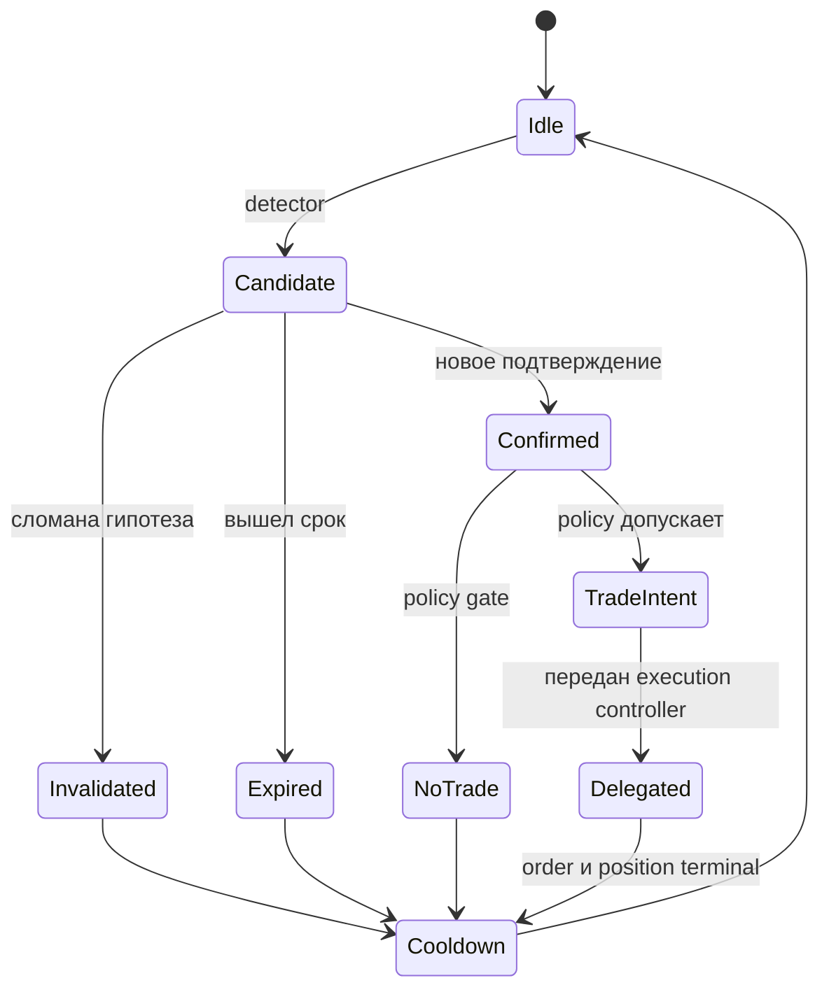
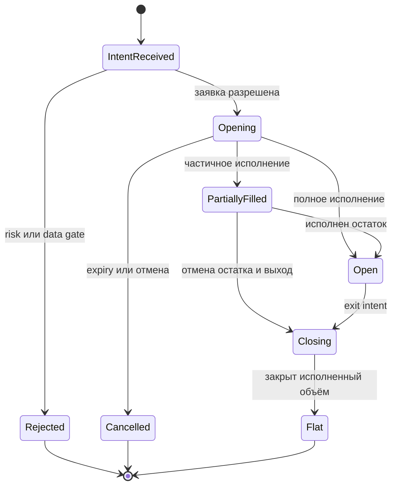

# ORDER-FLOW-STRATEGY-001: жизненный цикл наблюдения и торгового решения

**Статус:** TARGET STRATEGY CONTRACT — NOT IMPLEMENTED.

**Назначение:** отделить рыночное наблюдение от кандидата, подтверждённого
сигнала, решения торговать, заявки и позиции. Конкретные формулы и значения
порогов появятся только в версионируемом `StrategySpec` после исследования.

## 1. Ключевой принцип

Дисбаланс, дивергенция цены и дельты либо изменение стакана сами по себе не
являются командой купить или продать. Они могут только создать candidate,
который затем подтверждается, отменяется или истекает.

Неуспешный Long candidate означает прежде всего **no trade**. Он не становится
Short автоматически. Для Short требуется независимый причинный detector,
собственное подтверждение и прохождение тех же gates.

## 2. Словарь решений

| Термин | Точное значение |
|---|---|
| Observation | Сохранённый causal snapshot без обязательного торгового направления |
| Candidate | Гипотеза направления с причиной, уровнем, временем, expiry и invalidation |
| Confirmation | Новое событие после candidate, удовлетворившее frozen условиям подтверждения |
| Invalidated | Гипотеза разрушена до разрешённого входа |
| Expired | Время/объём наблюдения исчерпаны без confirmation |
| Eligible signal | Confirmed candidate, прошедший data/session/context/liquidity policy |
| No-trade decision | Осознанный отказ с reason code; не ошибка и не пропавшее событие |
| Trade intent | Запрос направления, максимальной цены/риска и срока действия; ещё не заявка |
| Order | Команда execution controller после risk approval |
| Fill | Фактическое либо смоделированное исполнение части заявки |
| Position | Состояние, сформированное только фактически исполненным объёмом |

## 3. Два связанных автомата

Аналитический автомат не управляет ордерами. Он заканчивается candidate outcome
или `TradeIntent`.

Execution/risk автомат принимает intent отдельно:

Подробная семантика исполнения находится в
[ORDER-FLOW-EXECUTION-001](EXECUTION_MODEL.md).

## 4. Создание candidate

Broad detector версии 1 исследует причинную последовательность, а не цвет
свечи:

1. Зафиксирован ценовой контекст и уровень без знания будущего.
2. Возник направленный агрессивный поток.
3. Цена отвечает слабее ожидаемого, удерживает уровень либо движется против
   потока.
4. В одном post-bucket snapshot создаётся направленный candidate.

Например, агрессивные продажи при удержании цены могут создать Long candidate.
Красная дельта внутри зелёной M1 свечи является возможным визуальным
проявлением, но не входным правилом: границы свечи зависят от display timeframe.

При создании неизменно фиксируются:

- Candidate ID, direction, detector/feature schema versions;
- event/bucket time и причинный snapshot;
- уровень гипотезы и reference price;
- confirmation, invalidation и expiry policies;
- maximum acceptable entry boundary;
- data-quality состояние и источник стакана.

Уровни не передвигаются задним числом после просмотра результата.

## 5. Confirmation, invalidation и expiry

Confirmation обязано появиться в более позднем закрытом bucket. Оно не может
быть одновременно причиной candidate и его подтверждением.

Для первой исследовательской версии проверяются как отдельные варианты, а не
как бесконтрольная смесь:

- восстановление цены после направленного потока;
- изменение последующего потока в сторону candidate;
- удержание уровня в течение заданного времени/объёма/числа сделок;
- доступный, свежий и приемлемый spread/стакан.

Invalidation определяется структурным нарушением уровня/реакции или
data-quality событием. Expiry срабатывает, если подтверждение не появилось в
ограниченном observation window. Оба исхода записываются в исследовательский
датасет независимо от наличия сделки.

## 6. Почему не каждый confirmed candidate торгуется

После confirmation применяются независимые gates:

| Gate | Причина отказа |
|---|---|
| Data quality | Gap, stale quote, unknown side, invalid/empty book |
| Session | Клиринг, запрет новых входов, приближение cutoff |
| Marketability | Недопустимый spread, недостаточная видимая ликвидность, entry boundary нарушена |
| Context policy | Неподдерживаемый volatility/liquidity regime или конфликт с frozen контекстом |
| Candidate policy | Недостаточная сила/устойчивость либо низкий rule/model score |
| Position/order state | Уже есть идея, заявка, позиция или reconciliation |
| Risk | Нулевой разрешённый объём, лимит сделки/дня/портфеля, blocked state |

Каждый отказ получает стабильный reason code. Отсутствие intent без причины
считается дефектом observability.

## 7. Направление и разворот

Правила версии 1:

- одновременно допускается одна активная идея на инструмент;
- усреднение и пирамидинг выключены;
- opposite candidate может наблюдаться и журналироваться, но не меняет сторону
  действующей идеи сам по себе;
- invalidated Long не создаёт Short;
- Short intent возможен только после независимых Short candidate + confirmation;
- при открытой Long позиции сначала формируется и исполняется exit; новая Short
  заявка допускается только после подтверждённого flat/reconciled state;
- same-bucket reverse запрещён.

Позже допускается отдельное исследование atomic reverse, но оно будет новой
версией StrategySpec и execution contract, а не скрытым следствием stop.

## 8. Переход от signal к intent

Frozen decision policy получает только causal snapshot и candidate state. Она
возвращает один из результатов:

| Результат | Обязательное содержание |
|---|---|
| `NoTrade` | Reason code и версия policy |
| `Wait` | Оставшийся срок candidate и причина ожидания |
| `Invalidate` | Нарушенное условие |
| `TradeIntent` | Direction, desired/max volume, maximum acceptable price, expiry, signal time, risk reference |
| `ExitIntent` | Position/filled volume, причина, urgency/price boundary |

Policy не вызывает методы `BotTabSimple` и не знает о WPF. Тонкий адаптер
передаёт intent в risk/order controller. Такая граница нужна, чтобы одна policy
работала в historical replay, shadow и live.

## 9. Выход из позиции

Выход является отдельной причинной policy и не выводится из результата сделки
задним числом. StrategySpec должен точно задать приоритеты:

1. аварийные data/session/risk причины;
2. денежный защитный предел;
3. структурное разрушение исходной гипотезы;
4. подтверждённый противоположный контекст;
5. достижение цели либо затухание эффекта;
6. максимальное удержание;
7. обязательный внутридневной cutoff.

Stop является условием создать exit intent, а не гарантированной ценой fill.
Изменение display timeframe не меняет exit. Максимальное удержание исследуется
на горизонтах от минут до часов и фиксируется до final OOS.

## 10. Содержание StrategySpec

`StrategySpec vN` создаётся после development/validation исследования и до
final OOS. В нём обязательны:

- совместимые dataset, event, feature и model schema versions;
- формулы и окна всех признаков;
- точные Long/Short detector, confirmation, invalidation и expiry rules;
- gates, приоритеты и полный набор reason codes;
- rule/model policy, thresholds и hash model artifact при наличии;
- intent semantics и maximum acceptable price;
- entry/exit/session/cooldown policies;
- position sizing input и risk limits;
- execution/cost/latency profile IDs;
- режимы `Off`, `Research`, `Shadow`, `Paper`, `Live` и разрешённые переходы;
- версия, commit/config hashes и дата freeze.

После freeze изменение одного правила создаёт новый StrategySpec и новый
эксперимент. Результаты старой версии остаются воспроизводимыми.

## 11. Диагностика и визуализация

Event journal и график различают маркеры:

`candidate → confirmed → no-trade/intent → order activated → partial/full fill → exit intent → flat`.

Для каждого маркера сохраняются Candidate/Intent/Order IDs, точное время,
direction, feature/policy versions и reason code. M1 является основным display,
`Sec15/Sec30` — drill-down. Индикатор только отображает опубликованные
snapshots; он не пересчитывает policy и не является вторым источником сигналов.
