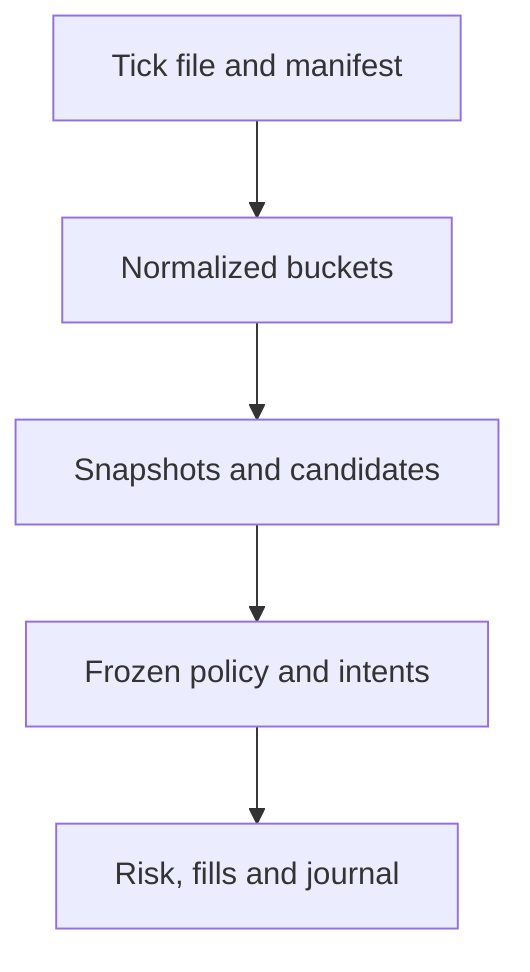

# ORDER-FLOW-QUALIFICATION-001: тестирование и критерии допуска

**Статус:** TARGET QUALIFICATION CONTRACT — SYNTHETIC RESEARCH STAND ADDED.

**Назначение:** определить evidence, необходимое для перехода от данных к
исследованию, от исследования к роботу и от робота к ограниченному live.

Компиляция или один прибыльный backtest не являются экономическим допуском.

В `Tests/OrderFlowResearch` offline stand создаёт временные текстовые тики.
Он проверяет строгий формат/UTF-8, time/side/decimal, игнорирование технического Id,
микросекундные barriers, ручной шаг цены, inclusive даты без outside warmup/labels,
полную валидацию источника, Long/Short, formulas/causality, deterministic artifacts,
missing/locked input, отмену и pinned handle. WPF component tests проверяют сводку,
21 TF, OHLC/response, шкалу времени и навигацию без Application/Window.
Проверяются синхронные XAML-привязки выбора интервала/размера, радиус Cloud
и область наведения при разных коэффициентах без изменения результата/экспорта.
Отдельно проверяются медиана/контраст, отсутствие прежнего потолка объёмов,
decimal extremes, читаемые подписи и синхронизация контраста после переноса панели.
Рисунки проверяются на координаты source-time/decimal, лучи/отрезки/clipping,
выбор/изменение/удаление, смену TF и сброс нового результата. Transfer test переносит
одну панель между двумя ContentControl с разными namescope и проверяет bindings/cleanup;
он не запускает Window и не доказывает реальный фокус, mouse capture или окно ОС.
Фактическая геометрия свечей/баров/High-Low и обычного серого вида проверяется на Min1, Cloud-путь —
на всех 21 TF, включая соседей вне viewport и одинаковые timestamps; данные/экспорт
неизменны. Совместное состояние незавершённой линии и drag шкалы проверяется через
общий обработчик движения с заданным состоянием capture, без запуска окна ОС.
Визуальный tick replay проверяется fake-clock тестом скорости/паузы/шага/gap policy,
снимками каждого тика (в том числе внутри общего timestamp), prefix OHLC/Cloud,
отсутствием будущих кандидатов/labels и неизменностью уже опубликованных кадров.
Финальный результат observer-run сравнивается с обычным engine-run целиком.
Синтетический background worker проверяет шаг, отмену, освобождение файла,
финальный кадр, identity guard, Delta-only запуск с Cloud=null и отсутствие экспорта.
Barrier между разрешением тика и его обработкой проверяет, что новый одиночный шаг
недоступен до подтверждённой worker-паузы и публикации предыдущего кадра.
Возврат диапазона после смены M1/Sec15/H1/M5 проверяется по исходному времени,
включая округление границ старшего TF. Prefix chart рендерится на
21 TF; смена M5/M15 внутри реплея проверяет агрегацию доступных свечей.
Это component evidence без полной WPF Window, не owner-file performance или
проверка реального управления отдельным окном ОС.
Наличие стенда не является PASS конкретного checkpoint. Ранее выполненные
проверки другого формата не являются evidence новой реализации.
Golden real-data, performance и owner visual evidence фиксируются отдельно;
execution, historical profitability и live qualification не реализованы.

Дополнительные workspace fixtures проверяют независимость всех семи комбинаций
Delta/Cloud 1/Cloud 2, SingleTicks с одинаковыми временем/Id, inclusive threshold,
собственную completion sequence, неактивные chain settings, второй chain mode,
раздельные immutable CSV/manifest и rejected prefix. Проверяются независимые
circles/hits/paths и размеры, верхний hit второго слоя, prefix snapshots и
Cloud 2-only reference без первого слоя. Все 21 TF рендерят второй слой в реплее.
Геометрические тесты проверяют поле 0/5/50/90% без фиктивных свечей, рисунок
в свободной зоне, перенос тела и изменение конца, сохранение инструмента,
сохранение наклона при переходе через сжатые пропуски, decimal-уровни сетки
и фактические горизонтальные линии через всю панель. Это по-прежнему component
evidence, а не проверка физической мыши/окна или скорости на многомесячном файле.

Imbalance fixtures отдельно проверяют объёмную Δ% против count Δ%, диагональ
при ручных шагах 1/5/0.00001, inclusive ratio/volume/difference/delta thresholds,
обработку отсутствующей пары без пропуска цен/деления на ноль, выбор другой
подходящей пары при отсечении максимального отношения по объёму. Проверяются
точные произведения при underflow/overflow decimal, отказ публикации snapshot
с переполненным суммарным объёмом, совпадение инкрементального индекса с прямым
пересчётом после добавления/удаления сделок. Контекстные fixtures покрывают левую
границу окна, микросекунду за ней, отсутствие warm-up до даты, мелкие сделки,
равные timestamps, истечение окна перед разрывающим тиком, отсутствие перезаписи
старого Cloud на EOF. Проверяются SingleTick context против unavailable inside,
неизменность кадров, цепочек/Qualified/дельты и другого слоя, spec/CSV/manifest,
скрытие/возврат отсечённых меток и линий на всех 21 TF. Новый UI проверяется
по разметке/control names; полный Window-конструктор и физические клики не запускаются.

Дополнительные precision fixtures проверяют пороги без округления разности/суммы,
отклонение непредставимых decimal-агрегатов в обычном расчёте и observer replay,
а также сохранение дробного тика после expiry большого при представимой сумме.

Cloud offline fixtures проверяют цепочки, равенство/превышение порогов,
Tick Limit, смешанные стороны, single/accumulated, выбранный период, independent modes,
Qualified snapshot без будущего суффикса,
completion/EOF, immutable artifacts и render layers. D1/W1 включают полночь,
понедельник, переход года и високосный день. Месячные свечи проверяются на
разную длину месяцев, февраль високосного года, пропуски и частичные интервалы.
Это не сверка с закрытым SBProX;
его точные marks/Smart и owner visual parity остаются NOT_PROVEN.

Postfilter fixtures дополнительно проверяют произвольные новые пороги по полной
сохранённой карте пар и неизменность старого корня после добавления/expiry,
фильтр итогового TradeCount против Qualified, применение без существующего файла,
независимость слоя и неизменность raw DTO/экспорта. Проверяются полные pair CSV,
сохранённый replay prefix, квадратные углы hit test, круглые накопленные Cloud,
временный показ отсечённого точного ID на всех 21 TF. Проверка разметки сопоставляет
каждое поле управления и binding колонки с содержательной RU/EN подсказкой,
проверяет themed header, отделение фильтров от панели формирования и многострочный
summary статистики. Фактическое открытие контекстного меню мышью — owner visual check.

Statistics fixtures проверяют completed-minute ATR20/21-bar warm-up, gap true range,
неиспользование будущего экстремума текущей свечи, completion price против anchor,
равные timestamps с physical row order, включительную границу горизонта и EOF на
микросекунду раньше, отсутствие будущих сделок и общий полный cohort всех горизонтов.
Покрыты neutral/OpenAtEnd, фиксированное прореживание до фильтров, разделение слоёв,
purge label/feature span, неизменность выбранного небазового правила и fit ATR
квантилей при изменении только held-out исходов, точные границы третей на четырёх
различных fit ATR, малые выборки и исключённые даты. Проверяется отказ обоих
ATR-барьеров при округлении положительной дистанции до нуля: стационарные тики
не дают ложного первого касания и worker не публикует результат.
Проверяются копия/валидация настроек, SHA mismatch и освобождение handle, отсутствие
мутации raw result, отдельный детерминированный bundle, отказ при другом содержимом,
cleanup staging, отмена до публикации и worker lifetime без UI join/позднего результата.
Применение группы рекомендации на chart проверяется через сохранённый ID-mask без IO.
Это синтетическое/component evidence; реальные доходность, costs, скорость на файле
владельца и полный Window не проверяются этим стендом.

### Поиск предвестников и доработки Explorer

`ExplorerPatternTests.cs` дополняет прежние fixtures: строгий числовой,
bool/enum/list parsing и адресные русские ошибки, пустой диапазон без
публикации, единый диапазон графика и независимый Y, верхнее выравнивание
сводки и базовая разметка workflow. Проверяются причинные day/week суммы,
неполная неделя/отсутствующая дата, ordinal-first-hit при одинаковом времени,
EOD без overnight, NoAtr/NoFutureTrade/Incomplete, общая политика перекрытий,
whole-week split/purge, порядок grammar, сопоставимый контроль и Fit-only
границы при изменении Test, календарная поддержка и пустой/неподтверждённый
Test. Каждый префикс pattern replay сравнивается с независимым новым kernel
на том же префиксе без финализации; отдельные ручные оракулы проверяют суммы
и исходы. Artifact fixtures проверяют сохранность старого каталога, hash,
budget reasons, повторное открытие без raw, отмену и checksum corruption.
Компонентные регрессии проверяют сохранение watch VWAP после загрузки
интервала/перерисовки, замену быстрым последующим выбором наблюдения,
отбрасывание устаревшего callback примера и загрузку последнего выбранного
сценария/класса. Ошибка preflight с внутренней I/O-причиной включается в
независимую диагностику; чистая адресная validation не открывает modal.
`FollowupMultilineReportsUseThemedHeight` проверяет пять текстовых отчётов
Explorer с реальным implicit TextBox-style из `App.xaml`, темами DarkOrange
и Tiffany и высотами контейнера 90/180/480: растягивание, верхнее выравнивание,
прокрутку к первой/последней строке. Обычный ввод сохраняет высоту 23.
Это изолированная component-layout проверка, не запуск окна приложения.

Явная отдельная нагрузочная команда (не запускает приложение/коннектор):

```text
dotnet run --project Tests/OrderFlowResearch/OsEngine.OrderFlowResearch.Tests.csproj --no-build -- --pattern-input <SRU6 tick path> <separate output root>
```

Используется default pattern preset, шаг цены 1, весь файл; terminal summary
выводит SHA, hash, строки/даты, время, peak working set и bytes артефактов.
Это не live evidence и не доказательство найденного торгового преимущества.
Полный owner-run 24.09.2026 на реализации поверх `9a6aaa351`:
3 130 667 строк, 174 source-даты / 27 недель; 407,05 с;
peak working set 87 744 512 bytes; все артефакты каталога/эпизодов/поиска
12 192 236 377 bytes. SHA исходника:
`435ea400ffcc45cd3215be0806f660368a024d1c2942b8eed8aa8e3d2fed1f7b`;
pattern hash:
`1889013e79777eca8043e89e1f1fadf220117101e92423ed9e99ec7561451bc0`.
Числа относятся к этому default plan, машине и проходу; это не верхняя граница
для других источников. Артефакты велики, свободное место требуется заранее.
Реальное переключение окон, физическая мышь, перенос графика и DPI требуют
отдельной проверки владельцем: синтетический WPF render их не удостоверяет.

### Прежние V2 fixtures

Дополнительные `ExplorerV2Tests.cs` и `ExplorerV2AcceptanceTests.cs` проверяют
отдельный полный каталог, фильтрацию без source-файла, frozen adaptive tick,
ATR с предыдущим close и 20 TR, rolling/time-of-day background, episodes/raw
interval volume, VWAP, причинное подтверждение swings и Long/Short watches.
Проверяются равные/пониженные lows, TTL, cutoff, Unknown gates, первый trigger,
same-row breakout, separate hashes, проверки версий/checksums и неизменность
каталога при добавлении downstream bundle. Golden legacy Cloud1/2 hashes и
CSV зафиксированы на неизменённом legacy engine базового `a6cca6b`.

Для каждого кадра небольшой многодневной ленты все опубликованные сущности
сравниваются с новым независимым запуском ядер только на том же префиксе:
Cloud/episode, provisional/confirmed pivots, watches/triggers, observations,
labels, выбранный VWAP и bars. Старые кадры проверяются на неизменность.
Отмена после 8192 строк проверяется отдельно для catalog/episode/study;
проверяются cleanup staging, освобождение handle, replay cancellation и late
worker result после Dispose. WPF control/chart рендерятся без запуска
Application или показанного OS Window; длинный диапазон OHLC остаётся bounded.
Компонентный UI fixture проверяет реальный launcher вкладки: выбор возвращает
предыдущую вкладку, создаёт одно отдельное окно со всем Explorer, повторный выбор
не создаёт дубликат, а освобождение окна позволяет создать новое. Он также
проверяет возвращённый inline-флажок масштабов и шесть редактируемых профилей.
Отдельная markup-проверка фиксирует четыре видимых шага, русскую hover-подсказку
для каждого именованного поля, переключателя, кнопки, таблицы и каждой вкладки
результата, общий `DataGridStyle`, пояснение строки параметра и штатный
`WindowStyleCanResize` обоих Explorer-окон. Она доказывает XAML-контракт и его
компиляцию, но не физический цвет пикселя или время появления native tooltip.
Fixture создаёт только непоказанные Window objects; физические клики, фокус,
активация и owned-window поведение ОС остаются ручной проверкой.
Regression fixtures отдельно моделируют отказ второго открытия row writer и
одного/обоих Dispose, проверяют сохранение I/O-причин и освобождение первого
handle. Проверяются явный отказ несовместимого relative Cloud study и реальный
trigger при включённом фоне, снятие UI selection, смена run A→B и отклонение
чужого VWAP-якоря в расчёте и replay до открытия source.

Команды из `project/`:

```text
dotnet run --project Tests/OrderFlowResearch/OsEngine.OrderFlowResearch.Tests.csproj
dotnet build OsEngine.sln
dotnet run --project Tests/OrderFlowResearch/OsEngine.OrderFlowResearch.Tests.csproj --no-build -- --explorer-input <SRU6 tick path> <separate output root> [from yyyy-MM-dd] [to yyyy-MM-dd]
dotnet run --project Tests/OrderFlowResearch/OsEngine.OrderFlowResearch.Tests.csproj --no-build -- --explorer-input <SRU6 tick path> <empty separate output root> --cancel
```

Owner-file режим остаётся offline, проверяет reference SHA/count для `SRU6.txt`,
полностью валидирует источник даже при коротких датах, печатает wall time,
working-set peak, размер bundles и время чтения/render 250 строк. Снимок
`component-page.png` сохраняется только в отдельной папке результата.
Это не запуск терминала/коннектора и не проверка физической мыши, фокуса,
mouse capture или управления отдельным окном ОС. Такие действия остаются
`REQUIRES OWNER-RUN`; экономическая/Tester/live квалификация не заявляется.

Зафиксированный полный offline-прогон 24.09.2026 на PRIMARY checkpoint задачи
`TASK-ORDER-FLOW-CLOUD-EXPLORER-V2-IMPLEMENTATION-001`, база `a6cca6b`:
SHA reference принят, 3 130 667 строк / 174 наблюдаемые даты / 638 289 Cloud,
303 849 эпизодов и 87 705 terminal observations. Настройки CLI: шаг 1 как явно
заданный параметр нагрузочного теста, Cloud1/Base chain с relative background,
Cloud2/Base single с минимумом 100, episodes и study включены; это не утверждение
о спецификации инструмента или удачном торговом пороге.

| Прогон | Выбранных строк | Время, с | Peak working set, bytes | Bytes трёх bundles | Page/render 250, мс |
|---|---:|---:|---:|---:|---:|
| Полный свежий PRIMARY | 3 130 667 | 176,81 | 116 469 760 | 4 557 319 793 | 210,65 |
| 16–31 марта | 7 015 | 10,97 | 112 926 720 | 18 149 734 | 174,62 |
| 1–31 июля | 1 329 413 | 81,54 | 115 744 768 | 1 919 829 467 | 200,84 |
| Повторное использование полного результата | 3 130 667 | 12,04 | 109 309 952 | 4 557 319 793 | 198,57 |

Март/июль/reuse измерены непосредственно перед PRIMARY; свежий полный прогон
повторён после финального уточнения time-of-day cutoff. Во всех этих прогонах
time-of-day option выключена. Три manifests двух независимых полных расчётов
совпали побайтово и включают одинаковые checksums 34 файлов. Отмена owner-файла
после 8192 выбранных строк: 0,80 с, ни одного partial bundle, source handle освобождён.
В peak включён WPF component-render. Время коротких периодов включает полную
проверку исходного файла; эти числа не являются гарантией скорости на другом ПК
или исчерпывающим доказательством асимптотики. Защита ресурсного лимита и
source-order causality дополнительно проверяются синтетическими тестами.

## 1. Уровни доказательства

| Уровень | Что доказывает | Чего не доказывает |
|---|---|---|
| Unit/property tests | Локальные формулы и инварианты | Связность всего потока и прибыльность |
| Synthetic scenarios | Известный порядок событий и ожидаемые переходы | Работа на реальном распределении данных |
| Golden replay | Воспроизводимость полного контура на закреплённых файлах | Перенос на другие дни/контракты |
| Historical validation | Устойчивость frozen policy на независимой истории | Live fill/parity и будущую прибыль |
| Shadow/paper | Работа live data path без либо с безопасным исполнением | Достаточную live статистику автоматически |
| Limited live | Фактическое исполнение при минимальном риске | Разрешение увеличивать риск без новых ворот |

## 2. Обязательные наборы данных

1. **Synthetic:** минимальные вручную проверяемые потоки для каждого перехода
   state machine и ошибки данных.
2. **Golden:** небольшие неизменяемые локальные файлы тиков с manifest, ожидаемым
   event hash, snapshots, observations, markers и intents.
3. **Full-day performance:** полные реальные сессии для памяти, скорости и
   отсутствия потерь.
4. **Development/validation/OOS:** хронологически разделённая история нескольких
   дней и по возможности нескольких реальных контрактов.
5. **Forward/shadow:** данные, которые не участвовали в исследовании.

Raw market data не коммитятся автоматически в Git. Fixture policy должна
определить лицензию, размер, анонимизацию при необходимости и воспроизводимый
способ получения.

## 3. Данные и replay

Для [ORDER-FLOW-DATA-001](DATA_REPLAY_CONTRACT.md) обязательны:

- unit tests parser/normalizer и граничных значений;
- rejection malformed строки, неизвестной side, регрессии времени, неверных дат/шага;
- property tests: время buckets не убывает, цены/объёмы валидны, один source
  record не теряется и не дублируется;
- одинаковые manifest + файлы дают одинаковый event hash;
- последний bucket дня не теряется;
- перестановка сделок одинакового timestamp не меняет решения до
  закрытия bucket;
- изменение будущего suffix не меняет snapshots/decisions прошлого prefix;
- микросекунды, повторяющиеся Id, inclusive даты и EOF labels воспроизводимы;
- full-day прогон имеет ограниченную память и фиксированный count событий.

Переход дальше запрещён, если точность timestamp/side либо контрактная metadata
не позволяют однозначно интерпретировать результат.

## 4. Feature engine и observation dataset

Проверяются:

- каждая формула на synthetic sequence с ручным ожидаемым результатом;
- временные, объёмные и trade-count windows на границах add/evict;
- отсутствие чтения незакрытого будущего bucket;
- неизменность уже опубликованного snapshot после добавления будущих событий;
- одинаковые snapshot IDs/values в research replay и frozen strategy replay;
- уникальность observation key и идемпотентный экспорт;
- физическое/логическое разделение features и future labels;
- purge строк на split boundaries;
- отсутствие нормировки по validation/OOS либо будущим сессиям;
- соответствие event journal, экспортированной строки и визуального marker.

Тест leakage должен намеренно изменить только будущие цены/объёмы/side: features и
candidate transitions до точки изменения обязаны остаться теми же, labels после
неё могут измениться.

## 5. Candidate и strategy lifecycle

Для [ORDER-FLOW-STRATEGY-001](STRATEGY_LIFECYCLE.md) synthetic tests покрывают:

- candidate без confirmation → `Expired`;
- candidate с нарушением уровня → `Invalidated` и no trade;
- invalidated Long не создаёт Short;
- Short возникает только из независимого Short detector/confirmation;
- confirmation не возникает в candidate bucket;
- каждый policy gate возвращает ожидаемый no-trade reason;
- один Candidate ID создаёт не более одного активного entry intent;
- opposite signal при открытой позиции сначала создаёт exit, но не same-bucket
  reverse;
- cutoff блокирует вход и инициирует выход;
- изменение display timeframe не меняет candidate/signal/intent sequence.

State/property tests дополнительно проверяют невозможные переходы, повтор
событий, cooldown, restart snapshot и идемпотентность.

## 6. Исполнение и риск

Для [ORDER-FLOW-EXECUTION-001](EXECUTION_MODEL.md) обязательны:

- запрет fill до activation time и на signal bucket;
- обоснованность выбранной fill-модели для доступных данных и price boundary;
- partial fill, остаток, expiry и cancel;
- объём записи trade не приравнивается к доступному для заявки объёму;
- комиссия и adverse slippage применяются только к исполненному объёму;
- stop создаёт intent, но его цена не гарантирует fill;
- недостаточное execution evidence даёт no-fill/rejection;
- late fill после cancel корректирует позицию и защиту;
- повтор command/event не дублирует заявку или fill;
- риск считается по фактически открытому объёму;
- daily loss/reconciliation/disconnect переводят систему в blocked state;
- restart в `Opening`, `PartiallyFilled`, `Open`, `Closing` и `Reconciling` не
  создаёт вторую команду;
- session timer закрывает позицию даже без новых Deals.

Baseline, adverse и severe profiles проходят одинаковые тесты и имеют
зафиксированные config hashes.

## 7. Интеграционный golden flow

Будущий интеграционный deterministic test должен доказать цепочку; текущий
research stand заканчивается snapshots/candidates/labels и не доказывает fills:



Golden evidence включает counts и hashes на каждой границе, а не только итоговый
PnL. При изменении принятого контракта golden result обновляется отдельным
осознанным review, а не автоматическим перезаписыванием expected-файла.

## 8. Экономическая проверка

На одинаковых observations, splits и execution profiles сравниваются:

| Вариант | Состав |
|---|---|
| A | Price/session context без order flow |
| B | A + агрессивная дельта |
| C | B + измеренная реакция цены на поток |
| D, если применимо | Лучший простой baseline + frozen ML ranker |

Если C не превосходит A/B после одинаковых расходов, реакция потока не даёт
доказанного прироста. Если D не превосходит простой baseline устойчиво, ML исключается.

### 8.1. Основные метрики

- net PnL и expectancy после всех расходов;
- доверительный интервал expectancy с группировкой/resampling по торговым дням;
- maximum drawdown, downside/tail losses и recovery;
- hit rate только вместе с payoff ratio;
- MAE/MFE и время жизни эффекта;
- intents, fills, partial/rejected/expired и fill ratio;
- coverage: какую долю candidates policy принимает;
- концентрация результата по дням, контрактам, времени и regimes;
- чувствительность к соседним параметрам и execution profiles;
- incremental value относительно price-only и rule-based controls;
- turnover и чувствительность к допущениям доступности исполнения.

Accuracy/AUC модели сами по себе не являются торговой метрикой.

### 8.2. Защита от подгонки

- Final OOS открывается один раз для frozen StrategySpec.
- Все просмотренные варианты и неудачные эксперименты остаются в registry.
- Выбирается устойчивое плато соседних параметров, а не единственный максимум.
- Результат считается по дням и контрактам, а не как тысячи зависимых ticks.
- Используется только хронологический split с purge перекрывающихся окон/labels.
- После изменения rules/features/model/threshold OOS становится development,
  требуется новый будущий OOS.
- Walk-forward имеет заранее заданную схему и суммарный учёт всех попыток.

## 9. Визуальное и ручное evidence

До economic gate человек проверяет стратифицированную выборку:

- правильность candidate/confirmation/invalidation уровней;
- совпадение M1 и `Sec15/Sec30` markers с event journal;
- точное время и window/bar delta без смешения с future label;
- причины no-trade;
- различие signal/intent/order/fill;
- representative wins, losses, no-fills и data-quality rejections.

Ручное решение не меняет отдельную строку или сделку. Если найден системный
дефект, исправляется contract/код, создаётся новая версия и повторяется весь
затронутый прогон.

## 10. Ворота перехода

| Gate | Обязательный результат |
|---|---|
| Data accepted | Manifest/quality report приняты; semantics не двусмысленны |
| Replay qualified | Determinism, bucket invariance и no-look-ahead PASS |
| Features qualified | Formula/golden/visual parity PASS |
| Research dataset accepted | Schema, market-path labels, split/purge и registry воспроизводимы; execution PnL ещё не используется |
| Execution qualified | Совместимая с доступными данными модель, causal activation/fills, assumptions/costs и baseline/adverse/severe profiles прошли synthetic/invariant tests; simulation results хранятся отдельно от raw labels |
| Strategy frozen | Только после `Execution qualified`: одна policy, StrategySpec, model artifact при наличии и execution profiles закрыты до OOS |
| Historical go | Инженерные тесты PASS и устойчивое net advantage на OOS/walk-forward |
| Robot qualified | Order/risk/recovery tests PASS; нет unresolved critical findings |
| Shadow/paper go | Live/replay feature and intent parity доказана; latency/fill assumptions откалиброваны |
| Limited live go | Runbook, monitoring, reconciliation и минимальный risk limit утверждены |

## 11. Основания для `no-go`

- эффект исчезает после комиссии, spread, latency или ограниченной ликвидности;
- прибыль возникает из будущих данных, неизвестного same-timestamp order или
  исполнения на signal event;
- результат зависит от недоказуемого пассивного fill;
- Order Flow вариант не превосходит сопоставимый price-only control;
- результат сосредоточен в нескольких днях/контрактах/эпизодах;
- соседние разумные параметры меняют знак результата;
- adverse profile создаёт неприемлемый риск;
- shadow систематически расходится с historical feature/intent sequence;
- данных недостаточно для статистически и операционно осмысленного решения.

`No-go` является корректным результатом исследования. Он запрещает production
торговлю этой версии, но сохраняет данные, код и evidence для следующей явно
сформулированной гипотезы.
