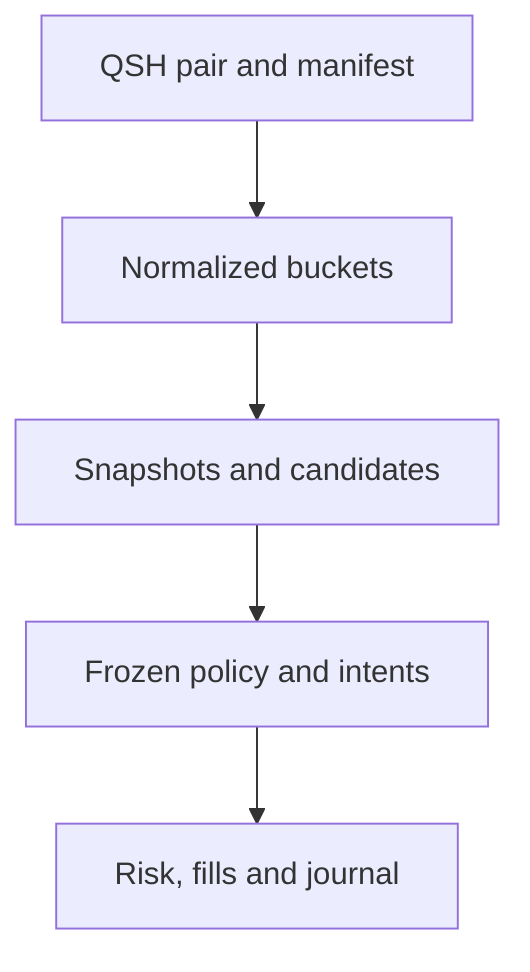

# ORDER-FLOW-QUALIFICATION-001: тестирование и критерии допуска

**Статус:** TARGET QUALIFICATION CONTRACT — NOT IMPLEMENTED.

**Назначение:** определить evidence, необходимое для перехода от данных к
исследованию, от исследования к роботу и от робота к ограниченному live.

Компиляция или один прибыльный backtest не являются экономическим допуском.

## 1. Уровни доказательства

| Уровень | Что доказывает | Чего не доказывает |
|---|---|---|
| Unit/property tests | Локальные формулы и инварианты | Связность всего потока и прибыльность |
| Synthetic scenarios | Известный порядок событий и ожидаемые переходы | Работа на реальном распределении данных |
| Golden replay | Воспроизводимость полного контура на закреплённых файлах | Перенос на другие дни/контракты |
| Historical validation | Устойчивость frozen policy на независимой истории | Live fill/parity и будущую прибыль |
| Shadow/paper | Работа live data path без либо с безопасным исполнением | Достаточную live статистику автоматически |
| Limited live | Фактическое исполнение при минимальном риске | Разрешение увеличивать риск без новых ворот |

## 2. Обязательные наборы данных

1. **Synthetic:** минимальные вручную проверяемые потоки для каждого перехода
   state machine и ошибки данных.
2. **Golden:** небольшие неизменяемые пары Deals/Quotes с manifest, ожидаемым
   event hash, snapshots, observations, markers и intents.
3. **Full-day performance:** полные реальные сессии для памяти, скорости и
   отсутствия потерь.
4. **Development/validation/OOS:** хронологически разделённая история нескольких
   дней и по возможности нескольких реальных контрактов.
5. **Forward/shadow:** данные, которые не участвовали в исследовании.

Raw market data не коммитятся автоматически в Git. Fixture policy должна
определить лицензию, размер, анонимизацию при необходимости и воспроизводимый
способ получения.

## 3. Данные и replay

Для [ORDER-FLOW-DATA-001](DATA_REPLAY_CONTRACT.md) обязательны:

- unit tests parser/normalizer и граничных значений;
- rejection неполной пары, неверного инструмента/даты и неоднозначной metadata;
- property tests: время buckets не убывает, цены/объёмы валидны, один source
  record не теряется и не дублируется;
- одинаковые manifest + файлы дают одинаковый event hash;
- последний bucket дня не теряется;
- перестановка межпоточного порядка одинакового timestamp не меняет решения до
  закрытия bucket;
- изменение будущего suffix не меняет snapshots/decisions прошлого prefix;
- stale/gap/session flags воспроизводимы;
- full-day прогон имеет ограниченную память и фиксированный count событий.

Переход дальше запрещён, если точность timestamp/side либо контрактная metadata
не позволяют однозначно интерпретировать результат.

## 4. Feature engine и observation dataset

Проверяются:

- каждая формула на synthetic sequence с ручным ожидаемым результатом;
- временные, объёмные и trade-count windows на границах add/evict;
- отсутствие чтения незакрытого будущего bucket;
- недоступность quote-derived features при stale/invalid book;
- неизменность уже опубликованного snapshot после добавления будущих событий;
- одинаковые snapshot IDs/values в research replay и frozen strategy replay;
- уникальность observation key и идемпотентный экспорт;
- физическое/логическое разделение features и future labels;
- purge строк на split boundaries;
- отсутствие нормировки по validation/OOS либо будущим сессиям;
- соответствие event journal, экспортированной строки и визуального marker.

Тест leakage должен намеренно изменить только будущие цены/стаканы: features и
candidate transitions до точки изменения обязаны остаться теми же, labels после
неё могут измениться.

## 5. Candidate и strategy lifecycle

Для [ORDER-FLOW-STRATEGY-001](STRATEGY_LIFECYCLE.md) synthetic tests покрывают:

- candidate без confirmation → `Expired`;
- candidate с нарушением уровня → `Invalidated` и no trade;
- invalidated Long не создаёт Short;
- Short возникает только из независимого Short detector/confirmation;
- confirmation не возникает в candidate bucket;
- каждый policy gate возвращает ожидаемый no-trade reason;
- один Candidate ID создаёт не более одного активного entry intent;
- opposite signal при открытой позиции сначала создаёт exit, но не same-bucket
  reverse;
- cutoff блокирует вход и инициирует выход;
- изменение display timeframe не меняет candidate/signal/intent sequence.

State/property tests дополнительно проверяют невозможные переходы, повтор
событий, cooldown, restart snapshot и идемпотентность.

## 6. Исполнение и риск

Для [ORDER-FLOW-EXECUTION-001](EXECUTION_MODEL.md) обязательны:

- запрет fill до activation time и на signal bucket;
- проход нескольких уровней стакана с точным VWAP и price boundary;
- partial fill, остаток, expiry и cancel;
- один snapshot volume не расходуется дважды;
- комиссия и adverse slippage применяются только к исполненному объёму;
- stop создаёт intent, но fill происходит по будущему доступному стакану;
- stale/empty/crossed book отклоняет исполнение;
- late fill после cancel корректирует позицию и защиту;
- повтор command/event не дублирует заявку или fill;
- риск считается по фактически открытому объёму;
- daily loss/reconciliation/disconnect переводят систему в blocked state;
- restart в `Opening`, `PartiallyFilled`, `Open`, `Closing` и `Reconciling` не
  создаёт вторую команду;
- session timer закрывает позицию даже без новых Deals.

Baseline, adverse и severe profiles проходят одинаковые тесты и имеют
зафиксированные config hashes.

## 7. Интеграционный golden flow

Один deterministic test доказывает цепочку:

Golden evidence включает counts и hashes на каждой границе, а не только итоговый
PnL. При изменении принятого контракта golden result обновляется отдельным
осознанным review, а не автоматическим перезаписыванием expected-файла.

## 8. Экономическая проверка

На одинаковых observations, splits и execution profiles сравниваются:

| Вариант | Состав |
|---|---|
| A | Price/session context без order flow |
| B | A + агрессивная дельта |
| C | B + измеренная реакция цены на поток |
| D | C + причинно свежий стакан |
| E, если применимо | Лучший простой baseline + frozen ML ranker |

Если C не превосходит A/B после одинаковых расходов, реакция потока не даёт
доказанного прироста. Если D не превосходит C, стакан не включается в production
policy. Если E не превосходит простой baseline устойчиво, ML исключается.

### 8.1. Основные метрики

- net PnL и expectancy после всех расходов;
- доверительный интервал expectancy с группировкой/resampling по торговым дням;
- maximum drawdown, downside/tail losses и recovery;
- hit rate только вместе с payoff ratio;
- MAE/MFE и время жизни эффекта;
- intents, fills, partial/rejected/expired и fill ratio;
- coverage: какую долю candidates policy принимает;
- концентрация результата по дням, контрактам, времени и regimes;
- чувствительность к соседним параметрам и execution profiles;
- incremental value относительно price-only и rule-based controls;
- turnover и оценка доступной видимой ликвидности.

Accuracy/AUC модели сами по себе не являются торговой метрикой.

### 8.2. Защита от подгонки

- Final OOS открывается один раз для frozen StrategySpec.
- Все просмотренные варианты и неудачные эксперименты остаются в registry.
- Выбирается устойчивое плато соседних параметров, а не единственный максимум.
- Результат считается по дням и контрактам, а не как тысячи зависимых ticks.
- Используется только хронологический split с purge перекрывающихся окон/labels.
- После изменения rules/features/model/threshold OOS становится development,
  требуется новый будущий OOS.
- Walk-forward имеет заранее заданную схему и суммарный учёт всех попыток.

## 9. Визуальное и ручное evidence

До economic gate человек проверяет стратифицированную выборку:

- правильность candidate/confirmation/invalidation уровней;
- совпадение M1 и `Sec15/Sec30` markers с event journal;
- причинный возраст стакана;
- причины no-trade;
- различие signal/intent/order/fill;
- representative wins, losses, no-fills и data-quality rejections.

Ручное решение не меняет отдельную строку или сделку. Если найден системный
дефект, исправляется contract/код, создаётся новая версия и повторяется весь
затронутый прогон.

## 10. Ворота перехода

| Gate | Обязательный результат |
|---|---|
| Data accepted | Manifest/quality report приняты; semantics не двусмысленны |
| Replay qualified | Determinism, bucket invariance и no-look-ahead PASS |
| Features qualified | Formula/golden/visual parity PASS |
| Research dataset accepted | Schema, market-path labels, split/purge и registry воспроизводимы; execution PnL ещё не используется |
| Execution qualified | Causal activation/fills, liquidity ledger, costs и baseline/adverse/severe profiles прошли synthetic/invariant tests; simulation results хранятся отдельно от raw labels |
| Strategy frozen | Только после `Execution qualified`: одна policy, StrategySpec, model artifact при наличии и execution profiles закрыты до OOS |
| Historical go | Инженерные тесты PASS и устойчивое net advantage на OOS/walk-forward |
| Robot qualified | Order/risk/recovery tests PASS; нет unresolved critical findings |
| Shadow/paper go | Live/replay feature and intent parity доказана; latency/fill assumptions откалиброваны |
| Limited live go | Runbook, monitoring, reconciliation и минимальный risk limit утверждены |

## 11. Основания для `no-go`

- эффект исчезает после комиссии, spread, latency или ограниченной ликвидности;
- прибыль возникает из будущего quote, неизвестного same-timestamp order или
  исполнения на signal event;
- результат зависит от недоказуемого пассивного fill;
- Order Flow вариант не превосходит сопоставимый price-only control;
- результат сосредоточен в нескольких днях/контрактах/эпизодах;
- соседние разумные параметры меняют знак результата;
- adverse profile создаёт неприемлемый риск;
- shadow систематически расходится с historical feature/intent sequence;
- данных недостаточно для статистически и операционно осмысленного решения.

`No-go` является корректным результатом исследования. Он запрещает production
торговлю этой версии, но сохраняет данные, код и evidence для следующей явно
сформулированной гипотезы.
