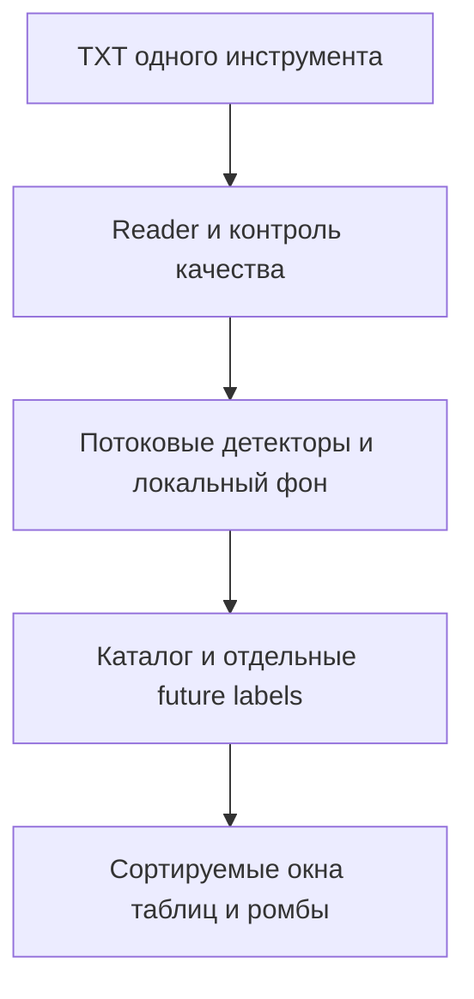

# ORDER-FLOW-TICK-PATTERNS-001: статистика отпечатков тикового потока

**Статус:** TARGET IMPLEMENTATION SPECIFICATION — NOT IMPLEMENTED.
**Область:** только локальный `OsData → Order Flow`, один инструмент и один TXT за запуск.
**Ветка:** `docs/order-flow-production-roadmap`; база постановки `97bd89fb676d074842169a1f9041af595b7eb3ec`.
**Связанные контракты:** `ORDER-FLOW-DATA-001`, `ORDER-FLOW-RESEARCH-001`, `ORDER-FLOW-MVP-RUNBOOK-001`, `ORDER-FLOW-CLOUD-EXPLORER-V2-001`, `ORDER-FLOW-CLOUD-CALIBRATION-001`, `UI-DETACHED-TABLES-001`.

## 1. Результат для пользователя

1. В существующем Order Flow пользователь указывает **один** локальный файл сделок, имя инструмента, папку результатов, даты, ручной `PriceStep` и **профиль именно этого инструмента**. Вкладка/кнопка «Отпечатки ленты» открывает отдельное рабочее окно со статусом и настройками; текущие Cloud 1/2, Cloud Explorer, «Подбор Cloud», Delta, график и прежние артефакты продолжают работать со своей семантикой.
2. «Рассчитать статистику» один раз строит полный каталог наблюдений по четырём независимым типам: **ритм исполнений**, **концентрация одинакового объёма**, **ускорение ленты**, **большой односторонний объём без продвижения цены**. Текущий input полностью проверяется. Таблицы и график открываются по отдельным видимым кнопкам. Статистику можно изучить и отсортировать **до открытия графика**.
3. В таблице **«Сводка паттернов»** одна строка означает группу событий с одинаковыми типом, подтипом, наблюдаемой стороной, размером/периодом, `RangeId` и версией настроек (точный ключ — в §4.5). Сортировка по любой числовой колонке — числовая. «Показать все на графике» выбирает **все вхождения выбранной строки**, переходит к их временному диапазону и показывает ромбы; плотные участки группируются с числом событий и доступом к каждому исходному `EventId`.
4. В таблице **«Каталог событий»** одна строка означает отдельный подтверждённый эпизод. «Показать событие на графике» открывает/активирует график, включает нужный слой, переходит к точному времени/цене этого эпизода и выделяет его ромб. Повторное открытие таблицы или смена сортировки не перестраивают расчёт.
5. Третья таблица **«Исходы и сочетания»** показывает отдельно будущую реакцию цены на заранее заданных горизонтах и встречаемость совместных меток. Она не переименовывает событие в торговый сигнал и не считает прибыль/исполнение. Из неё можно перейти к конкретным событиям.

Весь новый расчёт **opt-in** и не меняет текущую статистику Cloud и её экспорт. Экран остаётся исследовательским: не идентифицирует участника, конкретный TWAP/VWAP, iceberg, Almgren–Chriss или Implementation Shortfall и не отправляет заявок.

## 2. Фактическая база и точки интеграции

| Факт current checkout | Требование для новой реализации |
|---|---|
| `OrderFlowTickReader.cs` проверяет UTF-8/7 полей, `Buy/Sell`, неубывающее эффективное время, SHA-256 на удерживаемом handle; `Id` отброшен, `SourceSequence` сохраняется | Использовать этот reader/контракт, не создавать альтернативный CSV-парсер и не дедуплицировать исполнения |
| `OrderFlowResearchUi.xaml(.cs)` запускает legacy расчёт; `OrderFlowResearchEngine.cs` не сбрасывает окно на границе дня | Новый исследовательский запуск отделить от legacy request/hash/экспорта и явно определить собственную политику времени сессии |
| `OrderFlowResearchChart.*`, `OrderFlowResearchUi.Replay.cs`, `OrderFlowReplaySession.cs` реализуют общий график и причинный покадровый replay | Добавить независимый слой ромбов, точную навигацию и префиксный replay; не подменять историческим результатом ещё не известные события |
| `Explorer/ExplorerStorage.cs`, `Calibration/CalibrationStorage.cs` используют отдельные проверяемые каталоги; `DetachedTables/` — отдельные окна | Применить существующие приёмы дискового каталога, пагинации и lifecycle окон; новый namespace/формат и собственная identity |
| `CLOUD_CALIBRATION_SPEC.md` описывает профили времени и независимые Cloud rules | Переиспользовать определения источникового времени/диапазона там, где это совместимо; **не** наследовать численные пороги Cloud и не менять существующие rules |

Точки кода уточнить до реализации по current HEAD. Если от документа до начала кода checkout изменился, сначала сопоставить diff и переустановить baseline; target-документ сам по себе не является утверждением о готовом коде.

## 3. Вход, время и отдельный профиль инструмента

- Формат — `Date,Time,Price,Volume,Side,MicroSeconds,Id` по `ORDER-FLOW-DATA-001`. `Price`/`Volume` — положительные `decimal`; `Side` — метка источника, её точность как агрессора этим модулем не подтверждается. Не восстанавливать отдельные дочерние заявки из строк исполнений. QSH Quotes/Deals/AuxInfo, брокер и стакан **не являются** входом этой итерации.
- Пользователь указывает **явный код инструмента** (например, `SRU6`), ручной шаг и диапазон дат. Имя файла — лишь подсказка, не доказательство спецификации контракта. Часовой пояс источника неизвестен: часы профиля сравниваются с `DateTimeKind.Unspecified` исходного TXT; не преобразовывать их в МСК. В этой версии границы диапазонов задаются только в **целых минутах `HH:mm`**, `[start,end)` внутри дня (допустимо `end=24:00`), без перекрытий; секунды/дробные минуты отвергаются валидацией, чтобы минутный/TPS bucket не был частичным у входа. Работа через полночь задаётся двумя частями/явным календарным правилом. Каждый диапазон получает устойчивый `RangeId`; он, а не будущая оценка режима рынка, обозначает «временной профиль» в сводке. По умолчанию полный день источника, пока пользователь не выберет диапазоны. Исключённые даты и минуты не прогревают фон.
- В начале **каждого дня и выбранного диапазона** состояние ритма, окна и фон сбрасываются. Ни событие, ни будущий исход не переходят через эти границы. Эта политика относится только к новому режиму; legacy Delta/Cloud сохраняет своё непрерывное окно. Пропуски в активном диапазоне учитываются как нулевые секунды/минуты при расчёте интенсивности; реальные несостоявшиеся сделки не выдумываются.
- Источник с `MicroSeconds=0` имеет только секундную точность. Порядок строк с одной секундой известен по `SourceSequence`, **реальные интервалы меньше секунды неизвестны**. Поэтому в таком файле нельзя проверять ритм 500 мс или обозначать внутрисекундные строки независимыми ордерами. Смешанная точность отмечается в Data Quality; секундные детекторы работают после агрегации в секунды.
- Профиль связывается с выбранным инструментом, диапазонами часов, версией алгоритма и ручным шагом. Все параметры ниже сохраняются **отдельно для каждого инструмента** (и при необходимости для отдельного временного диапазона). Общий шаблон — только отправная точка исследования, **не оптимальный набор порогов**. Нельзя молча применить настройки `SRU6` к `RIU6` или `S1U6`: при новом имени требуется явный выбор/создание профиля и отображение его версии. Изменение порога порождает новую расчётную identity; фильтр показа, сортировка и выделение на графике не меняют её.

### 3.1. Конфигурация и пример исследовательского шаблона

| Группа параметров | Исследовательский шаблон (редактируется в профиле инструмента) | Смысл и валидация |
|---|---|---|
| Фон | Предыдущие 60 **закрытых** минут того же дня/диапазона; минимум 20 законченных минут и 10 активных; для долей размеров минимум 50 исполнений стороны | Ни текущая минута, ни будущие дни не входят; при недостатке данных — `INSUFFICIENT_BASELINE`, а не ноль/«значимый сигнал» |
| Ритм | Период 2–60 секунд; минимум 9 отмеченных секунд | Выбирать только секунды с заданными стороной и **точным** объёмом; список интервалов и допустимая погрешность версии хранятся в профиле |
| Размер | Минута; минимум 30 исполнений стороны и 20 выбранного размера; доля ≥50%; превышение фоновой доли ≥2 раза **или** прирост доли ≥20 процентных пунктов | Дополнительное условие разницы нужно, когда фоновая доля >50% и удвоение недостижимо; оба условия и базовую долю сохранять раздельно |
| Скорость | Секунда: минимум 10 исполнений и ≥3× фонового TPS; минута: минимум 30 исполнений и ≥3× среднего числа исполнений за предыдущие минуты | Секундный и минутный масштабы — разные подтипы одной категории, не суммируются как независимые подтверждения |
| Поглощение | Минута: ≥30 исполнений, объём ≥3× фонового, доминирование одной стороны ≥80%, ценовой диапазон ≤ половины фонового | Фоновый диапазон — медиана только активных минут; отдельно ограничить движение в сторону доминирующей стороны, порог в шагах цены; при нулевом фоне событие не формируется |
| Исход | Горизонты 1, 5, 15, 60 минут после **момента доступности** события; целевые уровни/порог значимости в шагах цены задаются пользователем | Горизонт и границы не вытекают из цвета/типа ромба; не считать PnL и fills |

Значения шаблона повторяют **идею** предыдущего разведочного прогона, но изменяют там, где он давал недостижимые или неоднозначные критерии. Они не были откалиброваны как равноредкие или прибыльные на разных инструментах. Все диапазоны, минимальные выборки, `PriceStep`, цвет и пороги проверяются до запуска; невалидный профиль не запускает job.

## 4. Детерминированные расчёты

Сначала агрегировать по (день, выбранный диапазон, целая секунда), сохраняя для каждой стороны и точного размера **наличие, количество, объём**, а также исходный поток, необходимый для цен. Выполнять один последовательный проход по выбранным тикам и выбрасывать старые buckets после расчёта; не хранить всю ленту в памяти. При смене секунды/минуты закрывать прежний bucket до оценки новых событий; на EOF последнюю незакрытую календарную минуту считать `INCOMPLETE_MINUTE` и не выдавать за обычное закрытое окно. Событие на границе диапазона публиковать только если тик, подтвердивший закрытие, **всё ещё относится к этому же диапазону**; иначе неполноту записать в quality и сбросить состояние. `KnownAt` = время первого тика, подтверждающего закрытие, `KnownSequence` = его ordinal; секунду/минуту источника и время события сохранять отдельно. Второй проход допустим для будущих labels или постфактум статистического контроля только по ранее зафиксированным событиям.

### 4.1. Ритм исполнений (`HEARTBEAT`)

Для ключа `(Side, Volume)` создать упорядоченное множество секунд присутствия. Для каждого разрешённого периода `d` искать цепочку `t, t+d, …, t+(L−1)d` из последовательных **отметок выбранного ключа**, допускающую сделки других размеров/сторон между ними. Несколько строк ключа в одной секунде дают **одну** отметку; сохранять их отдельное количество и общий объём. При `L >= MinMarks` событие впервые становится доступно на последней требуемой отметке (после закрытия её секунды), без переноса точки подтверждения назад к началу серии. Последующие отметки продлевают ту же серию: событие и `EventId` не дублируются. Пересекающиеся периоды и делители явно связывать с серией, показывать первичный период (самый короткий при равном покрытии), не выдавать связанные серии за независимые находки. Секундное округление/пропуск секунд объяснять в строке качества. Сканировать периодический ряд событий, **не автокорреляцию самих временных меток**.

Поле `InitialMarks` (= число отметок при первой квалификации) допустимо в причинной сводке; конечная длина серии — отдельное описательное поле, которое становится известно позднее. Отсутствие ритма ничего не говорит об отсутствии алгоритма с нерегулярными интервалами.

### 4.2. Концентрация размера (`REPEATED_SIZE`)

Для закрытой минуты, стороны и каждого точного `decimal Volume`: `p_current = executions(side,size) / executions(side)`; `p_previous = (k_previous + 0.5) / (n_previous + 1)` по предыдущим 60 закрытым минутам, где `k_previous` — число исполнений выбранного размера и стороны, `n_previous` — все исполнения этой стороны. Проверить пороги §3.1. Хранить обе доли, разницу и отношение, а не одно имя «крупная заявка». Нулевой `k_previous` допустим благодаря сглаживанию, нулевой/недостаточный `n_previous` — нет. Почти одинаковые размеры не объединять молча: это другой, отдельно версионируемый режим.

### 4.3. Скорость ленты (`TPS_SECOND`, `TPS_MINUTE`)

`TPS_SECOND = count(executions in complete second)`; `TPS_MINUTE = count(executions in complete minute) / 60`. Фоновый `TPS_SECOND` — сумма исполнений за доступные предыдущие **секунды** внутри 60-минутной истории, делённая на число этих секунд, включая пустые; минутный фон — среднее число исполнений за предыдущие закрытые минуты (либо его эквивалент в TPS). Сравнивать значения в одинаковых единицах; сохранять абсолютное число, локальный фон и кратность. Для TPS сохранить `Side=Buy/Sell` по знаку фактической дельты объёма окна, при равенстве — `None`; это описание окна, не направление сигнала. Суммарный объём, дельта и изменение цены — контекст, не доказательство HFT или направления. Всплески в соседних секундах связывать в эпизод с отдельными исходными отметками; минутный всплеск и секундный всплеск внутри него показывать как связанные подтипы.

### 4.4. Объём без продвижения цены (`ABSORPTION_CANDIDATE`)

В закрытой минуте считать `V = BuyVolume + SellVolume`, `dominance = max(BuyVolume,SellVolume)/V`, `delta = BuyVolume − SellVolume`, полный диапазон `(maxPrice−minPrice)/PriceStep` и продвижение от первой к последней цене **в сторону доминирующей метки**. Сравнивать `V` со средним полным объёмом за предыдущие завершённые минуты (нулевые минуты учитываются), диапазон — с медианой диапазонов предыдущих **активных** минут. Проверить §3.1 и отдельный профильно заданный верхний предел положительного продвижения в шагах. Для нулевой медианы, недостаточных активных минут или отсутствия допустимого шага вернуть reason code, не делить на ноль. Buy- и Sell-доминирование хранить раздельно; нет направления при равенстве объёмов. «Поглощение» — название исследовательской категории, не заключение о скрытой заявке. Регрессия `volume ~ return` и знак её остатка в эту версию не входят.

### 4.5. Сочетания и дальнейшая реакция

- Каждое событие имеет `EventStart`, `EventEnd`, `AnchorTime`, `AnchorPrice`, `KnownAt`, `KnownSequence`, **`KnownPrice`**, detector/subtype/side, `ProfileId`, `RangeId`, `EventId`, суммы и размер выборки, фон и quality flags. Для минутных событий `AnchorTime` — последняя сделка минуты, `AnchorPrice` — её цена; для ритма — последняя сделка выбранного ключа в девятой **закрытой** секунде. `KnownAt` и `KnownPrice` — время и цена первого следующего тика, подтвердившего закрытие нужного bucket; `KnownSequence` — ordinal именно этого тика. На графике ромб привязан к исходным `AnchorTime/AnchorPrice`, а tooltip отдельно сообщает момент/цену подтверждения. В replay ромб впервые доступен **не ранее `KnownSequence`** (после закрытия bucket он появляется на уже прошедшем участке графика). Дополнение поздних характеристик серии не меняет координаты уже опубликованного ромба.
- `SummaryGroupKey` внутри immutable run однозначно состоит из `(ProfileVersion, RangeId, Detector, Subtype, Side, ExactVolume?, PeriodSeconds?)`: для heartbeat заполняются оба последних поля, для повторяющегося размера только `ExactVolume`, для TPS/поглощения оба пусты (различие секунды/минуты задаёт `Subtype`). `Side=None` — самостоятельная группа. Никакое «время дня» из будущих данных автоматически не подбирается. Запрос «Показать все» выполняется по **этому ключу** на полном дисковом индексе и возвращает все подходящие `EventId`, даже если окно таблицы показывает одну страницу.
- Для сочетания типов объединять события, чей **момент доступности** попадает в выбранное предыдущее окно относительно текущего события. Сохранять четыре логических признака, список `EventId` и порядок их `KnownAt`; не создавать из каждой пары новый независимый торговый сигнал. Агрегировать соседние окна с перекрытием в эпизоды, сохраняя все исходные события. Частоты считать также по дням/профилям, чтобы один всплеск не выдавался за много независимых дней.
- `Horizon` отсчитывать от `KnownAt` внутри того же дня/диапазона; **эталон будущего движения — `KnownPrice`, а не предшествующая `AnchorPrice`**. Первый тик подтверждения уже известен и служит только reference price; для outcome принимать только тики со временем **строго больше `KnownAt`**, чтобы очередность сделок с равным timestamp не выдумывалась. Отдельно для каждого горизонта: число полных наблюдений, signed return **относительно наблюдаемой стороны агрессии** (и обратное направление без скрытого выбора), MFE/MAE в шагах, время до экстремумов и исход `TargetFirst / InvalidationFirst / AmbiguousSameTimestamp / Neither / NoFutureTrade / Incomplete`. Для нейтрального TPS (`Side=None`) сохранять только возврат, движение вверх/вниз и время, без directional target/invalidation и без искусственно выбранной стороны. `Incomplete` нельзя автоматически считать неудачей или успехом. Сначала рассчитывать полный необусловленный каталог, затем группировать; никогда не использовать будущий исход, конечную длину ритма или полную сессию как признак/фильтр онлайн-события.
- В сводке показывать `count`, уникальные дни, частоту на день и по участкам дня, медиану/квантили нормированных величин, долю с полным горизонтом, отдельные исходы и доли по каждому заранее заданному горизонту. По запросу сравнивать с детерминированными несобытийными минутами того же инструмента/диапазона и проверять устойчивость по дням. Сообщать размер контрольной группы и способ отбора; описательный эффект не объявлять торговым преимуществом. Настройки горизонта и правил объединения являются частью расчётной identity.

## 5. Необычность ритма и множественный поиск

Кандидат `HEARTBEAT` после девятой отметки **не получает автоматически** ярлык «статистически значимо». В отдельном offline-действии «Проверить ритм» для зафиксированного набора дат/диапазонов переставлять **целые секундные пачки** внутри каждой минуты, сохраняя сделки пачки, минутную активность и состав секундных пакетов. При каждой перестановке заново искать **максимальную** длину по всем проверяемым дням, сторонам, размерам и периодам данного инструмента: это контроль всего перебора, а не p-value одной заранее выбранной красивой серии. Фиксировать seed, алгоритм перестановки, `B`, измеренный максимум и `p = (1 + #{null_max >= observed_max})/(B+1)`; для заявления `p < 0.01` требуется не менее 999 перестановок и строгое прохождение порога. Контроль ограничен выбранной моделью перестановки: он не исключает особенности источника/торгового расписания или общего участника. При нехватке ресурсов/числа перестановок хранить `NOT_EVALUATED`, не подставлять 0.

Проверка после всего периода — **ретроспективное evidence**: её `p` запрещено показывать как уже известное при реплее прежнего дня и использовать для causal labels/отбора будущих сигналов. Указанные прежде 100 случайных копий поддерживали только описательный вывод о заметной регулярности в этих файлах.

## 6. Интерфейс, сортировка и ромбы

| Место | Обязательное поведение |
|---|---|
| Рабочее окно | Шаги «Данные/профиль → Рассчитать → Сводка/каталог → График»; выбор и редактирование профиля инструмента, видимые `Рассчитать`, `Остановить`, `Открыть сводку`, `Открыть каталог`, `Открыть исходы`, `График и реплей`, `Артефакты`; понятная причина отсутствия строк |
| Таблицы | Каждая — отдельное немодальное окно по кнопке, независимая сортировка/фильтры **по всему каталогу**, глобальная постраничная выборка (начальный размер страницы 250), типизированные сравнения `decimal`/`DateTime`/чисел, стабильная вторичная сортировка по `EventId`; окна переоткрываются с прежним выделением, не скрывают кнопки |
| Сводка | Сортировать по числу событий, уникальным дням, доле исхода, медиане объёма/ритма/TPS, по мере наличия статистики; выбор строки → «Показать все на графике» загружает весь набор её событий, а не только видимую страницу |
| Каталог | Сортировать по `KnownAt`, `EventId`, типу, стороне, объёму, периоду, кратности фона, диапазону, исходу; фильтр/сортировка только меняют показ, не пересчитывают и не удаляют события; выбор → один эпизод с точной навигацией |
| График | Те же тиковые цены, выбранный экранный TF не меняет паттерны; 4 включаемых слоя **ромбов**: фиолетовый ритм, янтарный размер, голубой TPS, красный объём без продвижения. `Buy`/`Sell` показывать подписью и различимой обводкой, не торговым цветом; легенда всегда подписана словами. При наложении ромбы разводятся по визуальным дорожкам/счётчику с кликабельным списком, точный `AnchorPrice` в tooltip сохраняется. Исходы отображаются отдельным текстом/слоем **после** горизонта, не перекрашивают ретроспективно основной ромб |
| Видимость/производительность | Настройки слоёв/фильтров применяются к готовому каталогу без повторного чтения TXT. В видимой области допускается не более 2000 отдельных глифов на слой: остальные события представлены группами с числом и раскрытием всех `EventId`, а при масштабировании вновь доступны отдельные ромбы. Показать `events / glyphs`; переход к выбранному EventId работает даже в группе. Число таблицы и экспорт остаются полными. Текущие Cloud круги/кольца и одиночные квадраты не меняют форму и трактовку |

График может открываться сразу по отдельной кнопке и без выбора строки. Основной сценарий исследования начинается со статистики; переход из сводки и каталога работает в уже открытом или восстановленном графике. При смене TXT/профиля старое окно явно помечено старой identity до нового успешного расчёта, не выдаёт прежние ромбы за новый файл. Подсказка содержит тип, сторону источника, размер/период, абсолютные значения и фон, время события/доступности, причину отбора и версию профиля. Локализация и темы — по действующим UI/`CONTEXT_CODING_GUIDELINES.md`; окна resizable, кнопки доступны при поддерживаемом малом размере и DPI.

## 7. Причинный replay, сохранение, ошибки и ресурсы

- Replay читает **тот же SHA-256** источника, параметры успешного запуска и тот же потоковый detector. До текущего `KnownSequence` видны только уже подтверждённые ромбы; минуты/секунды в работе помечаются `FORMING` лишь в служебной панели, без готового ромба. Сортировка исторических таблиц и future labels недоступны как «знание в моменте». На паузе шаг на одну исходную строку; одинаковые timestamp не добавляют ложные микросекунды. При завершении/отмене восстановить выбранный полный результат и viewport по существующему поведению replay.
- Вынести расчёт из WPF в детерминированное ядро, применяемое к history и replay; UI получает неизменяемые snapshots на dispatcher. Worker и окна освобождают reader/подписки при отмене. Потоковая обработка не должна держать в памяти все 8,5 млн входных строк: минуты и фон ограничены длительностью, каталог/индексы — дисковые по образцу Explorer; сортировка/фильтр/переходы работают по полному источнику без полной загрузки в `DataGrid`. Бюджеты памяти/времени/размера output настраиваются и измеряются; при превышении job отклоняется с reason code, без молчаливого усечения успешного каталога.
- Immutable bundle со схемой `tick-pattern-statistics-1`: manifest (инструмент, path display, SHA-256 и размер TXT, полный record count, выбранные даты/часы/шаг, профиль/версии/formula, параметры фона/горизонтов/seed, precision diagnostics, completion/status), сортируемый каталог и индексы, отдельно summary/labels, quality/rejection counts и checksums. Публикация только после полного успешного чтения и атомарного завершения; старая версия результата не перезаписывается. Изменение только видимости/сортировки — отдельный view state, без смены calculation identity. Reopen и export возможны без TXT, replay требует исходный TXT и совпадающий hash.
- Ошибки — русскими словами в статусе и reason code в manifest/log: `TICK_INVALID`, `TIME_REGRESSION`, `INSTRUMENT_PROFILE_MISMATCH`, `INSUFFICIENT_BASELINE`, `INCOMPLETE_MINUTE`, `UNSUPPORTED_TIME_PRECISION`, `NUMERIC_OVERFLOW`, `RESOURCE_LIMIT`, `SOURCE_CHANGED`, `CANCELLED`, `OUTPUT_IO`. Нехватка фона у отдельного окна — quality counter/невыданный кандидат, а не авария всего файла. Отмена не оставляет опубликованный «успешный» частичный bundle. При decimal overflow не округлять молча; `SourceSequence` и время должны сохранять воспроизводимую identity.
- Никакие настройки размера тика, количества исполнений, волатильности и часов **не общие между инструментами по умолчанию после сохранения профиля**. Сравнимость относительных порогов не гарантирует равную частоту: показывать по каждому инструменту распределения фона, число кандидатов на день, долю «без фона» и stability между периодами. Пользователь меняет отдельный профиль и повторяет исследование; автоматически «оптимальный» профиль не выбирать.

## 8. Приёмка и доказательные данные

Тестовые synthetic TXT/модели допускаются в `project/Tests/OrderFlowResearch/` без включения больших пользовательских файлов в Git. Проверить минимум:

1. Reader: BOM, seven fields, `decimal` шаги `10` и `0.01`, `MicroSeconds=0`, повторные идентичные строки, неизвестный Side, time regression, overflow, inclusive dates, SHA/pinned source, разные session ranges, отклонение нецелой границы минуты.
2. Четыре detector fixture с ручным oracle: девятая отметка ритма и продление без дубликатов, посторонние сделки между отметками, пачка в одной секунде, минутная группа одного размера, общий и секундный TPS, Buy/Sell поглощение и price range с excursion; `p_previous>0.5` покрывается альтернативой разницы долей. Нулевой/недостаточный фон, пустые секунды, неполная минута на EOF, граница дня и одинаковые timestamp не создают ложных qualified событий.
3. History/replay parity по `EventId`, `KnownAt`, `KnownSequence`, `KnownPrice` и доступному префиксу на каждом контрольном `SourceSequence`; никакой ромб или future outcome раньше своего времени. Fixture с двухминутной паузой между `AnchorPrice` и `KnownPrice` доказывает, что labels отсчитываются от цены подтверждения; равные timestamp не выдаются за будущие сделки. При смене TF события не пересчитываются. Соседние секунды, связанные heartbeat-периоды и пересечение паттернов не удваивают независимые события.
4. Сводка и каталог: сортировка всех строк при пагинации, типизированное возрастание/убывание и устойчивые равенства, фильтр без изменения manifest/hash, выбор summary→**все** соответствующие EventId на графике, выбор catalog→**один**, переход к точному ромбу вне лимита первичного просмотра, связанная легенда и tooltip в обеих темах. Окна открываются/закрываются повторно без лишних worker/subscription и потери выбора.
5. Bundle: одинаковые байты + профиль → идентичный каталог/хэши, новое значение профиля → новая версия, повторное открытие/экспорт без TXT, replay после изменения файла отвергнут, ошибка/отмена/лимит не публикуют успешный частичный bundle. Верифицировать потоковую память и сортировку на ≥1 000 000 синтетических строк, без зависания UI; зафиксировать фактические peak/время и лимиты, не выдавать лабораторное число за universal performance guarantee.
6. Штатные проверки после кода: targeted Order Flow tests, `dotnet build project/OsEngine.sln` при изменении tests, validator из корня `bash .agents/validation/validate-agent-system.sh`, `git diff --check`, ссылки/статусы DOCMAP; независимый production и documentation review на frozen checkpoint, ручная проверка Windows UI/DPI как `REQUIRES OWNER-RUN`. Не запускать терминал, connector, MCP stand или торговые операции без отдельного запроса.

Реальные файлы пользователя **не коммитить**. Для owner-run/data qualification можно проверить три SHA и наблюдаемые контрольные фрагменты:

| Инструмент, SHA-256 TXT | Контроль исходных строк (не golden number новых детекторов) |
|---|---|
| `SRU6`, `435ea400ffcc45cd3215be0806f660368a024d1c2942b8eed8aa8e3d2fed1f7b` | 3 130 667 строк, `MicroSeconds=0`; 22.06.2026 10:50 — 97 исполнений, Buy 1119 / Sell 4, диапазон 28949–28950; 15.06 в выбранной группе Sell×1 — 73 пятисекундные отметки |
| `RIU6`, `71e8f279b7bf0277674fc64b049d6f5a14b518e5decec5d804c4bd60259f8a35` | 3 628 684 строк, `MicroSeconds=0`; 13.08.2026 17:35 — 195 исполнений, Buy 7 / Sell 2126, диапазон 84370–84380; 09.06 11:09 — 73 Sell×3 из 99 Sell |
| `S1U6`, `5e3f74192187e97d2ae9a3adf976fab9ac9a1ff76271a12543ecefe6ff4a20e6` | 1 699 114 строк, `MicroSeconds=0`; 26.06.2026 12:10 — 49 исполнений, Buy 3221 / Sell 215, диапазон 58.81–58.83; 25.06 18:28 — 395 Buy×20 из 470 Buy |

Точные количества результатов старого разведочного прогона (`364/19/47` heartbeat и т. п.) **не golden acceptance** нового расчёта: их код/все правила отбора здесь не переносились один к одному. Сверка допустима по исходным строкам, независимым synthetic oracle и явно сохранённому профилю. На этих файлах не проверены брокерский смысл `Side`, полнота ленты, прибыльность, исполнение заявки и перенесение результата на другие контракты.

## 9. Порядок реализации для агента

1. Зафиксировать current HEAD/dirty boundary, прочитать `AGENTS.md`, compact workflow, `ACTIVE_TASK.md`, `DOCMAP-001` и перечисленные current Order Flow contracts; уточнить реальные точки интеграции. Работа только в форке `2Rukin/OsEngine` на согласованной ветке; не обращаться к внешнему upstream как к реализации.
2. Добавить модель одного профиля инструмента и валидируемый immutable ResearchSpec; реализовать четыре потоковых detector, background, reason codes и golden synthetic fixtures. Чётко разделить текущие признаки и будущие labels; отдельно сделать дисковый catalog/manifest/reopen.
3. Встроить шаги пользователя в Order Flow, отдельные окна сводки/каталога/исходов, полную сортировку/фильтрацию, переходы «все/одно», затем независимый слой ромбов на существующем графике и тот же причинный replay. Не менять legacy Cloud 1/2, Explorer, Calibration и прежние exports ради новых паттернов.
4. Выполнить scoped targeted/solution checks и независимый review по repo workflow; обновить **current** runbook/guide/qualification и DOCMAP только после фактической реализации, отличая прошедшие тесты от owner-run Windows UI и от непроверенной экономической гипотезы. Обычный commit/push только в рамках явного разрешения владельца на этап реализации.
