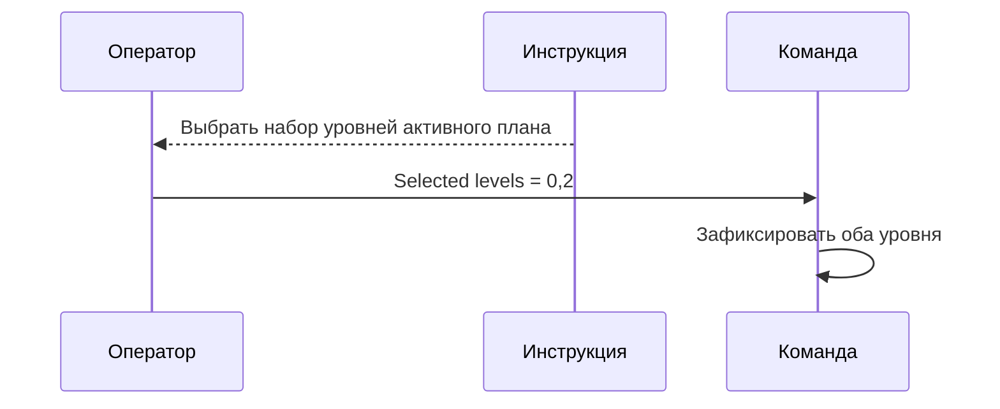
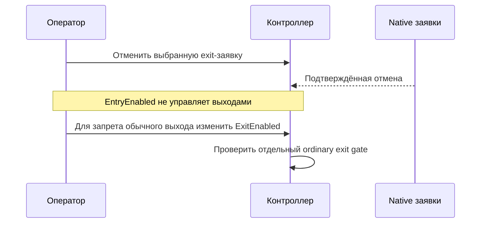

# THG-BATCH-REVIEW-011: scoped implementation review

**Статус:** TERMINAL — CLEAN/CLEAN.
**HEAD:** `088add98b728f8088fb18ff2e59c8d4113ad043c`.
Scope: [THG-BATCH-011](BATCH_LEVELS.md), validated selections, durable manual entry,
exit lot snapshot, selected edit/cancel, schema4 and native controls/evidence.
Entry batch-entry.json SHA256
`a2fca09f7e95e55e9c9f782658a1feb4ab061a311f70aa522e94e54c420cdcf9`,94files.
Copies/manifests/diffs TEMP/TradeHelp4-analysis. Main sole writer; independent
safety/docs reviewers read-only. Previous009/010terminal reviews not reopened.
Final solution build --no-restore0errors17existingwarnings20.78sec;
managed offline harness670/670 (55added to615baseline). First test run's two
expectations observed an ordinary profit exit ahead of pending manual entry;
isolated the entry-progress case with ForbidExits, preserving production priority.
PRIMARY production CLEAN; documentation returned two bounded DOC_STALE findings.
Validator109PASS,90links0missing,diffcheckPASS. Runtime and tests unchanged by
following documentation-only fixes; final build/harness evidence remains valid. No live/GUI/credentials/native sessions,
commit/push. Existing dirty worktree preserved.

## PRIMARY exact checkpoint and findings

batch-primary.json SHA256
`baff42f417dcf567b3598a8736b13318659efd6c32c8183d7e49d61f3f0a2df8`,
97files17changed; both roles verified97/97. Production PRIMARY CLEAN is reused
on unchanged runtime/test boundary; only documentation requires VALIDATION_1.

| Finding | Severity/business | Scope/modes | State |
|---|---|---|---|
| THG-BATCH-DOC-001 DOC_STALE | LOW/BUSINESS_LOW | REGRESSION; UI/operator Live/Tester/Optimizer | FIXED/CLOSED |
| THG-BATCH-DOC-002 DOC_STALE | MEDIUM/BUSINESS_MEDIUM | IN_SCOPE; selected cancellation/operator Live/Tester/Optimizer | FIXED/CLOSED |

DOC-001: older operator paragraph still restricted renamed Enter selected levels
to one level, although Selection→SelectLevels→EnterLevels captures CSV/all.
PROVEN/REACHABLE when operator selects several IDs. Consequence is conflicting
instruction hiding the new feature. Strongest counterevidence: the new section
already described lists correctly and runtime had no singleton restriction.
SHOULD_FIX; owner APPROVED_FOR_FIX. Fixed paragraph and explicit all fallback.
Terminal relation PRIMARY→FIX→VALIDATION_1; no runtime change.

DOC-002: cancel paragraph suggested EntryEnabled=false to prevent all ordinary
reposting, but CancelLevels also captures exit-intents. With held, enabled exit,
reached target, fresh data and reconciliation, confirmed cancel frees reservation
and ordinary exit can be posted again despite disabled entry. PROVEN,
CONDITIONALLY_REACHABLE under these conditions. Consequence: wrong expectation
that exits stop. Real broker execution/loss not claimed. Counterevidence: advice
was correct for entries; BATCH contract correctly preserves future ordinary trade.
SHOULD_FIX; owner APPROVED_FOR_FIX. Fixed instruction separates EntryEnabled from
ExitEnabled and says neither ordinary flag blocks emergency/voluntary reduction.
Terminal relation PRIMARY→FIX→VALIDATION_1; controller unchanged.

## Terminal result

Production PRIMARY CLEAN; documentation VALIDATION_1 CLEAN. DOC-001/002 CLOSED.
VALIDATION_2 not needed. batch-validation1.json SHA256
`d16d935a22541a29dd2d6b0938bb8c96f7082a68314637e414da336f1fdf6ee9`,
97files17changed. Docs reviewer verified97/97 and unchanged runtime/test/build
hashes versus PRIMARY.670/670,build0errors17warnings,validator109PASS,90links0missing.
Final status/index edits leave this runtime boundary unchanged. No commit/push.
Scope011 complete; original full-source scope still not claimed complete. Next
separate question is source optional empty-strategy removal via native owner lifecycle.
