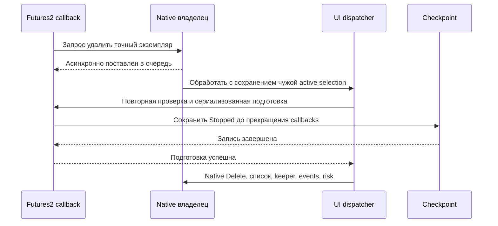

# THG-EMPTY-012: удаление неработавшего пустого робота

**Статус:** CURRENT IMPLEMENTATION — OFFLINE CHECKS PASSED, REVIEW CLEAN/CLEAN, LIVE/GUI NOT QUALIFIED.
**HEAD:** `088add98b728f8088fb18ff2e59c8d4113ad043c`. **Дата:** 2026-09-29.
Дополнение к [ADR-THG-002](ADR-0002_OSENGINE_IMPLEMENTATION.md),
[review012](EMPTY_REMOVAL_REVIEW.md) и native ROBOTS-ARCH-001.

## Контракт текущего этапа

`Policy.RemoveEmptyRobot`, default false, добавляет opt-in удаление отдельного
Futures2 после уже сработавшего EmptyStop. Параметр не включает сам Trailing или
EmptyStopMinutes. В Trader владелец OsTraderMaster принимает запрос и повторно
проверяет конкретный экземпляр на UI dispatcher. BotPanel.Delete не вызывается
из callback/timer самого робота. Native keeper/list/events/risk обновляет владелец;
другой активный робот не подменяется удаляемым по имени или UI selection.

Допуск строго ограничен отсутствием всей торговой/учётной истории кампании:
нет lots, intents, native positions, registration ledger, pending manual/config/
rollover/transfer/group obligations; есть свежая native/account сверка. Любая
известная активность или неизвестный исход блокирует автоматическое удаление.
Нет использования portfolio/coordination: checkpoint хранит nullable
CoordinationUsed, false только у нового adapter-owned checkpoint; legacy отсутствие
поля означает unknown и блокирует удаление. Включение coordination/portfolio
ролей навсегда устанавливает true до публикации peer snapshot. Ручное отключение
параметра не стирает эту историю. Старый неизвестный или участвовавший робот
остаётся для явного ручного удаления, а не объявляется изолированным автоматически.

Подготовка удаления сериализована с callbacks, сохраняет State=Stopped и причину
до quiescence/host destruction; ошибка записи прекращает удаление. Campaign
checkpoint остаётся для расследования, native lifecycle удаляет обычные настройки
и ресурсы робота. После прерывания между checkpoint и native keeper нет обещания
немедленного автоматического удаления: восстановление требует штатной сверки.

Tester/Optimizer сохраняют экземпляр и журналы для результатов/следующего прохода:
работает обычная EmptyStop-пауза, физического автоудаления нет. Это явное различие
lifecycle, а не подтверждение полной Tester/live parity. Новый optional policy/
metadata формат не повышает schema4: старый reader игнорирует remove/history поля
и сохраняет прежнюю EmptyStop-паузу без автоматического удаления.

## Источник и ограничения переноса

TralingStop.cs SHA256
`3dd59b18c4c3ac1808138753edcb8e1a16d42b11b14f04db59373952d27e9abd`,
1871–1888: StopEmptyByTime + CreatedDateTime + elapsed + !WasActivity останавливает
выбранные стратегии/helper; optional RemoveStrategiesEmptyByTime запрашивает их
удаление у portfolio owner. Target добавляет strict never-owned/never-coordinated
проверки и удаляет только собственный отдельный робот. Групповое удаление чужих
стратегий/helper и автоудаление когда-либо отправлявшего заявки здесь не заявлены.
Source static contract: [THG-F2-HOST-001](FUTURES2_HOST_AND_CALLBACKS.md).

Реализовано в BotPanel/OsTraderMaster, Futures2NativeAdapter и Futures2Grid.
Managed harness: 768/768 (98 новых assertions), full solution build успешен.
EmptyRemovalCases вызывает реальные методы guards/preparation на fixture-объектах;
request/deferred callback моделирует fake owner. Вызовы настоящего WPF dispatcher,
DeleteRobotCore, уничтожение keeper/settings, UI screener/hot-update и процессное
аварийное завершение не проверялись: REQUIRES OWNER-RUN. Сохранение checkpoint и
отказ при ошибке записи проверены реальными временными файлами. Нет live evidence.
Независимые verdict и exact checkpoint — [review012](EMPTY_REMOVAL_REVIEW.md).

## Наблюдаемость и отказ владельца

Preview показывает `Empty removal` и coordination history. Queue acknowledgement
не означает удаления; при отказе final check робот остаётся и следующий pass
обновляет причину. При отсутствии UI/owner request возвращает false. Запросы одного
экземпляра объединяются до обработки. Дубликаты имён и active hot-update alias
блокируются, не перенаправляются на другой экземпляр. Ошибки подготовки/host
попадают в native log, ошибка persistence также fault-ит кампанию. После успешной
подготовки host cleanup использует существующий native best-effort Delete/Save;
это не атомарная транзакция файлов. Ошибка host cleanup может оставить stopped
экземпляр/keeper для ручного восстановления. Campaign JSON не удаляется.

Account guard использует существующую явную сверку own + declared ExternalNet;
свежий owner-attested zero допускается как в reconciliation, а не выдаётся за
broker snapshot. Пустая неиспользуемая вторая вкладка не требует account snapshot,
но её journal и список local stop-openers обязаны существовать и быть пустыми.
Любая такая локальная заявка блокирует удаление без её отмены. Fresh ready quote
и неизменность endpoint identity/tick/paper profile проверяются повторно.

