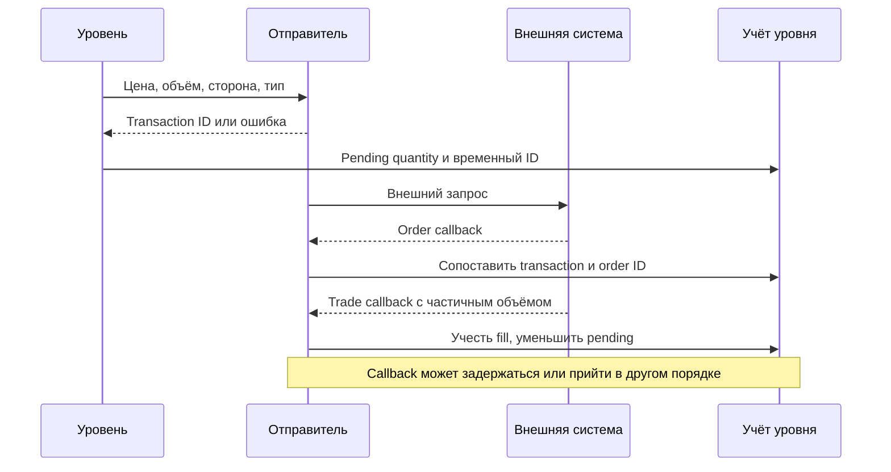
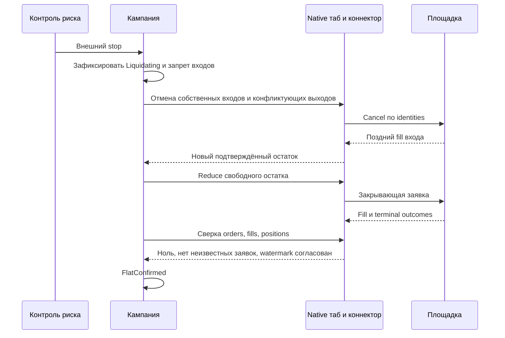

# THG-EXECUTION-001: заявки, исполнения и восстановление

> Историческая спецификация и evidence baseline этапа исследования. Текущий
> implementation contract: [ADR-THG-002](ADR-0002_OSENGINE_IMPLEMENTATION.md);
> native команды: [THG-OPERATOR-002](OSENGINE_OPERATOR.md). Указания «будущий»/
> «код не менялся» ниже относятся к исходному исследованию, не к текущему diff.

**Статус:** OBSERVED LEGACY FLOW + PROPOSED EXECUTION CONTRACT, NOT IMPLEMENTED.

**Дополнение target:** числовой домен всех intents, fills, средних, TP/stop и
checkpoint задаёт [THG-PRICE-001](PRICE_DOMAIN.md). Signed price и Limit(0)
не меняют side/quantity/ownership и не обозначают Market/missing. При partial
fill денежный резерв переносится pending→held без потери точности; старые
fills/цены working orders не переквантовываются при runtime-настройке.
Restart требует schema/presence/tick проверки до возобновления. Это новые
требования, а не исправление описанного ниже OBSERVED execution.

## OBSERVED: от уровня до внешней заявки

В DTI `StrategyDTI.GetStrategyReaction` вызывает manager; manager выбирает
`Zone.GetZoneReactionBuy/Sell`, затем `ZoneBasket` и его инструменты.
Нормальная отправка проходит через strategy SendOrder и общий OrderSender.
При grouping DTI использует MultiOrderSender, а DTF создаёт
`OrderSendingContainer` для каждого локального намерения и группирует их
по ключу `Ticker + BuySell + Price`.

`PilotFinanceSystem.QuikPlatform.SendOrder → Quik.SendOrder` формирует обычную
либо stop-транзакцию и вызывает wrapper `QuikApi.send_async_transaction_test`.
Положительное возвращаемое значение — transaction identity после успешного
локального вызова; это не подтверждение fill. Поля broker/account берутся
кодом из настроек, значения этих настроек в исследовании не читались.
Совместимость формата с текущей внешней спецификацией QUIK не проверялась.

После order callback zone заменяет временный ID номером заявки.
Trade callback сопоставляет номер заявки, проверяет локальный список trade IDs,
увеличивает/уменьшает inventory и остаток pending. В DTF `RegisterOrderBuy`
обслуживает и набор шорта; направление брокерской операции хранится отдельно.

Групповой callback разделяет количество по контейнерам и генерирует локальные
номера order/trade. Подробно восстановлены проверка внешних ID в wrapper,
запись ID только при завершении хотя бы одного контейнера, повтор частичного
fill, cancel/fallback и host unmatched replay. Канонический разбор —
[THG-F2-HOST-001](FUTURES2_HOST_AND_CALLBACKS.md). Он не устанавливает глобальную
exactly-once гарантию. Будущий contract ниже не описывает существующий ledger:
в legacy slot flags и order lists могут разойтись.



Диаграмма показывает логические зависимости, а не гарантию временного порядка
в реализации: некоторые callbacks могут возникать до возврата SendOrder.
Для полного доказательства нужна трасса конкретного runtime route.

## PROPOSED: сущности и identities

| Сущность | Обязательные поля/смысл |
|---|---|
| Campaign | Stable ID, instrument/account reference, direction, mode, lifecycle state, stop reason, plan version |
| GridPlan | Schema/version/hash, metadata snapshot, L/U, explicit stop bounds, N, таблица P/q/TP, budget model, принятые параметры |
| Level | LevelId, plan version, cycle counter, native Position identities, held qty, entry/exit reservations |
| Intent | Stable intent ID, level/cycle, Increase/Reduce/Protect/Cancel, side, quantity, limit/type, created receive sequence, status |
| NativeOrderLink | NumberUser, NumberMarket при наличии, connector session identity, intent, immutable requested qty, cumulative executed qty |
| Fill reference | Connector/instrument/order/trade identity, quantity, price, source/receive times; ссылка на факт native учёта |
| Checkpoint | Schema, campaign/plan hash, последняя обработанная sequence, незавершённые intents, stop latch, integrity hash |

Account reference — непубличная ссылка/идентификатор, не credential.
`LevelId` не выводится из одной цены: после перенастройки/повтора уровня
одинаковые цены не означают одинаковое намерение. Новая версия плана не
переименовывает старые заявки. Отмена содержит точную native identity.

Основной учёт fills/positions принадлежит `Journal`/native сущностям. Strategy
checkpoint не должен независимо «создавать сделки». Если Position связывается
с новой level cycle, связь устанавливается по identity и сохраняется до
завершения всех старых order outcomes.

## PROPOSED: состояние кампании

| Состояние | Разрешённое поведение | Переход |
|---|---|---|
| Draft | Расчёт и preview, без ордеров | Валидация → Ready |
| Ready | План зафиксирован; проверка readiness | Явный start + reconciliation → Active |
| Active | Входы/выходы в рамках бюджета | Pause, stop, disconnect, fault |
| PausingEntries | Входы запрещены, отмена pending entries, обработка fills | Cancel outcomes → PausedEntries |
| PausedEntries | Только сопровождение/сокращение | Явный resume после readiness либо Liquidating |
| Liquidating | Защёлкнут emergency reason, входы запрещены, отмена/сверка/сокращение | Доказанный flat → FlatConfirmed; потеря достоверности → Reconciling |
| Reconciling | Запрет новых входов и неоднозначных повторов, broker/native сверка | При stop latch обратно Liquidating; иначе явный resume |
| Faulted | Ошибка видима; сохраняется risk ownership и обработка fills | Исправление/сверка; не сброс в Draft |
| FlatConfirmed | Нет inventory и потенциально исполнимых собственных ордеров | Stop либо новая campaign |
| Stopped | Кампания окончена; поздние события всё ещё коррелируются | Новая campaign, не автоматический вход |

Отключение data stream не переводит позицию в FlatConfirmed. `Faulted` не
означает прекращения обработки executions. При невозможности автоматического
сокращения state сообщает outstanding exposure и требует вмешательства.

## PROPOSED: состояние заявки

```text
IntentRecorded → SubmitPending → Working → PartiallyFilled → Filled
                         ↘ Rejected
                         ↘ Unknown → Reconciliation
Working/PartiallyFilled → CancelPending → Canceled
CancelPending → PartiallyFilled/Filled (fill пришёл во время отмены)
```

Timeout — Unknown, не Rejected. CancelPending сохраняет fillability исходного
остатка до terminal confirmation. Cancel reject не снимает резерв. Working
status с более старой sequence не откатывает учтённые fills. Fill до order
ack попадает в bounded unmatched buffer и вызывает сверку; повторная отправка
«потерянного» order не разрешается.

Dedup key включает область уникальности trade ID данного connector; одного
числового номера без instrument/order/session недостаточно, если площадка
переиспользует номера. Коррекции/bust trades требуют отдельной capability;
неподдержанный correction переводит в сверку, а не отрицательный обычный fill.

## PROPOSED: количество и резервы

Для уровня h — подтверждённый held qty, e — оставшийся потенциально исполнимый
entry, x — оставшийся exit, включая Unknown/CancelPending. Новое увеличение
не больше `max(0, planQty − h − e)`. Новое обычное сокращение не больше
`max(0,h − x)`. Для emergency выбирается то же ограничение количества, но
цена/приоритет определяются emergency policy. Каждый fill меняет h, e/x и
native mapping ровно один раз в serial decision stream.

Одновременные broker stop и local exit входят в один резерв x, если оба могут
исполниться независимо. Не предполагать OCO/reduce-only. Если нужен отдельный
protective stop, capability должен доказывать его совместимость с обычными
выходами; без неё нельзя ставить два независимых full-volume выхода.

На netting счёте inventory собственного робота сверяется с общей позицией
с учётом других владельцев. Нельзя закрывать чужую позицию по разности
несогласованных snapshots. Для первой реализации предлагается отдельное
владение instrument/account; совместная торговля требует allocation contract.

## PROPOSED: алгоритм аварийной ликвидации

1. Сохранить stop latch, время/причину и snapshot цен. Запретить любые новые
   increases, rearm уровней, авторасширение и ручное наращивание.
2. Запросить отмену всех собственных entry и конфликтующих normal exits/stop
   orders. Вести отмену по identity; поддерживать обработку всех fills.
3. Известный свободный остаток можно сокращать, не ожидая всех entry cancel:
   будущие entry fills снова увеличат остаток. Нельзя дублировать неизвестные
   exits; x сохраняется до сверки. Такое решение сокращает риск задержки,
   сохраняя защиту от over-close.
4. Отправлять Reduce intent допустимого объёма выбранным способом. При market
   reject/price band/закрытой сессии — классифицировать ошибку, bounded retry
   только с известным исходом; иначе Reconciling. Внешняя ликвидность не
   гарантируется.
5. Повторять по подтверждённым новым фактам. Поздний entry fill после cancel
   request порождает новый остаток для закрытия. Порог slippage не допускает
   скрытого бесконечного widening: исчерпанная policy → alarm + owner action.
6. Подтвердить h=0, отсутствие entry/exit/stop с неизвестным или активным
   исходом, пустой unmatched buffer, согласованность с broker snapshot и
   полноту событий до согласованного watermark. Только затем FlatConfirmed.



## PROPOSED: crash и reconnect

Checkpoint пишется versioned форматом в temp-файл с проверкой целостности и
атомарной заменой в пределах поддержанного filesystem. Native journal и
strategy checkpoint не становятся общей транзакцией от одной atomic rename.
Порядок intent-before-send, crash после send-before-ack и restart replay
проверяется отдельно. Старые binary serialized blobs TradeHelp не исполняются
и не десериализуются автоматически.

После запуска: загрузить план/stop latch → подключить native state → запросить
broker positions, активные обычные и stop orders, fills от watermark →
сопоставить IDs → пересчитать резервы → сравнить остатки. Snapshot без
гарантии полноты callback stream требует повторной сверки до стабильного
состояния; один sleep не доказывает завершённость.

Unknown submit сопоставляется по поддерживаемому client ID/query contract.
Если однозначный поиск невозможен, автоматический resend/entry блокируется.
Ненайденная локальная заявка не считается отменённой от одного отсутствия
в неполном снимке. Corrupt/unknown schema не обнуляет позицию и не создаёт
новый активный grid. Rollback меняет код/план только после cancel/drain/сверки;
он не откатывает совершённые сделки.
