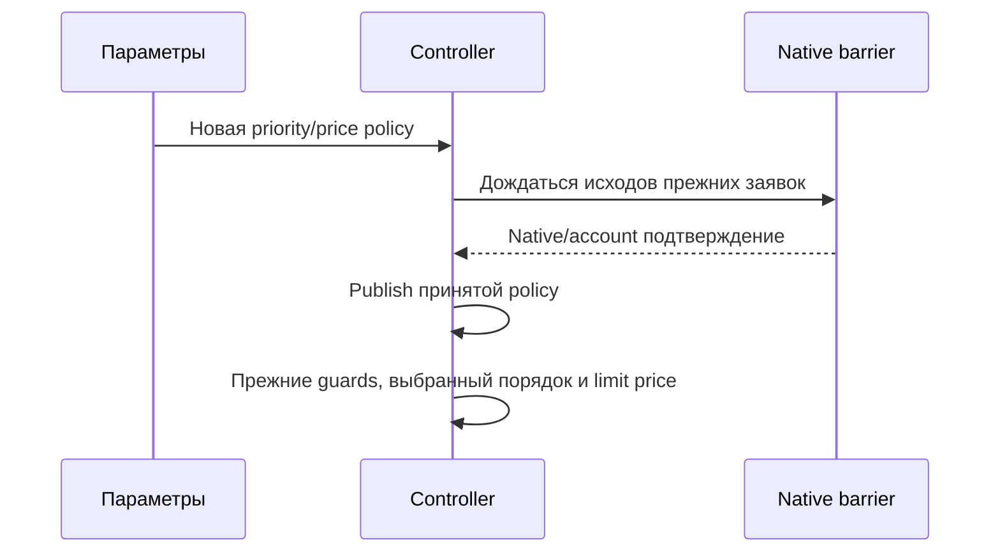

# THG-EXECUTION-OPTIONS-013: приоритет уровней и обычные limit-цены

**Статус:** CURRENT IMPLEMENTATION — OFFLINE CHECKS PASSED, REVIEW CLEAN/CLEAN. **HEAD:** `088add98b728f8088fb18ff2e59c8d4113ad043c`.
Дополнение к [ADR-THG-002](ADR-0002_OSENGINE_IMPLEMENTATION.md).
[Независимая проверка](EXECUTION_OPTIONS_REVIEW.md).

## Контракт

Две runtime boolean политики, обе default false:

- `Policy.AscendingLevelPriority`: обход входных уровней по возрастанию Price;
  обычные выходы — по цене соответствующего уровня, stable при равной цене.
  Не меняет ID, price/volume/markup, carry бюджета, существующие lots/intents и
  CSV-selection. При false сохранён порядок plan.Levels для входов и Book.Lots
  для выходов. MaxActions/funds выбирают первые допустимые элементы этого порядка.
- `Policy.QuoteOrdinaryLimits`: только достигнутые обычные входы/выходы используют
  физический Buy=Ask+ThresholdTicks*tick, Sell=Bid-ThresholdTicks*tick, с округлением
  к admissible tick в сторону исполнения. IsHedge меняет физическую сторону,
  логические triggers/targets/HJ не меняются. Ноль и отрицательные quotes допустимы.
  SlippageTicks не добавляется в этой ветке. При false прежняя price policy сохранена.

PreEntries/PreExits до достижения trigger сохраняют level/target цену; manual
entry/exit, funded entry, replacement entry и emergency/voluntary reduction
сохраняют существующую Aggressive политику. MarketOrders всё так же выбирает тип
заявки, сохранённая reference price не обещает цену исполнения. Сначала рассматриваются
выходы, затем входы; это сохраняет текущий native порядок, а не legacy interleaving.
Priority действует также на обычные selected-level commands и входы replacement;
это порядок обхода, а не изменение их guards/ценообразования.

Изменение параметров проходит existing cancel-confirm Configure/Publish barrier.
Unknown удерживает reservations. Новые flags при true требуют schema5 для active
или pending policy; отключение не понижает версию. Reader принимает1..5; старые
readers отвергают5. Отсутствующие bool поля legacy означают false.

## Source boundary

Локальный dti.cs SHA256
`523f17b7db8d9b3754f30375c4237ecc0d23c78af8739163da6930a26de6ed78`.
MakeStrategyDTF10131–10150 распределяет объём в builder order;10165 сортирует
m_Zones ascending; Active10601 обходит полученный порядок. DBItem3701/3738 и
обычные tickets13518/14037 используют directed quote±threshold. Target priority
не перестраивает budget allocation и не обещает численной parity исходного sizing.
Строгие cancel/Unknown, funds, logical HJ и native reservations сохраняются.
Цена заявки и цель выхода различаются; изменение limit policy может повлиять на
очерёдность/цену реальных исполнений. Venue fills и экономический результат не доказаны.

Managed harness861/861,93 новых assertions; production solution build0errors,
17existingwarnings. Финальный test-only incremental build0errors,1NU1900
(NuGet vulnerability endpoint unavailable). [Review013](EXECUTION_OPTIONS_REVIEW.md)
фиксирует checkpoint и независимые verdicts. Physical broker/GUI NOT_RUN.

Source reconstruction независимо сверена по локальным hashes и указанным anchors.
Source нулевая quote считалась отсутствующей, а budget collateral зависел от цены:
эти ограничения не переносятся. THG-PRICE-001 и явное presence сохраняются.
Новая общая quote-price может объединить несколько entry allocations при
GroupOrders=true и MaxActions=1; общий Capital/day/funds резерв проверяется для
каждого добавленного уровня. Выбор уровня при таком grouping не равен числу orders.

