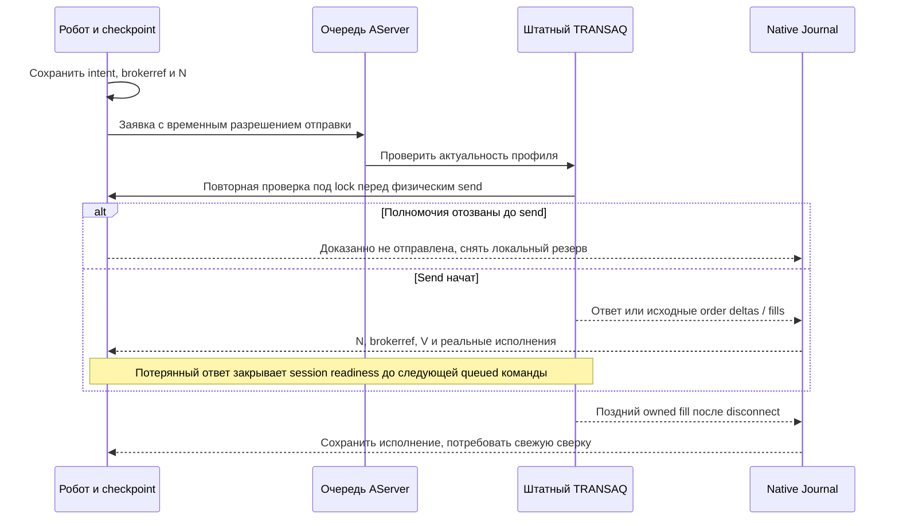

# THG-TRANSAQ-IMPLEMENTATION-006: адаптация штатного TRANSAQ

**Статус:** CURRENT IMPLEMENTATION — OFFLINE CHECKS PASSED; REVIEW CLEAN/CLEAN; LIVE NOT QUALIFIED.
**Дата:** 2026-09-29. **Baseline:** `088add98b728f8088fb18ff2e59c8d4113ad043c`.
Основание: [THG-TRANSAQ-PLAN-001](FINAM_TRANSAQ_PLAN.md),
[ADR-THG-002](ADR-0002_OSENGINE_IMPLEMENTATION.md). Этот документ уточняет
реализацию выбранного транспорта; границы offline evidence и отдельного live допуска приведены ниже.

## Протокол и профиль

Owner подтвердил единый счёт и обычный TRANSAQ. Новый параметр коннектора
`Signed FUT transport profile` по умолчанию `Off`; основной профиль
`Standard union`, отдельная ветвь `Standard FORTS`. Параметр добавляется после
существующих 0–14. Смена профиля закрывает readiness и требует reconnect/сверки.
Профиль ограничен `FUT`; HFT, опционы и FUTSPREAD сюда не входят.

Исследован [авторский PDF](https://files.comon.ru/usercontent/TXmlConnector.pdf):
6.47 / 2.26.4, Rev.09.09.2025, 94 страницы. Локальная tracked DLL имеет
FileVersion 2.26.0 / ProductVersion 6.45, SHA256
`ED8711F626A511BD8CE27A970627E21A35F98D543EB641945E15C61EEDCBC217`.
DLL не загружалась и не заменялась. Точная редакция manual для 2.26.0 не найдена;
загрузка PDF для SHA завершилась timeout, побайтовая фиксация отсутствует.
Совместимость выбранной DLL/сервера остаётся `REQUIRES OWNER-RUN`.

Нормативные anchors PDF: §3.8/4.10/4.11 — brokerref в orders/trades,
transactionid в пределах соединения; §4.9 — decimal depth и удаление стороны
количеством −1; §3.30/4.36 — повторяемый полный mc_portfolio и balance в штуках;
§3.1/4.12 — push_u_limits и свободные средства union; §3.13/4.13 — отдельные
FORTS refresh/limits. Полнота history replay и отсутствие строки как нулевая
позиция не установлены. Changelog 2.26.1–4 не является сертификатом совместимости.

## Решения реализации

- `NumberUser` остаётся N OsEngine. `SignedOrderIdentity` хранит непрозрачный
  brokerref, наблюдённый T и исходные session/sequence/time. V остаётся
  `NumberMarket`; сохранённый T не разрешает отмену в новом соединении.
- `ClientKey` сохраняется в intent перед внешним эффектом. Order/MyTrade имеют
  добавочное версионированное поле; старые записи читаются без transport identity.
  Journal сопоставляет opted-in executions также по brokerref; reuse V сам по себе
  не создаёт владение. Native и strategy dedup учитывают дату сделки.
- Managed parser вызывается из существующего converter; исходный callback
  захватывает session/sequence/time до очередей. Нового connector lifecycle нет.
  Старые quotes/account не освежают новый session; поздние owned fills сохраняются.
- `Limit(0)` и `Market` сериализуются различно. Depth хранится в decimal;
  отсутствие стороны и удаление отделены от буквального нуля цены.
- Union позиции берутся из mc_portfolio.balance с делением на известный Lot.
  Missing row не превращается в flat. Free приходит отдельно из united_limits.
  FORTS ветвь получает totalnet и money_free отдельными обновлениями.
- Broker free уже свободен: blocked повторно не вычитается. Однако его связь с
  конкретными pending obligations не доказана. Для TRANSAQ
  `Use portfolio available funds` недоступен: требуется явный ручной конверт.
  Held и fillable entries учитываются в нём один раз; manual не заменяет свежесть
  account, владение, Capital/DayLimit и фактический контроль обеспечения брокером.
- Исходящая очередь несёт transient `SignedOrderDispatch`: проверка полномочий
  выполняется при физической отправке. Доказанно локальная отмена не равна
  broker cancel. Потерянный/неразобранный response оставляет Unknown и резерв.
- Query capabilities остаются false. Reconnect остаётся Reconciling; отсутствие
  заявки в cache и успешный Connect не доказывают terminal. Локальная emergency
  защита не действует при остановленном процессе или недоступном транспорте.

## Порядок native эффекта и восстановления

Наблюдаемость: сообщения о suppressed/unknown, invalid evidence и отсутствии
current-session cancel proof не содержат raw XML. State/Reason показывает
неподдержанный broker-free режим и необходимость сверки. Unknown buffer ограничен
1024 сообщениями; ранние deltas связываются с уникальным уже наблюдённым brokerref
по T/V в той же source session. При регистрации восстанавливается исходный
порядок callbacks; эти deltas не уходят в legacy parser. Неоднозначность и
переполнение закрывают readiness и требуют внешней сверки; полный durable
broker history этим буфером не предоставляется. Повреждённое присутствующее
количество стакана закрывает session без публикации якобы свежей старой цены.
При смене session между буферизацией и регистрацией replay использует уже
доказанный ClientKey, включая T-only terminal до появления V; старый T при этом
не становится разрешением на cancel в новом соединении. Изменение profile фиксируется ValueChange: возврат прежнего значения сам по
себе не восстанавливает session. Нужны reconnect и новая сверка.

MODE PARITY: deterministic grid/allocations и прежние Alor/simulator проверки
сохранены. TRANSAQ clocks/IDs/funds/profile и физическая DLL имеют отдельный
contract; synthetic команды не моделируют ликвидность, latency/slippage или
экономическую достаточность Collateral. OBSERVABILITY: REQUIRED — указанные
диагнозы добавлены, raw authenticated payload не логируется новым путём.

## Проверки и граница готовности

На checkpoint после PRIMARY/FIX выполнены:

| Команда из project/ | Результат |
|---|---|
| `dotnet build OsEngine.sln --no-restore -v:q` | PASS, 0 errors / 17 warnings |
| `dotnet run --project Tests/TradeHelpGrid/OsEngine.TradeHelpGrid.Tests.csproj --no-build --no-restore` | PASS, 356/356 assertions |

В этих356 сохранены предыдущие219 regression assertions; новые137 относятся
к TRANSAQ и непосредственно затронутым native paths. В частности проверены
реальный managed parser → AServer → ConnectorCandles → Journal → adapter,
частичный выход и PnL, terminal-before-fill, persisted unknown, late fill после
owner resolution, source sequence против порядка доставки, runtime отзыв
полномочий/уменьшение бюджета/изменение Lot перед физическим command boundary.
После review дополнительно проверены ранние order deltas до регистрации и их
исключение из legacy dispatch, repeated terminal close с ростом исполнения,
malformed depth без освежения старой котировки и round-trip профиля без Pump.
Внешний эффект подменён SyntheticTransaq; это component evidence, не transport test.

При перекомпиляции production — семнадцать предупреждений: восемь старых C# diagnostics в BCS/OKX/MCP/SyntheticBond,
повторённые WPF temporary и основным project, плюс NU1900 (недоступен NuGet
vulnerability service). Сборка не подтверждает vulnerability audit. Устранение
этих независимых предупреждений не входило в адаптацию. Промежуточная incremental
сборка после изменения только теста выводила один NU1900; final production compile
снова вывел все17 diagnostics.

Независимый safety/docs pass фиксируется в
[THG-TRANSAQ-CODE-REVIEW-006](FINAM_TRANSAQ_IMPLEMENTATION_REVIEW.md). PRIMARY
выявил четыре code и три docs/XML findings. VALIDATION_1 закрыл пять; оставшиеся
SAF001/DOC002 адресно исправлены; VALIDATION_2 завершён CLEAN/CLEAN для
ограниченного scope адаптации TRANSAQ. Это не подтверждает полноту переноса
всех функций исходного скрипта: исключение ручного импорта позиции остаётся
описанным в ADR-THG-002 и остаётся незакрытой частью первоначального переноса. Agent validator, ссылки и
whitespace проверяются отдельно. P6 (DLL/сервер, native replay, GUI и операции
с заявками) остаётся NOT_RUN / REQUIRES OWNER-RUN по точному разрешённому сценарию.
