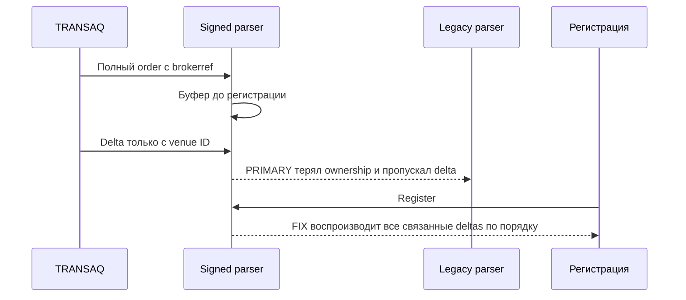
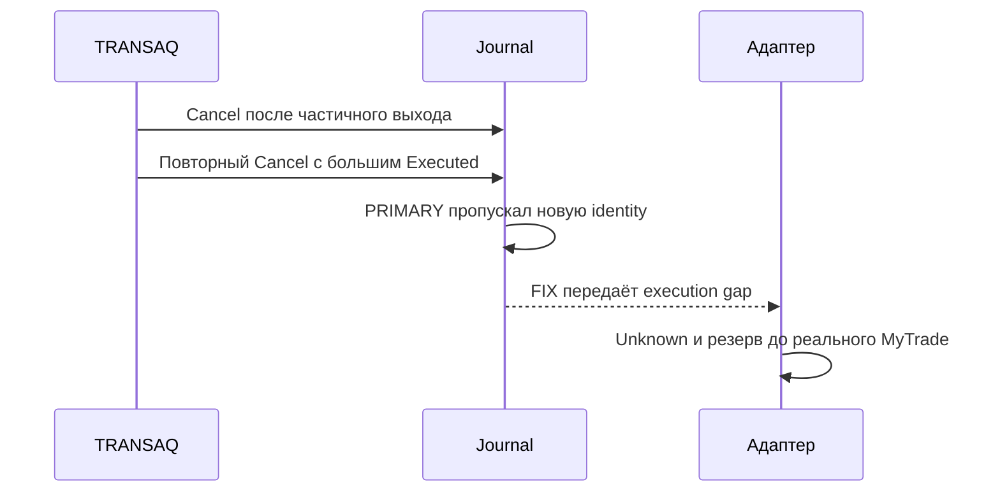
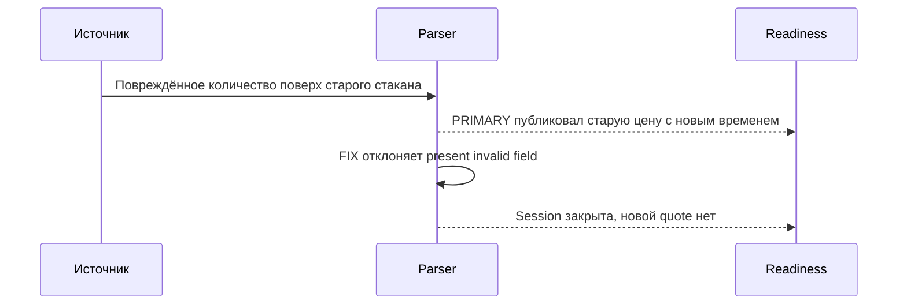
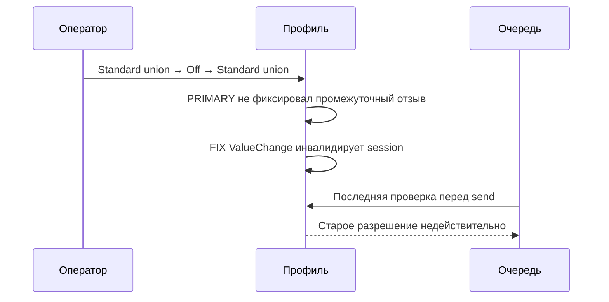
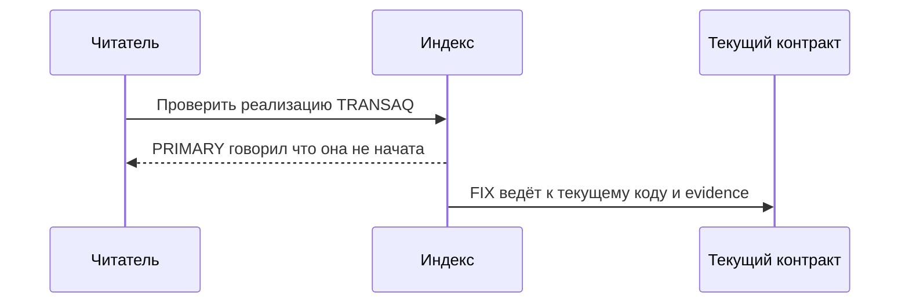
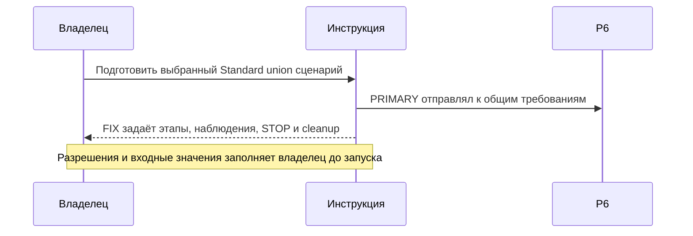
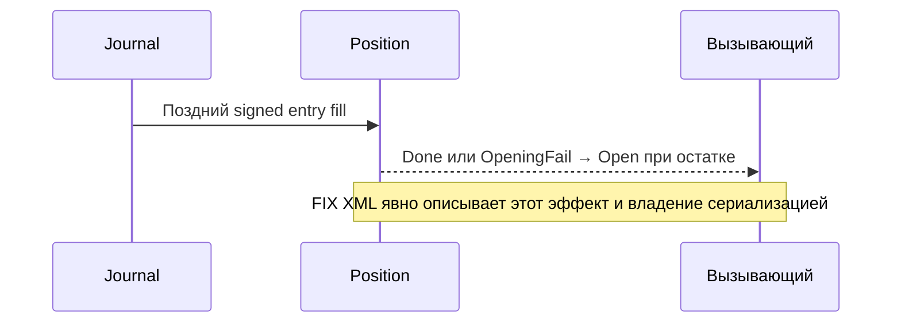
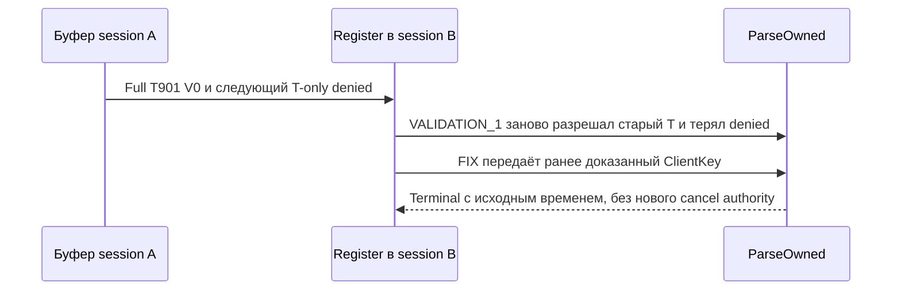
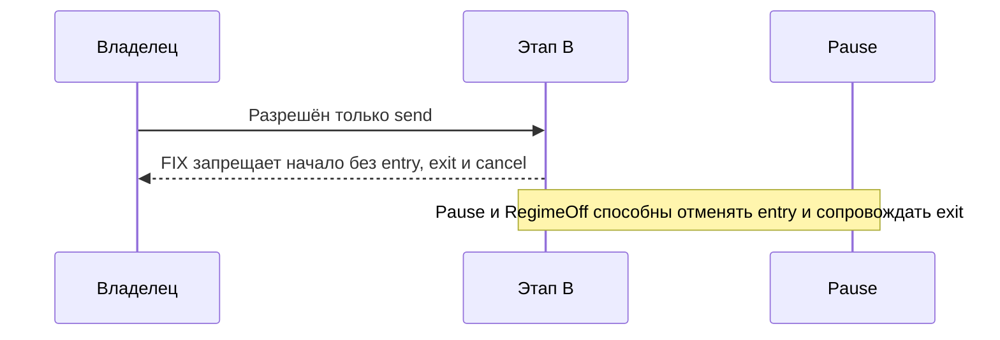

# THG-TRANSAQ-CODE-REVIEW-006: review реализации TRANSAQ

**Статус:** TERMINAL CLEAN/CLEAN в bounded scope адаптации TRANSAQ; LIVE NOT QUALIFIED.
**Task:** TASK-THG-TRANSAQ-IMPLEMENTATION-006.
**Baseline/current HEAD:** `088add98b728f8088fb18ff2e59c8d4113ad043c`.
**Ветка:** `docs/order-flow-production-roadmap`; commit/push не выполнялись.

Scope: [THG-TRANSAQ-PLAN-001](FINAM_TRANSAQ_PLAN.md) и
[THG-TRANSAQ-IMPLEMENTATION-006](FINAM_TRANSAQ_IMPLEMENTATION.md).
Main — sole writer. Независимые read-only роли: `transaq_implementation_safety`
(production-code-reviewer) и `transaq_plan_docs` (documentation-reviewer,
новый pass реализации, старый verdict плана не переиспользован).
Путь review: PRIMARY → FIX → VALIDATION_1 → TERMINAL.

## Checkpoints и evidence

Baseline содержит предшествующий dirty Futures2 scope. Entry manifest
`TEMP/TradeHelp4-analysis/transaq-implementation-entry.json`, SHA256
`a75e89af813d20f0063741e4ae03553e7bdeeae806b771a735d5f9560934d2a2`.
PRIMARY: `transaq-implementation-primary.json`, SHA256
`0b379554c42bce9276ca7d2fd757164d3ea569b8f4e74686652feb3a11759816`,
79 files / 28 changed since entry. Оба reviewer подтвердили 79/79 hashes.
Копии PRIMARY source сохранены в TEMP/TradeHelp4-analysis/transaq-primary-sources.
VALIDATION_1 manifest: `transaq-implementation-validation1.json`; exact SHA
передаётся обоим reviewer после фиксации этого отчёта. Workflow state исключён
из frozen source manifest; итоговые status-only записи не меняют runtime evidence.

| Проверка | PRIMARY | После FIX |
|---|---|---|
| `dotnet build OsEngine.sln --no-restore -v:q` из project/ | 0 errors / 17 warnings | 0 errors / 1 warning incremental; production compile 0 errors / 17 warnings |
| `dotnet run --project Tests/TradeHelpGrid/OsEngine.TradeHelpGrid.Tests.csproj --no-build --no-restore` | 326/326 | 353/353 |
| Agent validator из root | 109/109 | 109/109 |
| `git diff --check` | PASS | PASS |
| Markdown local links | 54 / 0 missing | 57 / 0 missing |
| Protected entry files | 51 unchanged | 51 unchanged |

После первого FIX build тест остановился на 340/341: старый restart fixture
возвращал профиль без нового BeginSignedSession, что теперь правильно запрещено.
Fixture исправлен: явный новый source generation и свежие account/quotes.
Итоговый прогон353/353. Старые219 regression assertions сохранены; новые134
относятся к TRANSAQ/native paths. Остался NU1900, поэтому vulnerability audit
не подтверждён. Старые C# warnings не исправлялись в этой задаче.

## PRIMARY findings и disposition

PRIMARY safety/docs: BLOCKED до перечисленных исправлений. Все семь findings
**IN_SCOPE**, evidence **PROVEN**, owner decision **APPROVED_FOR_FIX** в рамках
порученной реализации. Ниже ссылки/номера относятся к PRIMARY snapshots.
Первый FIX передан в VALIDATION_1; closure и остаточные пути указаны по раундам ниже.

### THG-TRANSAQ-SAF-001 — ранние deltas теряли ownership

Category: order lifecycle/recovery. Technical severity **MEDIUM**;
business impact **BUSINESS_MEDIUM**. Components: Live TRANSAQ/parser/legacy/Journal.
Entry/precondition: startup full order с F2 brokerref приходит до регистрации,
затем venue-only delta. `TransaqSignedProtocol.Reference:167` ищет только
registered bindings; `ParseOwned:193` теряет delta, `LegacyPayload:181` отдаёт его
legacy parser; Register воспроизводит только старый full order. Последствие:
потеря terminal/cumulative evidence и лишнее незавершённое обязательство.
Strongest counterevidence: после Register обычные deltas уже работали, early fill
с brokerref был покрыт. Reachability **CONDITIONALLY_REACHABLE** при указанном
порядке callbacks; action **MUST_FIX**.
FIX: buffered frame хранит resolved ClientKey; unique same-session T/V связывает
следующие deltas, общий resolver исключает их из legacy dispatch. Register
сохраняет capture order/clock. Ambiguity/overflow закрывают readiness.
Evidence: full→partial→cancel-progress→terminal до Register, отсутствие legacy
payload, исходный sequence и отказ при ambiguous buffered V.

### THG-TRANSAQ-SAF-002 — повторный terminal close скрывал исполнение

Category: order/position safety. Technical severity **HIGH**;
business impact **BUSINESS_HIGH**. Components: Live Journal/Futures2 allocations.
Entry/precondition: частичный close Cancel, затем повторный terminal delta с
большим Executed; соответствующий MyTrade/account задержан.
`Position.SetOrder:892` в ClosingFail возвращался до обновления SignedIdentity;
BotTabSimple:8448 публиковал старый journal order. Adapter не видел execution gap,
оставлял Canceled и освобождал резерв: следующий close мог превышать реальный net.
Strongest counterevidence: поздний fill или новый account mismatch закрывают gate,
но не до их поступления. Reachability **CONDITIONALLY_REACHABLE** при указанном
порядке; action **MUST_FIX**.
FIX: legacy duplicate-terminal guard не отбрасывает signed close updates.
Evidence: actual parser→AServer→Connector→Journal→adapter, повторный Cancel
повышает Executed, intent Unknown и остаток reserved; delayed fill учитывается
однократно, без преждевременного изменения quantities/PnL.

### THG-TRANSAQ-SAF-003 — malformed depth освежал старые стороны

Category: market-data/fail-closed. Technical severity **MEDIUM**;
business impact **BUSINESS_MEDIUM**. Components: Live signed quotes/readiness.
Entry/precondition: положительная сторона уже есть; новый buy/sell присутствует,
но пуст, не число или равен −0.5. Patch:346 молча сохранял старую сторону,
ParseQuotes:340 публиковал её с новым ReceivedAt/Sequence. Последствие — ложная
свежесть. Strongest counterevidence: нормальные значения −1,0,positive работали;
нужен malformed source. Reachability **CONDITIONALLY_REACHABLE**; action **MUST_FIX**.
FIX: absent field остаётся no-update; present field обязан быть числом −1 или ≥0.
Evidence: через realization malformed `bad`, empty, −0.5, −2 не публикуют quote
и закрывают SignedOrderSession; valid signed/zero/deletion regressions сохранены.

### THG-TRANSAQ-SAF-004 — round-trip профиля возвращал старое разрешение

Category: lifecycle/deferred authority. Technical severity **HIGH**;
business impact **BUSINESS_HIGH**. Components: UI/TRANSAQ/SignedOrderDispatch.
Entry/precondition: queued command, Standard union→Off/FORTS→Standard union
между Pump/dispatch. HasSignedOrderTransport:19 сравнивал лишь текущее значение;
generic ValueChange сохранял настройки, session не инвалидировался. Старая
команда могла уйти без обязательного reconnect/reconcile.
Strongest counterevidence: пока значение отличается или Pump увидел изменение,
gate закрыт. Reachability **CONDITIONALLY_REACHABLE** при round-trip между
наблюдениями; action **MUST_FIX**.
FIX: BeginSignedSession подписывает выбранный enum; каждое ValueChange закрывает
source session, обратное значение её не возвращает. Dispose отписывает handler;
новый Connect/Begin восстанавливает source generation, адаптер требует сверку.
Evidence: actual AServer queued command, round-trip enum без промежуточного Pump,
0 sends/освобождение только proven-unsent, затем новая generation и Reconcile.

### THG-TRANSAQ-DOC-001 — устаревшая навигация

Category **DOC_STALE**. Technical severity **LOW**; business impact
**NO_DIRECT_BUSINESS_IMPACT**. Components: README/operator documentation.
Entry: читатель открывает README:52 «реализация не начата», затем current
implementation; setup operator:32–34 упоминает только Alor capability.
Последствие — противоречивое понимание статуса/профиля. Strongest counterevidence:
README introduction уже разделял версии, operator не говорил буквально «только».
Reachability **REACHABLE**; action **SHOULD_FIX**. FIX: текущий статус/ссылки и
Alor/TRANSAQ capability с manual envelope и отдельным physical evidence.

### THG-TRANSAQ-DOC-002 — отсутствовал исполнимый owner-run handoff

Category **DOC_STALE**. Technical severity **MEDIUM**; business impact
**BUSINESS_LOW**. Components: Live qualification/operator documentation.
Entry: OSENGINE_OPERATOR:193→P6 плана:301→QUALIFICATION:196 перечисляли требования
к будущему сценарию без последовательности/ожиданий/cleanup. Последствие —
невоспроизводимая квалификация. Strongest counterevidence: ограничения полномочий
и NOT_RUN уже были правильны; live evidence не требуется для написания сценария.
Reachability **REACHABLE**; action **MUST_FIX**. FIX: в current operator guide
добавлены обязательные owner inputs, read-only A, отдельно разрешаемый B с
orders/cancel/recovery, expected observations, deadlines/STOP и cleanup. Пустой
read-only счёт не подтверждает brokerref echo/исполнение; недоступные проверки
остаются NOT_PROVEN. Никакие этапы не запускались.

### THG-TRANSAQ-DOC-003 — XML Position не описывал изменённый lifecycle

Category **DOC_STALE**. Technical severity **MEDIUM**; business impact
**NO_DIRECT_BUSINESS_IMPACT**. Components: Position/Journal public contracts.
Entry: SetOrder:757/SetTrade:1002, signed identity routing и late fill Done или
OpeningFail→Open:1024. Общие summaries не сообщали о последствиях и caller
serialization. Strongest counterevidence: Markdown и native fixture late-fill
уже отражали правильное поведение; runtime здесь не оспаривался.
Reachability **REACHABLE**; action **MUST_FIX**. FIX: адресные Tier1 XML matching,
transport facts/dedup, mutation/state, caller-owned serialization и отсутствие
broker/account reconciliation; ссылка THG-TRANSAQ-IMPLEMENTATION-006.

## VALIDATION_1 и основание финального VALIDATION_2

Оба reviewer подтвердили manifest VALIDATION_1 SHA256
`d6a186ebfad016a77965c339d31b1385d70f2318d7515a4507200dfda17fd164`, 79/79 hashes.
SAF002/003/004 и DOC001/003 **CLOSED**. Исходные SAF001 и DOC002 оставались OPEN;
для них разрешён единственный VALIDATION_2 по AGENT-WORKFLOW-001. Это продолжение
доказанных in-scope paths и regression fix, не новый широкий поиск.

**SAF001 residual:** категория/severity/business прежние; scope IN_SCOPE,
evidence PROVEN, reachability CONDITIONALLY_REACHABLE. Entry: в session A
до Register full forwarding (T901,V0,brokerref), затем T-only denied; до Register
начинается B. Register удалял frame и снова разрешал Reference; корректный guard
не делал старый T current-session authority, поэтому terminal терял ownership.
Strongest counterevidence: same-session venue replay уже проходил. Последствие —
ложное unresolved обязательство. MUST_FIX, APPROVED_FOR_FIX. Адресный fix:
ParseOwned получает сохранённый replay ClientKey; исходные clocks и запрет
старого T для cancel сохраняются. Три assertions проверяют terminal/source/cancel.

**DOC002 residual:** DOC_STALE, MEDIUM/BUSINESS_LOW; scope REGRESSION текущего
FIX, evidence PROVEN, reachability CONDITIONALLY_REACHABLE. Entry: владелец
разрешил send, но не cancel; B.4 сначала предписывал Pause, а разрешение cancel
упоминал лишь для последующей кнопки. Фактически Pause/RegimeOff отменяет entries
и продолжает exits. Strongest counterevidence: основной раздел оператора уже
верно описывал Pause. Последствие — возможное неверное толкование полномочий.
MUST_FIX, APPROVED_FOR_FIX. Адресный fix: B заранее требует полный разрешённый
автоматический entry/exit/cancel набор; send-only не подходит; B.4 повторяет
конкретные эффекты Pause и Cancel. Никаких внешних действий не выполнялось.

После адресного второго FIX: `dotnet build OsEngine.sln --no-restore -v:q`
PASS, 0 errors / 17 warnings; offline harness с `--no-build --no-restore`
**356/356 PASS** (предыдущие219 + новые137). Команды и safety boundary те же.
Финальный frozen manifest: `transaq-implementation-validation2.json`, SHA
передаётся обоим reviewer; копии — `transaq-validation2-sources`.
VALIDATION_2 завершён **CLEAN/CLEAN**. Оба reviewer подтвердили 79/79 hashes
manifest SHA256 `098c09ebe9e6bee25dc6ec8c16ada02aacfee94c546c7de7263c67158f463333`.
SAF001–004 и DOC001–003 **CLOSED**. Новых regressions в bounded fix scope не найдено.
Последующие изменения report/index/state отражают terminal verdict, не меняют
code/test boundary. Runtime evidence356/356 повторно не запускалось без причины.
Нового широкого review/VALIDATION_3 нет.

## Evidence boundary и remaining qualification

OBSERVABILITY: REQUIRED — bounded failure/state/reason, original sequence/IDs,
никаких raw authenticated XML. MODE PARITY: REQUIRED — старые Alor/simulator
regressions сохранены; TRANSAQ profile/IDs/account имеют отдельный source contract.
Synthetic managed fixtures не загружают DLL/native constructors, не запускают
GUI/workers/connector session и не моделируют liquidity/slippage/latency.
Нет credentials/settings reads, real/paper orders или vendor replacement.
Физическая DLL2.26.0 против public manual2.26.4, native Tester/Optimizer lifecycle,
WPF и broker operations остаются **NOT_RUN / REQUIRES OWNER-RUN**.
Конкретный [сценарий P6](OSENGINE_OPERATOR.md#p6-сценарий-владельца-для-standard-union)
готов для заполнения владельцем до отдельного разрешения. Profitability/live-ready
claims отсутствуют. Изменения находятся в dirty worktree; commit/push не выполнялись.

## Последующие вопросы владельца: границы полноты исходного переноса

После frozen VALIDATION_2 владелец отдельно спросил о ручной покупке/продаже,
регистрации объёма и наблюдаемости. Read-only current-code mapping установил:
legacy RegisterZone/RegisterPart/SetLots не перенесены как external adoption.
ADR-THG-002, раздел «Native data, recovery и lifecycle», описывает это исключение; сам ADR не является
доказательством отдельного согласия владельца отказаться от исходной функции.
Этот факт не расширяет terminal review транспорта и не получает его CLEAN verdict.

Current external net — только декларация для формулы owned + external = account;
не импорт quantity/price/level и не уменьшение owned inventory после ручной продажи.
Offline tests подтверждают account mismatch gate и защиту от чужого brokerref,
но не полный сценарий manual buy/sell/adoption или ненулевой ExternalNet.

Current status показывает сохранённый Reconciled, а не текущий AccountMatches;
получение mismatch само по себе не меняет State/Reason. Поэтому видимый Active /
reconciled=true ещё не доказывает открытые торговые guards. Preview reserve
относится к геометрии формы, aggregate current reserve отдельно не выводится.
Это ограничения общего исходного переноса/наблюдаемости, не подтверждение того,
что вся первоначальная задача завершена. Требуется отдельный bounded scope для
принятия внешних executions/quantity adjustments, observability и их recovery tests.
Никаких изменений этого поведения под видом итогового status update не выполнено.
