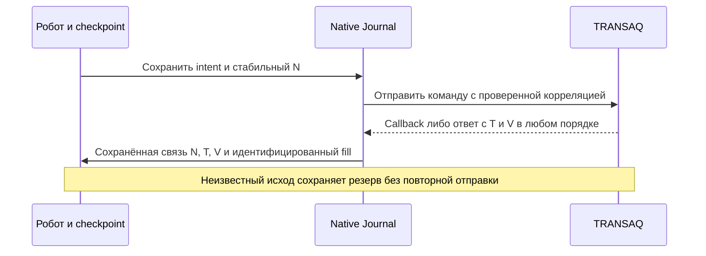
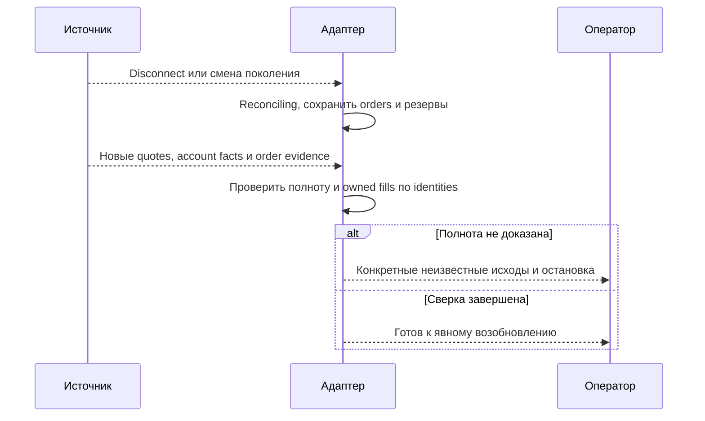

# THG-TRANSAQ-PLAN-001: план адаптации Futures2Grid к Finam / TRANSAQ

**Статус:** TARGET PLAN — REVIEWED CLEAN/CLEAN.
Планирование завершено; последующая отдельно разрешённая реализация ведётся в
[THG-TRANSAQ-IMPLEMENTATION-006](FINAM_TRANSAQ_IMPLEMENTATION.md).
**Дата:** 2026-09-29. **Task:** TASK-THG-TRANSAQ-PLAN-005.
**Baseline/current HEAD:** `088add98b728f8088fb18ff2e59c8d4113ad043c`,
ветка `docs/order-flow-production-roadmap`, существующий dirty Futures2 сохранён.
**Полномочия завершённой задачи планирования:** составить план, независимо проверить, исправить
план и остановиться. Код, тесты, настройки, DLL и подключения сейчас не меняются.

## 1. Результат и границы

Будущая реализация должна подключить существующий Futures2Grid к штатному
`ServerType.Transaq` для брокера Finam. Сохраняются обычные BotPanel/BotTabSimple,
Journal, штатные параметры, ручное управление, signed/zero decimal цены до пяти
знаков, собственные allocations/fills и правила [ADR-THG-002](ADR-0002_OSENGINE_IMPLEMENTATION.md).
Новый брокерский коннектор или параллельный lifecycle не создаются.

Результаты будущего этапа различаются: реализованный и проверенный offline
профиль; выполненная квалификация конкретного подключения. Второй результат
не следует из первого. Текущий план не разрешает ни реализацию, ни live/paper
сессию. Старые 219 assertions относятся к существующему implementation checkpoint,
а не к Transaq; их числом нельзя закрыть сценарии этого плана.

Пользователь подтвердил Finam через TRANSAQ. Тип счёта, обычный/HFT профиль,
рабочая DLL и серверная версия пока неизвестны. План предусматривает отдельные
ветви единого счёта (`union`) и отдельного срочного счёта (`client`/FORTS);
никакая ветвь не выбирается молча. Первичный торговый scope — фьючерсный grid.
Добавление иных классов инструментов, Finam REST/gRPC, массовое исправление
предыдущих 17 warnings и общая переработка всех коннекторов сюда не входят.

## 2. Основания и установленное текущее состояние

Иерархия: [DOCMAP-001](../DOCUMENTATION_MAP.md), ADR-THG-002 и
[THG-PRICE-001](PRICE_DOMAIN.md) задают проектный contract; current code задаёт
реализацию; официальная спецификация задаёт внешний протокол. Этот TARGET
не заменяет current ADR. Необходимые изменения его API/persistence contracts
вносятся и проверяются вместе с будущей реализацией, до включения профиля.

| Current факт | Источник относительно project/ | Следствие для плана |
|---|---|---|
| Realization не предоставляет IExplicitAccountSource | `OsEngine/Market/Servers/Transaq/TransaqServer.cs`, class TransaqServerRealization | Live non-paper Futures2 сейчас не допускается |
| ParsePortfolio получает mc_portfolio; UpdateClientLimits отдельно пишет MoneyFree/MoneyReserve | тот же файл, ParsePortfolio / UpdateClientLimits | Значение Current−Blocked нельзя автоматически переносить между профилями |
| FORTS position использует totalnet, mc_portfolio — balance/bought/sold и lot | тот же файл, UpdateClientPositions / ParsePortfolio | Требуется единый контракт количества и выбора источника |
| PortfolioEvent публикует общий cache | тот же файл, portfolio callbacks | Повтор cache не доказывает свежесть выбранной строки |
| Futures2 сохраняет native N до send, Transaq после SendCommand меняет NumberUser на transaction T | `Futures2NativeAdapter.cs`, Execute / OnOrder / OrderFor; Transaq SendOrder | До account capability нужна корректная цепочка идентичности |
| Native orders callbacks несут transaction T; fills — биржевой order number | Transaq UpdateMyOrders / UpdateMyTrades | Нужна проверяемая связь N ↔ T ↔ venue order, без ценовых эвристик |
| GetOrdersState/GetAllActivOrders пусты, GetOrderStatus None, order lists null | TransaqServer.cs и TransaqServerPermission.cs | Автовосстановление запросами сейчас не реализовано; permission flags false |
| Некоторые depth и best-bid/ask ветви отбрасывают цену 0 | Transaq market-data parsing | Одной поддержки decimal в отправке недостаточно |
| Adapter считает available как Current−Blocked и сравнивает receipt/sequence с fill | `OsEngine/OsTrader/Grids/Futures2/Futures2NativeAdapter.cs` | Нужны profile semantics, provenance и тесты порядка доставки |

Локальная tracked `OsEngine/bin/Debug/txmlconnector64.dll`: FileVersion **2.26.0**,
ProductVersion **6.45**, SHA256
`ed8711f626a511bd8ce27a970627e21a35f98d543eb641945e15c61eedcbc217`.
Проверены только metadata/hash; библиотека не загружалась. Это не версия
фактически используемого пользователем процесса или сервера.
[Официальный каталог Finam](https://www.finam.ru/howtotrade/soft/tconnector/)
на дату исследования перечисляет 2.26.4 от 09.09.2025. Его индексируемое
представление доступно, прямой fetch страницы дал HTTP 403. Каталог не является
полным текстом protocol specification и не доказывает совместимость версий.
Обновление DLL автоматически не входит в план: сначала P0.

## 3. Порядок будущей работы

P0 предшествует изменениям зависимых contracts. P1–P4 можно разрабатывать
независимыми частями после P0, но включение профиля допускается только после
совместной проверки P5. Документы/XML обновляются вместе с соответствующим
шагом, а не последним незавершённым пунктом. P6 — отдельный разрешённый запуск.

### P0. Зафиксировать версию, профиль и нормативный протокол

Получить официальное руководство для выбранной TXmlConnector, записать
publisher URL, revision/date и SHA256 скачанного публичного документа.
Сопоставить P/Invoke exports/bitness, локальную DLL и заявленную поддерживаемую
версию; несовпадение не устранять молчаливой заменой binary. Обычный и HFT
профили не считать взаимозаменяемыми без подтверждения.

Заполнить таблицу для обеих account branches: client/union routing,
board+seccode/secid, валюта, единицы quantity/lot/ГО, поля денег и их точный
смысл, full snapshot против delta, значение отсутствующей/нулевой строки,
частота/способ обновления неизменной позиции, доступный запрос после fill,
order/status/cancel response, replay после reconnect и перехода торгового дня,
transaction/order/trade ID scope, brokerref echo/ограничения, правила XML prices,
стакан delta/delete и наличие сторон, limittype/market, rate limits.
Для каждой ячейки нужны раздел спецификации и локальный code mapping.

Неподтверждённые ячейки отмечаются NOT_DETERMINED и блокируют соответствующую
возможность, а не весь безопасный исследовательский этап. При отсутствии
средства доказать полноту заявок автоматическое восстановление не обещается.
Профиль выбирается оператором явно; реальные account numbers и credentials
в документации/fixtures не нужны. Перед живой квалификацией владелец задаёт
account type, обычный/HFT environment и инструмент; секреты не запрашиваются.

Результат P0: версионированная матрица возможностей/единиц и решение по точному
набору поддерживаемых профилей. Для непроверенной ветви — явный отказ, без
фиктивного общего флага «Transaq поддержан».

### P1. Сохранить идентичность заявки на всём native пути

Целевой контракт для opt-in Futures2 orders: native NumberUser **N** остаётся
стабильным в Journal/intent; transaction **T** и биржевой номер **V** хранятся
отдельно. Реализовать явное преобразование входящих orders в native N через
проверенную связь, а cancel адресовать согласно protocol transaction ID.
Не менять NumberUser уже сохранённого intent постфактум как способ «догнать»
изменившийся shared Order. Область ключа включает server instance/account,
инструмент и подтверждённый P0 namespace идентификатора.

Проверить возможность echo client correlation в brokerref по P0. Если она
не подтверждена, не использовать разбор строки/комментария как доказательство
владения. Связь N с intent сохраняется до SendCommand; полученная T/V связь —
до публикации разрешающих callback/effect. При callback раньше send response
использовать bounded unmatched buffer с лимитом/timeout и fail-closed исходом;
никаких поисков по совпадению цены, количества или последнему ордеру.

Если send мог достичь брокера, потеря response, parsing exception, разрыв или
невозможность сохранить mapping означает **Unknown**, сохранение резерва и
остановку новых отправок, а не Fail/автоматический повтор. Отдельно различать
подтверждённый отказ до принятия заявки и неизвестный результат. Cancel response
сам по себе не доказывает снятый остаток; late fill учитывается всегда.

Mapping и dedup должны переживать reconnect/process restart. Native Journal,
connector mapping и Futures2 checkpoint согласуются без distributed-atomic
обещаний: любой crash между ними приводит в Reconciling, не к восстановлению
путём новой заявки. При расширении Order/intent/store — явная версия, backward
read tests, отсутствие потери старых подписей/полей, отказ на неоднозначной
миграции; не переписывать существующие checkpoints при простом чтении.

Legacy Transaq orders и остальные connectors сохраняют текущий contract.
Signed opt-in и legacy orders одновременно различаются надёжным mapping,
не префиксом с возможной коллизией. Foreign callback не присваивается кампании.

### P2. Источник счёта, денежные единицы и наличие данных

Публиковать immutable observations через IExplicitAccountSource только из
фактических source updates. Funds-only, position-only и unrelated account/row
независимы. Время приёма и поколение соединения фиксируются до callback queues;
время разбора/повторной публикации cache не становится временем наблюдения.
Одинаковая timestamp у двух callbacks не должна терять действительное второе
обновление: нужен monotone receipt sequence. Источники/поколения проверяются
до разрешения submit, включая второй endpoint при replacement.

Missing row = unknown/no update. Нулевой net подтверждается явной строкой либо
документированной полнотой снимка выбранного счёта. Пустой список без такой
полноты не превращается в flat. Существующее ручное подтверждение нулевой
позиции не расширять до общего автоматического recovery обхода.

Для единого и отдельного срочного счёта определить единственный authoritative
источник позиции и денег; не складывать дублирующие представления. Board/seccode
и native SecurityNameCode должны однозначно совпадать. Количество контрактов,
лот бумаги, monetary collateral и валюта проверяются независимо от знака цены.
Смена account/instrument/profile/metadata инвалидирует readiness, старые lots
и orders сохраняют исходное владение и units.

Целевое available-funds поле имеет явные units и признак «уже свободные средства»;
если источник даёт MoneyFree, не вычитать тот же Reserve повторно. При необходимости
расширить explicit account DTO/адаптер отдельным typed значением/семантикой,
не менять смысл общих Portfolio.ValueCurrent/Blocked для legacy consumers.
Пока formula профиль не доказан, Use portfolio available funds недоступен;
ручной конверт Capital/ManualFunds не отменяет account ownership и freshness.
Отдельно различать полный выделенный конверт стратегии и уже свободный broker
остаток для новой экспозиции. Held collateral нельзя повторно вычитать из free
funds; pending reservation учитывается ровно один раз с различением уже
отражённых брокером и ещё локальных обязательств. Консервативная формула и
пример с held+working+not-yet-ack входят в P0/P2 acceptance; неоднозначность
согласования не увеличивает разрешённый бюджет.

Отдельно обеспечить liveness: неизменная позиция при работающем рынке не должна
получать фальшивую свежесть из cache. Использовать только документированный
poll/full snapshot/heartbeat с известной полнотой; interval/backoff/rate-limit
согласовать с FreshnessSeconds. Если источник не позволяет освежить выбранную
строку доказуемо, профиль остаётся ограниченным/заблокированным, TTL не снимается.

### P3. Signed/zero market data и отправка

Для market depth/delta/top-of-book/trades/candles, используемых этим роботом,
разделить literal zero price, missing field, removal уровня и пустую сторону
согласно P0. Не заменять 0 предыдущей ценой и не заполнять bid/ask другой стороной.
Проверить decimal serialization/parsing без culture-зависимых замен и double,
цены ±0.00001, отрицательные границы ticks, пересечение нуля и off-tick отказ.
Limit(0) и Market имеют разные явные типы/команды.

Нулевой/отрицательный price не отменяет проверку положительного tick, количества,
коллатерали и server/exchange price limits. Покупка/продажа задаётся Side.
Receipt/presence должны дойти до IExplicitQuoteSource без обновления возраста
в downstream queues; source epoch смены подписки/соединения проверяется.

Если протокол выбранного источника кодирует отсутствие стороны нулём без
различимого признака, нельзя обещать передачу реального zero quote. Зафиксировать
capability restriction и возможный документированный альтернативный feed;
не открывать сделки по неоднозначной котировке.

### P4. Восстановление, lifecycle и ограничения полномочий

При disconnect немедленно закрыть readiness, сохранить facts/reserves, завершить
или изолировать очереди старого поколения. Повторный Connect не является
сверкой. Новый поток market data не разрешает отправку без account/order evidence.
Queued callbacks маркируются исходным epoch. Старые observations не освежают
новый счёт/подписку. Late fills старого epoch по известному owned order сохраняют
экономический эффект и dedup; их нельзя безусловно выбросить вместе с очередью.
Callback после Dispose не выполняет новые торговые действия.

Проверить и исходящую очередь AServer: решение, поставленное в очередь до
потери readiness, не должно превратиться в send старого профиля после reconnect.
Нужна повторная проверка поколения, ownership и полномочий непосредственно
перед native SendCommand, а не только в момент решения робота. Queue cancel
и подтверждённое «ещё не отправлялось» отделены от уже начатого/неизвестного
send. Снятие local reserve допустимо только при доказанном отсутствии внешнего
эффекта; перезапуск worker сам по себе такого доказательства не даёт.

P0 определяет реальный механизм восстановления: подтверждённые queries либо
полный replay/snapshot с явной границей завершения. Неполный cache, тишина,
успешный Connect и отсутствие ордера в delta не доказывают terminal outcome.
Не включать CanQueryOrdersAfterReconnect/CanQueryOrderStatus/CanGetOrderLists
до реализации именно соответствующего контракта. Локальный список нельзя
выдать за полный ответ сервера.

После reconnect/restart остаётся Reconciling. До возобновления сверить
идентификаторы, working/Unknown/terminal orders, подробные fills и dedup,
owned quantity и declared external net, свежесть счёта/котировок и funds.
Автоматический resend/reprice запрещён. При недоказанной полноте — явный
операторский путь с перечислением недостающих facts, без автоматического снятия
резервов. Owner подтверждает факты по конкретному intent; команда не создаёт
MyTrade и не меняет экономическую историю для совпадения баланса.

Emergency latch сохраняется через разрыв. При недостоверном объёме/заявках
нельзя отправлять «закрыть всё» с риском переворота. Показать причину, оставшийся
подтверждённый риск, неизвестные заявки и время ожидания. Локальный stop робота
не становится брокерской защитой при отключении/остановке процесса; операторский
runbook явно описывает этот предел и действия через штатный терминал.

### P5. Offline реализация, регрессии и независимые проверки

Сначала выделить минимальные seams для воспроизводимого вызова настоящих
парсеров/dispatch/gateway, без native DLL initialization, workers и сети.
Синтетические XML fixtures отражают P0 specification, не реальные payload/logs.
Assertions проверяют эффект на Journal, intent, allocations, remaining exposure,
число send/cancel, available funds и persisted state, а не только DTO поля.

| Сценарий | Проверяемый результат |
|---|---|
| Union и FORTS: funds-only, position-only, другая строка/счёт, несколько instruments | Обновляются только присутствующие facts; отсутствие не flat |
| Position=0 явно / missing / подтверждённый полный снимок | Разные состояния, автоматическое доказательство zero только по P0 |
| MoneyFree/Reserve и mc_portfolio, held/pending/fee буферы | Нет двойного вычитания и завышения доступного объёма; currency/units проверены |
| Неизменная позиция, account refresh delayed/throttled | Либо подтверждённое обновление, либо видимая пауза; cache не освежает |
| N отличается от T; callback/fill до response; два параллельных orders | Верная связь с native и уровнем, нет cross-order attribution |
| Duplicate/reordered partial fill, terminal до trade detail, cancel race | Экономический эффект один; сохраняется резерв потенциального остатка |
| Успешная доставка с потерянным response / повреждённый ответ / save failure | Unknown/Reconciling, ноль повторных sends и сохранённый резерв |
| Crash до send / после send до T / после T до публикации / после fill до последующего save | Восстановление без выдуманных fills и повторной заявки; неоднозначность блокирует |
| Повтор venue/trade ID в другом допустимом P0 namespace; replay после reconnect | Не принять чужую сделку, не удвоить свою; dedup переживает restart |
| Задержанная старая очередь, equal timestamps, смена профиля/счёта | Старый frame не разрешает send, действительный late owned fill учтён |
| −0.00001 / 0 / +0.00001, cross-zero book, missing side, delete, off-tick | Точное значение/presence/type и правильный отказ без side effect |
| Queued send → disconnect/profile switch → worker resume; cancel до dispatch | Старый эффект подавлен либо Unknown, резерв снимается только для доказанно не отправленного |
| Reconnect incomplete snapshot, отсутствующая заявка, локальный cache | Не объявлять flat/terminal и не включать ложные permission flags |
| Foreign order/net и ручная торговля на том же инструменте | Никакого присвоения чужого объёма или общего flatten |
| Stop при Unknown/disconnect; late fill после stop | Latch сохраняется, нет перекрывающихся close, риск виден |
| Replacement между двумя endpoint и локальный transfer/group actions | Обоим endpoint нужна сверка; ownership/funds не смешиваются |
| Dispose/delete, повторные connect events, overload unmatched buffer | Нет новых sends/дублирующих подписок; controlled stop без потери фактов |
| Legacy Transaq и существующий Alor/simulator path | Нет изменения старой native идентичности/разрешений/расчётов |
| Старый checkpoint/order serialization и новый формат | Явная совместимость либо блокировка миграции, без молчаливой потери |

Плановые команды после будущих code/test changes (сейчас NOT_RUN):
`dotnet build OsEngine/OsEngine.csproj`, `dotnet build OsEngine.sln`,
`dotnet run --project Tests/TradeHelpGrid/OsEngine.TradeHelpGrid.Tests.csproj`,
agent validator и diff/link checks. Existing warnings классифицируются отдельно;
NU1900 не даёт PASS vulnerability audit. Количество новых assertions определяется
реальными сценариями; заранее не назначать обещанный total.

На одном frozen checkpoint нужны независимые production-safety и docs/XML
reviews, исправления по конечному scoped-review протоколу. Критический review
данного плана не заменяет review будущего кода.

### P6. Отдельная квалификация выбранного подключения

Только после отдельного разрешения с точным account/environment/instrument и
перечнем операций: сначала read-only подключение/сверка, затем разрешённый
минимальный сценарий order/partial/cancel и reconnect/restart. Read-only доступ
сам по себе не разрешает send/cancel. Сценарий задаёт лимит объёма/экспозиции,
timeout, stop conditions, ответственного оператора и проверяемый cleanup.
Market/отрицательные/нулевые реальные заявки не отправлять просто ради теста.
Недоступные площадке цены проверять синтетически, broker acceptance не выдумывать.

Отдельно выполнить полный native Tester/Optimizer lifecycle и WPF walkthrough
по разрешённому локальному сценарию. Факт live теста на одной ветви счёта не
распространяется на другую, HFT или другой набор instrument permissions.
Квалификация должна проверить выбранный профиль, единицы, fees/margin, late fills,
повторное восстановление и отсутствие чужих side effects. Пока это NOT_RUN,
выход P5 называется offline-verified implementation, не live-ready release.

## 4. Предполагаемые файлы будущей реализации

| Область | Граница изменения |
|---|---|
| `OsEngine/Market/Servers/Transaq/TransaqServer.cs`, permission, TransaqEntity | Source parsing/epoch, ID mapping, account profile, zero data, truthful permissions |
| `OsEngine/Market/Servers/IExplicitAccountSource.cs`, при необходимости quote source/AServer | Минимальный backwards-compatible source metadata/funds contract, только по доказанной необходимости |
| `OsEngine/OsTrader/Grids/Futures2/Futures2NativeAdapter.cs`, Book/Store при изменении mapping/schema | Native correlation, persistence/reconcile/funds; математические правила сетки сохраняются |
| Native Order/serialization/Journal/gateway consumers | Только непосредственно затронутые ID/format contracts, с legacy regression proof |
| `OsEngine/Robots/MyBots/Futures2Grid/Futures2Grid.cs` | Явный выбор/диагностика профиля при необходимости, штатные Parameters |
| `Tests/TradeHelpGrid/**` | Offline fixtures и экономические assertions, без внешнего стенда |
| ADR-THG-002, operator guide, qualification, CONTEXT_CONNECTORS, XML docs | Current mapping, limits/recovery, единицы, source clocks и конкретное evidence |

Не разрешается менять binary/vendor DLL, upstream, unrelated MCP/BCS/OKX/SyntheticBond
и agent workflow под видом этой адаптации. Если P0 выявит необходимость обновления
библиотеки, это отдельное явное решение с version compatibility и rollback.

## 5. Завершение текущей задачи планирования

Готовый план содержит current/target distinction, dependencies, unresolved
profile/protocol inputs, конкретные offline scenarios и отдельный owner-run
boundary. Независимый review и disposition находятся в
[THG-TRANSAQ-REVIEW-001](FINAM_TRANSAQ_PLAN_REVIEW.md).

Для текущего documentation-only diff: production build/tests **NOT_RUN — не
требуются**; XML code comments **NO CHANGE**; OBSERVABILITY и MODE PARITY
**NO CHANGE сейчас**, требования будущей адаптации описаны в P1–P6. Проверяются
регистрация/ссылки, whitespace, agent validator и сохранность entry source hashes.
После исправления и проверки плана — **остановиться, реализации не начинать**.
