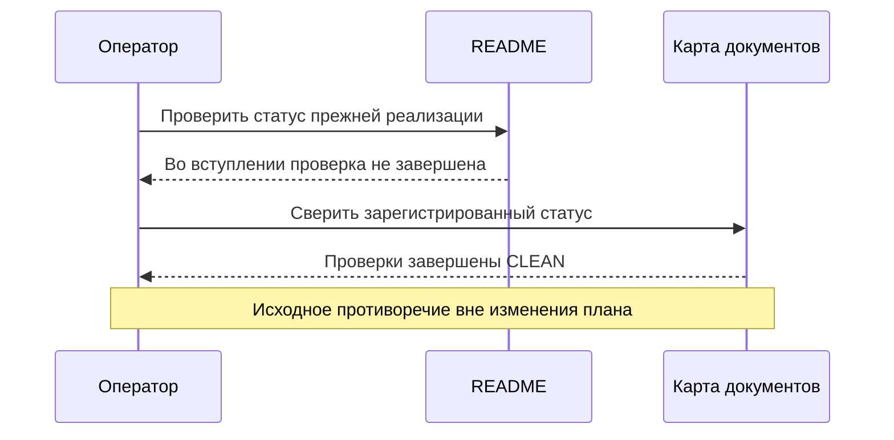

# THG-TRANSAQ-REVIEW-001: критический review плана Finam / TRANSAQ

**Статус:** TERMINAL — CLEAN/CLEAN для TARGET плана.
**Task:** TASK-THG-TRANSAQ-PLAN-005. **Дата:** 2026-09-29.
**Baseline/current HEAD:** `088add98b728f8088fb18ff2e59c8d4113ad043c`.
**Ветка:** `docs/order-flow-production-roadmap`. Commit/push не выполнялись.

## Область и точная версия

Предмет: [THG-TRANSAQ-PLAN-001](FINAM_TRANSAQ_PLAN.md), его dependencies,
current/target distinction, риски ID/account/queues/recovery/zero prices,
acceptance и полномочия будущих этапов. Runtime/test/config/DLL diff запрещён.
Запись текущей задачи: plan, этот report, README navigation, DOCMAP, ACTIVE_TASK.
Существующий dirty implementation и его завершённый review не переоцениваются.

Entry: `TEMP/TradeHelp4-analysis/transaq-plan-entry.json`, 67 hashes,
SHA256 `4bae75f49cf5971adae3fa87bb0dbdb9abebabfe4380c3045178cc1e7f8a0647`.
PRIMARY: `TEMP/TradeHelp4-analysis/transaq-plan-primary.json`, 4 hashes,
SHA256 `a742f49f79e9f8082188d5189bce1c34ca14ad9f79df11214b403409cb083d7c`.
Reviewed plan SHA256:
`d37c12a4764f21b5e24a2edb66c81b5178377e009daa4fea170a1368a63a8580`.
Обе роли проверили 4/4 frozen hashes, 0 mismatches. После verdict меняются
только строка статуса плана, terminal report/index и ACTIVE_TASK. Содержание
P0–P6 не изменено. Ревью плана не доказывает реализацию или broker compatibility.

## Независимые проверки

| Роль | Исполнитель | Outcome | In-scope findings |
|---|---|---|---:|
| production-code-reviewer | /root/transaq_plan_safety | CLEAN | 0 |
| documentation-reviewer | /root/transaq_plan_docs | CLEAN | 0 |

PRIMARY завершён terminal outcome; FIX и VALIDATION_1 не требуются, поскольку
доказанных in-scope findings и semantic fixes после PRIMARY нет. Повторный
широкий поиск и новый review ранее завершённой реализации не запускаются.

| Критический вопрос | Проверенный ответ плана |
|---|---|
| Потеря N при замене на transaction T, callback раньше send response | P1: отдельные N/T/V, stable native identity, durable mapping, bounded unmatched path, Unknown |
| Crash между native send и checkpoint | P1/P5: сохранить резервы, восстановить факты, не пересоздавать заявку; тестируются отдельные окна |
| Очередь sends пережила disconnect или смену профиля | P4: guard непосредственно перед native эффектом, proof для never-sent и Unknown для неоднозначного исхода |
| Старое сообщение освежило новый account epoch | P2/P4: source receipt/sequence/epoch; late owned fills сохраняют эффект, cache не считается новым фактом |
| MoneyFree ошибочно уменьшается ещё раз на Reserve/held/pending | P0/P2: раздельные profile units, free funds и общий конверт, verified formula и отрицательные сценарии |
| Неизменная позиция перестаёт получать обновления | P0/P2: документированное обновление/полнота либо явная пауза, без снятия TTL |
| Отсутствующая строка ошибочно принята за ноль | P2: explicit zero или нормативно полный snapshot, отсутствие остаётся unknown |
| Reconnect принят за доказательство отсутствия заявки | P4: полнота queries/replay проверяется отдельно, permissions честные, no blind resend |
| Zero quote спутана с missing/delete; Limit(0) с Market | P0/P3: presence/type protocol mapping; при неоднозначности capability ограничена |
| PLAN/документация выдают будущую работу за выполненную | TARGET статусы, P0 dependencies, P5 offline и P6 owner-run разделены |

Прямо проверялись TransaqServer/Permission, explicit account DTO,
Futures2NativeAdapter OnOrder/OnFill/Execute/account guards, AServer queue/send,
ADR-THG-002 и THG-PRICE-001. Самый сильный предел — нормативная спецификация
выбранной версии, account profile и replay guarantees ещё не установлены.
План явно делает их зависимостями P0; отсутствие этих входов не мешает закончить
планирование и не превращается в разрешение реализации неподтверждённого пути.

## Исходное замечание вне scope текущего плана

**THG-TRANSAQ-DOC-ADJ-01 — DOC_STALE**.

- Severity: LOW; business: NO_DIRECT_BUSINESS_IMPACT; scope relation: ADJACENT.
- Components/modes: documentation/operator navigation.
- Affected paths: README.md:9–10 против его строки навигации review и DOCMAP.
- Problem: entry README говорит о незавершённой проверке старой реализации,
  тогда как её зарегистрированный итог — CLEAN/CLEAN.
- Preconditions/entry: оператор открывает вступление README и сверяет реестр.
- Execution path: вступление → navigation/review status → противоречие статусов.
- Evidence: PROVEN; reachability: REACHABLE. Фраза присутствовала в entry;
  текущая задача добавила только navigation к TARGET Transaq plan.
- Strongest counterevidence: completed implementation report и DOCMAP позволяют
  установить правильный статус; сама новая Transaq plan строка ему не противоречит.
- Consequence: неоднозначное прочтение прежнего статуса; runtime не изменён.
- Action: SHOULD_FIX отдельно. Owner decision: DEFERRED; это не принятие риска
  и не утверждение, что владелец уже одобрил отдельное исправление.
- Terminal relation: SEPARATE_TASK. Не блокирует CLEAN рассматриваемого плана.



## Evidence и остановка

- Git Bash agent validator: PASS **109**, exit0.
- Local links изменённых TradeHelpGrid документов: **27 checked / 0 missing**.
- Entry preservation: **64 protected files / 0 changes**; три прежних разрешённых
  docs — ACTIVE_TASK, DOCMAP, README. Два новых документа входят в текущий scope.
- Diff whitespace: PASS с существующим CRLF-aware режимом. Plain check отмечает
  CR ранее изменённых Alor строк; текущая задача их не трогала. Invocation:

```powershell
$env:GIT_CONFIG_COUNT = '1'
$env:GIT_CONFIG_KEY_0 = 'core.whitespace'
$env:GIT_CONFIG_VALUE_0 = 'blank-at-eol,blank-at-eof,space-before-tab,cr-at-eol'
& 'C:\Program Files\Git\bin\bash.exe' .agents/validation/validate-agent-system.sh
```

Из корня репозитория; отдельная команда whitespace:
`git -c core.whitespace=blank-at-eol,blank-at-eof,space-before-tab,cr-at-eol diff --check`.
Git config на диске не изменён. Отчёт сохраняет bounded verdict, не сертификат
готовности брокерского подключения.

Build/tests, native DLL, GUI и подключения **NOT_RUN**, для documentation-only
задачи не требуются. XML/observability/mode parity **NO CHANGE**; будущие требования
описаны в плане. Commit/push отсутствуют. **Задача завершена; остановка до реализации.**
