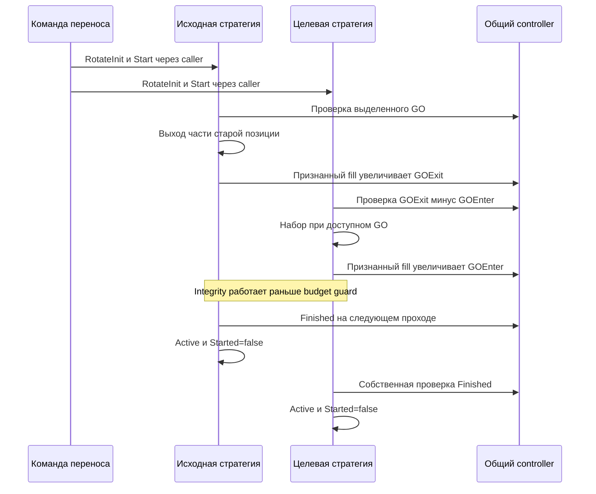

# THG-F2-ROLLOVER-001: экспирация и перенос между стратегиями

**Статус:** OBSERVED INHERITED TRANSITIONS — STATIC ONLY.  
**Дата:** 2026-09-29. Не смешивать замену плана через RotateEmitent,
операционный Rotate controller и экспирацию контракта.

Наследование StrategyDTI делает эти входы callable для Futures2; manager
не исключает StrategyKind.DTF. Обычный одноинструментный builder не означает,
что объект никогда не сможет попасть в другой режим. UI entry points — в
[THG-F2-SETTINGS-001](FUTURES2_RUNTIME_SETTINGS.md).

## EX: подготовка и выполнение экспирации

| ID | Событие / guard | Mutation / effects | Anchor |
|---|---|---|---|
| EX01 | ReplaceFutures, Lua.GetQuote(newContract) не null | Convert quote, AddExpirateTicker(oldCode,newDBItem), notification; null quote →no-op | dti.cs:7292 |
| EX02 | AddExpirateTicker | Создать mapping old→new; скопировать commission object/orientation/ratio под новый ticker; добавить newTicker ratio в каждую ZoneRatio; wrapper Save | dti.cs:11611 |
| EX03 | StartExpirate, state!=Expirate, mapping nonempty, AllowExperate | LastStrategyState=state; state=Expirate; event и Save; Started не меняется | dti.cs:7303 |
| EX04 | AllowExperate | Для всех зон (q==0 либо ZoneIsFull) && b==0 && s==0; partial/pending старой корзины запрещают старт | dti.cs:7904 |
| EX05 | Reaction Expirate | CheckBug: если counts ZoneRatio/Ratio различаются, добавить new ratio через old key; равные counts не доказывают равные keys | dti.cs:10462 |
| EX06 | EnabledLiquidity | Обычная rollover ветка запрещена при old pending либо если не(full || q0 || fullExpirate || balanceExpirate) хотя бы у одной зоны | dti.cs:10997 |
| EX07 | UseBlockEnter и Min<buyShortExpirate<Max | Запретить обычную ветку; границы строгие, BlockEnterAlways/Status не используются | dti.cs:10776 |
| EX08 | Каждая зона | Сначала CheckZoneIntegrityExperate вне обычных EX06/EX07 gates, threshold0, empty priority | dti.cs:10796 |
| EX09 | Обычный gate разрешён после EX08 | GetZoneReactionExperate с включаемым threshold; реакция нужна при q>0 либо наличии replacement baskets | dti.cs:12341 |
| EX10 | После каждой из двух стадий | Прервать по pass-count либо positive result&&EnabledLiquidity | dti.cs:10776 |

EX02 сначала пишет mapping, затем обращается к старым dictionaries; missing
key может оставить частичную mutation перед exception. MakeStrategyDTF
передаёт один ZoneRatio dictionary всем зонам. В generic случае null
ZoneRatio заменяется новым словарём только с новым key. EX05 не защищает
null dictionary/missing old key.

Обычные ForbidBuyes/Sells/Long/Short, HJ, TP, day-budget и внешний stop-zone
в Expirate reaction не применяются. Передача некоторых полей через info не
означает их чтения зоной. TodaySpended в этом manager branch не обновляется.

## EB: две корзины и применение результата

| ID | Guard / событие | Действие | Anchor |
|---|---|---|---|
| EB01 | Integrity: partial old либо partial new, любые old/new pending | Stale flush обеих корзин | dti.cs:12557 |
| EB02 | Integrity без pending: old BalanceIsCorrect && new BalanceIsCorrectExperate | Return−1; early guard проверяет старую И новую корзины | dti.cs:12566 |
| EB03 | Integrity без pending, EB02 false, ExperateState=Expirating | Basket.Expirate; оба передаваемых balance-аргумента здесь вычисляются через NEW BalanceIsCorrectExperate. Это отличается от early guard EB02 | dti.cs:12572 |
| EB04 | Basket.Expirate | Требовать ненулевые buy quotes new и sell quotes old; лениво создать replacement baskets | dti.cs:13613 |
| EB05 | Отправка rollover | Old close q−s; new entry P−q+b; liquidity cap r/выравнивание; отправить old и new подряд в одном вызове, без ожидания old fill | dti.cs:13613 |
| EB06 | Expiration order/trade callback | Сначала old baskets; только при miss и State=Expirate fallback в new baskets | dti.cs:11049 |
| EB07 | Zone.ExperateState, есть new baskets | New pending →Expirating; new q!=old PlanLots либо old q!=0 →Expirating; old ticker q0 позволяет Experated | dti.cs:11989 |
| EB08 | Нет new baskets и old total q0 | Experated; иначе None | dti.cs:11989 |
| EB09 | Manager state Expirate и All zones Experated | StrategyExperateState=Experated; пустой список проходит All | dti.cs:8364 |
| EB10 | Wrapper после реакции увидел EB09 и mapping nonempty | IsStartStrategy=false; удалить old Papers; ApplyExperate; profit event; заменить Instruments; очистить mapping | dti.cs:5030 |
| EB11 | Completion wrapper, включая empty mapping | Восстановить LastStrategyState, Papers assignment, event None и notification; при empty mapping EB10 пропущен, остановки может не быть | dti.cs:5030 |

Priority map в Basket.Expirate не используется, returned spended остаётся0.
Completion predicate не содержит отдельной проверки old pending; начальные
guards ограничивают нормальный путь, но не превращают predicate в broker-flat.
В completion wrapper отдельного Save нет. Последующий host Save зависит от
результата реакции и иных event paths.

Для Basket/Futures2 apply:

`δ=((BuyLongNew−BuyLongOld)+(SellLongNew−SellLongOld))/2`.

| ID | Операция | Mutation | Anchor |
|---|---|---|---|
| EA01 | Manager.ApplyExperate, Basket | High/Low и каждый PlanPrice +=δ; Zone.ApplyExperate | dti.cs:11632 |
| EA02 | Basket.ApplyExperate | Новая средняя = new entry average with commission + old average − old exit average; сохранить прежний AverageStepPrice через используемое выражение | dti.cs:14672 |
| EA03 | Применение новой ноги | Fill всех плановых slots с очисткой active flags, ticker replacement, удалить expiration history/baskets | dti.cs:14672 |
| EA04 | Manager.AfterExperate | Перестроить Ratio/Comiss/Orientation на new tickers | dti.cs:11693 |
| EA05 | Zone.AfterExpirate | Создать локальный dictionary без присваивания обратно; ZoneRatio старые keys этим кодом не очищаются | dti.cs:13057 |
| EA06 | Ручной RegisterExperatesLots | Сначала FlushAll; register history с passed count, но Fill заполняет все slots new basket; вернуть ранее недостающие | dti.cs:14786 |
| EA07 | GetNeedExpirateFuturesCount на basket | Возвращает0 | dti.cs:14781 |

Const, StrategyModeOnly, Money, CustomGO%, plan lots и SellValue при EA01 не
перестраиваются. Classic apply — унаследованная другая ветка: без δ-сдвига,
new contract Fill по Call, отдельный cash-leg PnL/rebase и actual expiration
days; она не подменяет Basket формулу.

## EC: отмена и переключение режима во время экспирации

| ID | Событие | Mutation / оставшийся риск | Anchor |
|---|---|---|---|
| EC01 | Manager.CancelExpirate | Пересобрать Ratio/Comiss/Orientation по текущим Instruments; удалить mapping/new baskets/history; broker cancel отсутствует | dti.cs:11663 |
| EC02 | State не Classic и не SellAll | Восстановить LastStrategyState; если всё ещё Expirate, поставить Active; Started не меняется | dti.cs:11683 |
| EC03 | UI CancelExpirate | UI entry допускается в Expirate; wrapper event None, Save, notifications | dti.cs:24848 |
| EC04 | Expirate сменился на SellAll/Active другим setter/helper | New-leg fallback EB06 больше не вызывается; new orders могут ещё существовать | dti.cs:11129 |
| EC05 | Old fill признан до new fallback | AutoUpdateUpDown/ClearSpendDayLimit при old held0 могут сработать до apply; StopAfterExit исключает Expirate | dti.cs:11108 |

Нельзя описать «Закрыть всё» во время rollover как гарантированную отмену
переноса. Неисполненная new заявка и old/new учёт требуют отдельного target
контракта; исходный enum switch этого не обеспечивает.

## RT: операционный перенос через ClassicArbitrageController

Controller хранит From/To, IsActive=true и GOExit/GOEnter0. Finished=true
при отсутствии хотя бы одного endpoint; иначе оба RotateIsFinished.
GetNeedMinimumGOToEnter обращается к To без null guard. IsActive и
VolumeControlEnabled в inspected dti operational path не читаются
(`Order_callback.cs:3974`).

| ID | Entry / guard | Mutation / действие | Anchor |
|---|---|---|---|
| RT01 | RotateInit(controller,isFrom) | Записать controller/role, State=Rotate, notification; Started/LastState/Save не меняются | dti.cs:10980 |
| RT02 | Rotate reaction и controller.Finished | Controller=null, State=Active, Started=false, save?.Invoke, notification | dti.cs:10842 |
| RT03 | State=Rotate, controller=null | Dereference Finished вызывает exception; локального recovery transition нет | dti.cs:10842 |
| RT04 | ResetRotateMode | Controller=null, Active, Started=false, save+notification; orders не отменяются | dti.cs:10966 |
| RT05 | Wrapper reset | После manager reset вызвать StartedOrStoped для stopped | dti.cs:7197 |
| RT06 | Ориентация | Первая held зона; иначе первая pending; иначе Short при price−Low>High−price, в остальных случаях Long; StrategyModeOnly не читается | dti.cs:11269 |
| RT07 | From.RotateIsFinished | Все зоны вычисленной ориентации q=b=s=0 | dti.cs:7991 |
| RT08 | To.RotateIsFinished | Все зоны вычисленной ориентации q==P и b=s=0; null controller/zones и пустая filtered list дают true | dti.cs:7991 |

У Futures2 противоположные зоны имеют P0. При вычисленной противоположной
ориентации destination может считаться завершённым по q=P=0; не следует
заменять этот predicate смыслом «весь заданный бюджет набран».

### Порядок прохода Rotate

| ID | Guard / этап | Эффект | Anchor |
|---|---|---|---|
| RT09 | Начало | ForbidLiquidity, четыре цены, orientation, controller Finished | dti.cs:10842 |
| RT10 | Каждая зона до transfer budget | CheckZoneIntegrityRotate независимо от global liquidity/budget; raw OrderThreshold, даже если EnabledOrderThreshold=false | dti.cs:10863 |
| RT11 | From, !globalLiquidityBlock | SellRotate разрешён при ToFinished ИЛИ (GOExit+ActiveSellOrdersGO−GOEnter<ToMinGO && To.BalanceIsCorrect) | dti.cs:10876 |
| RT12 | To, !globalLiquidityBlock и zone side==computed orientation | BuyRotate разрешён при FromFinished ИЛИ GOExit−GOEnter>=ZonePartGO | dti.cs:10911 |
| RT13 | После integrity и обычного действия | Pass-count limit либо первый positive при EnabledLiquidity | dti.cs:10863 |
| RT14 | BuyRotate | !full, P!=q, balance; Basket.Buy LimOrder, volumeControl=true, positive100 независимо от bool | dti.cs:12305 |
| RT15 | SellRotate | q>0, balance; Basket.Sell аналогично | dti.cs:12325 |
| RT16 | IntegrityRotate partial0<q<P | Без pending и без balance+liquidity return выбрать Buy/Sell по needSell; с pending stale flush | dti.cs:12521 |
| RT17 | Любой признанный fill при controller!=null | From прибавляет GOExit, To GOEnter; нет проверки Buy/Sell или текущего state=Rotate | dti.cs:11143 |

RT17 для Stock считает fillPrice×Lot×qty, для остальных типов
qty×max(GO_buy,GO_Sell). ActiveSellOrdersGO аналогично использует pending exit
и AverageSellOrderPrice для cash, maxGO для остальных (`dti.cs:14886`).
ZonePartGO=Σinstrument.GO×managerRatio, не стоимость всего плана уровня
(`dti.cs:8532`).

Обычные RotateBuy/Sell не проверяют plan price/TP, HJ, stop-zone,
ForbidBuyes/Sells, directional forbids и day budget. Primary threshold
здесь gated EnabledOrderThreshold, integrity threshold — нет.
Controller не содержит собственного ограничения PnL/просадки; такие guards
принадлежат отдельному workflow RotateEmitent→SettingsDialog.

Оба endpoints завершаются на собственных последующих реакциях, не атомарно.
Controller-wide cancel barrier отсутствует. StopAfterExit действует в Rotate:
нулевой held From может остановить его до следующей completion reaction.

## Дополнение target: signed-price

Для target replacement-инструмент проверяется по собственным tick/value/
currency и execution capabilities. Signed spread/сдвиг, новые цены уровней,
средние и положительное обеспечение должны удовлетворять
[THG-PRICE-001](PRICE_DOMAIN.md). Переход через0 не разрешает терять
old/new pending identities или считать новую нулевую цену отсутствующей.
Это дополнение к переносу; EX/EB/EA/EC/RT остаются literal source spec.
