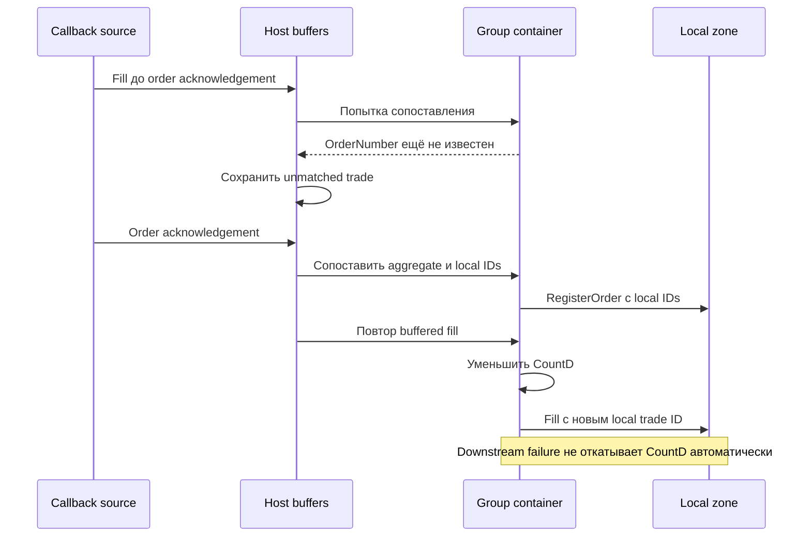

# THG-F2-HOST-001: host, callbacks и портфельный trailing

**Статус:** STATIC SOURCE SPECIFICATION — NOT LIVE EVIDENCE.  
**Дата:** 2026-09-29. Anchors — exact views из
[manifest](evidence/manifest.json): D=`dti.cs`, O=`Order_callback.cs`,
P=`PilotFinanceSystem.cs`, T=`TralingStop.cs`. Полные имена сохраняются в
таблицах для машинной проверки.

## H: разрешение и порядок работы host

| ID | Событие / guard | Действие / следующий шаг | Anchor |
|---|---|---|---|
| H01 | MainTickLua, PauseTimer либо UserData==null | return до остальных действий | PilotFinanceSystem.cs:7049 |
| H02 | Server time MinValue и есть QuikId | Инициализировать Lua; выполнить TMInterval | PilotFinanceSystem.cs:7049 |
| H03 | Начало прохода | UpdateCurParameters всех существующих стратегий до проверки Started/connection/session | PilotFinanceSystem.cs:7049 |
| H04 | TMAllowTrade(helper) | Helper.Update всегда; HelperReaction только при IsStartPlatform && BrokerConnected | PilotFinanceSystem.cs:7087 |
| H05 | Стратегия под lock(EmitentInStrategy) | Требуются TMAllowTrade, LotsIsGood либо Demo, StrategyStarted, IsStartPlatform, BrokerConnected, SessionState, IntervalCounter==0 | PilotFinanceSystem.cs:7134 |
| H06 | H05 пройден | Повторить UpdateCurParameters, вызвать реакцию; positive result → Save | PilotFinanceSystem.cs:7165 |
| H07 | Внутри started/platform/connected gate | Увеличить counter modulo interval даже при SessionState=false; при lot mismatch/TM deny counter не увеличивается | PilotFinanceSystem.cs:7165 |
| H08 | Стратегия сама стала stopped | Вызвать Stop handler; это не автоматический broker-flat | PilotFinanceSystem.cs:7165 |
| H09 | В конце прохода BlockingRobotTransactionErrors | Сбросить RobotStartedByUser и остановить платформу после уже выполненных реакций | PilotFinanceSystem.cs:7418 |
| H10 | Исключение в outer MainTickLua | Записать journal; остаток этого прохода пропускается | PilotFinanceSystem.cs:7049 |
| H11 | OnStart | IsStartPlatform=true; sender!=null ставит RobotStartedByUser=true; сброс transaction error counter | PilotFinanceSystem.cs:8370 |
| H12 | OnStop | IsStartPlatform=false; sender!=null снимает RobotStartedByUser; непосредственного закрытия/отмены здесь нет | PilotFinanceSystem.cs:8447 |
| H13 | Broker reconnect в новую дату | CancelAllActiveOrders; при RobotStartedByUser выполнить Start(null,null) | PilotFinanceSystem.cs:11984 |
| H14 | Ежедневный night cleanup: hour>=23, minute>=53, !IsNight | CancelAllActiveOrders через стратегии, не ожидание terminal outcomes | PilotFinanceSystem.cs:7280 |

IsPriceOld в этой цепочке обслуживает индикацию/предупреждение; отдельного
`if(!IsPriceOld)` перед send в inspected MainTickLua нет. Начало host-прохода
может изменить quotes/план даже остановленной стратегии.

## S: расписание и подключение

| ID | Условие | Результат | Anchor |
|---|---|---|---|
| S01 | Для текущего времени нет matching Disallow | TMAllowTrade=true | PilotFinanceSystem.cs:7721 |
| S02 | Есть matching Disallow Robot/StrategyType/Strategy | Разрешить, если есть хотя бы один matching Allow; строгого приоритета более конкретного уровня нет | PilotFinanceSystem.cs:7721 |
| S03 | Helper schedule | Аналогично S01/S02 с HelperType/Helper | PilotFinanceSystem.cs:7854 |
| S04 | TimeFrom<TimeTo | Интервал включительный [From,To] | PilotFinanceSystem.cs:29691 |
| S05 | TimeFrom>=TimeTo | t>=From ИЛИ t<=To; при равенстве границ получается весь день | PilotFinanceSystem.cs:29691 |
| S06 | Выбор polling | Первый matching Allow для имени, затем типа, иначе IntervalStep; PollingTakt минимум1, PollingInterval<2 даёт1000ms | PilotFinanceSystem.cs:7524 |
| S07 | QUIK connection event8/9 | Broker connected/disconnected; стратегия Started не сбрасывается автоматически | PilotFinanceSystem.cs:28379 |
| S08 | Connection event10/11 | DLL connected/disconnected; при11 сброс OrderSubscribed/TradeSubscribed, но в этой ветке не BrokerConnected | PilotFinanceSystem.cs:28379 |
| S09 | Broker-connected callback | Event выдаётся до SubscribeOrders/SubscribeTrade; MainTickLua проверяет BrokerConnected, а не всю совокупность4 flags TradePlatform.Allow | PilotFinanceSystem.cs:28330 |

## G: обычная и групповая отправка

| ID | Событие / guard | Мутация и эффект | Anchor |
|---|---|---|---|
| G01 | SendGroupOrdersEnable=false | Передать manager обычный SendOrder | dti.cs:4922 |
| G02 | SendGroupOrdersEnable=true | Передать MultiOrderSender; сначала создать local containers/reservations, затем добавить весь batch в OrderSendingBag и отправлять группы | dti.cs:4947 |
| G03 | MultiOrderSender, sender существует | Дополнить OrderInfo; hedge переворачивает стороны; optional limited threshold двигает цену; получить local transaction ID, index-map и container, подписать callbacks; вернуть ID до отправки агрегата | dti.cs:5066 |
| G04 | Нет OrderSender | Return−1; MultiOrderSender не создаёт container | dti.cs:5122 |
| G05 | Построение группы | Ключ Ticker+BuySell+Price; CountD=sum; остальные поля первого container; ClassCode/OrderType/LongShort/ZoneIndex не входят в ключ | Order_callback.cs:1196 |
| G06 | Отправка агрегата | CheckLimits=false, alias=dti, Market Price=0; присвоить всем containers aggregate TransactionId ДО send; result<=0 не откатывает их автоматически | dti.cs:5000 |
| G07 | Ручные BuyZones/SellZones | Всегда container grouping независимо от SendGroupOrdersEnable; пустой batch return; transport-result дальше не используется | dti.cs:6849 |
| G08 | Single instrument и opening direction | Проверить AllowBuy по GetGO×count; обычный SendOrder делает gate до hedge inversion, batch после неё | dti.cs:5170 |
| G09 | MoneyControlDisable либо Demo | Денежный gate разрешает отправку | dti.cs:6699 |
| G10 | Есть futures limit с CbplPlanned!=0 | Разрешить CbplPlanned−orderValue>=0; иначе stock fallback CurrentBal−Locked−ValShort−orderValue>=0; нет подходящего limit → false | dti.cs:6699 |
| G11 | Batch money gate не пройден | Локально вызвать Container_CancelActiveOrder для текущей группы; прекратить отправку последующих групп; bag Actual/CountD этим прямым event-вызовом не обнуляются | dti.cs:4964 |

LocalId из StrategyAbstract — отдельный простой `++LocalId`, а local
transaction ID G03 выдаёт transport NextTransactionId. Их нельзя объединять.
Ключ контейнера — строковая конкатенация; группы не доказывают одинаковые
остальные параметры и не задают FIFO распределение по уровням.

## C: контейнер и маршрутизация callbacks

Container хранит LocalTransactionId, aggregate TransactionId, broker
OrderNumber, сгенерированный LocalOrderNumber, CountD, Actual и Trades.

| ID | Событие / guard | Mutation / результат | Anchor |
|---|---|---|---|
| C01 | Создание | CountD=requested, Actual=true, Trades пуст, local transaction ID сохранён | Order_callback.cs:2769 |
| C02 | transId>0, transId==TransactionId, LocalOrderNumber==0 | Записать broker OrderNumber, сгенерировать local order ID, вызвать event с local identities, true | Order_callback.cs:2778 |
| C03 | Повтор order callback после C02 | false, новые значения не присваиваются | Order_callback.cs:2778 |
| C04 | Fill: номер совпал, lots>0, CountD>0, Actual | Выделить min(lots,CountD); уменьшить CountD ДО downstream callback; callback получает новый local trade ID | Order_callback.cs:2795 |
| C05 | Fill lots>=старого CountD | CountD=0, Actual=false, внешний tradeID добавить в Trades; вернуть хвост | Order_callback.cs:2795 |
| C06 | Fill lots<CountD | CountD−=lots; внешний tradeID НЕ добавить; вернуть0 | Order_callback.cs:2795 |
| C07 | Cancel: num==OrderNumber, lots>0, CountD>0, Actual | Частично/полностью уменьшить CountD, event с local order ID; id аргумент не проверяется | Order_callback.cs:2833 |
| C08 | Guard fill/cancel не пройден | Вернуть исходный lots без mutation | Order_callback.cs:2795 |
| C09 | DTI.RegisterOrder | Попробовать все containers; хотя бы один true подавляет ordinary manager fallback; event делает регистрацию local IDs | dti.cs:6138 |
| C10 | DTI.RegisterTrade, outer !bagTrade | Если внешнего tradeID нет ни в одном container.Trades, раздать по ConcurrentBag до остатка0 | dti.cs:6186 |
| C11 | C10 оставил ненулевой хвост либо dedup пропустил раздачу | Ordinary manager fallback с ИСХОДНЫМ lots, не остатком | dti.cs:6186 |
| C12 | Downstream container event | Повторно DTI.RegisterTrade с bagTrade=true; container не получает подтверждение успешности manager | dti.cs:6294 |
| C13 | Принятый trade | При исходной qty==0 wrapper сразу flag=true без manager/order match/slot mutation; иначе требуется успешная обработка. Post-success: EnterPosDt установить один раз текущим временем, обновить UI | dti.cs:6219 |
| C14 | Принятый trade, state SellAll и GetLotsCount()==0 | Включает C13 qty0 bypass; Report/EndDt; outer !bagTrade выдаёт SellAllCompleted; pending не проверяется; report может строиться inner и outer | dti.cs:6238 |
| C15 | DTI.FlushActiveOrder | Сначала раздать cancel по containers, затем безусловно manager fallback с исходными external IDs/qty; его bool заменяет результат container-раздачи | dti.cs:6598 |
| C16 | SetAddData при восстановлении | Оставить только Actual containers, восстановить events/maps/lots; inactive containers и их завершившие trade IDs исключаются | dti.cs:6341 |

Повтор частичного fill, не завершившего ни одного container, может пройти C10
повторно с новым local trade ID. Если первый fill завершил хотя бы один
container, внешний ID уже присутствует и повторная раздача подавляется.
Это точная граница dedup, а не утверждение, что dedup отсутствует вообще.

Fill до order registration не совпадает с ещё нулевым OrderNumber; cancel
до registration не спасает совпадение transaction ID, поскольку C07 его не
использует. После полного cancel Actual=false блокирует поздний fill;
после частичного cancel раздаётся не больше оставшегося CountD. Host может
буферизовать несовпавшие события. Container не сверяет ticker/ClassCode/side
при совпавшем order number; host фильтрует стратегии по ticker раньше.

## K: отмена, transport failure и локальные тайм-ауты

| ID | Событие / guard | Эффект и значение результата | Anchor |
|---|---|---|---|
| K01 | flushOrderLocal, callback отсутствует | false | dti.cs:6312 |
| K02 | flushOrderLocal нашёл LocalOrderNumber==id | Заменить его broker OrderNumber; иначе передать id без изменения | dti.cs:6312 |
| K03 | OnTrashOrder, !BrokerConnected | false без send | PilotFinanceSystem.cs:12016 |
| K04 | OnTrashOrder, connection есть | Вызвать CancelActiveOrder, игнорируя return; вернуть false при ListOrders match либо age<1min, иначе true | PilotFinanceSystem.cs:12016 |
| K05 | Повтор cancel того же номера <10s после успешного async submit | Подавить повторную отправку; overload Order возвращает номер | PilotFinanceSystem.cs:26425 |
| K06 | Quik.CancelActiveOrder, settings+connection | KILL_ORDER/KILL_STOP_ORDER; async return0→return0, ошибка/exception→−1 | PilotFinanceSystem.cs:28228 |
| K07 | Quik.SendOrder: null/!IsCorrect/disconnect | Return−1; IsCorrect требует Ticker!=null, CountD>0, Accuracy>0 | PilotFinanceSystem.cs:27992 |
| K08 | Валидный Quik send | Buy price floor tick, Sell ceil tick, qty=Math.Round(CountD); info.Id>0 либо ++GlobalID; async return0 → positive transaction ID | PilotFinanceSystem.cs:28107 |
| K09 | Nonzero async return либо exception | −1, не broker reject с гарантированно отсутствующим order | PilotFinanceSystem.cs:27992 |
| K10 | TransactionCallback replyCode==5 | Немедленный return | PilotFinanceSystem.cs:28132 |
| K11 | TransactionCallback dOrderNum==0 | Warning с исключениями двух текстов; через5s синтетический cancel ID=transaction, Number=0, Count=−1 | PilotFinanceSystem.cs:28178 |
| K12 | После исключения replyCode5 | Increment только при dOrderNum==0 && replyCode!=3 && CheckErrorTransactions; последующая проверка накопленного count не требует dOrderNum==0: при включённой проверке и count>=limit (default10) BlockingRobotTransactionErrors=true; platform stop позже H09 | PilotFinanceSystem.cs:28138 |

K04 true разрешает локальное забывание старой неизвестной заявки; это не ack
брокера. K11 с qty−1 не проходит C07, хотя ungrouped manager имеет обработку
отрицательной qty по ID. Разные overload CancelActiveOrder имеют разные
return-контракты. MinOrderInterval реализован Sleep после операции.
Общеплатформенный daily-buy-limit Quik sender применяется к dtm/dtmf,
не к alias dti.

## R: host unmatched/replay

| ID | Событие | Порядок и эффект | Anchor |
|---|---|---|---|
| R01 | OrderCompleted null либо ID0 | return | PilotFinanceSystem.cs:11889 |
| R02 | Live OrderCompleted новый номер | Добавить ListOrders ДО регистрации; повтор из live callback return; под lock искать первую стратегию по ticker, принявшую order | PilotFinanceSystem.cs:11889 |
| R03 | Order принят | Storage append, Save, NonActualOrderList.add; иначе actual ID сохранить в ActualListOrders | PilotFinanceSystem.cs:11889 |
| R04 | TradeCompleted | Под lock вызывать стратегии по ticker без предварительного NonActualTradeList dedup; первый true → append/NonActual/Save | PilotFinanceSystem.cs:11798 |
| R05 | Trade никто не принял и ID actual | Сохранить в ActualListTrades; передаваемая дата DateTimeNow, не exchange timestamp | PilotFinanceSystem.cs:11798 |
| R06 | OrderCanceled→RemoveOrder | Перебрать стратегии без ticker-filter; первый FlushActiveOrder=true → Save и return; C15 false может скрыть уже сделанную local mutation | PilotFinanceSystem.cs:9048 |
| R07 | Timer2 каждые850ms | Сначала replay trades, затем orders; trade-before-order может разрешиться лишь на следующем проходе | PilotFinanceSystem.cs:8769 |
| R08 | Replay успешен | Удалить buffered event, добавить NonActual; replay-order не отсекается ListOrders | PilotFinanceSystem.cs:9006 |
| R09 | Constructor/restart | Actual buffers создаются пустыми; их самостоятельное восстановление из persistence не найдено | PilotFinanceSystem.cs:5211 |

OrderCompleted имеет пустой общий catch, TradeCompleted пишет journal.
NonActual — сохраняемые ID с дневной областью; они ограничивают добавление
unmatched, но не заменяют входной глобальный dedup. Save асинхронный и не
подтверждает durable write; подробности в THG-F2-SETTINGS-001.

## T: портфельный trailing — расчёт и жизненный цикл

Выбор — StartStopList[id]==true; список StrategiesInProcess/галочки IsChecked
сам по себе не выбирает стратегии для этих вычислений. Selected set не
фильтруется по strategy.Started в первичных stop-ветках.

`z=(int)(ΣGetPrib−ΣGetProsadka)`, `P=float(100z/ΣGetMoney)` при plan>0,
иначе0. Extrema обновляются строгими >/<. EnterDateTime/CreatedDateTime —
самые ранние non-null даты selected; WasActivity — Any соответствующего
интерфейса без проверки Started.

FromMax: CurStep=H−P. From0: H−P при H<0 или H>=Target, иначе−P;
неизвестный enum обрабатывается как FromMax. StopLoss=Step либо DynamicStop;
при abs(Target)>0 dynamic=round(Step−H×Step/Target,2), затем lower
MinDynamicStop и upper Step. При Target0 вычислительная/lower ветка
пропускается, начальное0 проходит только upper clamp. ActualStep=TargetStep
при H>0 && H>=Target, иначе StopLoss.

| ID | Событие / guard | Изменение / продолжение | Anchor |
|---|---|---|---|
| T01 | Update, хоть одна selected SessionState=false | return с прежними CurStep/P/extrema/датами | TralingStop.cs:1998 |
| T02 | Update, рассчитано P<=−100 либо P>=100 | Такой же return; это не trigger аварийного stop | TralingStop.cs:1998 |
| T03 | Update прошёл | Обновить extrema, Current result, CurStep, даты, WasActivity даже если helper stopped | TralingStop.cs:1998 |
| T04 | P>0 && P>=Target && !LastStopProfit | LastStopProfit=now, cause=TakeProfit, Save | TralingStop.cs:1998 |
| T05 | HelperReaction, !Started | return | TralingStop.cs:1817 |
| T06 | CurStep>ActualStep && !LastStopLoss | LastStopLoss=now; ClosePositions(Id) всем selected; optional IntervalStep=1 | TralingStop.cs:1817 |
| T07 | Mini enabled, Minutes>0, !LastStopLoss, EnterDateTime и elapsedSeconds>Minutes×60 | Проверить limited-window и P; затем поставить MiniStopLimitedDeactivated=true, если ещё false | TralingStop.cs:1817 |
| T08 | T07; !Limited либо elapsedMinutes<Minutes+1; P<−MiniStopPercent | LastStopLoss=now; ClosePositions всем; optional interval1 | TralingStop.cs:1817 |
| T09 | StopByTime, !LastStopLoss, EnterDateTime, elapsedSeconds>StopMinutes×60 | LastStopLoss=now; ClosePositions всем; optional interval1 | TralingStop.cs:1817 |
| T10 | StopEmptyByTime, CreatedDateTime, elapsed>StopEmptyMinutes×60, !WasActivity | Selected IStarted+IWasActivity Started=false; Stop helper; optional удалить стратегии/helper; текущий проход продолжается | TralingStop.cs:1817 |
| T11 | LastStopLoss и все selected lots==0 | Stop helper, всем ISellAll FreezeVolume=0; это не проверка pending; текущий проход продолжается | TralingStop.cs:1888 |
| T12 | LastStopLoss, не все lots0 | low=min volume, high=max, portion=max(high−low,PieVolume); при Equalize FreezeVolume=high−portion, иначе0 | TralingStop.cs:1904 |

Host после T01/T02 всё равно может вызвать HelperReaction: stale computed
fields остаются рабочими. Первичный trigger T06 строгий. T06/T08/T09 идут
последовательно: первый записавший LastStopLoss подавляет следующие guards,
но T10 не зависит от этой даты. При пустом selected set All(lots0)=true;
Min/Max ветка T12 не вызывается. PieVolume>high может дать отрицательный
FreezeVolume: model-level clamp нет.

## F: отложенное закрытие, выполняемое после T11/T12

Весь блок требует LastStopLoss, DeferredClosePos, !StopEmptyByTime,
!StopByTime. Ниже порядок важен: проверки stop-loss следуют за TP-веткой
и могут повторно поменять причину в том же проходе.

| ID | Guard | Мутация / вызовы | Anchor |
|---|---|---|---|
| F01 | LastStopProfit и cause=TakeProfit и P<Target−TargetStep | Started+SellAll+positive lots+ISellAll → RevokeSellAll | TralingStop.cs:1926 |
| F02 | LastStopProfit и cause=TakeProfit и P>=Target−TargetStep | Started+!SellAll+positive lots → ClosePositions | TralingStop.cs:1926 |
| F03 | TP-cause branch не выбран и P>Target−TargetStep | cause=TakeProfit, без немедленного TP close/revoke именно этой веткой | TralingStop.cs:1926 |
| F04 | CurStep>=StopLoss | cause=StopLoss; Started+!SellAll+positive lots → LastStopLoss=now и ClosePositions | TralingStop.cs:1926 |
| F05 | cause=StopLoss и CurStep<StopLoss | Started+SellAll+positive lots+IForbidBuyes → RevokeSellAll и ForbidBuyes=true | TralingStop.cs:1926 |
| F06 | DTI.ClosePositions(helperId) | TralingStopId=id, State=SellAll, Save; не включить остановленную стратегию | dti.cs:7075 |
| F07 | DTI.RevokeSellAll | State=Active, Save; без отмены/reprice существующих exit orders и без проверки источника SellAll | dti.cs:7554 |

T06 может выставить SellAll, а F01/F05 отозвать его в том же проходе.
LastStopLoss при отзыве не очищается. Helper не различает внешний stop-zone,
ручной SellAll и закрытие другим helper. Именно поэтому target emergency
latch из ADR не является найденной гарантией оригинала.

## U: ручное изменение helper и восстановление

| ID | Команда / guard | Mutation / side effect | Anchor |
|---|---|---|---|
| U01 | Started=true и H<Target | Присвоить true и Save; иначе оставить прежнее значение и сообщение «Цель уже достигнута» | TralingStop.cs:1306 |
| U02 | Setter Started при успехе/отказе | StartedOrStoped и property event выдаются в обоих случаях; false всегда допускается | TralingStop.cs:1306 |
| U03 | Stop() | Started=false; StartedOrStoped дополнительно вызывается второй раз | TralingStop.cs:2088 |
| U04 | StartStop(id) | Инвертировать selection; сбросить maxima и LastStopLoss/Profit, Save; minima/mini-deactivated/cause/CurStep/FreezeVolume/ForbidBuyes не сбрасываются | TralingStop.cs:1695 |
| U05 | Clear() | Extrema в ±1e6, stop dates=null, mini-deactivated=false, Save, Stop; selection/cause/FreezeVolume/ForbidBuyes сохраняются | TralingStop.cs:1735 |
| U06 | Manual ClosePositions | Вызвать selected ClosePositions без Started guard и без установки LastStopLoss; post-stop управление этим одним действием не активируется | TralingStop.cs:1986 |
| U07 | AddStartStop отсутствующего id | Добавить id=false | TralingStop.cs:1686 |
| U08 | Tune(ids,settings) | Отметить переданные IDs true, прежние не очищать; поменять stop/time параметры, RemoveStrategiesEmptyByTime=true; без start/reset extrema | TralingStop.cs:2102 |
| U09 | Runtime Step/Target/TargetStep/Dynamic/Mini/Deferred/Equalize | Прямое присваивание и Save; реакция пересчитывается по очередному проходу, model validation часто отсутствует | TralingStop.cs:339 |
| U10 | UI PieVolume getter/setter | Clamp минимум100000, включая mutation в getter; это UI-эффект, не invariant model | TralingStop.cs:551 |
| U11 | UI включение time stop либо изменение minutes | Отказ, если соответствующий срок уже истёк; minutes допускаются при отсутствии даты либо elapsed<newMinutes | TralingStop.cs:339 |
| U12 | UI StopLossType и ожидаемый немедленный stop | Запрос Yes/No; прямые model-вызовы bypass UI guard | TralingStop.cs:492 |
| U13 | Reload | Persisted Started/extrema/dates/cause/settings/selection восстановлены; Cur* fields/Enter/Created/WasActivity/providers nonserialized и default до Update; setter U01 автоматически не выполняется | TralingStop.cs:1135 |

Constructor defaults: Step3, Target3, MinDynamicStop1, TargetStep0.2, bools
false, FromMax, пустой selection. Это defaults, не рекомендуемые параметры.

## Разные режимы transport и граница доказательства

Demo SendOrder присваивает actual demo ID через callback, затем синхронно
вызывает OrderCompleted и full TradeCompleted по переданной цене
(`PilotFinanceSystem.cs:26182`). Возврат sender и callbacks могут быть
реентерабельными относительно предварительной local регистрации. Это не
модель live partial fills/cancel races.

В inspected Form1 switch создаются QuikPlatform, DemoPlatform или TWS
(`PilotFinanceSystem.cs:11272`). Класс QuikPlatformWithAcrossOrderModule есть,
но его инстанцирование в этих views не найдено; его crossing-flow не
приписывается штатному Futures2. Управляемый wrapper вызывает native QUIK;
доставка/полнота callback потока и выполнение биржевых отмен не доказаны
статическим managed-кодом. Локальные replay buffers найдены, broker snapshot
reconciliation ими не становится.

## Дополнение target: signed-price

Legacy Market Price=0, transport rounding и callbacks выше сохранены
буквально. Target обязан различать Limit(0)/Market и missing/zero quote,
сохранять signed precision при grouping/replay и нормировать процентный
trailing на положительную базу. Единственный числовой контракт —
[THG-PRICE-001](PRICE_DOMAIN.md); native ограничения — THG-INTEGRATION-001.
