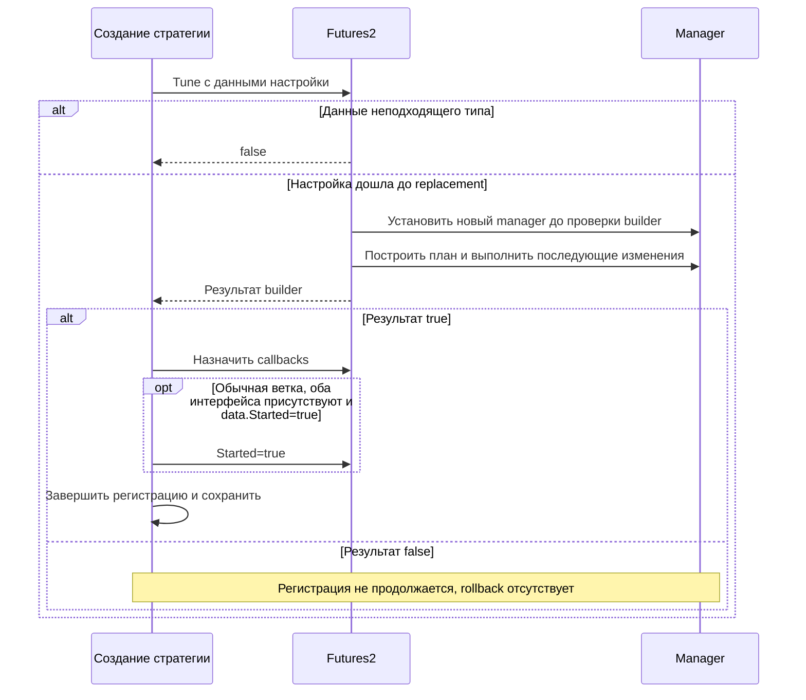

# THG-F2-SETTINGS-001: ручные команды, runtime-настройки и сохранение

**Статус:** STATIC SOURCE SPECIFICATION + EXPLICIT OWNER REQUIREMENTS.  
**Дата:** 2026-09-29. Основной тип — `DTI.StrategyDTIDTF`, не DTMF.

Различать начальный builder, полную замену manager, немедленные setter-изменения,
команду применения и локальное исправление учёта. Наличие setter само по себе
не доказывает отмену или изменение уже выставленного ордера.

## Источники UI и граница видимости

`StrategyViewDTF` использует общий StrategyViewModel (`dti.cs:18556`).
Пассивно прочитаны ресурсы `DTI.g.resources` через ResourceReader.GetResourceData,
без XAML loading и исполнения vendor code. Строки путей в конкретном BAML
подтверждают их наличие в ресурсе, но не полную цепочку Binding, visibility,
CanExecute либо фактическую доступность на экране. Проверка code-behind/VM
указана отдельно. Hashes ресурса и выбранных entries — в
[приложении UI evidence](evidence/ui-bindings.json).

Штатные resources: `view/settingsdtfdialog.baml`, `view/strategyviewdtf.baml`.
Общие унаследованные: `view/settingsdialog.baml`, `view/strategyview.baml`.

## N: создание и полная перенастройка

| ID | Entry / guard | Изменение и результат | Anchor |
|---|---|---|---|
| N01 | ChooseInstrument Futures2 | Выбрать инструмент, открыть SettingsDTFDialog/SettingsDTFViewModel; builder создаёт пустые baskets | dti.cs:27420 |
| N02 | Host ChangeSettings, allowShowMessage && held!=0 | Предупреждение о несоответствии позиции; отказ возвращает управление до остановки | PilotFinanceSystem.cs:8557 |
| N03 | Продолжение ChangeSettings | Под emitent lock Started=false ДО окончательной проверки бюджета и диалога; pending guard отсутствует | PilotFinanceSystem.cs:8601 |
| N04 | Создание settings dialog | Deep clone manager через in-memory BinaryFormatter; восстановить const links; ClearStrategy обнуляет LastUpdateUpDown и прибыль | dti.cs:18221 |
| N05 | MakeStrategyDTF допустил начальные guards | Заменить m_Zones новым списком; записать direction/GO/fixed/commission/internal bounds; создать 2N зон, отсортировать | dti.cs:10084 |
| N06 | Хотя бы один рассчитанный active PlanLots<=0 | Builder false ПОСЛЕ mutation cloned zones; иначе InitHJ и true | dti.cs:10161 |
| N07 | SettingsVM.MakeStrategy | Bool builder игнорируется; AllowSave проверяет zero PlanLots выбранного направления, не полноту валидации плана | dti.cs:21307 |
| N08 | OnApply | true, если нет exception; exception → false | dti.cs:21289 |
| N09 | Применён диалог | Полностью заменить manager; IsAdjustStrategy=true; SellAll→Active; ExitAfterAcross=false; Source очистить; привязать events/resync flags | dti.cs:27491 |
| N10 | Cancel, недостаток бюджета либо ошибка до Apply | Старый manager сохраняется, но сделанная N03 остановка не откатывается | PilotFinanceSystem.cs:8557 |
| N11 | Успешный host apply | Восстановить callbacks, Save; автоматического Start в ChangeSettings нет | PilotFinanceSystem.cs:8557 |

N09 не переносит старые zone fills/pending в новые baskets и не ждёт broker
cancel barrier. ClearStrategy сам по себе не очищает holdings; их потеря в
новом плане связана с заменой списка builder. Слово «изменить диапазон» не
должно скрывать эту разницу.

### Начальные поля

| Поле | Единица / default | Валидация и эффект | Anchor |
|---|---|---|---|
| StrategyMode | Long/Short | Направление нового плана | dti.cs:20838 |
| TrendType / IsHedge | false, «волатильность» | При true предупреждение, подписи Long/Short меняются местами; это не перевод существующей позиции | dti.cs:20670 |
| Money | Валюта бюджета; trunc(sum(exchangeGO×5))+1 | Setter только>0; getter ограничивает availableMoney; manager может хранить uncapped сумму | dti.cs:20878 |
| Up / Down | Котировка; первоначально Ask±1%, округлённые целым | Только>0; обе границы округляются ВВЕРХ к tick; проверки Up>Down здесь нет | dti.cs:20900 |
| GO | Пользовательский процент;20 | Только>0; не фактическое exchange GO для AllowSpend | dti.cs:20861 |
| ZonesCount | Active N;5 | Setter>0, builder>1; N1 может оставить прежний валидный cloned план вследствие N07 | dti.cs:20943 |
| EnableFixLots / LotsCountInZoneFix | Переключатель и целые контракты | При F<=0 helper фактически рассчитывает объём; отрицательное значение UI не отвергается явно | dti.cs:20510 |
| Comission | Для futures руб./контракт;2 | Без positivity validation | dti.cs:20960 |
| Output | Единицы цены фьючерса;100 для нового плана | Положительный SellValue первой зоны копируется при редактировании; новое значение без >0 guard | dti.cs:20975 |
| SellFormat | Default Roubles, enum содержит четыре значения | Output передаётся прямо в SellValue, преобразования по enum в этой ветке нет | dti.cs:21326 |
| StopAfterExit | false | Запись в cloned manager | dti.cs:20977 |
| PreSendOrders / Percent | false/0 | Запись в cloned manager | dti.cs:21103 |
| FixDeviationPercUp/Down | false | Границы привязаны к текущему Ask; проценты пересчитывают их | dti.cs:20524 |
| ZoneWidth | UI (Up−Down)/N | Setter симметрично двигает границы, отдельная ветка при нижней<=0; не builder (Up−Down)/(N−1) | dti.cs:21064 |
| Подбор N | По деньгам, верхней цене и fixed lots | Обычная кнопка учитывает F; автоматический FixDeviation path вызывает без F, подразумевая1 | dti.cs:21279 |
| Подбор Money | trunc(N×F×ratio×GO%×P×StepPrice/Accuracy)+1 | Не пересчёт фактического брокерского лимита | dti.cs:21274 |

Builder guard требует N>1, Money>0, instruments nonempty, GO>0 и ненулевого
DBItem.GO у всех instruments. В нём нет общего Up>Down/tick-unique validation.
container.Money не присваивается обратно manager.Money. Поэтому header budget
и фактический бюджет распределения могут различаться. Formula/fixed-carry
описаны в THG-MATH-001 и не дублируются здесь.

## W: изменения действующего manager

Следующие пути найдены строками в Futures2 BAML и имеют implementation в VM.
Обычная семантика — немедленная запись и Save, без cancel/reprice/barrier;
исключения указаны явно.

| ID | Изменение | Условие / эффект | Anchor |
|---|---|---|---|
| W01 | SellRule, OrderType, zone.SellValue | Сразу изменить будущие решения; SellRule обновляет отображение зон | dti.cs:22550 |
| W02 | Ввод CommonMarkup | Только поле; getter при<=0 присваивает100; zone.SellValue ещё не изменён | dti.cs:23303 |
| W03 | SetMarkup | При >1 selected zones применить к выбранным, иначе ко ВСЕМ, включая случай ровно одной выбранной | dti.cs:24570 |
| W04 | ForbidBuyes / ForbidSells / IsStopAfterExit | Boolean setter, без отмены working orders | dti.cs:23119 |
| W05 | Два UseBlockExit и From/To | From только<To, To только>From; неверное значение не записывается | dti.cs:23441 |
| W06 | Add/remove/edit BlockRule | Сразу изменить список и Save; у отдельных правил нет From<To validation | dti.cs:18781 |
| W07 | UseSpendDayLimit, SpendDayLimit, ClearSpendDayLimitAfterSellAll | Прямые изменения будущих budget guards | dti.cs:22931 |
| W08 | IgnoreSellsForLimits=true при TodaySpended<0 | Обнулить счётчик; UI ClearTodaySpended отдельно не вызывает Save явно | dti.cs:23066 |
| W09 | HJBuyEnabled/HJSellEnabled | Включить/выключить фильтр; ClearHJ создаёт новый HJ текущей ширины и Save | dti.cs:24480 |
| W10 | PreSendOrders/Percent | Прямая запись; при IsHedge runtime setter принудительно ставит PreSendOrders=false | dti.cs:22448 |
| W11 | PreSendOrderPorog / PreSendOrderOtskokPerc | Прямые записи; отсутствие чтения ряда аргументов в lower flow описано в THG-F2-LEVELS-001 | dti.cs:22601 |
| W12 | EnabledLiquidity / OrderThreshold | Прямая запись; обычный EnabledOrderThreshold при включении выключает Limited | dti.cs:23682 |
| W13 | AutoUpdateUpDown / UpdateUpDown / CorrectUpDownAfterExit / value | Setters и явные вызовы manager, без единого общего rebuild процесса | dti.cs:22841 |
| W14 | LotsIsGoodDisable / SendGroupOrdersEnable / MoneyControlDisable | Прямая запись; смена grouping не переводит существующие orders в другую identity model | dti.cs:22682 |
| W15 | RealizedZonesCountOnStep / HalfOrderDelay | Setter принимает>0; getter manager нормализует неположительное, defaults1/30s | dti.cs:24112 |
| W16 | OutOfBoundValueLabel | Строка принимает integer, включая отрицательный;0 выключает; decimal API отдельно допускает дробное | dti.cs:24065 |
| W17 | EnableLogs / SaveLogs | Boolean и явный экспорт непустых строк; не торговый transition | dti.cs:24399 |

BAML содержит строку `PreSendOrderEnable`, но одноимённого свойства в dti.cs
не найдено. Это unresolved binding, не рабочий alias для PreSendOrders.
Доказательство отсутствующего свойства получено по декомпилированным типам;
полная runtime WPF binding resolution не запускалась.

### Унаследованные поля и альтернативные входы

В Futures2 BAML не найдены direct strings PreSendOrdersType, ExitAfterAcross,
UseBlockEnter, BlockEnterAlways, DirectionalIntegrity, WidenRange,
EnablePriorityOrder, EnabledOrderThresholdLimited, ForbidLong, ForbidShort,
SpeedMode, ArbitrageType. Это не доказывает недостижимость setter через
унаследованный API/другие окна. Generic UI и helper paths существуют.

| ID | Setter / API | Отличающееся условие | Anchor |
|---|---|---|---|
| W18 | PreSendOrdersType | Percent/Raw/Zones, default Percent; future reactions используют новую формулу | dti.cs:22469 |
| W19 | EnablePriorityOrder=true | Требуется выбранный instrument, иначе warning | dti.cs:23977 |
| W20 | EnabledOrderThresholdLimited=true | Требуется dictionary; отключить обычный threshold; editor присваивает0 нераспарсившемуся значению | dti.cs:24005 |
| W21 | IntervalStep | Getter минимум1, setter хранит любое значение | dti.cs:4349 |
| W22 | DescriptionDTI.ForbidShort | Не менять при ForbidBuyes=true; общий VM setter этого guard не содержит | dti.cs:27073 |
| W23 | DescriptionDTI.StopPrice | Преобразовать price в D относительно internal Low/High по UI orientation; знак не проверяется | dti.cs:27146 |
| W24 | DescriptionDTI.UseStopOrders setter | Пустой, ничего не меняет | dti.cs:27140 |
| W25 | SetSpendDayLimit(percent) | round(Money×percent/100), Save; UseSpendDayLimit сам не включается | dti.cs:4903 |
| W26 | FreezeVolume | Прямое значение; backing field NonSerialized | dti.cs:4379 |

## J: команды стратегии и зоны

| ID | Entry / guard | Эффект | Anchor |
|---|---|---|---|
| J01 | Started→SetIsStartStrategy | Flag+Save+event; Stop не делает cancel/close | dti.cs:5359 |
| J02 | Futures2 GetIsStartStrategy | Дополнительный server-time/license AllowStartStrategy("Фьючерсы",...) gate; значение flag само недостаточно | dti.cs:27546 |
| J03 | Штатный host Start, freeMoney>=0 | Emitent.StartStrategy, Save, sender/canceller; план не строится и local synthetic fill не делается | PilotFinanceSystem.cs:8492 |
| J04 | UI SellAll, подтверждение Yes | State=SellAll и Save, Started не включается | dti.cs:24631 |
| J05 | API SellAll(helperId) | Дополнительно сохранить helper ID; иначе тот же state | dti.cs:7075 |
| J06 | RevokeSellAll | Без проверки прежнего state →Active и Save, без cancel существующих exits | dti.cs:7554 |
| J07 | Buy/Sell selected zones | Выбрать selected FilterZones, вызвать strategy напрямую; manual grouping описан в THG-F2-HOST-001 | dti.cs:24337 |
| J08 | Buy/Sell одной зоны | Прямой вызов без UI CanExecute predicate | dti.cs:25182 |
| J09 | RegisterZone / GroupRegZones | Local registration, Save; group dialog допускается только при отсутствии pending выбранной стороны и наличии free zones | dti.cs:11502 |
| J10 | GroupRegisterActualZones | Пустое тело | dti.cs:25165 |
| J11 | ClearZone UI | Только selected в текущей отображаемой коллекции; ClearZone и Save; selection пуст →no-op | dti.cs:25213 |
| J12 | Flush zone active orders | FlushAllActiveOrders, отдельного Save в command body нет | dti.cs:25242 |
| J13 | Редактирование LotsCount детали | value0→Clear, иначе SetLotsCount со старой средней либо текущим SupplyInRouble; positivity/явного Save нет | dti.cs:20126 |
| J14 | Редактирование AveragePrice детали | Только held>0; UpdateAveragePrice и UI, явного Save нет | dti.cs:20114 |
| J15 | Комиссия / Constant инструмента | После диалога записать две пары commission либо SetConstant, Save | dti.cs:20234 |
| J16 | AveragePrice инструмента | Только информационный диалог средней/средней с двойной комиссией/стоимости шага | dti.cs:20225 |
| J17 | ShowHJBuyGraph | Открыть history; ShowHJSellGraph пуст | dti.cs:24486 |
| J18 | Старые handlers ProcExitSame/HalfZoneUp/ZoneUp, FlushAllStop, OnSetSellAll | Пустые тела в StrategyViewDTF; реальный SellAll/SetMarkup используют VM bindings | dti.cs:18610 |

GroupRegZones сортирует long по убыванию цены, short оставляет исходный список;
запрашивает число **зон** для регистрации, для каждой заполняет недостающие
лоты, опционально unified price. Это отдельная команда и не порядок
автоматического входа. BuyPrice/PlanBuyPrice/AveragePrice/LotsCount найдены
в ресурсе detail-window, но их фактический readonly/layout здесь не заявлен.

## Общая средняя и требование владельца

GetAveragePrice всей стратегии существует (`dti.cs:11755,11778`) и используется
для статистики/GetAvaragePrice/dialog. Общая наценка W03 копирует SellValue
по зонам, не ставит общую цель всей позиции. В найденных call sites нет пути
от whole-strategy average к автоматическому TP. SellRules enum содержит только
FromEnter/FromPlan (`dti.cs:28901`), а GetSellPrice использует average зоны.

**OWNER REQUIREMENT:** будущий робот поддерживает и отдельные выходы уровней,
и общий выход относительно средней всей позиции; режим меняется в runtime.
Смена не должна создавать два независимых full-volume выхода. Перед передачей
ownership выходов новому режиму нужны учёт partial fills, отмена конфликтующих
старых заявок и подтверждение их исхода. Это дополнение к оригиналу, не
восстановленное legacy-свойство. Реализация и runtime qualification отсутствуют.

## PERSIST: сохранение и загрузка

| ID | Событие | Действие и граница | Anchor |
|---|---|---|---|
| PERSIST01 | Emitent.Save | Передать mutable object reference через RepositoryAssistant в асинхронный BinaryRepository; return true не durable ack | PilotFinanceSystem.cs:15188 |
| PERSIST02 | Worker save | Coalesce requests, ThreadPool, File.Create+BinaryFormatter; до5 попыток с500ms, exceptions скрыты | PilotFinanceSystem.cs:25400 |
| PERSIST03 | Load project | Обычный BinaryFormatter.Deserialize; восстановить Save delegate/key; backup ZIP fallback при повреждении. Type remap в этом маршруте не вызывается | PilotFinanceSystem.cs:25454 |
| PERSIST04 | Strategy.SetAddData | Восстановить delegates/events/maps/paper links; оставить только Actual grouped containers; пересчитать lots | dti.cs:6341 |
| PERSIST05 | LoadUserData | Lua/server-time/flush/sender/canceller/start-stop/demo wiring | PilotFinanceSystem.cs:6036 |
| PERSIST06 | OnConnect | ClearOldOrders всех strategies | PilotFinanceSystem.cs:8827 |
| PERSIST07 | DTI.ClearOldOrders | Manager.ClearActiveOrders меняет local orders, но wrapper num остаётся0 и его conditional Save/UI ветка не выполняется | dti.cs:6732 |
| PERSIST08 | Отдельный GetEmitentInStrategyDataSer | DP.GetNewType и Deserialize с новым типом; caller в исследованных PFS/TradeHelp не найден. Не гарантия миграции штатного проекта | PilotFinanceSystem.cs:21881 |

Сериализуются manager state, IsStartStrategy, zones/order/trade graph и maps.
NonSerialized runtime delegates, caches, некоторые counters/status и
FreezeVolume восстанавливаются отдельно/default. Actual replay buffers host
не восстанавливаются этим graph. Load не является broker reconciliation;
backup может вернуть старую локальную картину. Реальные state/config/database
файлы не открывались, BinaryFormatter vendor graph не исполнялся.

## Достижимые альтернативные workflow

Обычный Futures2 settings dialog не содержит Speed/Classic controls.
Но inherited RotateEmitent открывает generic SettingsDialog с ними:
TradeHelp.RotateBillMenu→UserPlatform.Rotate останавливает platform/источники,
запрашивает отмены, рассчитывает budget, требует summed drawdown>100 и
available money>0, создаёт replacement выбранного типа и вызывает
ChooseInstrument→RotateEmitent (`TradeHelp.cs:13543`,
`PilotFinanceSystem.cs:10471`, `dti.cs:6743`). Это создание заменяющего плана.

Другой workflow AreaViewModel.RotateTo принимает source через inherited
IClassicArbitrageRotate; body не проверяет source.IsClassicMode, список target
фильтруется по Classic, затем RotateInit обоих и Start
(`TradeHelp.cs:13753,13808`). Это операционный перенос через общий controller.
Оба маршрута и экспирация подробно описаны в
[THG-F2-ROLLOVER-001](FUTURES2_EXPIRATION_AND_ROTATION.md).

## API: альтернативные команды и создание без диалога

Futures2 наследует следующие интерфейсы StrategyDTI. Достижимость указана
по callers; наличие public метода не выдаётся за кнопку штатного Futures2 UI.

| ID | Entry / guard | Изменение и результат | Anchor |
|---|---|---|---|
| API01 | Host EnterBackEmitents / remote enter-back-strategy | При manager!=null State=Active и Save, независимо от прежнего режима; без Start и cancel exits | dti.cs:6174; PilotFinanceSystem.cs:9282 |
| API02 | Public StartStrategy / SopStrategy | Только IsStartStrategy=true/false; без Save/events/license gate. Direct caller именно этих DTI методов в исследованных host/TradeHelp/helper не найден; штатный Started идёт через J01 | dti.cs:5592 |
| API03 | CreatePortfolioElement / CreatePortfolioGroupElement | По типу "Futures 2.0" создать объект, задать Lua и вызвать IQuietSetting.Tune. Обычный путь задаёт DemoMode до Tune, group — после его успеха | PilotFinanceSystem.cs:6393; PilotFinanceSystem.cs:6501 |
| API04 | Tune: data не ArbitrageDataFormat | info=null, false без дальнейшей перенастройки | dti.cs:7319 |
| API05 | Tune: data подходящего типа | Меняет Source; создаёт новый local manager, копирует hedge/name/лимит/group/liquidity/threshold/SellRule, PriceWithGO=true | dti.cs:7326 |
| API06 | Tune: SpendDayLimit>0 | Пишет через property StrategyManager в СТАРЫЙ manager до его замены. На новом объекте с null manager — исключение; на существующем значение теряется при replacement | dti.cs:7360 |
| API07 | Tune: после наполнения instruments/Papers/excludes | StartDt=now, EnterPosDt=null; m_Strategy уже заменён ДО builder. Копирует ratios/commissions/price kind/range/budget/exit flags; Demo отключает threshold | dti.cs:7403 |
| API08 | Tune: StrategyType==2 | MakeStrategyDTF; N по GO×positive CustomDepoCorrect, container.GO исходный; fixed lots выключен, commission2, SellValue=Delta. Отсутствующее direction для builder заменено Long | dti.cs:7444 |
| API09 | Tune: после DTF builder | При true привязать events, IsAdjustStrategy, Name/resync. StrategyModeOnly затем получает исходное nullable значение, даже если builder использовал Long | dti.cs:7466 |
| API10 | Tune: StrategyType!=2 | Generic MakeStrategy и UseBlockEnter; N=maximum, заданный N ограничивает его только при 0<N<max | dti.cs:7480 |
| API11 | Tune: после любой builder-ветки | Даже при false очистить HasLongBargs/HasShortBargs, создать BlockRules/границы, установить StartPrice и положительный ActiveRequestTime→HalfOrderDelay, notification Tune. Return builder result | dti.cs:7507 |
| API12 | Host получил Tune=true | Установить AddData/events/delegates, зарегистрировать в project/portfolio и сохранить. Обычный CreatePortfolioElement ставит Started=true только если data is IStarted && portfolioElement is IStartStop && data.Started. В group-ветке просмотренного пути такого Start нет; false не продолжает регистрацию | PilotFinanceSystem.cs:6558 |
| API13 | ChooseInstruments scoring setup | Active Lua+непустые securities: сразу заменить manager, записать Name/service data и instruments. AddInstrument false оставляет уже изменённый manager. Non-Lua требует DataBaseInfoDTI и выбирает BaseTicker. Papers/excludes/UI создаются, zones не строятся | dti.cs:5777; PilotFinanceSystem.cs:10672 |
| API14 | Dictionary overload ChooseInstrument / AdjustStrategy | Всегда false; это не unattended эквивалент штатных диалогов | dti.cs:5772; dti.cs:5646 |
| API15 | SetTicker | Меняет только Name, игнорирует ticker/class/lot/accuracy; direct caller в исследованных PFS/TradeHelp не найден | dti.cs:6128 |
| API16 | Host OnAutoCorrect | GetActualZones всегда throws NotImplementedException; следующий AplyPlan всегда false и в этом host-пути не достигается | dti.cs:6468; PilotFinanceSystem.cs:10908 |
| API17 | FlushAllActiveOrders | Вызывает manager→все zones; возвращает true независимо от broker cancel acknowledgment | dti.cs:6508; dti.cs:11233 |
| API18 | FlushAllActiveStopOrders / GetActiveOrders / ManualControlForm | Соответственно false / пустой массив / null; это не очистка broker stops, не inventory working orders и не zone VM manual UI | dti.cs:6514; dti.cs:6588; dti.cs:6555 |
| API19 | PribClear | ClearProfit всех zones, true даже при null manager; позиции не закрывает. Host вызывает при архивировании/изменении/удалении | dti.cs:6579; PilotFinanceSystem.cs:9906 |
| API20 | PrepareToremove / Closing | Пустые тела; сами не отменяют orders и не закрывают позиции. Host removal/close вызывает их | dti.cs:6672; dti.cs:6835 |

Tune не содержит catch, rollback, Save либо guard stopped/flat/no-pending.
Исключение или false могут оставить Source/Papers/manager уже изменёнными.
API08 — отдельный контракт создания: его defaults и guards отличаются от
SettingsDTFViewModel. API02 не следует путать с одноимённой командой host
EmitentInStrategy.StartStrategy, использующей property Started.

Диаграмма показывает ветвление API04–12; исключения, включая API06,
могут прервать Tune до возврата результата.

## SYNC: сверка количества и ручное исключение внешних позиций

Это проверка агрегированного количества по ticker. Она не сопоставляет
broker orders с кампаниями и не восстанавливает пропущенные fills зон.
Интерфейс IOptimize содержит NeedUpdateFromStrategy/NeedUpdateFromTerminal;
его имя не обозначает генетический подбор сетки (`Order_callback.cs:469`).

| ID | Entry / guard | Изменение и результат | Anchor |
|---|---|---|---|
| SYNC01 | Host tick→UpdateCurParameters | Обновить quotes, terminal lots и UI до торговых guards. Pending-zone lookup в начале тела при пустом результате ничего не восстанавливает | dti.cs:5283 |
| SYNC02 | UpdateLotsCount, active Lua | GetPositions(...)??0; затем IsAbsent=!n.HasValue всегда false. Replacement instruments при Expirate также получают0 вместо null | dti.cs:5518 |
| SYNC03 | UpdateLotsCount, non-Lua DataBaseInfo | Сопоставить ticker; отсутствие означает LotsCount0 и IsAbsent=true | dti.cs:5518 |
| SYNC04 | Terminal count изменился / SetNeedUpdateFromTerminal | Распространить invalidation всем известным IOptimize strategies, иначе себе; SetNeedUpdateFromStrategy аналогичен. Это флаги, не fills | dti.cs:6388; dti.cs:6407 |
| SYNC05 | Manager.UpdateLotsCount, NeedUpdateLotsCount | Сбросить flag и обновить LastLotsCount=GetLotsCountEx из локальных zones; terminal count не копируется в basket | dti.cs:10413 |
| SYNC06 | LotsIsGood, Demo либо текущий instrument FUTSPREAD | Ранний true | dti.cs:5366 |
| SYNC07 | LotsIsGood, ordinary instrument | Суммировать Papers.LotsCount того же ticker всех strategies, корректировать связанные FUTSPREAD и прибавить Exclude текущей стратегии | dti.cs:5366 |
| SYNC08 | LotsIsGood, IsAbsent | Создать/обновить монитор и continue; само отсутствие НЕ устанавливает return flag=false | dti.cs:5366 |
| SYNC09 | LotsIsGood, сопоставление | Match если aggregate==terminal либо Lot>1 && terminal>Lot && aggregate==terminal/Lot с integer division; mismatch выставляет NeedUpdateLotsCount, монитор/направление/величину и flag=false | dti.cs:5366 |
| SYNC10 | Конец LotsIsGood | Запомнить m_LotsIsGood, очистить оба sync flags; LotsIsGoodDisable переопределяет только возвращаемое значение на true | dti.cs:5366 |
| SYNC11 | Host ApplyIncorrect, два Yes, lock | ApplyNonCorrectLots: при Papers!=null и непустом списке записать Exclude=terminal−aggregate local по ticker; распространить UpdatePaperInfo всем strategies этого ticker, затем host Save | dti.cs:6786; PilotFinanceSystem.cs:9411 |
| SYNC12 | UpdatePaperInfo | Скопировать Exclude по ticker, Save и UI NotInStrategyLotsCount; holdings basket не изменяются | dti.cs:6821 |

ApplyNonCorrectLots не имеет собственного catch/rollback; сумма чужих Papers
не null-safe, а UpdatePaperInfo читает newInfo.Ticker без null guard.
Таким образом ручное «принять расхождение» меняет исключение из проверки,
а не фактическую позицию или её среднюю.

## OPT: отдельный генетический подбор replacement-плана

Путь: inherited RotateEmitent→generic SettingsDialog→SettingsViewModel.Rotate
(`dti.cs:6743,22106`)→RotateDialog/RotateViewModel (`18020,20356`). Штатный
SettingsDTFViewModel его не открывает. Это не OsEngine Optimizer и не
подтверждённый backtest; candidate graph использует локальные synthetic fills.

| ID | Entry / guard | Изменение и результат | Anchor |
|---|---|---|---|
| OPT01 | RotateViewModel.Start | Отдельный Thread, population400/crossover0.9/mutation0.01/100 поколений | dti.cs:20381 |
| OPT02 | VIndividual.Born | До10 попыток: новый manager, instrument/ratio/commission dictionaries по ссылке, случайные range/N, generic MakeStrategy; при успехе FillZones | dti.cs:25738 |
| OPT03 | VIndividual.Cross | Новый manager, усреднённые параметры, generic MakeStrategy; при успехе FillZones, при Dead вызвать Born | dti.cs:25833 |
| OPT04 | FillZones | GetStockPriceBuyLong для ОБОИХ направлений; long price<=plan, short price>=plan→RegisterZone. Это synthetic registration, без биржевого fill | dti.cs:10064 |
| OPT05 | VIndividual.Mutation, ветка перестройки | ClearZones→MakeStrategy→UpdateKritery; прямого FillZones нет. Затем при Dead вызвать Born; успешный fallback Born выполняет synthetic FillZones | dti.cs:25776; dti.cs:25817 |
| OPT06 | ClearZones | ClearZone каждой зоны с FlushOrder candidate manager; не доказательство закрытия реальной позиции | dti.cs:10056 |
| OPT07 | RotateViewModel.Apply | parent SettingsViewModel.Strategy=BestChromosome.Strategy; сохранение профиля MakeStrategyDTF не гарантируется: построение generic | dti.cs:20375 |

## Дополнение target: signed-price

В будущем UI диапазон, цены целей/stop и границы блокировки допускают
отрицательные значения и0, с точностью до5 знаков и проверкой tick.
Money, обеспечение на лот, шаги и расстояния остаются отдельными
положительными величинами. Требуются presence/Enabled вместо price0
и versioned persistence/runtime reconfiguration по
[THG-PRICE-001](PRICE_DOMAIN.md). Legacy setters Up/Down>0 и integer
OutOfBoundValueLabel выше описывают ограничение исходного UI, не target.
