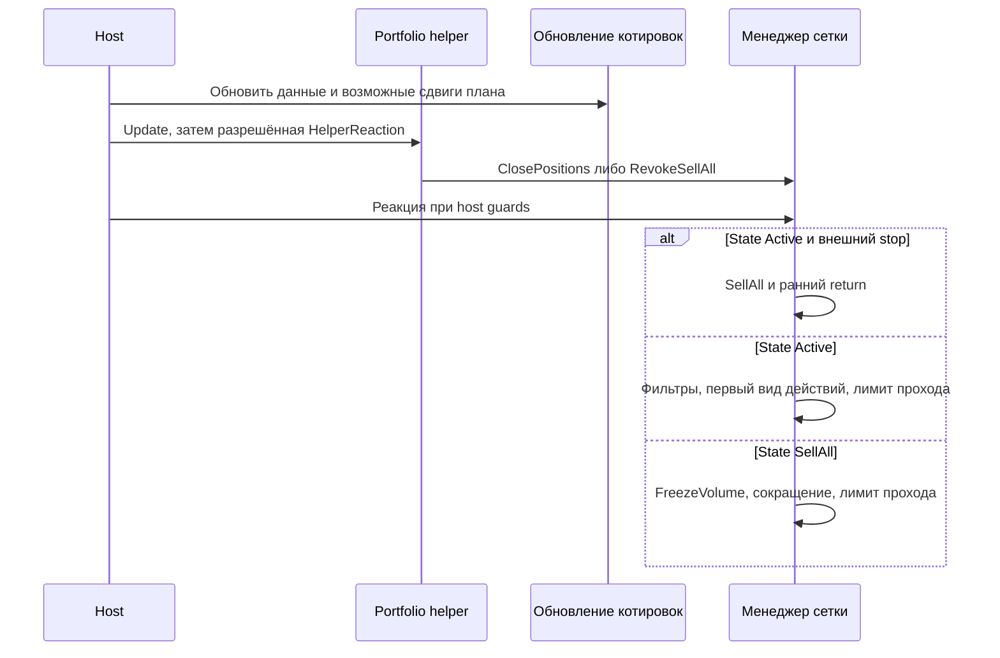

# THG-F2-TRANSITIONS-001: переходы «Фьючерсы 2»

**Статус:** STATIC SOURCE SPECIFICATION — NOT RUNTIME QUALIFICATION.  
**Источник:** `DTI.StrategyDTIDTF` и вызываемые компоненты локальной TradeHelp4.  
**Дата:** 2026-09-29. **OsEngine HEAD:** `088add98b728f8088fb18ff2e59c8d4113ad043c`.

Это спецификация найденного поведения, включая необычные и ошибкоопасные
ветки. Она не заменяет их предполагаемым «правильным» алгоритмом. Архитектура
будущего робота находится в ADR-THG-001; общий выход относительно средней
цены всей позиции с переключением в runtime — требование владельца, а не
автоматически установленная функция оригинала.

Переход описан как событие → guard → mutation/effect → следующий проход.
Отрицание guard означает отсутствие указанного действия, если отдельно не
описана fallback-ветка. Порядок строк внутри прохода существенен. Anchors
`dti.cs:10477` и аналогичные относятся к exact TEMP views из
[manifest](evidence/manifest.json), а не к production source OsEngine.

Связанные части спецификации:

- [Уровни, предварительные заявки и локальный учёт](FUTURES2_LEVELS_AND_ORDERS.md).
- [Ручные команды, настройки и сохранение](FUTURES2_RUNTIME_SETTINGS.md).
- [Host, callbacks и портфельный helper](FUTURES2_HOST_AND_CALLBACKS.md).
- [Покрытие и сценарии переходов](FUTURES2_COVERAGE.md).
- [Формулы построения плана](MATHEMATICS_AND_PARAMETERS.md).

## Состояние является произведением нескольких независимых частей

| Часть | Значения и смысл | Anchor |
|---|---|---|
| Manager.StrategyState | Active, SellAll, Speed, Classic, Expirate, Rotate | dti.cs:28916 |
| Manager.IsStartStrategy | Разрешение вызова реакции host; остановка не равна flat | dti.cs:8513 |
| Платформа | IsStarted, broker.IsConnected, allow/lot/session/interval guards | PilotFinanceSystem.cs:7049 |
| Зона | PlanLots, LotsCount, pending buy/sell, flags отдельных LotPart; отдельного общего enum order-state нет | dti.cs:11887 |
| Блокировки | ForbidBuyes/Sells, ForbidLong/Short, BlockEnterStatus, два BlockExitStatus, BlockRules, HJ | dti.cs:10477 |
| Expiration | None, Expirating, Experated; состояние старых/новых инструментов | dti.cs:28875 |
| Helper | Started, LastStopLoss/Profit, причины, extrema, таймеры, FreezeVolume, DeferredClosePos | TralingStop.cs:1135 |

`Stopped`, `PausedEntries`, `Reconciling`, `FlatConfirmed` из целевого ADR
не являются значениями legacy enum. Нельзя подставлять target state machine
в описание оригинала. У manager setter StrategyState простое присваивание;
оно само не отменяет заявки, не сохраняет snapshot и не включает торговлю
(`dti.cs:7858`).

## M: диспетчер реакции

| ID | Событие и guard | Изменение / эффект / продолжение | Anchor |
|---|---|---|---|
| M01 | Вход GetStrategyReaction | result=-1; локальный liquidity flag=false; UseSpendDayLimitStatus=false | dti.cs:10477 |
| M02 | State=Active | Рассчитать четыре направленные цены с threshold; затем внешний stop, блокировки и обход зон | dti.cs:10516 |
| M03 | State=SellAll | Только специальный цикл сокращения; обычные entry/exit filters не вызываются | dti.cs:10746 |
| M04 | State=Expirate | CheckBug; expiration liquidity guard; repair старой/новой корзины, затем перенос | dti.cs:10776 |
| M05 | State=Rotate | Отдельный ClassicController flow; при Finished → Active, IsStartStrategy=false, save | dti.cs:10842 |
| M06 | State=Speed или Classic либо неизвестное enum-значение | В этом switch нет соответствующей ветки; заявок отсюда нет, result=-1 | dti.cs:10477 |
| M07 | Обычный выход из switch | m_EnabledLiquidityState=накопленный flag; вернуть result; ранний return stop пропускает это присваивание | dti.cs:10948 |

Speed/Classic в enum не доказывают отдельный рабочий режим Futures2. Не путать
`StrategyState.Classic` и `ArbitrageType.Classic`: это разные enum. Доступность
унаследованных команд описана в THG-F2-SETTINGS-001.

## A: точный порядок прохода Active

Для обычной одноинструментной Futures2 с orientation Long и ratio=1:
`buyLong=Ask+kτ`, `buyShort=Bid−kτ`, `sellLong=Bid−kτ`,
`sellShort=Ask+kτ`, где k=OrderThreshold при EnabledOrderThreshold, иначе0.
`Supply=Ask`, `Call=Bid`. PriceCorrection для StrategyKind.DTF использует
котировку `kτ`, несмотря на Rouble в именах. Проверки уровня выполняются
по этим ценам, а цена фактически отправленной заявки определяется нижним
sender. Anchors: `dti.cs:9293,9393,9495,9636,9797`.

| ID | Guard / порядок | Изменение и эффект | Anchor |
|---|---|---|---|
| A01 | D!=0 и (sellLong>=HightLavel+D или sellShort<=LowLavel−D) | State=SellAll; немедленно return−1; закрывающая заявка не посылается этой веткой в этом проходе | dti.cs:10535 |
| A02 | UseBlockEnter && BlockEnterAlways | BlockEnterStatus равен включительному условию buyLong>=BlockEnterMin && buyShort<=BlockEnterMax; notification только при смене | dti.cs:10540 |
| A03 | UseBlockEnter && !BlockEnterAlways && status=true | Снять status, если buyLong<Min или buyShort>Max; save+notification | dti.cs:10560 |
| A04 | UseBlockEnter && !BlockEnterAlways && status=false | Поставить status только при buyShort<min(short PlanPrice) && buyLong>max(long PlanPrice); save+notification | dti.cs:10571 |
| A05 | EnabledLiquidity | Запретить обычные входы И выходы, если хоть одна зона имеет pending buy/sell либо ненулевой неполный несбалансированный остаток | dti.cs:10988 |
| A06 | После block-enter | Вычислить total plan/held; в StrategyKind.DTI делить plan на2, в DTF не делить; gap=null либо abs(CurrentOpenPrice−CurrentOpenPrice)=0 | dti.cs:10579 |
| A07 | Перед обходом | ForbidBlockBuy отдельно для buyLong и buyShort; ForbidBlockSell с buyShort для обеих сторон; сбросить два BlockExitStatus; action-kind=None, counter=0 | dti.cs:10592 |
| A08 | Каждая зона в текущем m_Zones order | Пересчитать sell prices по ratio зоны; FromEnter использует Basket arithmetic; проверить HJ входа по PlanPrice и выхода по её GetSellPrice | dti.cs:10601 |
| A09 | Instruments.Count>1 | Сначала CheckZoneIntegrity; positive result → counter++, TodaySpended+=spended, action-kind=Integrity; обычные Buy/Sell в этом проходе больше не разрешены | dti.cs:10621 |
| A10 | !ForbidBuyes && !(UseBlockEnter&&status) && !liquidity && !blockBuy(side) && HJ-entry && kind∈{None,Buy} | Вызвать GetZoneReactionBuy; positive result → counter++, TodaySpended+=spended, kind=Buy | dti.cs:10646 |
| A11 | UseBlockExit или UseBlockExit2 | Для long взять buyShort, для short buyLong; при held>0 и попадании во включительный диапазон запретить обычный выход зоны и поставить соответствующий status | dti.cs:10682 |
| A12 | !ForbidSells && !liquidity && !blockSell && HJ-exit && !exit-region-block && kind∈{None,Sell} | Вызвать GetZoneReactionSell; positive result → counter++, TodaySpended−=spended, kind=Sell | dti.cs:10712 |
| A13 | В конце итерации counter>=RealizedZonesCountOnStep ИЛИ result>0 && EnabledLiquidity | Прервать обход. Проверка после обработки зоны; значение лимита0 не является безусловным запретом первой попытки | dti.cs:10740 |

Начальный builder сортирует zones по PlanPrice по возрастанию. Поэтому при
нескольких подходящих long уровнях сначала рассматривается меньшая цена,
а не обязательно верхняя граница. Нулевые противоположные zones тоже входят
в список. Первый positive result фиксирует вид действий до конца прохода:
Buy и Sell не смешиваются. Positive result здесь не равно подтверждённой
биржевой заявке: immediate zone branch может вернуть служебное100 после
неудачной попытки отправки; точная семантика в THG-F2-LEVELS-001.

При выключении UseBlockEnter его status может оставаться сохранённым, но
AND-условие перестаёт блокировать вход. BlockExitStatus обнуляется в Active,
а не при любом изменении UI. HJ и BlockRules не отменяют уже working orders
в этих guard-ветках. Проверка цены0 в ценовой функции даёт0, но локального
freshness/quote-validity barrier перед A01 в manager не найдено.

## B: правила блокировки

`ForbidBlockBuy/Sell` выбирают только StateIsActive rules нужной стороны.
Любое правило с AllowSendOrder=false блокирует соответствующее действие.
Область — логические набор/сокращение, а не буквальные Buy/Sell брокера.

| ID | Условие правила | Результат | Anchor |
|---|---|---|---|
| B01 | Condition=Gap и gap отсутствует | false немедленно, до BlockCondition | dti.cs:26018 |
| B02 | Condition=PositionsEmpty | Правило действует только lots==0 | dti.cs:26112 |
| B03 | Condition=PositionsFull | Правило действует при lots>=planLots | dti.cs:26112 |
| B04 | Condition=None либо Gap с известным gap | Дополнительного position guard нет; для Gap сравнивается gap, иначе price | dti.cs:26018 |
| B05 | Buy/Sell interval | Запрет при PriceFrom<=value<=PriceTo | dti.cs:26018 |
| B06 | FromOnly / ToOnly | Запрет соответственно value>=PriceFrom / value<=PriceTo | dti.cs:26018 |
| B07 | BuyFile / SellFile | Запрет при пустом пути, наличии файла либо исключении File.Exists; иначе разрешение. Исследован код проверки, реальные файлы не читались | dti.cs:26018 |
| B08 | Неактивное правило или неприменимое position condition | Разрешение; manager обычно отсеивает inactive раньше | dti.cs:26018 |

В A06 известный gap всегда0 из-за буквального вычитания Current из Current.
Это не вычисление реального гэпа и не исправлено в спецификации. Выходные
BlockRules получают buyShort для обеих сторон; два отдельных BlockExit region
используют свою направленную цену по A11. Эти механизмы нельзя объединить.

## L: SellAll и завершение

| ID | Guard / событие | Изменение и эффект | Anchor |
|---|---|---|---|
| L01 | Проход SellAll | Выбрать zones с held>0 ИЛИ pendingBuy>0 ИЛИ pendingSell>0; totalVolume=sum Zone.GetVolume | dti.cs:10746 |
| L02 | FreezeVolume>0 и totalVolume−zoneVolume<FreezeVolume | break ВСЕГО цикла; следующая зона не проверяется | dti.cs:10754 |
| L03 | FreezeVolume>0, проход L02 разрешён | totalVolume−=zoneVolume ещё до результата отправки | dti.cs:10754 |
| L04 | Зона допущена | Zone.SellAll с allowToBuy=true, priority=null, enabledLiquidity=false, текущими OrderType/threshold; обычные фильтры A10/A12 не вызываются | dti.cs:10763 |
| L05 | Positive result | counter++; при counter>=RealizedZonesCountOnStep остановить цикл; без положительного результата продолжать по правилам цикла | dti.cs:10764 |
| L06 | Trade успешно сопоставлен и held всей стратегии==0, IsStopAfterExit, state!=Expirate | Запросить FlushAllActiveOrders; IsStartStrategy=false; notification. Отмена не подтверждена этим действием | dti.cs:11108 |
| L07 | Сопоставленный trade и held==0, ClearSpendDayLimitAfterSellAll | TodaySpended=0 вне зависимости от того, был ли state SellAll | dti.cs:11119 |
| L08 | IgnoreSellsForLimits && TodaySpended<0 | TodaySpended=0; guard не требует успешного сопоставления текущего trade | dti.cs:11124 |

SellAll сам по себе не имеет завершающего перехода по пустому списку и не
проверяет «все заявки terminal». Completion wrapper и helper имеют отдельные
правила в THG-F2-HOST-001. Для внешнего stop A01 не устанавливает helper ID
и не вызывает ручной SellAll wrapper; побочные действия этих путей различаются.

## Q: обновление котировок и планов вне реакции

Метод `UpdateQuotes(IQuoteContractFactory, save, out goChanged)` не проверяет
IsStartStrategy перед внутренними обновлениями. Он отличен от перегрузки
`UpdateQuotes(List<DBItem>,save)`: последняя заменяет элементы, обновляет
Speed/HJ, но не выполняет весь factory-flow с widening.

| ID | Событие / guard | Mutation / side effect | Anchor |
|---|---|---|---|
| Q01 | Получена quote | Обновить Bid/Ask, depths, step value, expiry, Open, Status; Accuracy обновить только если MinPriceStep>0; вернуть changed по Bid/Ask | dti.cs:8904 |
| Q02 | Нет quote либо недостаёт полей | Добавить monitor error; прежний DBItem не обнуляется целиком; отсутствие данных не равнозначно сбросу позиции | dti.cs:8904 |
| Q03 | DateTimeNow!=LastChangeOpenPriceDate и все проверенные Open!=0 | LastOpenPrice=CurrentOpenPrice; CurrentOpenPrice=GetPriceOpen; LastChangeOpenPriceDate=текущее время. Сравнение полного времени, не только даты | dti.cs:9051 |
| Q04 | Все инструменты SessionState и HJ.SetPrice(mean adjusted entry quotes) вернул true | save; HJ обновляется даже при выключенных HJBuy/HJSell | dti.cs:9253 |
| Q05 | CorrectUpDownAfterExit && shift!=0 && held==0 && buyLong>max(long plans) && sellLong<min(short plans) | Прибавить shift к обеим внутренним границам и всем PlanPrice; notifications; отдельного pending guard нет | dti.cs:11180 |
| Q06 | WidenRange && held==0 | Инициализировать MaxPrice/MinPrice границами, если0; выбрать направление GetStrategyOrientation | dti.cs:9059 |
| Q07 | Выбран short и buyShort>MaxPrice либо long и buyLong<MinPrice | d=выход за extrema; увеличить High на d, уменьшить Low на d; long plan−=d/N×(index+1), short plan+=d/N×(index+1), RoundBuyPrice | dti.cs:9071 |
| Q08 | Widening выполнен | У active Buy/BuyFromOnly/BuyToOnly rules PriceFrom+=d, PriceTo−=d; BlockEnterMin−=d, Max+=d; notification all. PlanLots не перераспределяются | dti.cs:9093 |
| Q09 | Явный CorrectUpDownAfterExitNow(value) | Прибавить value к обеим границам и всем PlanPrice без внутреннего flat/pending guard; caller guards отдельно | dti.cs:11844 |
| Q10 | Успешный fill, AutoUpdateUpDown и held==0 | UpdateUpDown: не чаще смены даты и при наличии ArbitrationService data; успешный external range заменяет границы и вызывает ResetRange; exceptions swallowed | dti.cs:11115 |
| Q12 | ResetRange, ZonesCount>0 | midpoint=(Low+High)/2, step=abs(midpoint−Low)/N; long plans round(midpoint−step×(i+1)), short round(midpoint+step×(i+1)), default integer midpoint-to-even. Long список по убыванию, short по возрастанию. Без pending guard; недостаточное число зон может дать exception после частичных присвоений | dti.cs:10340 |
| Q11 | State=Speed, elapsed>=SpeedInterval | Записать speed baseline prices/time и снять composite forbid flag; это не создаёт отсутствующую ветку Speed в M06 | dti.cs:9230 |

Наблюдаемые буквальные особенности Q01/Q02: GO_buy присваивается BuyDepo,
затем тому же GO_buy — SellDepo; проверка отсутствующего предложения повторяет
Call==0. Они не являются гарантией корректной metadata. Widening и Q05 не
доказывают отмену старых предварительных заявок или пересчёт их цены.
RoundBuyPrice здесь округляет <=100 к2 знакам, иначе к0 — это отдельное
правило, отличное от builder-пары и биржевого шага.

## D: дневной бюджет

| ID | Событие | Изменение / граница | Anchor |
|---|---|---|---|
| D01 | Чтение TodaySpended в новую календарную дату | Обнулить счётчик и запомнить время; reset происходит в getter, не отдельным scheduler | dti.cs:8060 |
| D02 | Обычный вход либо integrity с positive zone result | Прибавить returned spended при отправке/попытке, а не ждать realized PnL | dti.cs:10633 |
| D03 | Обычный выход с positive zone result | Вычесть returned spended; IgnoreSellsForLimits отдельно может ограничить снизу позже | dti.cs:10735 |
| D04 | FlushActiveOrder успешно найден и это entry | Вычесть flushMoney, вычисленный нижним контейнером | dti.cs:11196 |
| D05 | Ручной ResetTodaySpended | Присвоить0, notification и save wrapper | dti.cs:4893 |

Этот счётчик не следует переименовывать в дневной убыток, брокерскую маржу
или сумму окончательных fills. PreSend fallback и неточный callback могут
дать другую траекторию; соответствующие переходы указаны в связанных частях.

## Приоритеты и конфликтующие события

Это причинный порядок одного host-прохода; callback может прийти между
проходами либо во время вызова внешней отправки. Сериализация каждого
возможного callback/UI/save thread не доказана одной диаграммой.

## Дополнение target: signed-price

Таблицы M/A/B/L/Q/D описывают оригинал, включая проверки Open!=0 и
инициализацию extrema через0. Для переноса на signed цены эти места,
stop bounds, HJ/block intervals, shift/widen и budget подчиняются
[THG-PRICE-001](PRICE_DOMAIN.md). Знак цены не меняет state/side;
наличие котировки и инициализация extrema требуют отдельных признаков.
