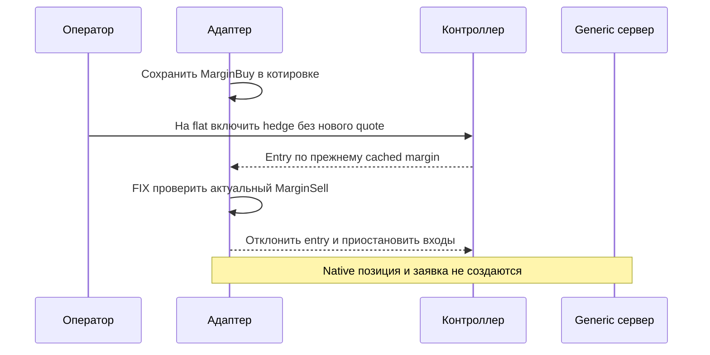
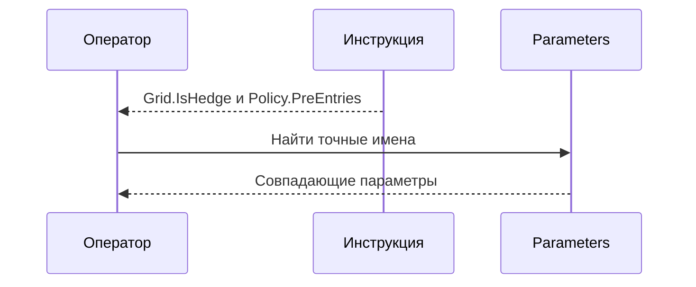

# THG-HEDGE-REVIEW-010: scoped implementation review

**Статус:** TERMINAL — CLEAN/CLEAN.
**HEAD:** `088add98b728f8088fb18ff2e59c8d4113ad043c`.
Scope: [THG-HEDGE-010](HEDGE_MODE.md), logical/physical separation, schema3,
adapter/native/manual inventory integration, control/status and targeted tests.
Main sole writer; independent production/documentation roles read-only.
Prior009 terminal is not reopened. No broader repository review.

## Exact boundary

Entry hedge-entry.json SHA256
`7fab3f7654b41368ec00a5e0701e4b7f403af790bdb062b3948c5f468540c2df`,91files.
PRIMARY hedge-primary.json SHA256
`4b85b61bad065020541c8fb282a6ebe93308bb2949f53fd39eb6f2dfd048ae68`,
94files21changed; both roles verified94/94. Copies and entry/fix diffs under
TEMP/TradeHelp4-analysis. Current branch docs/order-flow-production-roadmap;
existing dirty sources preserved, no commit/push.

## PRIMARY and bounded fixes

| Finding | Category/severity/business | Relation/modes | State |
|---|---|---|---|
| THG-HEDGE-SAF-001 | RISK/INSTRUMENT_METADATA; MEDIUM/BUSINESS_MEDIUM | REGRESSION; generic Live and simulation, configuration/controller/adapter | FIXED/CLOSED |
| THG-HDG-DOC-001 | DOC_STALE; LOW/BUSINESS_LOW | IN_SCOPE; operator/Parameters in Live/Tester/Optimizer | FIXED/CLOSED |

SAF-001: flat reconciled Long switches to Long/Hedge without a new quote.
OnQuote cached MarginBuy remains fresh; Configure/Publish does not invalidate
reconciliation and Pump refreshes Ready/FreeMargin, not Margin. Controller may
accept old Buy margin3≤Collateral4 when current Sell margin5 would block entry.
Generic Execute previously lacked that check. Existing counterevidence: new
quote corrects the cache; TRANSAQ SignedDispatch already checks current physical
margin. No broker loss or actual external execution is claimed.
Evidence PROVEN; CONDITIONALLY_REACHABLE on the stated metadata/timing/generic
route; consequence is entry despite known insufficient planning collateral.
MUST_FIX; owner decision APPROVED_FOR_FIX within authorized implementation.
Fix rechecks actual entry-side native margin before Position/order creation,
rejects only the unsent intent and pauses entries with visible reason. Reductions
remain allowed. Regression reproduces the flat mode switch and0sends; native
matrix now also closes with margin99 above Collateral7.
Terminal relation PRIMARY→FIX→VALIDATION_1.

DOC-001: HEDGE_MODE/operator named parameters with spaces; AddObject creates
prefix+'.'+property.Name. PROVEN/REACHABLE from operator Parameters search.
Strongest counterevidence: words/groups are recognizable and behavioral meaning
is correct; wrong trading action not proved. SHOULD_FIX; owner APPROVED_FOR_FIX.
Fixed exact Grid.IsHedge, Replacement.IsHedge, Policy.PreEntries/PreExits names.
Terminal relation PRIMARY→FIX→VALIDATION_1; runtime unaffected by this finding.

## Verification boundary

PRIMARY: solution0errors17existing warnings23.15sec;609/609 assertions
(125 added to484baseline),validator109PASS,80links0missing,diffcheckPASS.
Initial new test run had six expectation errors: four ordinary status log lines
were treated as errors, two open-position marks lacked a supplied quote. Fixed
expectations before PRIMARY; no runtime changes resulted from those six failures.
FIX: final solution build0errors17existing warnings19.73sec;615/615 assertions
(131 added to484baseline), managed offline only. Six new margin-transition assertions,
plus existing native close matrix now runs with above-budget margin metadata.
Validation manifest hedge-validation1.json/copies/fix.diff are frozen for both roles.

No broker/credentials/vendor DLL/GUI/native session/MCP stand launched.
Tests use managed native Journal/gateway with fake IServer, not a physical account.
No live parity, profitability or readiness claim. Source initial preorder path is
explicitly different from target runtime guard; ordinary logical hedge targets
can realize loss. Source hash/anchors and current contract are in THG-HEDGE-010.

## Terminal result

Independent production and documentation VALIDATION_1 CLEAN/CLEAN; both findings
CLOSED. VALIDATION_2 not needed. Manifest hedge-validation1.json SHA256
`d882330053117598eb0b92621acb8fb9511db8a703f9a9d3e20db75a73e89d0c`,
94files21changed, both roles verified94/94. Runtime/test evidence unchanged after
review:615/615,build0errors17warnings,validator109PASS,80links0missing.
Final status/index-only edits do not reopen review010 or earlier009.
Scope010 complete; original full transfer remains incomplete. Next manual gap is
arbitrary-level batch commands; it requires its own frozen implementation scope.
