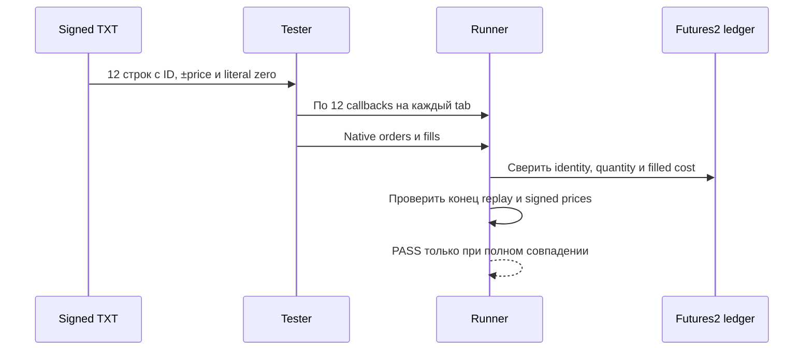
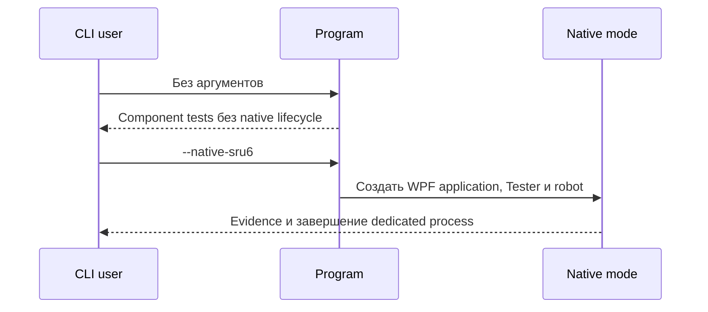
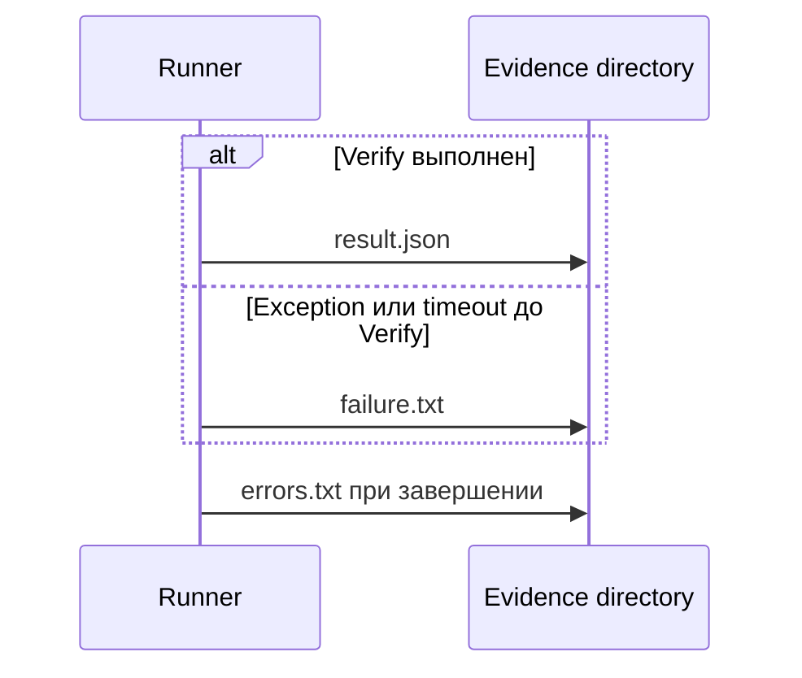

# THG-HISTORICAL-REVIEW-015: независимая проверка SRU6 qualification

**Статус:** TERMINAL CLEAN/CLEAN — VALIDATION_1.  
**Baseline/current HEAD:** `088add98b728f8088fb18ff2e59c8d4113ad043c`.  
**Entry boundary:** `sru6-entry.json`, SHA-256
`21cf59f762702520d41143bbda9042815eda19ddd4cbc83759f1725b63ad5f6b`.  
**Контракт evidence:** [THG-HISTORICAL-015](HISTORICAL_QUALIFICATION.md).

Проверка ограничена zero-price исправлением native Tester loader, новым offline
runner, signed fixture, SRU6 TXT/QSH evidence и прямо затронутой документацией.
Предыдущие terminal reviews не переоткрывались. Main был единственным writer;
review-роли работали read-only.

## Findings и закрытие

| ID | Класс / severity | PRIMARY | Bounded fix | VALIDATION_1 |
|---|---|---|---|---|
| `THG-SRU6-SAF-001` | `TEST_EVIDENCE_DRIFT` / MEDIUM | PASS мог сохраниться без доказанного signed-price пути и полного replay | Добавлены точная доставка каждого TXT row на каждый tab, replay-end guard, per-tab QSH guard, order/fill prices и сверка identities, quantities, executed volume и filled cost с Futures2 ledger | CLOSED / CLEAN |
| `THG-SRU6-DOC-001` | `DOC_STALE` / LOW | XML точки входа безусловно отрицал native constructors/application lifecycle | Default component mode отделён от явно включаемых `--native-*` режимов | CLOSED / CLEAN |
| `THG-SRU6-DOC-002` | `DOC_STALE` / LOW | Документ обещал `result.json` даже при exception/timeout до `Verify` | Раздельно описаны `result.json`, `failure.txt` и `errors.txt` | CLOSED / CLEAN |

## Проверенное evidence

- `SRU6.txt`: SHA-256
  `435EA400FFCC45CD3215BE0806F660368A024D1C2942B8EED8AA8E3D2FED1F7B`,
  3 130 667 строк, 174 дня, ошибок семипольного формата и обратного времени0.
- Zero-loader: воспроизведён drop инструмента до fix; после fix PASS, три строки
  `1, 0, -1`, `PriceStep=1`, result SHA-256
  `E630351986C07CA5170EB185798845AC393850FF67EA47F168DBCB14978094ED`.
- Signed TXT: exact12/12 строк на каждом из2 tabs; диапазон
  `-0.00010 … 0 … 0.00010`; 12 orders/12 fills; signed order/fill assertions,
  native-ledger match и replay-end PASS; result SHA-256
  `7D52E30355578E633402A25B9E9E530A08E495646D440F030F099F4B28D193FA`.
- SRU6 TXT 16.03.2026: exact240/240 на каждом tab,6orders/6fills,
  ledger/replay-end PASS, итог `Stopped / Stop after flat`, held quantity0;
  result SHA-256
  `1AFAC09ED353E16E319D51649453329BD01FC58B0984ADB7B628B2D85A12FE29`.
- SRU6 QSH Quotes, первые5 минут: depth callbacks1/1 по tabs,
  313 152 clock callbacks,2orders/2fills, ledger/replay-end PASS; result SHA-256
  `5BDF8374536664CF628EB3E767334A6958D9B4F75E792E3DA6F0BB104B8B442E`.
- Managed suite935/935; solution build0errors; agent validator109PASS;
  CRLF-aware `git diff --check` PASS; scoped local links68/68.

VALIDATION_1 привязан к10 файлам, отсортированным через
`StringComparer.Ordinal`; строки `path lowercase-sha256`, LF с завершающим LF,
UTF-8 без BOM. Aggregate SHA-256:
`fd9fb0d00b5782ea7549508e9a1339db5460a8536b365c38d193736b3e7057b1`.

## Граница результата

Production reviewer: CLEAN после VALIDATION_1. Documentation reviewer: CLEAN
после VALIDATION_1. Live/TRANSAQ, реальные credentials/orders, partial-fill и
cancel races, process restart, synchronized Deals+Quotes, GUI operator flow и
полный QSH день не запускались. Попытка полного QSH дня завершилась harness
timeout и остаётся `NOT_PASS`, а не скрытым PASS. Commit и push не выполнялись.
