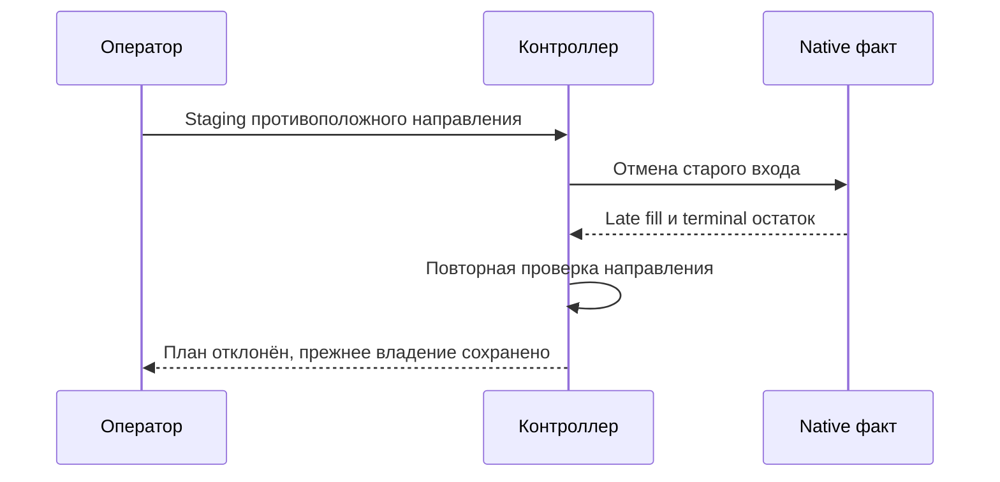
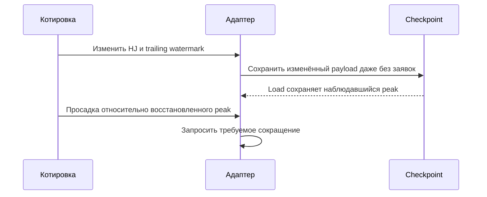
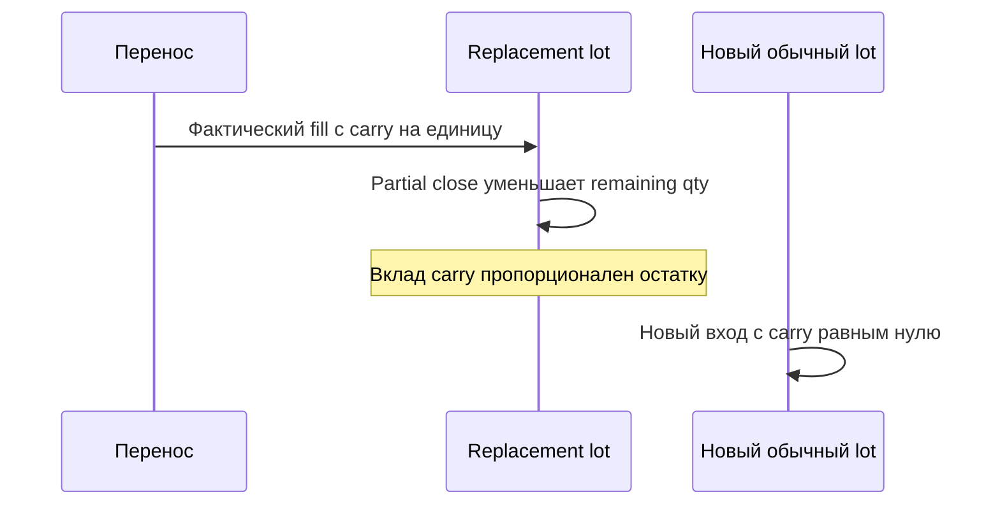
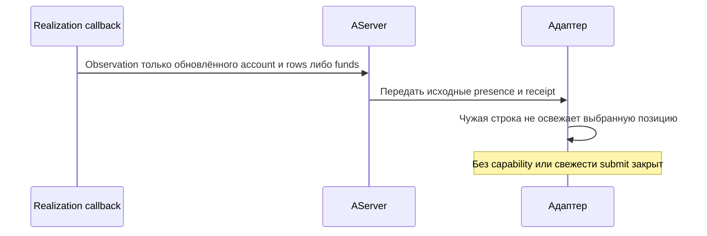
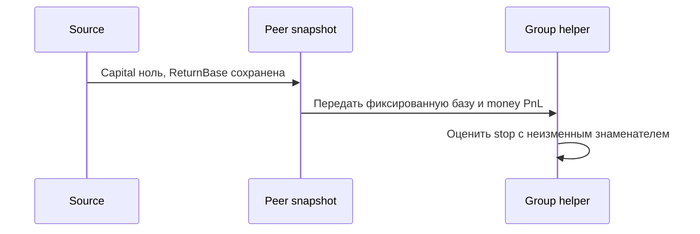
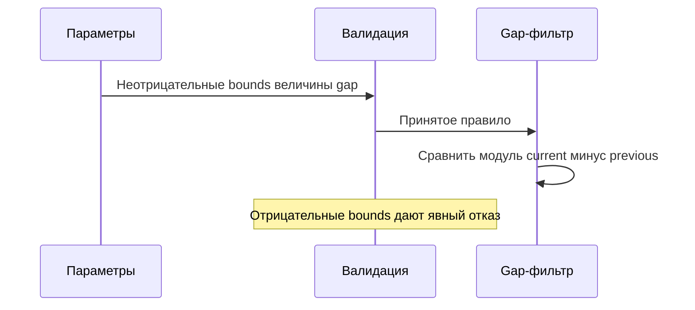
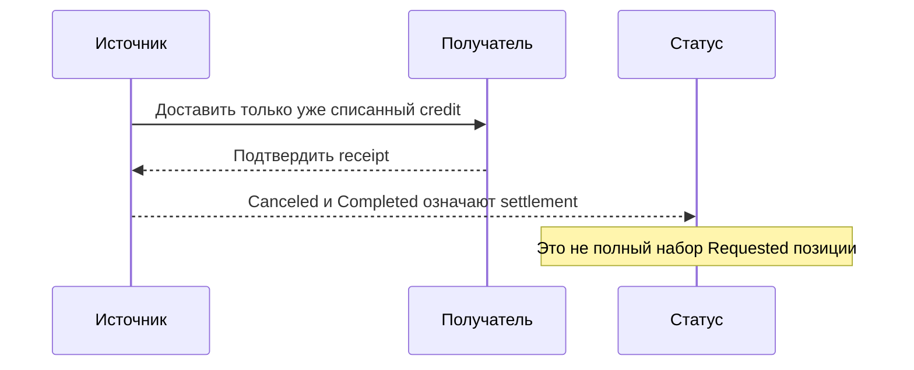

# THG-IMPLEMENTATION-REVIEW-004: проверка реализации Futures2Grid

**Task:** TASK-THG-IMPLEMENTATION-004. **Статус:** TERMINAL — CLEAN (bounded offline review).
**Baseline/current HEAD:** `088add98b728f8088fb18ff2e59c8d4113ad043c`.
**Ветка:** `docs/order-flow-production-roadmap`. Commit/push отсутствуют.

Scope: robot/core/adapter/store/coordination, signed-price native gateway и data
paths, isolated offline fixtures, current docs/XML. Файлы source reconstruction
сохранены как historical baseline. Native Alor account producer включён в FIX
как непосредственно доказанный путь F2-NATIVE-001; другие connector implementations
не аттестуются этим review. Runtime paper/live/native replay не запускались.

PRIMARY проведён независимыми read-only ролями production-code-reviewer и
documentation-reviewer на одном56-file checkpoint. Обе роли проверили56/56 hashes,
0mismatches. Manifest `TEMP/TradeHelp4-analysis/futures2-primary-checkpoint.json`,
SHA256 `4b2ebd58a16a70dd7fe1950c186f43b69fccba70a68742102bde85c2f2eb2cef`.
PRIMARY outcome у обеих ролей BLOCKED до исправления найденных дефектов.

## Disposition

Для всех findings Scope=IN_SCOPE, Evidence=PROVEN по статическому замкнутому
пути; Owner decision=APPROVED_FOR_FIX в пределах действующего поручения Main
на реализацию и исправление. Это не принятие владельцем trading/live risk.
Terminal relation каждой строки: FIX → VALIDATION_1 → CLOSED/CLEAN.
Все семь исходных findings закрыты обеими независимыми ролями.

| ID | Category; severity / business | Modes | Reachability / action | Исправление и targeted proof |
|---|---|---|---|---|
| F2-SAFE-001 | CODE_DRIFT, order ownership; HIGH / BUSINESS_HIGH | Live/paper/Tester/Optimizer | CONDITIONALLY_REACHABLE; MUST_FIX | Publish повторно проверяет направление actual lots; cancellation-time fill отклоняет pending direction и оставляет прежний план paused |
| F2-SAFE-002 | Persistence/risk recovery; HIGH / BUSINESS_HIGH | Persistent live/paper | CONDITIONALLY_REACHABLE; MUST_FIX | Pump сохраняет каждый изменившийся payload, включая quote-only watermarks; Store.Load до Dispose воспроизводит peak/HJ |
| F2-SAFE-003 | Financial/rollover ownership; HIGH / BUSINESS_HIGH | Все режимы | CONDITIONALLY_REACHABLE; MUST_FIX | Carry переносится в конкретную entry allocation/lot, действует на remaining quantity; fresh lot получает0; partial и whole-average fixture |
| F2-NATIVE-001 | CODE_DRIFT, account freshness; HIGH / BUSINESS_HIGH | Live non-paper Alor/AServer | CONDITIONALLY_REACHABLE; MUST_FIX | Legacy cached PortfolioEvent не создаёт свежесть. Actual realization observations с capability и раздельным funds/rows presence; unsupported источник блокируется |
| THG-I004-DOC-001 | CODE_DRIFT, portfolio return; HIGH / BUSINESS_HIGH | Все режимы | REACHABLE; MUST_FIX | Peer.ReturnBase отдельно от текущего Capital; полный transfer до Capital0 и произвольное изменение Capital не меняют denominator |
| THG-I004-DOC-002 | DOC_STALE, gap comparison; MEDIUM / BUSINESS_MEDIUM | Все режимы/Parameters | REACHABLE; SHOULD_FIX | Сохранён legacy-derived модуль разности; ADR/operator объясняют его; отрицательные interval bounds отклоняются, отрицательный gap проверен |
| THG-I004-DOC-003 | DOC_STALE, canceled settlement; LOW / BUSINESS_LOW | Все режимы/status | REACHABLE; SHOULD_FIX | ADR/operator/XML отличают successful Completed от Canceled+Completed по already debited receipt; runtime не менялся |

## Execution proofs и strongest counterevidence

F2-SAFE-001: working Long без held → staged Short → fill во время отмены →
старый Publish активировал Short при Long lot. Начальная проверка уже held и
правильный cancel barrier не исключали последующий fill. Последствие — смешение
направлений. Новый тест проходит именно staging/cancel/partial/terminal/publication.



F2-SAFE-002: quote увеличивала trailing maximum0→2 без actions/reason change;
crash загружал0, return0.5 не вызывал drawdown1.5. Commands/fills/Dispose
сокращали окно потери, но не закрывали quote-only interval. Теперь тест читает
checkpoint до Dispose и подтверждает reduction с восстановленным peak.



F2-SAFE-003: старый Plan.ExitCarry−10 сохранялся после полного закрытия
replacement lot и давал новому entry200 TP191 вместо201. Новый план или
StopAfterExit устраняли путь лишь при optional настройках. Carry теперь
связан с исполняемой replacement allocation; сокращение qty уменьшает его
совокупный вклад, а новый обычный lot имеет нулевую поправку.



F2-NATIVE-001: Alor менял B либо A.Y/funds, публикуя общий cached список;
AServer приписывал новую ReceivedAt присутствующему A.X. Совпадение старого
net с owned позволяло торговать после реального expiry. Missing row и mismatch
guards этого не исключали. Теперь actual Alor methods проходят synthetic
fixture: B не публикует A, A.Y не включает X, funds не включает positions.
AServer передаёт эти observations без создания новой receipt time. Наличие
capability необходимо, но не является выполненным live transport test.



THG-I004-DOC-001: локальная ReturnBase была верной, но peer публиковал текущий
Capital; после полного transfer source Capital0 выключал group helper. При
внутреннем частичном переводе сумма капитала могла случайно сохраняться — это
не покрывало полный transfer и временной разрыв debit/credit. Fixed ReturnBase
передаётся отдельным полем и участвует в обоих aggregate APIs.



THG-I004-DOC-002: current−previous=−2 превращалось в+2 перед сравнением, но
инструкция не объясняла Math.Abs. Legacy подтверждает magnitude semantics,
поэтому алгоритм сохранён; неправильный отрицательный interval теперь
отклоняется до применения, пример magnitude дан в current guide.



THG-I004-DOC-003: Requested140/Debited70/received70/Spent0/Canceled=true уже
давали Completed=true. Отдельные Canceled и Debited/Requested в status были
counterevidence против денежного дефекта; исправлена только интерпретация.



## Evidence и пределы

PRIMARY evidence: application/solution builds PASS,201/201 offline assertions,
agent validator109checks, diff check PASS, local links0missing,422XML blocks
без syntax errors. FIX evidence: solution build PASS0errors/17warnings; offline **219/219**, exit0.
Независимая VALIDATION_1 завершена 2026-09-29: production-code-reviewer
`/root/futures2_primary_safety` и documentation-reviewer
`/root/futures2_primary_docs` вернули **CLEAN**. Новых доказанных regressions
или незавершённых исходных paths не найдено; VALIDATION_2 не требуется.

Обе роли сверили **59/59 hashes, 0 mismatches**, 19 paths изменены после PRIMARY.
Manifest `TEMP/TradeHelp4-analysis/futures2-validation1-checkpoint.json`, SHA256
`314574c007a4db216ad7be70191a5eca0362f7f3a11df8b5bde2ffee83d09bba`.
Docs reviewer проверил 492 XML blocks без parse errors и 12 local links
изменённых current docs без missing targets. Build/tests reused на этом
checkpoint; reviewers сами не запускали runtime/GUI/сетевые сценарии.
После review меняются только terminal status/evidence/index и ACTIVE_TASK;
code/test/build boundary неизменна.

Final agent validator: **109 PASS**, exit0. Его встроенный diff check получает
тот же `core.whitespace` только через process environment (Git config на диске
не меняется). Без этого уточнения было 108 PASS и 1 FAIL на сохранённых CRLF.
В PowerShell из корня репозитория воспроизводимая команда:

```powershell
$env:GIT_CONFIG_COUNT = '1'
$env:GIT_CONFIG_KEY_0 = 'core.whitespace'
$env:GIT_CONFIG_VALUE_0 = 'blank-at-eol,blank-at-eof,space-before-tab,cr-at-eol'
& 'C:\Program Files\Git\bin\bash.exe' .agents/validation/validate-agent-system.sh
```

Final Main link check: 107 local Markdown links TradeHelpGrid, 0 missing.
Whitespace отдельно проверяется командой
`git -c core.whitespace=blank-at-eol,blank-at-eof,space-before-tab,cr-at-eol diff --check`.
Она возвращает PASS/exit0; обычный `git diff --check` отмечает CR на 11 новых
CRLF-строках Alor. Исходные line endings сохранены, остальные проверки
whitespace не отключены. Build-created tracked binaries восстановлены до
entry HEAD bytes (16 files). Созданный сборкой untracked
Tests/AdaptivePositionManager/bin оставлен: автоматическая проверка отклонила
команду recursive cleanup (`blocked by policy`). Удаление не выполнялось;
эта папка не входит в code/test/review scope.

OBSERVABILITY: REQUIRED — отказы публикации/сверки видны в Reason/log; statuses
и корреляция сохраняются. MODE PARITY: REQUIRED — общий controller проверен
offline, реальные transport/replay различия не объявлены устранёнными.

NOT_RUN: native replay session, WPF, live/paper/connector и реальные операции.
Fixtures actual Alor methods используют только synthetic JSON и uninitialized
objects; API keys, native constructor, сеть или broker operation не нужны.
