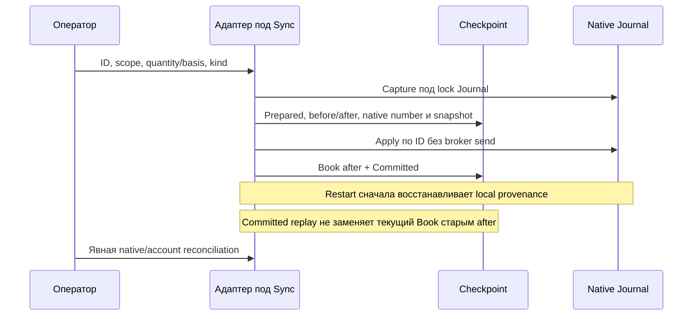

# THG-INVENTORY-009: ручное владение и внешние исполнения

**Статус:** CURRENT IMPLEMENTATION — OFFLINE CHECKS PASSED, REVIEW CLEAN/CLEAN, LIVE NOT QUALIFIED.
**Дата:** 2026-09-29. **HEAD:** `088add98b728f8088fb18ff2e59c8d4113ad043c`, dirty worktree.
Основание — поручение перенести ручной учёт исходного Futures2; source semantics
зафиксированы в [THG-OWNERSHIP-008](SHARED_ACCOUNT_AND_REGISTRATION.md).
Этот контракт дополняет [ADR-THG-002](ADR-0002_OSENGINE_IMPLEMENTATION.md).

[Hedge010](HEDGE_MODE.md) определяет физическую сторону регистрации и внешнего
исполнения: logical Long/Hedge создаёт short. Schema3 не понижается до2.
Остальные правила manual Inventory этого контракта сохраняются.

## Операции и экономика

| Команда Inventory | Значение |
|---|---|
| Register selected levels to capacity | Дополняет выбранные уровни до их плановой ёмкости; цена добавления известна явно либо выбран режим цен уровней |
| Set selected inventory quantity | Целевой остаток **на каждом** выбранном уровне; увеличение регистрирует владение, уменьшение снимает его; 0 снимает весь выбранный объём |
| Set selected accounting basis | Меняет cost оставшегося объёма, не его количество и не уже реализованный результат |
| Attribute external inventory increase/decrease | Явно приписывает выполненную вне робота сделку одному уровню; количество является delta, а направление относится к позиции: покупка закрывает short, продажа закрывает long |

Первые три операции не создают orders, MyTrade, комиссий, realised sale PnL или
дневного расхода исполнения. Средняя при добавлении взвешивается; при снятии
сохраняется средняя уровня. Количество снимается с lots в сохранённом порядке,
оставшимся lots назначается прежняя средняя уровня. ExitCarry сохраняется отдельно.
SetBasis меняет raw basis; переносимая rollover-наценка ExitCarry не обнуляется.
Исторические native исполнения, intent allocations и FillKeys сохраняются.

ExternalIncrease учитывает фактический объём, цену, явную общую денежную комиссию
и дневной расход ГО. ExternalDecrease учитывает basis снимаемых lots в их сохранённом порядке,
комиссию и, при CreditDayExits, возврат дневного расхода. Историческое исполнение
не изменяет расход более позднего Book.Day; при новой дате счётчик сначала
переходит на неё. Native fills отдельно учитываются по receipt/decision clock.
ExecutionReference
обязателен и уникален **в пределах campaign**; это декларация оператора, а не
автоматически полученное брокерское подтверждение. Между разными роботами общего
реестра таких references нет. Цена внешней сделки не выводится из изменения net.

## Параметры и порядок действий

1. Остановить входы, отменить свои рабочие заявки и дождаться terminal outcomes.
   Любой CanFill, включая Partial/CancelPending/Unknown, запрещает изменение.
   Pending configuration, emergency и незавершённый rollover также запрещают его.
2. Выбрать Selected plan id и Inventory endpoint. Inventory levels задаёт список
   ordinal через запятую, например `0,2,4`. Пустое поле использует Selected level;
   `-1` означает все уровни. Каждый уровень проверяется до публикации.
3. Ввести Inventory operation id: до64 латинских букв/цифр, `-` или `_`.
   Повтор того же ID и payload восстанавливает прежнюю операцию; другой payload
   с тем же ID отклоняется. Для следующей операции нужен новый ID.
4. Ввести target/delta и цену. Inventory price known разрешает явную цену,
   включая0 и отрицательное число до5 знаков. Inventory use level prices
   разрешён только для RegisterToCapacity; он использует цену каждого уровня.
   Средняя нескольких цен может иметь больше5 знаков и не округляется до tick.
5. Для внешнего исполнения дополнительно указать стабильный External execution
   reference, общую fee и External execution time в формате `yyyy-MM-dd HH:mm:ss`
   в часах режима (локальные часы live; event clock simulation). Время не может
   быть будущим. Для операций владения эти поля должны быть пустыми/нулевыми.
6. Проверить post-operation External net endpoint: для live требуется свежий
   account snapshot, равный будущему own net плюс явный external net. Декларация
   external не вычисляется автоматически. Нажать нужную кнопку, проверить status,
   затем выполнить Reconcile native and account. Автоматическое продолжение
   после регистрации запрещено; возобновление — отдельная команда.

Capacity каждого уровня и общий Capital ограничивают регистрацию. Эти величины
не подтверждают фактическое брокерское обеспечение. Чужие позиции/working orders
в native tab запрещены; чужие заявки на счёте не отменяются этой командой.
Изменение net соседним роботом закрывает прежний строгий account gate —
см. [общий счёт](SHARED_ACCOUNT_AND_REGISTRATION.md).

Возраст нового lot начинается от времени регистрации; для ExternalIncrease —
от заявленного ExecutedAt. Время существующих lots при basis/release сохраняется.
После resume MiniStop/TimeStop используют самый ранний старт оставшихся lots;
регистрация также считается прежней активностью для EmptyStop. В частности,
приписанный старый объём может сразу удовлетворять условию TimeStop.

## Native Journal и восстановление

`Position.Inventory` — отдельный opt-in ledger внутри обычной native Position.
Зарегистрированная позиция может иметь OpenOrders=null. Quantity, remaining basis,
cumulative entered, identity/time и mark доступны native потребителям; реальные
close orders создаёт существующий SubmitSignedOrder/PositionCreator.
Native mark использует агрегированную среднюю native position; campaign PnL/TP
использует распределение по lots/levels. Эти отчёты могут различаться при разных
средних lots одной сгруппированной позиции; их нельзя подменять друг другом.

При корректировке basis после частичного закрытия уже реализованный результат
заморожен: entry10@100, close4@110 → realised40; basis120 сохраняет40;
последующий close2@130 даёт60 и остаток4@120.

Checkpoint schema≥2 обязателен при наличии операций; новый reader читает1/2/3/4/5.
Native opt-in строка имеет envelope `INV1:` с base64 JSON и legacy native строкой.
Новый reader читает старые позиции; старый бинарник не поддерживает эти records.
Downgrade с открытым зарегистрированным инвентарём не поддержан. Checkpoint
содержит native before-images, включая routing metadata счёта, но не credentials.
SHA256 envelope обнаруживает повреждение и не является аутентификацией.

Journal.Save остаётся асинхронным. Его saver берёт тот же lock, что и mutations,
чтобы реальные fills и Inventory попали в согласованный snapshot. Prepared
пишется раньше изменения количества, а Committed сохраняется вместе с Book.
Повтор native ID проверяет payload. Later fills после captured boundary
повторно применяются к новому basis в receipt order, без стирания native facts.
Если у старого Journal нет необходимой ordered provenance или не совпадает
owner/endpoint/pre-state, recovery блокируется; отсутствующая история не
угадывается. Перенастроенный endpoint требует возврата к сохранённой identity
для восстановления прежней campaign, даже если её ручные операции исторические.

Если поздний close превышает оставшееся владение либо projection переполняется,
реальный MyTrade сохраняется, Inventory.Fault и ClosingSurplus блокируют дальнейшее
исполнение. Book не создаёт отрицательный lot. Повторная регистрация не служит
способом стереть такой конфликт; требуются сверка и разбор native evidence.
Legacy автоматическое surplus repair исключает opt-in Inventory, оставляя
исправление такого конфликта владельцу campaign.

## Наблюдаемость и граница доказательства

Log показывает operation ID и переходы Prepared/native applied/Committed;
status — последние10 операций, kind, stage и revision. Native/account gate
показывает незавершённое recovery и projection fault. Payload сделки и routing
metadata новым диагностическим сообщением не печатаются.

[InventoryCases](../../Tests/TradeHelpGrid/InventoryCases.cs) проверяет managed
компоненты без серверных конструкторов, DLL, GUI или сети. Fault injection через
log callback останавливает точные границы после Prepared и native apply; persisted
crash images проверяют replay. Это не физическое аварийное выключение Windows.
Точные проверки и независимый verdict — [review009](INVENTORY_REVIEW.md).
Live Finam/TRANSAQ, полный native Tester/Optimizer lifecycle и GUI — NOT_RUN.
OBSERVABILITY: REQUIRED. MODE PARITY: REQUIRED; live требует account evidence,
offline fixture проверяет ту же projection/replay логику с синтетическим источником.
