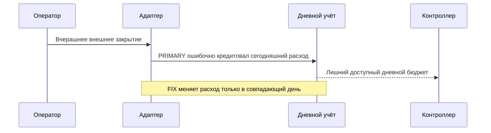
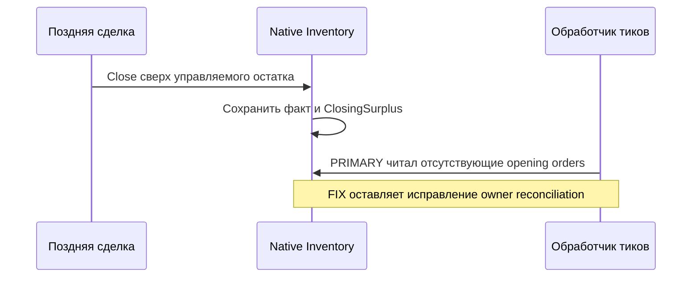
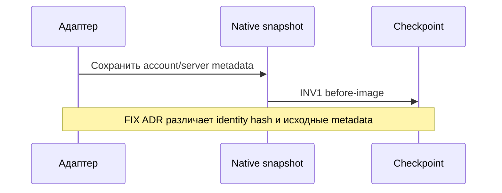
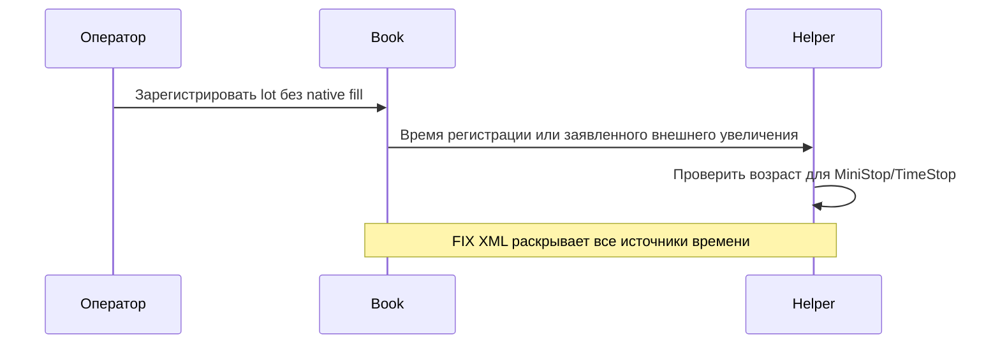

# THG-INVENTORY-REVIEW-009: ручной учёт и native recovery

**Статус:** SCOPED IMPLEMENTATION REVIEW — TERMINAL CLEAN/CLEAN.
**HEAD:** `088add98b728f8088fb18ff2e59c8d4113ad043c`.
**Ветка:** `docs/order-flow-production-roadmap`. Commit/push не выполнялись.
Это bounded review checkpoint009; полнота исходного переноса и live readiness
не объявляются. Reviews006/008 не переоткрывались.

## Scope и checkpoint

No-send Register/SetQuantity/SetBasis, отдельно декларируемые внешние исполнения,
native Position.Inventory/Journal, схема сохранения/replay, adapter/account gates,
UI controls и относящиеся к ним current docs/XML. Main — единственный writer.
Независимые роли: `inventory_safety` (production-code-reviewer) и
`inventory_docs` (documentation-reviewer).

Entry manifest `TEMP/TradeHelp4-analysis/registration-entry.json`, SHA256
`e6ff6aa23374318446cfb19cdaf845d61929769265c97bf3e73430be4e67ecb4`;
85 исходных файлов, entry copies и status сохраняют прежний dirty boundary.
PRIMARY manifest `registration-primary.json`, SHA256
`53c074a9942c159fd66731a3c4185ce96b8f8ab33403e5c5e381202c6765bb3c`:
90 файлов/24 changed, оба reviewers проверили90/90. Manifest/copies/diff находятся
в том же TEMP каталоге; entry baseline включает ранее незакоммиченный код.

PRIMARY: solution build0errors17warnings; harness470/470; validator109PASS;
53 local Markdown links/0missing; diff-checkPASS. Этот набор не распространяется
автоматически на последующий fix. Внешние системы не запускались.

## Finding registry

Все четыре findings приняты Main к исправлению в пределах выданного поручения.
VALIDATION_1 завершена CLEAN/CLEAN. SAF-001, SAF-002, DOC-001, DOC-002 —
FIXED/CLOSED; новых обязательных in-scope findings нет. VALIDATION_2 не понадобилась.

### THG-INV-SAF-001

Category `RISK_BUDGET/CODE_DRIFT`; MEDIUM / BUSINESS_MEDIUM; IN_SCOPE.
Modes: Live/Tester/Optimizer; external inventory и дневной лимит Controller.
Предусловие: ExecutedAt.Date старше Book.Day; для credit включён CreditDayExits.
Entry: AdjustInventory → StageInventory сохранял более поздний Book.Day, но
безусловно менял DaySpent → Controller entry budget мог разрешить новые входы.
Пример PRIMARY: DaySpent100/DayLimit100, вчерашний exit с collateral10 давал90.
Evidence PROVEN; REACHABLE. Strongest counterevidence: native fills учитываются
по receipt/decision clock и к этому defect не относятся; same-day работал.
Consequence: ошибочно освобождался/расходовался сегодняшний лимит.
Action MUST_FIX; owner APPROVED_FOR_FIX. Disposition: fix добавляет chargeDay
только при совпадении даты; исторические quantity/realized/fee сохраняются.
`HistoricalDayBudget` проверяет оба направления, same-day и duplicate credit.
Terminal relation: CLOSED в VALIDATION_1.

### THG-INV-SAF-002

Category `NATIVE_FAULT_LIFECYCLE`; LOW / BUSINESS_LOW; REGRESSION.
Modes: Live/paper, managed native cleanup. Предусловия: registered-only position,
late close сверх held, подключённый tab и следующий tick без active close.
Path: Position сохраняет actual MyTrade, Fault/ClosingSurplus → native tick →
CheckSurplusPositions → OpenOrders.Count при null. Evidence PROVEN;
CONDITIONALLY_REACHABLE при этих условиях. Strongest counterevidence: account
gate закрыт, отрицательного Book lot нет; uncontrolled send не доказан.
Consequence: повторный NullReferenceException в cleanup раз в10 секунд.
Action SHOULD_FIX; owner APPROVED_FOR_FIX. Disposition: opt-in Inventory исключён
из legacy repair до его cancel/send loops; `FaultCleanup` проверяет отсутствие
исключения, send/cancel и сохранение блокировки. Terminal relation: CLOSED в VALIDATION_1.

### THG-INV-DOC-001

Category DOC_STALE; LOW / BUSINESS_LOW; REGRESSION. Live/checkpoint/recovery.
Entry: ручная регистрация → native before-image → checkpoint. ADR002 заявлял
общее хеширование account/profile, хотя snapshot сохраняет routing metadata.
Evidence PROVEN; REACHABLE. Strongest counterevidence: THG-INVENTORY-009 уже
раскрывал эти данные; credentials не сохранялись. Consequence: неверное ожидание
обезличенного диагностического файла. SHOULD_FIX; owner APPROVED_FOR_FIX.
Disposition: claim ограничен EndpointIdentity; before-images названы явно.
Terminal relation: CLOSED в documentation VALIDATION_1.

### THG-INV-DOC-002

Category DOC_STALE; MEDIUM / BUSINESS_MEDIUM; REGRESSION.
Modes: Live/Tester/Optimizer, campaign/portfolio helpers.
Entry: регистрация создаёт lot без fill с Opened=Now; ExternalIncrease использует
ExecutedAt. Controller/portfolio передают earliest remaining start в FirstEntry;
MiniStop/TimeStop читают его. Старый XML называл это только entry fill time.
Evidence PROVEN; CONDITIONALLY_REACHABLE для helper consequence при Trailing и
положительном TimeStopMinutes либо соответствующем MiniStop.
Strongest counterevidence: no-send boundary сохранялась, время старых lots не
менялось. Consequence: неверное ожидание времени добровольного закрытия.
SHOULD_FIX; owner APPROVED_FOR_FIX. Disposition: XML Opened/FirstEntry/WasActivity
и правило времени в operator contract исправлены без изменения поведения.
Terminal relation: CLOSED в documentation VALIDATION_1.

## Evidence boundary

FIX checkpoint: `dotnet build OsEngine.sln --no-restore -v:q` — exit0,
0errors17warnings; `dotnet Tests/TradeHelpGrid/bin/Debug/net10.0-windows/OsEngine.TradeHelpGrid.Tests.dll`
— exit0, **484/484 PASS**. Последние14 assertions покрывают оба findings safety.
VALIDATION_1 manifest `registration-validation1.json`, SHA256
`e114cbbf6fdf40f8d10e37d2725beccae6bdb1b3ea391c7c8e6063071f8f1305`:91 файлов,
26 changed относительно entry. Оба reviewers подтвердили91/91, mismatches0.
Validator109PASS, diff-checkPASS,56local links/0missing. Finite path:
PRIMARY → FIX → VALIDATION_1 → TERMINAL. Финальные status/index updates
не меняют runtime boundary и не запускают новый review. Сгенерированные tracked
build outputs восстановлены только после доказательства чистого entry состояния;
предшествующий пользовательский dirty worktree сохранён.

Managed fixtures используют actual Position/Journal/adapter methods с
синтетическим transport endpoint; никакие broker credentials, real connections,
native DLL, WPF GUI, MCP/StopOrders stands или полный Tester/Optimizer lifecycle
не запускались. Physical crash/reconnect/partial fill остаются NOT_RUN.
Выделенный реальный тестовый счёт — выбранное окружение будущего owner-run,
а не evidence успешного исполнения. Demo не требуется.

OBSERVABILITY REQUIRED: operation IDs/stages/revision, native Fault и account gate.
MODE PARITY REQUIRED: общая managed projection/replay проверяется offline;
физические режимы требуют отдельного qualification. Контракт и формат —
[THG-INVENTORY-009](INVENTORY_REGISTRATION.md). Полный исходный scope остаётся
отдельно отслеживаемым в [audit007](COMPLETENESS_AUDIT.md).
