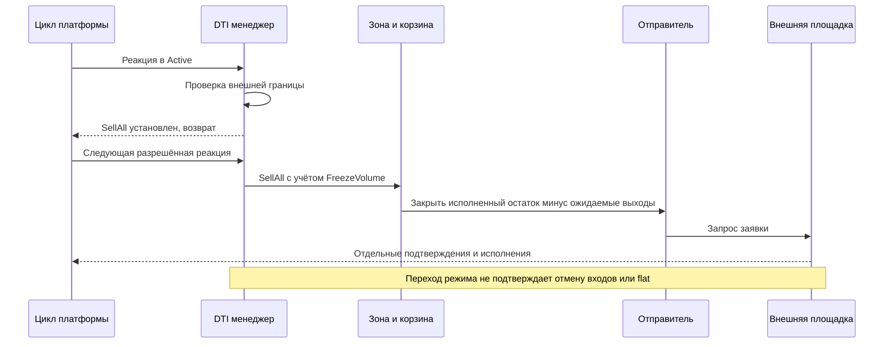
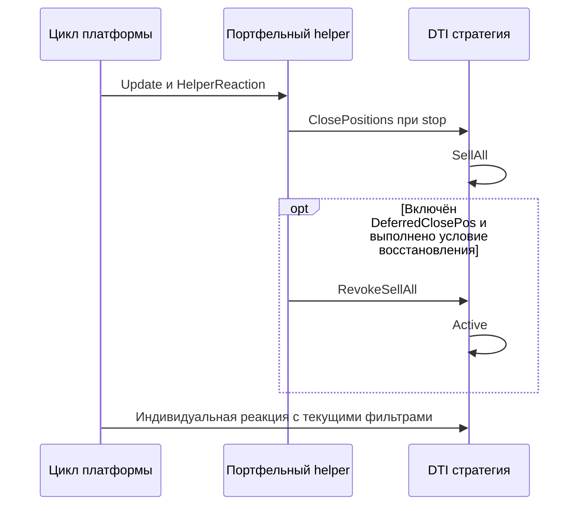

# THG-LEGACY-001: восстановленное поведение TradeHelp4

**Статус:** STATIC RECONSTRUCTION — LOCAL BINARY BASELINE  
**Дата:** 2026-09-29. Методы/линии ниже относятся к hash-bound views из
[THG-EVIDENCE-001](EVIDENCE.md), не к исходникам OsEngine.

Этот файл — обзор. Канонические подробные predicates, mutations и fallback
branches теперь находятся в [спецификации переходов Futures2](FUTURES2_TRANSITIONS.md)
и её пяти связанных частях. Краткая цепочка ниже не заменяет полный порядок
отказов, служебных результатов и callbacks.

## Идентификация решения

| Модуль | Классы и название | Подтверждённая роль |
|---|---|---|
| `dti.lf` | `DTI.StrategyDTIDTF` → «Фьючерсы 2» | Односторонняя сетка через общий DTI manager; основной reference задачи |
| `dti.lf` | `DTI.StrategyDTI`, `StrategyDTIClassic`, TWS-вариант | Арбитражная сетка, корзины/соотношения инструментов; отдельная семантика цены |
| `dtf.lf` | `DTMF.StrategyDTM`, `StrategyManager`, `Zone` → «Фьючерсы» | Другая односторонняя сетка; явный StopPrice, 7 режимов выхода |
| `dtm.lf` | `DTM.StrategyDTM` → «Акции» | Сетка акций с бюджетом уровней и локальной нижней stop-ценой |
| `ts.lf` | TouchScalp | Ручное ступенчатое изменение позиции; не автоматический диапазонный план |
| `PilotFinanceSystem.dll` | host tick, `QuikPlatform`, `Quik` | Общая диспетчеризация и отправка транзакций/доставка callbacks |
| `Order_callback.dll` | `StrategyAbstract`, `OrderSendingContainer` | Общие contracts, локальные/внешние identities, распределение grouped fills |
| `TralingStop.dll` | `TralingStop.Logic.TralingStopHelper` | Портфельный trailing, временные stops и порционное/отложенное закрытие |
| `Quik.Robotcraft.luac` | Lua 5.1 bytecode | Найдены OnInit/OnParam/OnStopOrder и таблицы данных; алгоритм bytecode полностью не восстановлен |

Существование названия стратегии не устанавливает настройки конкретного
экземпляра. Локальные `.us2`, `.par`, databases, logs и account/config files не
читались; их нельзя использовать как неявное доказательство выбранного режима.

## «Фьючерсы 2»: цепочка расчёта

`StrategyDTIDTF` наследует `StrategyDTI`, использует `StrategyViewDTF` и
`SettingsDTFViewModel`. Настройки передаются в
`StrategyManager.MakeStrategyDTF(SettingsDTFContainer)`. Число уровней задаётся
явно либо подбирается по `GetMaxZonesCount`. Формулы и недостатки округления
описаны только в [THG-MATH-001](MATHEMATICS_AND_PARAMETERS.md).

Менеджер строит два набора уровней вокруг середины внутреннего диапазона.
В выбранном направлении `PlanLots > 0`; противоположные N зон имеют план 0.
Общее число внутренних Zone равно `2N`, а не числу доступных входов. Это
не доказательство двусторонней торговли одним экземпляром Futures2.

Уровень содержит цену, объём, направление, корзину инструментов и состояние
отправленных/исполненных частей. Внутреннее понятие buy/sell часто означает
**набор/сокращение**, а не буквальную брокерскую сторону. У шорт-уровня набор
создаёт Sell, сокращение — Buy.

## Приход данных и приоритеты

Host `PilotFinanceSystem.UserPlatform.MainTickLua` обновляет параметры и
вызывает `Strategy.GetStrategyReaction` под lock экземпляра. Перед вызовом
проверяет разрешение торговли, согласованность лотов (с исключением demo),
запуск стратегии/платформы, соединение, session state и interval counter.
Это host-driven reaction, а не доказанный вызов на каждый exchange tick.

DTI `StrategyDTI.GetStrategyReaction(DataBaseInfo)` передаёт управление manager:
обычная отправка или `MultiOrderSender` при grouping. В `Active` manager:

1. Рассчитывает цены набора/выхода long/short с учётом `OrderThreshold`.
2. Проверяет выход за внешнюю границу. При срабатывании устанавливает
   `StrategyStates.SellAll` и немедленно возвращается из текущей реакции.
3. Если stop не сработал, проверяет блокировку входа, ликвидность,
   directional permissions, HJ, spending limits и запреты выходов.
4. Для multi-instrument zones сначала может исправлять целостность корзины.
5. Вызывает вход или выход уровня. Лимит `RealizedZonesCountOnStep` и
   `EnabledLiquidity` ограничивают число действий за проход.

Настройки `ForbidBuyes`, `ForbidSells`, `UseBlockEnter`, две области
`UseBlockExit`, HJ и дневной лимит — не синонимы одного общего «On/Off».
Режим `SellAll` имеет собственную ветку и не проходит все обычные фильтры.

## Пробой внешней зоны и ликвидация

В manager условие включительно:

```text
D != 0 AND (SellLong >= InternalUpper + D OR SellShort <= InternalLower - D)
```

`D = OutOfBoundValueInRouble`. Для `StrategyKinds.DTF` это единицы котировки,
несмотря на имя. Используются расчётные цены выхода с threshold; не `Last`
и не Close свечи. Связь расчётных Bid/Ask с реальной ликвидностью не
доказывается статическим чтением.

Новая реакция в `SellAll` выбирает зоны с позицией или pending buy/sell и
вызывает `Zone.SellAll → ZoneBasket.Sell`. Количество закрытия каждой ноги —
остаток `LotsCount − SendedBillSellCount`. Ликвидность как фильтр отключена,
но сохраняются OrderType/OrderThreshold и ограничение действий за проход.
Это не гарантированный Market и не синхронное закрытие.

В этой непосредственной цепочке не найден cancel-all barrier для входов.
Зона с одним pending entry и нулевыми fills не получает закрывающий объём.
Поздний fill входа может изменить остаток после начала ликвидации.
`SellAllCompleted` в trade handler опирается на нулевой `GetLotsCount`, а
не на явное отсутствие потенциально исполнимых заявок. Полный broker-flat
не установлен.

`FreezeVolume > 0` способен остановить цикл закрытия. В DTI `Zone.GetVolume`
суммирует расчётные цены составляющих без умножения на количество лотов,
поэтому подтверждённый денежный/notional floor этому полю не приписывается.
Это ограничение реконструкции единиц, а не предлагаемая риск-модель.



## Сопровождение и перенастройка

DTI поддерживает предварительные заявки, лимит действий, ликвидность,
первую/приоритетную ногу, восстановление целостности корзины, дневное
ограничение расходования, блокировки диапазонов, HJ и сдвиг границ после
выходов. `WidenRange` допускает изменение при отсутствии позиции;
`CheckCorrectUpDownAfterExit`/`CorrectUpDownAfterExitNow` перемещают границы
и plan prices. Наличие полей не означает атомарную замену плана с broker state.

`IsStopAfterExit` при нулевом lot count в trade handler вызывает отмену и
остановку. Для функции с названием `ClearSpendDayLimitAfterSellAll` reset
связан с успешным trade callback при нулевой позиции, а не только с ручной
командой SellAll. Присутствует автосброс TodaySpended по смене даты.

`TralingStopEnabled` внутри DTI найден как property; рабочий portfolio helper
реализован отдельно в `TralingStop.dll` и описан ниже. Само это property не
доказывает привязку конкретного экземпляра к helper. Встроенный в DTI `Expirate`
и repair корзины не являются квалифицированным single-instrument rollover.

## Отличия DTF («Фьючерсы»)

У DTMF `MakeStrategy` рассчитывает N кандидатов между HightLavel и LowLavel,
затем округляет по стороне; при off-tick границах крайний уровень может
оказаться снаружи. Есть 7 реализованных вариантов вычисления take-profit, long/short,
pre-send, HJ, группировка заявок, запреты набора/выхода и авторасширение
диапазона. Последнее выполняется при flat, отсутствии pending и выключенном
pre-send; меняется верхняя long или нижняя short граница.

`ToStrategy` при `UseStopOrders && StopPrice > 0` переключает в SellAll по
`price <= StopPrice` для long или `>=` для short. `SellAllMarket`/`StopOrderType`
выбирают тип закрытия. `FreezeVolume` ограничивает сокращение, лимит числа
обрабатываемых зон действует и здесь. `Zone.SellAll` пытается снять заявки
старше 30 секунд и затем отправляет закрытие свободного остатка. Все входы
немедленно и подтверждённо отменёнными считать нельзя.

Есть `SetStopOrders`, `CheckStopLoss`, `UpdateCommonStopOrders`, преобразование
stop transaction → stop order → regular order. Однако статический поиск
вызовов `SetStopOrders` в исследованных C# views не установил рабочий caller;
`GetStrategyReaction` в Lua-active ветке вызывает `FlushAllCommonStopOrders`.
Поэтому наличие helper не позволяет обещать постоянно установленный серверный
стоп. Reflection/иные внешние модули и реальный маршрут — NOT_DETERMINED.

Fallback getter `StopOrderPrice` вычисляет 90% цены последней зоны без
отдельного short-правила. Это не production default для неблагоприятного
short stop. Его нельзя перенести как универсальную настройку.

## Портфельный trailing и взаимодействие с сеткой

Host `MainTickLua` сначала обновляет параметры стратегий, затем для helpers
вызывает Update и, при запущенной платформе/соединении/разрешении, HelperReaction;
после этого выполняет индивидуальные реакции. `TralingStopHelper` выбирает
стратегии через StartStopList; расчёт результата и stop-порогов приведён в
[THG-MATH-001](MATHEMATICS_AND_PARAMETERS.md).

При срабатывании helper вызывает `Strategy.ClosePositions(helperId)`. Для DTI
это путь к SellAll. Он также может ускорить interval обработки до1,
назначить FreezeVolume для порционного выравнивания объёмов, остановить
неактивные стратегии по времени и при настройке удалить их из portfolio.
Helper считает свою работу законченной по нулевому GetLotsCount всех
выбранных стратегий; проверка отсутствия pending orders этим не установлена.

При DeferredClosePos, если выключены StopEmptyByTime/StopByTime, есть ветки
`RevokeSellAll` и повторного ClosePositions. У DTI RevokeSellAll прямо меняет
state на Active. При восстановлении после stop helper также устанавливает
ForbidBuyes. Из этого нельзя сделать claim о необратимой emergency latch в
legacy; вызовы отличаются от целевого контракта ADR.



PROPOSED production-контракт разделяет voluntary portfolio reduction и
emergency stop reason. Helper не вправе снять emergency latch: отдельный
source/reason приоритетов обязателен. Факт runtime согласованности legacy
helper, grid stop и всех callbacks не проверялся.

## Границы статической оценки

Установлены local matching и уменьшение pending quantities на fill;
не доказаны exactly-once доставки, полная синхронизация потоков, crash-safe
сохранение и брокерская сверка при restart. В DTF обычная зона отбрасывает
trade ID дубликаты, но grouping создаёт дополнительные локальные identities;
нельзя переносить локальную проверку зоны на весь transport.

Demo меняет типы заявок (DTF SendOrder переводит в LimOrder), а собственные
тестовые ветки используют другие время/данные. Tester/live parity отсутствует
как evidence. Историческая доходность, slippage, latency, очередь и
торговая безопасность не проверялись.

## Дополнение target: signed-price

Положительные UI guards, грубое округление и zero sentinels в этом обзоре
сохранены как факты оригинала. Они не являются допустимыми ограничениями
будущего робота: новый signed/zero домен до5 знаков и правила переноса
канонически заданы в [THG-PRICE-001](PRICE_DOMAIN.md).
