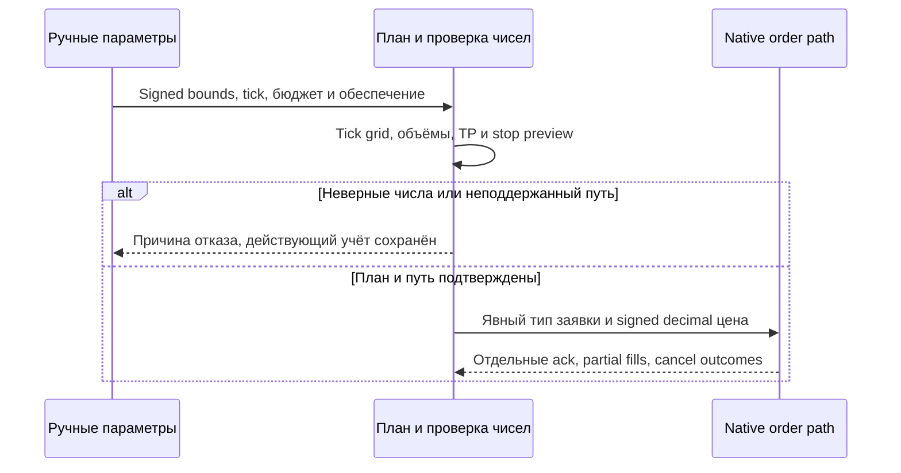

# THG-PRICE-001: цены до пяти знаков, отрицательные цены и ноль

**Статус:** OWNER REQUIREMENT + NUMERICAL TARGET — CURRENT IMPLEMENTATION IN ADR-THG-002.  
**Дата:** 2026-09-29. **Baseline:** `088add98b728f8088fb18ff2e59c8d4113ad043c`.

Владелец потребовал цены до пяти знаков после запятой и отрицательные цены.
Ноль и диапазон через ноль включены в целевой числовой домен, чтобы смена
знака не разрывала работу сетки. Алгоритмы ниже задают числовой target; реализованные компоненты и точная
граница evidence описаны в [ADR-THG-002](ADR-0002_OSENGINE_IMPLEMENTATION.md).
Наличие реализации не означает сквозной квалификации конкретного коннектора.
Документ является единственным каноническим источником новых числовых правил.
Literal legacy формулы и 363 source transitions остаются в исходных документах.

## 1. Числовые типы, единицы и допустимость

| Величина | Целевое правило |
|---|---|
| Введённая/отправляемая цена | Signed decimal, от0 до5 значащих дробных разрядов; отрицательная, нулевая и положительная допустимы численно |
| Tick τ | Строго положительный, не мельче0.00001; τ×100000 — целое. Например0.00005 допустим, число знаков само по себе не задаёт tick |
| Границы L/U | L<U; обе точно кратны τ. Запрета L<=0 нет; off-tick ввод отклоняется с preview исправления, не меняется молча |
| Цена заявки/уровня/stop trigger | Точно кратна τ; формат до5 знаков, проверка price-band отдельно от знака |
| Средняя/промежуточный результат | Decimal с большей промежуточной точностью; до5 знаков не обрезать перед расчётом цели или PnL |
| Количество/шаг объёма s | Неотрицательное количество; заявка строго>0 и кратна положительному s. Знак цены не задаёт сторону или знак объёма |
| Бюджет/обеспечение/стоимость шага | Положительные значения в явной валюте; v>0, κ=v/τ>0 для линейного инструмента |
| Наличие цены/котировки/средней | Отдельный presence/status либо nullable; price==0 и price<0 не означают отсутствие |
| Выключенная опция | Отдельный Enabled/enum. StopPrice0, BlockFrom0 и Average0 могут быть действительными значениями |

Не использовать float/double, преобразование через них и формат F2/F3 для
хранения, сравнения, identity, сохранения или отправки. UI принимает десятичный
разделитель выбранной культуры; неоднозначные строки с разделителями групп
отклоняются. Storage — versioned invariant decimal string с точкой, без
экспоненты и потери знака; UI может дополнять нулями до5. `-0.00000`
нормализуется в0.00000, не в missing. Лишние ненулевые разряды ввода не
округляются молча; trailing zeros сверх5 не меняют числовую точность.

Magnitude не безгранична: проверять decimal overflow, индекс tick, произведения
и суммы до изменения плана/submit. Metadata precision>5 или tick, не
представимый в этой шкале, дают явное unsupported profile; не обрезать metadata.
Допуск биржи/connector к signed/zero цене — отдельная проверка исполнения,
не повод заменять отрицательную цену её модулем.

## 2. Шаг сетки и округление

Границы задаются вручную. Идеальный шаг Δ=(U−L)/(N−1), N>=2. В target
UI и builder показывают одну формулу; legacy W/N остаётся только в source review.
План строится в целых ticks, так что округление не уничтожает пятый знак:

```text
kL=L/τ, kU=U/τ, S=kU−kL
require S>=N−1
k[j]=kL+floor(j*S/(N−1)), j=0…N−1
P[j]=k[j]*τ
```

Здесь kL/kU — точные целые, floor — математический пол, не trunc к нулю.
Умножение j*S и деление выполняются без потери integer precision/overflow
(достаточный целочисленный тип либо checked rejection). Получаются N разных
цен, включая L/U, в пределах [L,U]. Если S не делится на N−1,
фактические соседние шаги отличаются максимум на один tick; preview показывает
Δ и список фактических шагов. Это явное квантование, не обещание строго
равного шага в несовместимой с tick геометрии. Long нумерует уровни от U к L,
Short — от L к U; порядок обработки событий задаётся execution contract.

Отдельный квантователь для вычисленных цен:
`Down(x)=τ*floor(x/τ)`, `Up(x)=τ*ceil(x/τ)`. Семантика точная; реализация
должна проверять граничные значения и не полагаться на trunc отрицательной
дроби. Не выполнять повторное скрытое округление в adapter/connector.

| Назначение вычисленной цены | Направление округления |
|---|---|
| Passive Buy limit / passive Sell limit | Down / Up |
| TP long (Sell) / TP short (Buy) | Up / Down, чтобы не ухудшать заданный целевой уровень |
| Нижняя / верхняя внешняя граница | Down / Up, после проверки, что они снаружи active range |
| Aggressive Buy / aggressive Sell | Up / Down, с отдельным пределом допустимого проскальзывания |

У уже валидного уровня кратность точная, дополнительного округления entry
нет. Отдельное правило для aggressive limit не подменяется passive rounding.
Например при τ=0.00005: Down(−1.23456)=−1.23460,
Up(−1.23456)=−1.23455. `Math.Round(price,5)` эту задачу не решает.

Примеры: L=−0.00010,U=0.00010,N=5,τ=0.00001 дают
−0.00010,−0.00005,0,0.00005,0.00010. При L=−0.00010,U=0.00010,N=4
получаются −0.00010,−0.00004,0.00003,0.00010. Диапазон −12.34567…−12.34547
с N=5 и тем же tick полностью отрицательный и также валиден.

## 3. Количество лотов, резерв и дневной лимит

Legacy `price*κ*g/100` непригодна как универсальное обеспечение при price<=0.
Нельзя делить бюджет на signed price, считать нулевую цену бесплатным входом
или молча подставлять abs(price). Модуль цены допустим для отдельно названной
метрики gross notional, но не заменяет модель обеспечения.

Предлагаемый общий режим для всех знаков: вручную задаются `CollateralPerLot>0`
в валюте бюджета и отдельный резерв fees/stress. Положительное известное
broker margin в той же валюте может только повысить требование:
`C=max(CollateralPerLot, knownBrokerMarginPerLot)`, иначе C=CollateralPerLot.
Это консервативный planning input, не утверждение о реальном margin у брокера.
Перед увеличением позиции нужны независимые account/free-margin/capability
проверки. Неизвестную валюту/конверсию нельзя заменить числом1.

`M` ниже — выделенный новому плану бюджет ПОСЛЕ отдельного резерва fees/stress
и вычета обязательств старого плана, включая working/Unknown. C фиксируется
в preview/version, не пересчитывается из котировки при переходе через ноль.
Известное увеличение broker margin запрещает новые increases до перепроверки
резервов; сопровождение остатка сохраняется, план не заменяется автоматически.

Равные доли с переносом остатка задаются без накопления ошибки M/N:

```text
T[i]=floor((i+1)*M/(N*C*s)), T[-1]=0
q[i]=s*(T[i]−T[i−1])
require q[i]>=minimumVolume для каждого уровня и sum(q[i]*C)<=M
```

Индекс i следует нумерации активных уровней выбранного направления. C — деньги
за единицу количества native contract, s — volume step; для целых лотов s=1.
Floor вычисляется как точное рациональное отношение исходных decimal inputs,
например через масштабированные целые, а не цепочкой округлённых долей.
Все quantities также проверяются на native minimum/step/maximum.
При M=100,N=3,C=7,s=1 получаются4,5,5 лотов, резерв98 и остаток2 при любом
знаке уровней. Fixed mode назначает F>0, кратное s, каждому уровню и требует
N*F*C<=M; нехватка не исправляется скрытым уменьшением F.

Резервировать C*qty на held+потенциальные входы, не освобождать дважды при
partial fill; fill переносит резерв из pending в held. Cancel releases только
подтверждённый неисполненный остаток, Unknown сохраняет резерв. Для дневного
лимита использовать положительную стоимость C*qty принятого набора с явной
политикой возврата по выходам; signed price не делает расход отрицательным.
Правила source TodaySpended остаются историческими, не target oracle.

## 4. Наценка, средняя, PnL и процентные опции

Для исполненного количества h>0: A=sum(fillPrice*fillQty)/h; A может быть
отрицательной или нулевой. Если h=0, средняя отсутствует. Сохранять достаточную
decimal precision; количество, а не знак суммы цен определяет наличие позиции.
Partial fills и общая средняя используют те же правила; объёмы разных
направлений не взаимозачитываются для получения фиктивного знаменателя.

Наценка m задаётся как неотрицательное ценовое расстояние, для прибыльного TP
требуется m>0. Long: T=Up(B+m); Short: T=Down(B−m).
FromEnter: B=A; FromPlan: long B=max(A,plan), short B=min(A,plan).
Для whole-position TP основа — общая средняя той же стороны. Например
A=−10.00003,m=0.00010,τ=0.00001: long T=−9.99993, short T=−10.00013.
Комиссии вести отдельно от сырой средней; заданная наценка сама по себе
не гарантирует положительную прибыль после fees/slippage.

Для линейного инструмента gross PnL long=(exit−entry)*qty*κ,
short=(entry−exit)*qty*κ; net=gross−fees. Переход −1→+1 приносит long
положительный price PnL; деления на entry price нет. Процент результата/
portfolio trailing нормируется на положительный зафиксированный бюджет
кампании, а не на signed/zero entry или текущую signed стоимость позиции.

Ценовые процентные опции (offset/preorder distance/shift/trailing) получают
явную ручную положительную базу `PricePercentBase` в единицах цены:
distance=PricePercentBase*percent/100. База фиксируется в версии настроек,
показывается в preview и не меняет знак при проходе через0. Единицы каждого
параметра обязательны: price units, ticks, zones либо percent of this base.
Для zones distance используется указанная в preview идеальная Δ с последующим
целевым округлением; при неравных tick шагах это не «число соседних уровней».
Ни multiplier signed quote, ни исходная необычная формула preorder Percent
не переносятся молча. Это предложенное изменение семантики percent options.

## 5. Входы, блокировки, stop и runtime

Сравнения сохраняют математическое направление: long entry Ask<=level,
short entry Bid>=level; long TP Bid>=target, short TP Ask<=target.
Quote corrections k*τ и slippage offsets — расстояния, не проценты signed
цены. Require Bid<=Ask и наличие/свежесть нужной стороны; отрицательный Bid
и нулевой Ask сами по себе не ошибка данных. Missing quote не заменяется0.

Неблагоприятный stop: long Bid<=LowerStop, short Ask>=UpperStop; обе цены
могут иметь любой знак. Дополнительная благоприятная граница задаётся явно.
Liquidation latch, приоритет emergency и cancel/fill reconciliation сохраняются
по THG-EXECUTION-001. У stop есть Enabled, цена0 не выключает защиту.
Для дистанции D>0 используются L−D/U+D с outward rounding из раздела2;
внутренние удвоенные legacy bounds не переносятся автоматически.

ForbidLong/ForbidShort относятся к стороне позиции, не к знаку цены;
входы/preorders проходят один и тот же запрет. Блокируемый интервал
From<=price<=To допускает From<0, To=0 и пересечение нуля. HJ, max/min
и gap хранят отдельный initialized flag, а gap — разность действительных
наблюдений, не проверку Open!=0. Накопление extrema работает через0.

Ручной shift может иметь любой знак; ширина и расстояния остаются положительными.
Rebuild/widen/shift/rollover проверяют новый tick domain, все уровни/цели/стопы,
резерв и ownership до применения. Цена исполнения старой заявки и её identity
не округляются задним числом. При смене metadata или настроек с working/Unknown
заявками использовать versioned reconfiguration/cancel-confirmation из
THG-EXECUTION-001. Простой проход котировки через0 не создаёт новый план,
не меняет сторону и не сбрасывает запреты, среднюю, extrema или счётчики.

## 6. Исполнение, persistence и граница native поддержки

`Limit(0)` и `Market` различаются по явному типу заявки; price0 не кодирует
команду Market в domain model. Нельзя устранять native запреты заменой цены
на abs, epsilon, сдвигом всего рынка или обходом native order lifecycle.
Без проверенной поддержки соответствующего пути исполнения не активировать
новые входы. Если ограничение выявлено при открытой позиции — видимый остаток,
сохранённая защёлка ликвидации и только квалифицированный способ сокращения;
ни успешный вызов, ни локальное обнуление не означают broker flat.



Checkpoint хранит price-domain/schema version, tick/value/currency snapshot,
presence flags, signed decimal strings, C/percent base, план и native mapping.
Legacy price0 без отдельного presence/type нельзя автоматически трактовать
как действительную цену: миграция требует контекста и сверки; неоднозначность
оставляет Reconciling. Partial fills/replay не округляют среднюю до5 знаков.

Current native ограничения с exact anchors перечислены в
[THG-INTEGRATION-001](OSENGINE_INTEGRATION.md); наличие decimal полей не
доказывает signed/zero execution. Единый расчётный модуль требуется для
Tester/Optimizer/live, но feed/storage/chart/order simulation/connector должны
отдельно пройти signed-price qualification. Никакая такая квалификация
не выполнена в этой документационной задаче.

## 7. Проверяемые примеры и покрытие

[signed-price-cases.json](evidence/signed-price-cases.json) содержит входы и
явные ожидаемые значения. [check_signed_price_cases.py](evidence/check_signed_price_cases.py)
проверяет числовые примеры этого proposal без OsEngine/vendor runtime.
Список будущих integration/negative/recovery сценариев —
[THG-QUALIFICATION-001](QUALIFICATION.md). Итоги реального запуска checker
и независимых reviews записываются только в [THG-EVIDENCE-001](EVIDENCE.md).
