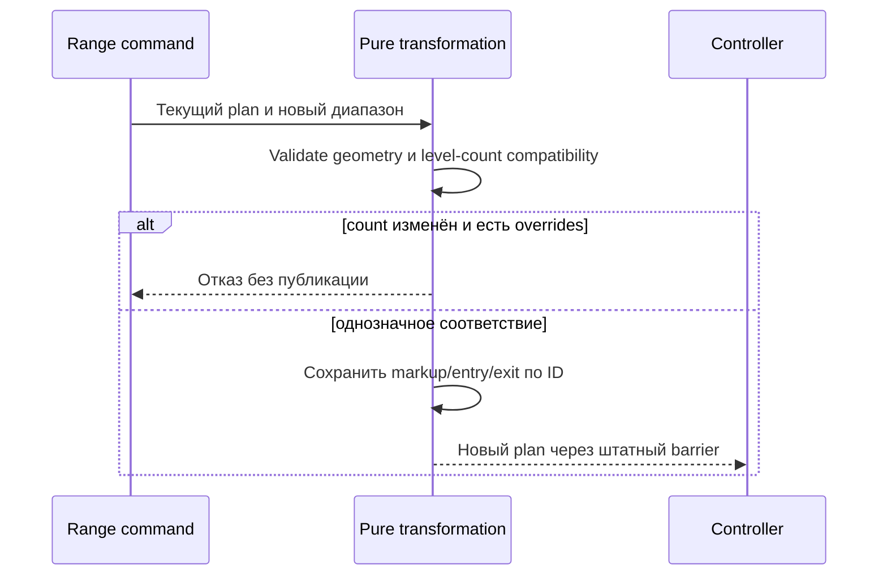

# THG-RANGE-014: ручные настройки уровней при Shift/Widen

**Статус:** CURRENT IMPLEMENTATION — OFFLINE CHECKS PASSED, REVIEW CLEAN/CLEAN. HEAD `088add98b728f8088fb18ff2e59c8d4113ad043c`.
[ADR-THG-002](ADR-0002_OSENGINE_IMPLEMENTATION.md), [review014](RANGE_STATE_REVIEW.md).

## Исправляемый переход

До014 Shift/Widen вызывали Plan.Build и теряли per-level Markup/EntryEnabled/
ExitEnabled: ранее отключённый уровень мог снова торговать, отдельная наценка
возвращалась к initial Grid.Markup. При неизменном количестве уровней новый
plan сохраняет эти три значения по ordinal ID; цена/geometry обновляются прежней
формулой. Старые lots/intents продолжают ссылаться на прежний plan. Initial inputs
и прежний plan не мутируются. Новая версия проходит существующий cancel-confirm
barrier. No-op transformations по-прежнему могут использовать прежний active plan.

Если Widen/CountMode.Step меняет число уровней и в исходном плане есть markup,
отличная от Input.Markup, либо запрещённый entry/exit, операция целиком отклоняется
**до Configure**, без отмен/новых заявок со стороны этой команды. Сопоставление
ручных настроек при другой топологии неоднозначно. Оператор явно строит новый
план через Apply configuration и заново проверяет настройки; не удаляет checkpoint.
Автоматический WidenWhenFlat получает штатный adapter Fault при таком отказе;
старый план сохраняется, автоматические sends блокируются до разбора причины.
Untouched uniform grid сохраняет прежний пересчёт количества/бюджета.

Исторические lot basis/ExitCarry не переносятся как template новых обычных входов.
Native metadata/profile копируются как прежде. Schema не повышается: новые поля
не добавлены, исправляется сама pure transformation. Старый код после rollback
не приобретает это исправление; это не обещание обратной behavioral parity.

## Source boundary

Локальный dti.cs SHA256
`523f17b7db8d9b3754f30375c4237ecc0d23c78af8739163da6930a26de6ed78`.
Source Shift11844/11854 меняет internal bounds и существующие PlanPrice;
Widen9075–9130 меняет существующие prices/bounds и некоторые entry rules,
не создаёт уровни заново и не перераспределяет PlanLots.014 закрывает потерю
ручных overrides в current implementation, **не** буквальный source Widen:
симметричное расширение internalbounds, asymmetric level displacement, source
rule translation, GetStrategyOrientation и autoShift с opposite zero-capacity
zones требуют отдельного geometry/state контракта и здесь не реализованы.

Managed harness935/935 (74new), full solution0errors17existingwarnings40.75s.
Independent reviews CLEAN/CLEAN; exact checkpoint в [review014](RANGE_STATE_REVIEW.md).
Physical GUI/broker NOT_RUN.
