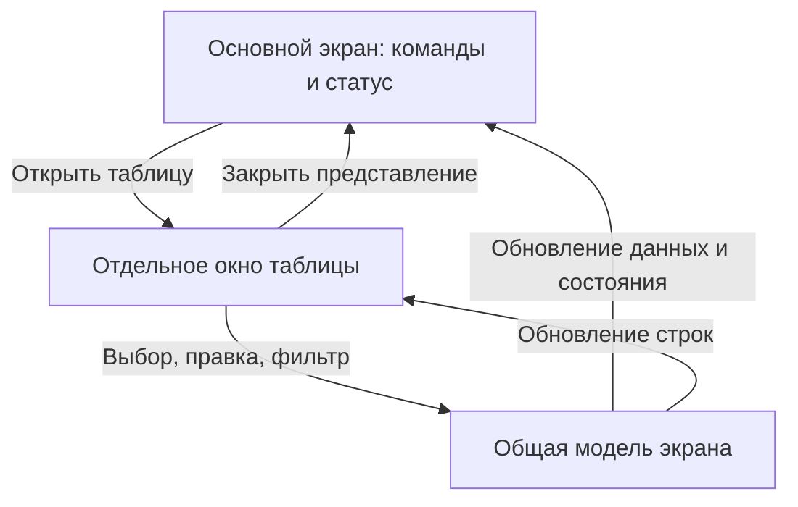

# UI-DETACHED-TABLES-001: окна таблиц и доступность команд

**Статус:** TARGET SPECIFICATION — NOT IMPLEMENTED.
**Область:** все пользовательские desktop-экраны OsEngine во всех модулях
production-приложения, включая OsData/Order Flow, OsTrader, Market,
OsOptimizer, Journal, Robots, UpdateModule и остальные экраны с таблицами.
**Основание:** запрос владельца от 24.09.2026 и наблюдение обрезанных кнопок
на вкладке Cloud Explorer «2.6 Предвестники движения».
**Приоритет:** сначала исправить недоступные команды Cloud Explorer,
затем охватить все остальные таблицы решения по проверенному реестру.

## 1. Задача и граница

Главный экран должен показывать параметры, важные состояния и все кнопки
выбранного раздела. Каждая пользовательская таблица — включая таблицы
настроек и результатов — открывается по явно названной кнопке **в своём
отдельном окне**. Таблица больше не занимает рабочую высоту экрана, из-за
которой перекрываются команды или график. Пользователь может оставить окно
таблицы рядом с основным и продолжать работу в основном окне, если это
допускает существующий сценарий.

Это задание на будущую реализацию; этот документ не утверждает, что
поведение уже изменено. Сами вычисления, настройки, форматы сохранения,
результаты исследований, торговые правила и права действий остаются прежними.
Под «таблицей» здесь понимается видимый пользователю набор строк и столбцов:
WPF `DataGrid`/`ListView` с колонками, WinForms `DataGridView`, в том числе
построенный фабрикой во время работы, и функционально аналогичные списки с
колонками/сортировкой/редактированием. Обычный выпадающий список выбора,
однострочное поле и непрерывный график без табличного режима сюда не входят.
Встроенная в таблицу кнопка действия переезжает вместе со своей строкой;
кнопка открытия самой таблицы остаётся на родительском экране.

## 2. Наблюдение и охват

В текущем `OsData/OrderFlow/Explorer/CloudExplorerControl.xaml` корневая
область вкладок настроек имеет `RowDefinition Height="220"`. Во вкладке
«2.6 Предвестники движения» кнопки `ButtonPatternSearch` и
`ButtonPatternOpen` находятся в верхнем `WrapPanel`, а таблица
`DataGridPatternOptions` заполняет оставшееся место того же `DockPanel`.
На снимке владельца текст обеих кнопок обрезан по нижнему краю при открытом
окне шириной около 2048 px. Исправление только размера этой таблицы или
этого окна не выполняет требование для остальных экранов.

Первичный поиск в исходниках обнаруживает WPF таблицы в
`CloudExplorerControl.xaml`, `OrderFlowResearchUi.xaml`,
`UpdateModuleUi.xaml` и многочисленные обращения к WinForms
`DataGridView` в других подсистемах. Число совпадений исходного текста не
равно числу самостоятельных пользовательских таблиц: фабрики, условные
экраны и переиспользуемые компоненты требуют проверки в работающем UI.

**Обязательный результат первого этапа реализации:** реестр *каждой*
пользовательской таблицы solution: модуль и экран, имя/идентификатор,
способ создания (XAML, WinForms, фабрика), доступность в режимах
OsData/Tester/Optimizer/Live, чтение или редактирование, связанные команды,
источник данных, жизненный цикл, исходное положение и результат переноса.
Обойти все пути создания таблиц, включая динамические, и отметить
«не применимо» только с объяснением. По этому реестру проверить 100% охват;
не считать поиск `DataGrid` достаточной приёмкой.

## 3. Пользовательский сценарий

1. Пользователь открывает рабочий экран и видит название раздела, основные
   параметры, краткий статус/количество строк и отдельную кнопку
   «Открыть таблицу: …» для каждой его таблицы. Если строк нет, кнопка
   остаётся доступной; рядом показывается причина пустого результата.
2. Нажатие открывает отдельное изменяемое по размеру окно с заголовком,
   названием таблицы и контекстом (инструмент/сервер/исследование, когда
   это существенно). Повторное нажатие переводит существующее окно вперёд,
   а не создаёт второй несогласованный редактор.
3. Таблица, её фильтры/сортировка/страницы и относящиеся к ней действия
   доступны в новом окне. Изменение строки, если оно допускалось раньше,
   работает с тем же состоянием и прежней проверкой ввода. Выбор строки,
   переход к графику, экспорту или другому экрану не теряют контекст.
4. Закрытие табличного окна освобождает только ресурсы представления;
   основной экран и фоновая работа остаются в корректном состоянии.
   Переоткрытие показывает актуальные данные и применимые настройки вида.

### Требования к состоянию и безопасности

- Открытие/закрытие/фокусировка окна не запускают повторный расчёт, не
  отправляют/отменяют заявку и не изменяют риск или сохранённые настройки.
  Кнопки торговли и подтверждения сохраняют прежние ограничения и контекст.
- Не копировать изменяемую коллекцию в несвязанный экземпляр. Данные и
  счётчики обновляются в окне при их изменении; при смене источника
  (например, другого робота, сервера или каталога) окно ясно меняет контекст
  или закрывается, не показывая старые строки как текущие.
- Не разрывать существующую последовательность валидации и подтверждений
  редактируемых таблиц. При закрытии редактора с несохранённой правкой
  применить тот же commit/cancel/confirmation contract, который действовал
  для встроенной таблицы. Для таблицы в модальном диалоге сохранить
  исходную модальность и запрет обхода обязательного подтверждения;
  во всех остальных случаях окно должно быть немодальным.
- Потоковые таблицы сохраняют пагинацию или виртуализацию, ограничения
  памяти и диспетчеризацию UI; закрытое окно не удерживает подписки и
  ресурсы. Не вводить вторую подписку на поток и не ухудшать реакцию
  кнопок при обновлении большого числа строк.
- Не закреплять новые окна поверх всех приложений. Сохранять привычную
  навигацию между окнами, возможность вернуться к основному экрану и
  корректную очистку окон при закрытии владельца/выходе из модуля.

## 4. Компоновка и видимость команд

Основной экран должен иметь области «параметры», «действия», «статус» и
«открыть таблицу». Кнопки не должны перекрываться таблицей, графиком,
строкой состояния или соседним `TabControl`, обрезаться границей контейнера
либо прятаться за горизонтальной прокруткой без явного доступа. Подсказка
не заменяет видимую подпись кнопки. Для длинных групп команд использовать
адаптивные строки с переносом, отдельные подписанные вкладки/группы и
вертикальную прокрутку *контента*; критичные для операции «Запустить»,
«Остановить» и обязательные подтверждения должны оставаться достижимыми
без скрытого меню. Каждый раздел показывает все свои команды целиком
после открытия соответствующей вкладки/группы. Всплывающие подсказки и
оверлеи не должны блокировать нажатие.

Не задавать фиксированную высоту блоку, который должен вместить кнопки,
при изменении масштаба текста/DPI. Проверить измерение `Auto`/`*`, минимальные
размеры и независимую прокрутку длинного содержания. Если физического места
для кнопок активной группы не хватает, увеличить прокручиваемую область
и оставить видимый способ дойти до каждой кнопки мышью и клавиатурой.
Ни одна команда не исчезает при уменьшении окна до поддерживаемого минимума.

Табличное окно должно поддерживать изменение размеров, разворачивание,
нормальную прокрутку строк и столбцов, полные заголовки (или подсказки к
ним), стандартную клавиатурную навигацию и клавиатурное закрытие. Подписи,
сообщение о пустой таблице, фильтр, сортировка, выделение, пагинация,
контекстное меню, экспорт и доступные права сохраняются по сравнению с
исходным экраном. Для большого числа колонок допускается горизонтальная
прокрутка **внутри отдельной таблицы**.

## 5. Обязательные примеры переноса

| Экран | Что должно остаться видно на основном экране | Что открывается кнопкой в новом окне |
|---|---|---|
| Cloud Explorer, вкладки настроек 2.1–2.6 | Выбор вкладки, цель/контекст, «Найти предвестники движения», «Сохранённые исследования», остальные команды расчёта | Каждый список параметров, в частности «Дополнительные параметры предвестников» вместо встроенной `DataGridPatternOptions` |
| Cloud Explorer, шаг 4 | Переключение разделов, навигация по страницам, ID, состояние запуска и действия с графиком/реплеем; текстовые «Сводка», «Сравнение групп» и карточка сценария сохраняют свой формат | Каждая таблица результатов: «Каталог», «Эпизоды», «Наблюдения», «Будущие исходы», «Триггеры», «Экстремумы», «Причины и активные наблюдения», таблица найденных сценариев (`DataGridPatternCards`) и недельный контекст (`DataGridPatternWeek`); график сохраняет собственный режим |
| OsData / Order Flow, остальные экраны | Загрузка и расчёт, фильтры, график и выбранный источник | Таблицы кандидатов, Cloud, рекомендаций, статистики и другие обнаруженные таблицы |
| Остальные модули приложения | Название функции, необходимые действия и текущий статус, в том числе торговые блокировки | Каждая обнаруженная пользовательская таблица с исходными правами и командами строк |

Перечень иллюстрирует требования, но не заменяет реестр из раздела 2.
Если в разделе открывается несколько таблиц, каждая получает различимую
кнопку. Не переносить график в табличное окно лишь потому, что он расположен
рядом с таблицей; существующая кнопка отдельного графика остаётся.

## 6. План реализации и приёмка

1. Составить проверенный реестр таблиц и экранов; установить список
   поддерживаемых размеров окон, DPI и тем. Зафиксировать до/после для
   всех обнаруженных таблиц и ссылку на проверку каждой строки реестра.
2. Разработать общий механизм открытия таблиц для WPF и WinForms-хостов:
   один экземпляр на конкретный контекст, владение ресурсами, актуальная
   модель, сохранение модальности там, где её требует исходный сценарий.
   Не менять таблицы механически без проверки действий в ячейках.
3. Исправить Cloud Explorer полностью, включая доступность кнопок 2.6,
   таблицы настроек и результата; проверить график и реплей. Затем
   перенести оставшиеся экраны по реестру, отмечая фактически завершённые
   строки. Не объявлять выполнение всей задачи по одному исправленному окну.
4. Автоматизированные UI/component проверки покрывают повторное открытие,
   закрытие, редактирование/валидацию, выбор/переход из строки, обновление
   данных, смену контекста и освобождение подписок. Для торговых экранов
   проверить, что открытие таблицы не создаёт торговых побочных эффектов.
5. На Windows выполнить ручную приёмку с мышью и клавиатурой: минимум
   1366×768 при 100% и 125%, 1920×1080 при 150%, а также восстановленное
   и развёрнутое окно, тёмную и светлую темы. Для каждого раздела реестра
   проверить полностью видимые подписи и кликабельность всех кнопок;
   каждую таблицу открыть кнопкой, изменить размер, прокрутить и закрыть.
   Если приложение определяет меньший поддерживаемый размер, включить его
   в приёмку и обеспечить доступность через прокрутку контента.

**Критерий готовности:** 100% проверенного реестра пользовательских таблиц
открываются своими кнопками в отдельных окнах; ни одна кнопка активной
группы не обрезана/перекрыта/недоступна на поддерживаемых размерах; прежние
операции с данными и права действий работают; экран 2.6 больше не скрывает
кнопки за таблицей. Сборка/тесты и фактическая Windows/DPI приёмка относятся
к реализации и **не проведены этим документационным изменением**.
