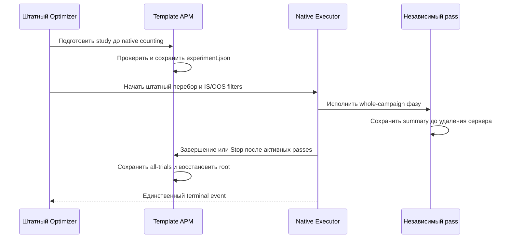

# APM-RELEASE-READINESS-001 — локальная поставка ResearchOnly

Статус: CURRENT RUNBOOK / выпуск заблокирован незавершёнными gates.
Основания: [T12](tasks/T12-release.md), [quality gates](10-quality-gates.md),
[операционная граница](15-operations-implementation.md). Точные текущие статусы,
totals и reviewers ведутся только в [work record](evidence/implementation.md).
Запись о сборке и hashes — [release manifest](evidence/release-manifest.json).
Этот документ не даёт разрешения на live и не подтверждает доходность.

## Что можно проверять на реальных исторических данных

Зарегистрированный `AdaptivePositionResearchBot` работает в штатных Tester и
Optimizer с TradeOnly. Используется один выделенный flat tab, один инструмент,
заранее сохранённый schedule входов и неизменяемых risk locks. Реализованы
обратимые ADD/REDUCE, ограничения риска, FAST/volatility, terminal latch,
durable intents/fills, компактная диагностика и пять отдельных таблиц/CSV.

Это техническая возможность локального исследования. Произвольная история ещё
не квалифицирована, автоматической подготовки schedule из торговых сигналов нет.
Перед запуском пользователь выбирает файл, период и timezone; проверяет явные
PriceStep/PriceStepCost/Lot/VolumeStep/DecimalsVolume/MinTradeAmount и валюту риска.
Тики должны соответствовать строгому семипольному native text contract с Side,
MicroSeconds и Id; файл целиком проверяется на порядок/качество и связывается SHA256
с schedule. Исходный порядок одинакового Time сохраняется. MicroSeconds не
превращаются в выдуманный event clock: текущий replay использует целые секунды.

Кампании не пересекаются. Каждая фаза включает прошлый warmup более30секунд до
entry и время после cutoff для final fill; разрезанная/пустая фаза отвергается.
В schedule отдельно задаются комиссии и entry/stop slippage reserves; native
slippage задаётся в сервере. Эти inputs должны соответствовать выбранному
исследовательскому сценарию: они не калибруются автоматически.

Tester/Optimizer исполняют полный объём без книги ликвидности и очереди. У них
разные правила equal-time fill; закрытие в тихом рынке может получить timestamp
предыдущего native tick. Результат не доказывает реалистичность рыночного исполнения.
Синтетические результаты и сохранённые примеры нельзя называть untouched holdout.

## Путь в Optimizer

1. Открыть штатный Optimizer, выбрать `AdaptivePositionResearchBot` и native
   tick folder. В редакторе инструмента явно заполнить metadata и сохранить их.
   Они перечитываются native storage; отсутствующий VolumeStep не угадывается.
2. На выделенном simple tab выбрать инструмент, класс, портфель и timeframe.
   Выключить native ManualControl protection: APM не принимает второй арбитр.
3. В параметрах указать schedule, dataset и writable Artifacts root, RegimeOn.
   Для ordinary TradeOnly оставить `Research AC enabled=false`.
4. В штатной таблице параметров fixed numeric значения задать в fixed/default
   колонке. Для поиска выбрать до трёх осей из Add scale price, Reduce scale price,
   Inventory gamma, Rearm volatility factor; до пяти значений на ось,125комбинаций.
   Начало/конец диапазона должны лежать на положительном absolute step.
   Без выбранных осей APM создаёт singleton axis для одного native pass.
5. Задать whole-campaign IS/OOS фазы. Последовательные OOS не пересекаются;
   каждый OOS следует после своего training. Rolling training может включать
   ставший прошлым OOS, но не будущий. До первого запуска зафиксировать отдельный
   финальный untouched период и экономические критерии; APM не выбирает их за вас.
6. Запустить штатный Optimizer. В Artifacts root создаётся study directory:
   experiment.json до перебора, passes с независимыми manifest/journal/summary,
   all-trials.json и native-selection.json при завершении либо остановке.
   Native фильтры определяют выжившие IS для OOS. Не запущенные trials сохраняются
   как NotObserved, без фиктивного нулевого PnL и без выдуманной причины пропуска.
7. Нажать параметр-кнопку **APM study report**, выбрать all-trials.json; проверить
   status/completeness, policy hash, numeric sorting и экспорт CSV. Net включает
   открытый остаток при partial run. MaximumDrawdown — максимум отдельных кампаний,
   не drawdown сшитого портфеля. Отсутствующие metrics остаются пустыми.

Путь в Tester и импортируемые S01/S02 находятся в [пошаговом runbook](evidence/implementation.md#воспроизводимый-запуск-в-штатном-tester).

Для воспроизведения выбранного pass перенести его policy из experiment/summary
в параметры Tester, использовать тот же dataset/schedule, metadata, costs и
соответствующий whole-campaign период. Сохранять новый output; сравнивать fills
с учётом документированного различия native timestamps. Перенос параметров
не переносит OOS-квалификацию на другие данные или runtime.

## Что остаётся ResearchOnly

Все профили пока ResearchOnly: исторический OOS и экономическое преимущество не
подтверждены. Event/sample OFI и causal calibration реализованы как независимые
компоненты, но согласованный native trades+quotes adapter отсутствует. A4 не
подключён; TradeOnly не подставляет вымышленные OFI/depth.

AS reservation, дискретная AC trajectory и ADAPT demand имеют reference tests.
Opt-in A5 AC pacing требует полного явного settings file и training cutoff до
каждой entry; обычные заявки дробятся, protective EXIT не задерживается.
Синтетические UNFITTED coefficients не являются рыночной настройкой. Полные
ADAPT optimal controls и running-inventory penalty phi не реализованы; граница
сопоставления с формулами описана в [research design](14-research-implementation.md).

Core recovery сохраняет identities, fills, pending и ExitLatch; native adapter
не принимает открытую позицию после перезапуска и не умеет сверяться с брокером.
Новый исторический replay является новой симуляцией. Live constructor отклоняется.
Для native/live recovery нужен отдельный adapter/query contract и qualification;
одних credentials или разрешения на live недостаточно.

## Ручное участие и сохранение состояния

QG06 открыт только на физические DPI100/125/200% и пользовательский walkthrough:
S01/S02, причины ADD/REDUCE/SKIP, stop, пять таблиц, сортировка/CSV и доступность
кнопок при resize. Результаты записать для каждого реального DPI; layout simulation
не засчитывать. Другие открытые gates требуют выбора исторического dataset/
интервалов/economic profile, согласованной книги для A4 и отдельной operational
квалификации. Shadow/paper/live не запускались и требуют точного разрешённого
сценария. После CP14 пользователь отдельно разрешил commit/push APM; это не
закрывает qualification gates и не даёт разрешения live.

Для остановки текущего исследования использовать штатный Stop; в Tester APM Close
запрашивает защитное завершение. Проверить actual q/pending и summary, сохранить
весь run/study directory. RegimeOff запрещает набор, но сам по себе не закрывает
позицию. После неизвестного результата send не повторять заявку вручную вслепую.

Rollback разрешён только для завершённой flat research simulation: сохранить
весь directory evidence, закрыть её отдельный процесс, выбрать проверенную версию
приложения и новый output для нового replay. Не подмешивать старый checkpoint в
новый run. Schema-v1 additive NativeLimits читается текущим кодом; downgrade
активного состояния в код, игнорирующий limits, не квалифицирован. При corrupted
checkpoint, неизвестном send или незавершённом inventory сохранить файлы и
остановить исследование до разбора. Удаление journal не является recovery.

Пять DividendsUpdater artifacts исключены из APM staging. Два сохранённых набора
остаются backup/evidence; до нахождения доказанного исходного before-image
побочный AfterBuild эффект не восстанавливается догадкой. Будущие изолированные
build используют [IsolatedBuild.targets](../../Tests/AdaptivePositionManager/IsolatedBuild.targets)
по команде work record. Обычный build без этого import сохраняет прежний copy target.
