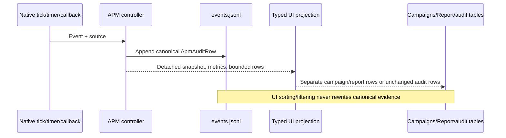

# 17. Ручная UX-приёмка APM

Статус: OWNER WALKTHROUGH COMPLETE; UX-01…UX-08 FIXED IN CP16; PHYSICAL DPI OWNER-RUN OPEN.
База проверки: ветка `docs/order-flow-production-roadmap`, APM-кандидат начиная с commit `c8798732c8c984e0bf219393d9a4c86dc75dcce8`.
Проверка выполнялась пользователем в штатном Tester/Tester Lite. Это не закрывает DPI 100/125/200%, исторический OOS, shadow/paper/live или экономическую квалификацию.

## Что проверено вручную

| Область | Результат | Наблюдение |
|---|---|---|
| S01, обычный обратимый цикл | PASS | Объём: `10 → 8 → 6 → 8 → 10 → 6 → 8 → 0`; итоговая equity 36 |
| S02, цикл ниже Anchor | PASS | Объём: `10 → 14 → 18 → 14 → 18 → 14`, затем штатное завершение |
| Первичный вход из schedule | PASS | Native позиция открыта `10 @ 100` |
| Pause набора | PASS | Состояние `PausedNoIncrease`; REDUCE разрешён, ADD подавлен |
| Resume | PASS | После Resume обратный ADD снова разрешён; наблюдалось `6 → 8` |
| Закрыть кампанию | PASS | `Closing`, `ExitLatch=True`, `MANUAL_EXIT`; после native fill `Completed, Filled=0, Pending=0` |
| Аварийное закрытие | PASS | `EMERGENCY_EXIT`; остаток закрыт до `Completed` |
| Закрытие окна diagnostics | PASS | Закрытие окна не останавливает сопровождение; позиция продолжила сокращаться |
| Следующее решение / Текущий момент | PASS | Исторический snapshot не меняет торговое состояние; Current возвращает фактический Completed |
| Сортировка таблиц | PASS | Заголовки сортируют в обе стороны |
| CSV export | PASS_WITH_FINDING | Экспорт создаётся, но имя файла одинаково для всех таблиц |
| Закрыть/открыть таблицу повторно | PASS | Данные сохраняются, дублирующая подписка визуально не наблюдалась |
| Resize diagnostics | PASS | Критические кнопки остаются доступны на проверенном размере |
| HardStop manual | NOT_RUN | Native automated S06 уже имеет PASS |
| FAST/SKIP manual | NOT_RUN | Native automated S08/S09 уже имеют PASS |
| DPI 100/125/200% physical | NOT_RUN | Обязательная оставшаяся часть QG06 |

## Подтверждённые находки

### UX-01 — верхний статусный блок тяжело читать
**Severity: Medium / usability.**

Текущее представление — плотный многострочный текст. Пользователю сложно быстро различать входные параметры, текущее состояние, риск и исполнение.

**Требование к исправлению:**
- заменить основной текстовый блок на структурированную таблицу/сетку;
- предпочтительно 4 колонки `Параметр | Значение | Параметр | Значение`, с допустимым переходом в 2 колонки при узком окне;
- группировать как минимум: Кампания, Позиция, Риск, Исполнение/состояние;
- использовать лёгкое чередование фона строк или визуально различимые секции;
- не превращать экран в разноцветную “радугу”: цвет должен помогать чтению, а не заменять подписи.

### UX-02 — управляемые состояния визуально не выделяются
**Severity: Medium / operational usability.**

После `Пауза набора` сама кнопка визуально не показывает активное состояние, хотя состояние меняется на `PausedNoIncrease`.

**Требование к исправлению:**
- активная пауза должна быть очевидна без чтения текстового статуса;
- после `Продолжить` визуальное состояние возвращается;
- поля, непосредственно изменяемые кнопками, должны кратко подсвечиваться при изменении: state, pause/no-increase, ExitLatch, exit reason, pending;
- использовать устойчивую семантику: normal/ok, paused/pending, closing/warning, emergency/error.

### UX-03 — кнопка «Начать сценарий» не начинает сценарий
**Severity: High / functional UX.**

Ручной тест после `Completed` показал отсутствие нового старта. По текущему коду `ButtonStart` привязан к тому же `ButtonResume_Click`, что и `Продолжить`.

**Требование к исправлению:**
- действие и подпись должны совпадать;
- если M1 поддерживает ручной старт, кнопка должна инициировать предусмотренный контрактом start flow;
- если ручной start в конкретном режиме недоступен, кнопка должна быть disabled/скрыта с ясным объяснением, а не выполнять Resume;
- не менять live/product flow догадкой: способ ручного live-start является отдельным продуктовым решением пользователя.

### UX-04 — окно «Кампании» не является сводкой кампаний
**Severity: Medium / contract mismatch.**

Текущее окно для `Кампании` берёт `rows.TakeLast(1)` и показывает последнюю audit-строку.

**Требование к исправлению:**
- одна строка = одна завершённая/активная кампания;
- минимум: CampaignId, direction, entry/exit time, entry/exit reason, net result, max drawdown, qmax, turnover, state;
- несколько кампаний должны отображаться отдельными строками;
- сортировка/фильтр/CSV сохраняются.

### UX-05 — окно «Отчёт» показывает последнюю audit-строку
**Severity: Medium / contract mismatch.**

Текущее окно `Отчёт` также использует `rows.TakeLast(1)`, поэтому не выполняет роль отчёта.

**Требование к исправлению:**
- отдельное summary-представление, не копия audit row;
- для текущего ResearchOnly профиля явно показывать: campaign result, drawdown, turnover, fees/cost assumptions, profile, execution model, research status/gates;
- baseline/OOS/stress, если не выполнены, показывать как `NOT_RUN`, а не пустой “успех”.

### UX-06 — одинаковое имя CSV у всех окон
**Severity: Low.**

Все экспорты по умолчанию предлагают `apm-audit.csv`, что провоцирует случайную перезапись.

**Требование к исправлению:**
- разные имена по типу окна, например:
  - `apm-decisions.csv`
  - `apm-orders-fills.csv`
  - `apm-campaigns.csv`
  - `apm-data-quality.csv`
  - `apm-report.csv`
- допустимо добавлять CampaignId и timestamp.

### UX-07 — пути из UI не нормализуются
**Severity: Low / robustness.**

При вставке `Schedule file` с завершающим переводом строки был получен `IOException` с неочевидным путём. После повторного ввода одной строкой запуск прошёл.

**Требование к исправлению:**
- trim ведущих/завершающих whitespace для path-параметров до FileInfo/Path API;
- валидировать пустое/несуществующее значение до запуска;
- сообщение ошибки должно показывать имя параметра и нормализованный путь, без скрытых символов;
- Dataset/Schedule hash-проверка остаётся обязательной и не ослабляется.

### UX-08 — диагностический журнал перегружен повторяющимися Wait
**Severity: Low / explainability.**

В S01 наблюдались парные `Wait` на одинаковую секунду из разных callback/heartbeat путей. Это не изменило решения, но затрудняет чтение.

**Требование к исправлению:**
- не удалять canonical audit evidence;
- в UI либо различать источник события (`tick/timer/callback`), либо давать фильтр/режим скрытия повторяющихся no-op Wait;
- экспорт полного журнала должен сохранять исходные события.

## Статус исправлений CP16 с уточнениями CP17

| Finding | Статус | Реализация и локальное evidence |
|---|---|---|
| UX-01 | `FIXED` | Верхняя область разбита на «Кампания», «Позиция», «Риск», «Исполнение / состояние»; две секции в ряд на широкой области, одна на узкой; поля используют пары label/value |
| UX-02 | `FIXED` | Кнопка Pause отражает текущее состояние контроллера даже при просмотре истории; поля state/pause/ExitLatch/exit reason/pending показывают выбранный snapshot с normal, paused/pending, closing и emergency/fault семантикой; при изменении поля две секунды показывают светлую рамку |
| UX-03 | `FIXED` | Кнопка переименована в `Старт: schedule / Tester`, disabled и имеет tooltip о новом прогоне; обработчик Resume удалён |
| UX-04 | `FIXED` | «Кампании» получает run-level typed rows для всех завершённых и активной кампаний: direction, фактические fill entry/exit, причины, net, drawdown, qmax, turnover, state; без closing fill exit остаётся пустым; сортировка/фильтры/CSV остаются |
| UX-05 | `FIXED` | «Отчёт» использует отдельные typed summary rows с fees/cost assumptions/profile/execution/ResearchOnly gates; baseline/OOS/cost stress равны `NOT_RUN` |
| UX-06 | `FIXED` | Default names: `apm-decisions.csv`, `apm-orders-fills.csv`, `apm-campaigns.csv`, `apm-data-quality.csv`, `apm-report.csv` |
| UX-07 | `FIXED` | Schedule/Dataset/Artifacts/AC-settings очищаются от внешних whitespace до Path/File API. Обязательные файлы должны существовать; новый Artifacts root допустим. Пустой input и внутренние control characters дают имя параметра и причину без вывода скрытых символов; отсутствующий файл — также нормализованный путь. Hash checks не менялись |
| UX-08 | `FIXED` | Audit row и CSV получили `Source`; native events помечаются `tick`, `timer`, `callback`. Wait не удаляются, `events.jsonl` сохраняет canonical sequence полностью |

Локальная ранняя проверка CP16: изолированная компиляция test project — 0 errors,
16 известных warnings; offline component suite — `8580/8580`; UI smoke — PASS на
фактическом monitor DPI144 (Windows 150%). Layout transforms 100/125/150/200%
остаются только simulation evidence и не закрывают physical DPI gate.

## Что менять не нужно по итогам walkthrough

- Закрытие diagnostics не должно останавливать торговый контроллер — текущее поведение подтверждено.
- `Pause` блокирует только увеличение; REDUCE/protection должны продолжать работать.
- Исторический просмотр `Следующее решение` не должен менять реальное состояние.
- `ExitLatch` после manual/emergency exit остаётся необратимым.
- S01/S02 decision/execution semantics не менять ради UI.

## Acceptance criteria для исправлений

1. Все UX-01…UX-08 имеют явный статус `FIXED`, `N/A_WITH_REASON` либо `OPEN`; молчаливое закрытие запрещено.
2. S01 canonical quantity trace остаётся `10,8,6,8,10,6,8,0`.
3. S02 canonical quantity trace остаётся `10,14,18,14,18,14,0`.
4. Pause/Resume, manual close, emergency close и закрытие diagnostics повторно проходят regression.
5. «Кампании» и «Отчёт» больше не строятся через общий `TakeLast(1)` audit row.
6. CSV default names различаются.
7. Path inputs устойчивы к вставленному завершающему CR/LF.
8. Physical DPI 100/125/200% остаются обязательной отдельной проверкой; симуляция не даёт PASS.
9. Изменения UI не дают права на live и не меняют ResearchOnly статус.
